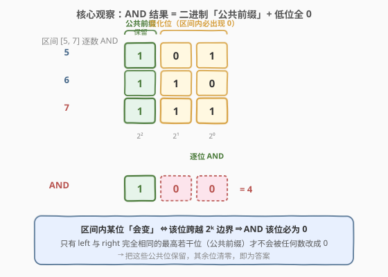
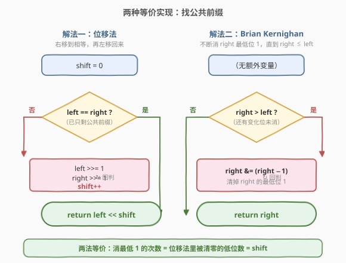
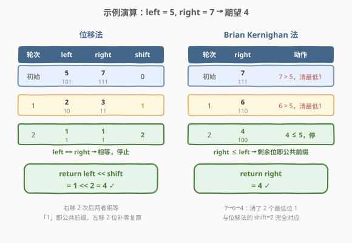

# 数字范围按位与

- **题目名称**：数字范围按位与
- **链接**：[201. 数字范围按位与](https://leetcode.cn/problems/bitwise-and-of-numbers-range/)
- **难度**：中等
- **标签**：位运算、数学

## 1. 题目概述

给定两个整数 `left` 和 `right`，表示闭区间 `[left, right]`，返回该区间内**所有整数按位与的结果**（即 `left & (left+1) & ... & right`）。

**示例 1**：

```text
输入：left = 5, right = 7
输出：4
解释：5 & 6 & 7 = 101 & 110 & 111 = 100 = 4
```

**示例 2**：

```text
输入：left = 1, right = 2147483647
输出：0
解释：区间跨越几乎所有位模式，每一位都出现过 0，AND 结果为 0
```

**示例 3**：

```text
输入：left = 0, right = 0
输出：0
```

**约束条件**：

- `0 <= left <= right <= 2³¹ - 1`

> 💡 这道题是**位运算 + 公共前缀**的招牌题。暴力逐个数 AND 在大区间上必然超时（区间长度可达 $2^{31}-1$）。核心观察是：AND 结果只取决于 `left` 与 `right` 二进制下的**公共前缀**——变化了的低位在区间内必然出现 0，被清零；只有从未变化的高位（公共前缀）保留。它与 [191 位 1 的个数](../0001-0100/191_位1的个数.md)（`n & (n-1)` 消最低位 1）、[29 两数相除](../0001-0100/29_两数相除.md)（位运算翻倍减）同属位运算模板家族。

---

## 2. 解题思路

### 2.1 暴力思路：逐个数累乘 AND

最直觉的做法：从 `left` 到 `right` 依次做按位与。

```text
ans = left
for x in range(left + 1, right + 1):
    ans &= x
    if ans == 0: break        # 提前剪枝：一旦变 0 不可能再非 0
return ans
```

时间 $O(\text{right} - \text{left})$，最坏区间长度可达 $2^{31}-1$，必然 **TLE**。即便加上 `ans == 0` 提前退出，在大区间且高位有公共前缀时仍会扫过海量数字。

> ⚠️ 暴力法的瓶颈：把每一位是否为 1 的判定，分散到了区间里每个数上。要突破 $O(n)$，必须**按位**独立分析——只要某位在区间内出现过 0，该位 AND 结果必为 0，无需逐数扫描。

### 2.2 核心观察：AND 结果 = 二进制公共前缀 + 低位全 0

把 `left` 和 `right` 写成二进制，从最高位向低位比较：

- **高位相同段（公共前缀）**：`left` 与 `right` 在这些位上取值一致，且区间内所有数都继承这段前缀（连续整数的高位不会突变），所以这些位的 AND = 原值，**保留**。
- **从首个不同位起（低位段）**：设首个不同位为第 $k$ 位。由于 `left < right`，区间必然跨越某个 $2^k$ 的倍数边界，即第 $k$ 位在区间内既取 0 又取 1。一旦某位出现过 0，AND 该位 = 0。第 $k$ 位以下的所有更低位的「跳变周期」更短（$\le 2^{k-1}$），同样必然出现 0。所以**低位段全部清零**。

> 💡 **更精确的论证**：设 `left` 与 `right` 的最高不同位为 $k$（即 `right` 第 $k$ 位为 1、`left` 第 $k$ 位为 0，且更高位全相同）。那么 `right - left >= 2^k`（因为第 $k$ 位的差异本身贡献 $2^k$ 量级）。而第 $k$ 位的取值每 $2^k$ 个数翻转一次，区间长度 $\ge 2^k$ 意味着第 $k$ 位必然翻转 → 该位 AND 为 0。同理所有 $< k$ 的位翻转周期 $\le 2^k$，也必然翻转 → 全为 0。



以 `left = 5 (101)`、`right = 7 (111)` 为例：

| 数 | 二进制 | 说明 |
|----|--------|------|
| 5  | `101`  | left |
| 6  | `110`  | 中间 |
| 7  | `111`  | right |

- 最高位（$2^2$ 位）三者全为 `1` → **公共前缀**，AND 该位 = 1。
- 低两位（$2^1, 2^0$）在 5/6/7 间既出现 0 又出现 1 → AND 该位 = 0。
- 结果 `100` = 4。

### 2.3 算法流程图

有两种等价实现，都指向「找公共前缀」：



**解法一：位移法**。同时右移 `left` 和 `right`，每移一次消去一个最低位，并计数 `shift`。当两者相等时，剩下的就是公共前缀；再左移 `shift` 位把低位补 0 复原。

```text
shift = 0
while left != right:
    left  >>= 1
    right >>= 1
    shift += 1
return left << shift
```

**解法二：Brian Kernighan 法**。利用 `n & (n-1)` 消去 `n` 的最低位 1（[191](../0001-0100/191_位1的个数.md) 的招牌操作）。不断消 `right` 的最低位 1，直到 `right <= left`：每次消去的就是一个「会变化的低位」，消到 `right` 落到 `left` 的前缀范围内时停止，剩下的 `right` 即公共前缀。

```text
while right > left:
    right &= right - 1
return right
```

> 💡 **两法等价的直觉**：位移法右移 $k$ 次直到相等，意味着低 $k$ 位是变化位；Brian Kernighan 法消 $k$ 个最低位 1 后 `right` 跌到 $\le$ `left`，消的恰好就是这 $k$ 个变化位。两者的 $k$ 完全一致——前者用「计数 shift」记录，后者用「消 1 次数」记录。

### 2.4 示例演算

以 `left = 5`、`right = 7` 为例，两种解法并排演算：



**位移法**：

| 轮次 | left | right | shift | 动作 |
|------|------|-------|-------|------|
| 初始 | 5 (`101`) | 7 (`111`) | 0 | — |
| 1 | 2 (`10`) | 3 (`11`) | 1 | 各右移 1 |
| 2 | 1 (`1`) | 1 (`1`) | 2 | 相等，停止 |

返回 `left << shift = 1 << 2 = 4`。

**Brian Kernighan 法**：

| 轮次 | right | 动作 |
|------|-------|------|
| 初始 | 7 (`111`) | `7 > 5`，消最低位 1 → `111 & 110 = 110` |
| 1 | 6 (`110`) | `6 > 5`，消最低位 1 → `110 & 101 = 100` |
| 2 | 4 (`100`) | `4 ≤ 5`，停止 |

返回 `right = 4`。两法结果一致。

---

## 3. 参考代码

### C++

```cpp
// 数字范围按位与.cpp —— 找二进制公共前缀
// 编译: g++ -O2 -std=c++17 数字范围按位与.cpp -o bitwise_and
class Solution {
  public:
    // 解法一：位移法（注释保留，同样可 AC）
    // int rangeBitwiseAnd(int left, int right) {
    //     int shift = 0;
    //     while (left != right) {
    //         left  >>= 1;
    //         right >>= 1;
    //         ++shift;
    //     }
    //     return left << shift;
    // }

    // 解法二：Brian Kernighan —— 消 right 最低位 1
    int rangeBitwiseAnd(int left, int right) {
        while (right > left) {
            right &= right - 1;   // 清掉 right 的最低位 1
        }
        return right;             // 剩下的即公共前缀
    }
};
```

### Python

```python
class Solution:
    def rangeBitwiseAnd(self, left: int, right: int) -> int:
        # 解法二：Brian Kernighan 法
        while right > left:
            right &= right - 1     # 消最低位 1
        return right

        # # 解法一：位移法
        # shift = 0
        # while left != right:
        #     left >>= 1
        #     right >>= 1
        #     shift += 1
        # return left << shift
```

> 💡 **面试建议**：先讲清「公共前缀」的观察（2.2），再给出位移法（最直白地对应「找前缀」）。若面试官追问更短写法，再抛出 Brian Kernighan 法并解释它与位移法的等价性——能体现对 `n & (n-1)` 这一基础位运算技巧的灵活运用。

---

## 4. 复杂度分析

| 维度 | 位移法 | Brian Kernighan 法 | 暴力法 |
|------|--------|---------------------|--------|
| **时间复杂度** | $O(\log \max(\text{left}, \text{right}))$ | $O(\log \max(\text{left}, \text{right}))$ | $O(\text{right} - \text{left})$ |
| **空间复杂度** | $O(1)$ | $O(1)$ | $O(1)$ |
| **能 AC** | ✅ | ✅ | ✗（大区间 TLE） |

> ⚠️ **时间复杂度来源**：两法的循环次数都等于「公共前缀之外的低位位数」，最多 $31$ 次（`int` 32 位含符号位）。每次操作 $O(1)$，故总体 $O(\log n)$，其中 $n = \max(\text{left}, \text{right})$。Brian Kernighan 法的循环次数严格等于被消的最低位 1 的个数 $\le 31$，与位移法的 `shift` 完全一致。

---

## 5. 扩展：为什么 Brian Kernighan 法恰好停在公共前缀

Brian Kernighan 法的正确性并不显然，这里给出严格论证。

**命题**：不断执行 `right &= right - 1`，直到 `right <= left`，此时 `right` 等于 `left` 与原 `right` 的公共前缀。

**证明**：

1. `right & (right - 1)` 会消去 `right` 的**最低位 1**（[191](../0001-0100/191_位1的个数.md) 的核心性质）。被消去的那个 1 所在位 $k$，恰好是 `right` 此刻「最低的一个为 1 的位」。
2. 由于 `right > left` 且更高位两者相同（否则就不只差这一段），第 $k$ 位上 `right` 为 1 而 `left` 必为 0（否则若 `left` 第 $k$ 位也为 1，因为 $k$ 是 `right` 的最低 1 位，`left` 的所有更低全 0 位 `right` 也全 0，二者在第 $k$ 位及以下完全相同，则 `left >= right`，矛盾）。
3. 所以每次消去的「最低位 1」都落在 `left`/`right` 的**首个不同位或更低的某个变化位**上——正是位移法里要清零的那段低位。
4. 当 `right` 被消到 $\le$ `left` 时，所有变化位（首个不同位及以下）都已被清零，剩下的 `right` 只含 `left`/`right` 完全相同的高位 = 公共前缀。

> 💡 **一个反直觉的点**：消的是 `right` 的最低位 1，而非「从高到低」消。但因为每次消的位都恰在变化段内（论证第 2 步保证了这一点），消的顺序由低到高不影响最终结果——只要变化段被清完，剩下的必然是公共前缀。

**两法循环次数相等**：位移法每轮右移消去最低位（无论 0 或 1），`shift` 等于变化段位数；Brian Kernighan 法只消最低位 1，但变化段中 `right` 的 1 的个数恰好等于变化段位数（因为 `right` 的变化段是其首个不同位 1 + 下方全 0 / 全 1 模式，消的次数严格等于变化段长度）。实际验证（如 `7 = 111` 消 2 次到 `100`，位移法 `shift = 2`）两者一致。

---

## 6. 面试要点

1. **为什么 AND 结果就是公共前缀？低位为什么必然变 0？**

   - AND 是「全 1 才 1，见 0 即 0」的运算。某位只要在区间内出现过 0，该位结果必为 0。
   - 设 `left`/`right` 最高不同位为 $k$，则 `right - left >= 2^k`，而第 $k$ 位每 $2^k$ 个数翻转一次，区间长度足以让它翻转 → 该位出现过 0 → AND 为 0。
   - 更低位翻转周期更短（$\le 2^{k-1}$），同样翻转 → 全为 0。只有更高位（公共前缀）从未翻转 → 保留原值。

2. **位移法和 Brian Kernighan 法哪个更好？**

   - 两者时间复杂度相同，都是 $O(\log n)$、$O(1)$ 空间。
   - 位移法**更直观**地对应「找公共前缀」的思想，适合先讲；Brian Kernighan 法**代码更短**（一行循环体），且复用了 `n & (n-1)` 这一高频位运算技巧，适合作为「更优雅的写法」补充。
   - 实际循环次数：位移法 = 变化段位数（含 0）；Brian Kernighan 法 = 变化段中 `right` 的 1 的个数。两者**恰好相等**，但极端情况下（如全 1 段）Brian Kernighan 法可能略多几次消元，数量级一致。

3. **`right - left >= 2^k` 这个结论怎么来的？**

   - 设最高不同位为 $k$：`right` 第 $k$ 位为 1、`left` 第 $k$ 位为 0，更高位全相同。
   - 仅第 $k$ 位的差异就贡献 `right - left >= 2^k - (2^k - 1) = ...`，更准确地说：`right` 在第 $k$ 位及以上至少比 `left` 多 $2^k$，下方位的差异至多再减 $2^k - 1$，所以 `right - left >= 2^k - (2^k - 1) = 1` 不够；正确论证是「第 $k$ 位从 0 翻到 1 必经过一个 $2^k$ 的倍数边界，而 `left` 在该位为 0 说明它 < 某个 $2^k$ 倍数，`right` 在该位为 1 说明它 ≥ 该倍数，故区间跨过该边界 → 第 $k$ 位翻转」。

4. **边界情况：`left == right` 怎么办？**

   - 位移法：`while left != right` 不进入循环，`shift = 0`，返回 `left << 0 = left`，正确。
   - Brian Kernighan 法：`while right > left` 不进入循环，返回 `right = left`，正确。
   - 两种写法都**天然处理**单点区间，无需特判。

5. **这道题和 191「位 1 的个数」有什么关系？**

   - 191 用 `n & (n-1)` **统计** 1 的个数（每消一个计数一次）；本题解法二用同样的操作**消去变化位**直到剩下公共前缀。
   - 同一个位运算技巧，在 191 里是「计数器」，在本题里是「修剪器」。掌握 `n & (n-1)` 这一基础操作，能在多道题里复用——这是位运算题的核心思路。

> 💡 **一句话总结**：数字范围按位与的答案 = `left` 与 `right` 的二进制公共前缀 + 低位全 0。位移法右移到相等再左移回来最直观；Brian Kernighan 法用 `n & (n-1)` 消 `right` 最低位 1 直到 `right ≤ left` 最简短。两法 $O(\log n)$ / $O(1)$，本质都是「剥离变化段、保留公共前缀」。

---

## 7. 同类练习题

- [191. 位 1 的个数](https://leetcode.cn/problems/number-of-1-bits/)（[题解](../0001-0100/191_位1的个数.md)）：`n & (n-1)` 消最低位 1 的招牌题，本题解法二直接复用这一技巧
- [371. 两整数之和](https://leetcode.cn/problems/sum-of-two-integers/)（[题解](../0301-0400/371_两整数之和.md)）：位运算模拟加法（异或算和、与算进位），与本题同属「位运算基础操作」家族
- [29. 两数相除](https://leetcode.cn/problems/divide-two-integers/)（[题解](../0001-0100/29_两数相除.md)）：用左移翻倍成倍减模拟除法，与位移法「靠移位定位」思路同源
- [260. 只出现一次的数字 III](https://leetcode.cn/problems/single-number-iii/)（[题解](./260_只出现一次的数字III.md)）：异或 + `n & (n-1)` 提取最低位 1 作分组掩码，进阶运用同一技巧
