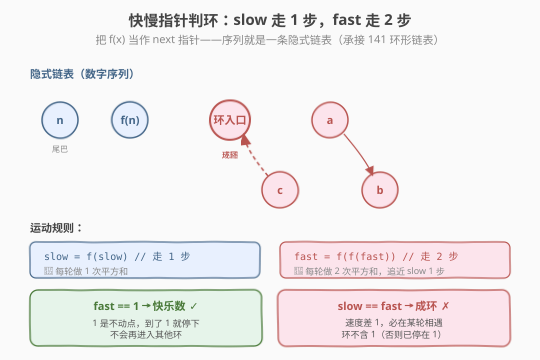
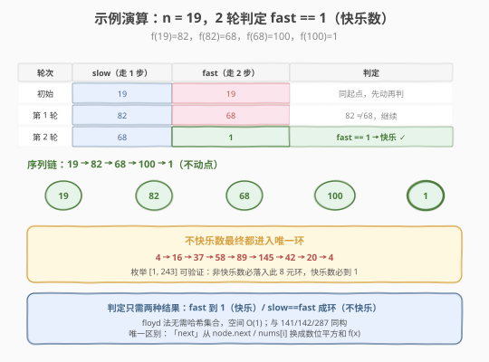
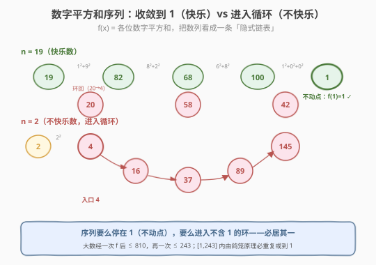

# 快乐数

- **题目名称**：快乐数
- **链接**：[202. 快乐数](https://leetcode.cn/problems/happy-number/)
- **难度**：简单
- **标签**：数学、双指针、哈希表

## 1. 题目概述

给定一个正整数 `n`，每一次将其替换为它**每一位数字的平方和**，然后重复这个过程。如果这个数能变为 `1`，就是**快乐数**，返回 `true`；如果**不能**变为 `1`（进入无限循环），返回 `false`。

**示例 1**：

```text
输入：n = 19
输出：true
解释：
  1² + 9² = 82
  8² + 2² = 68
  6² + 8² = 100
  1² + 0² + 0² = 1
  → 到达 1，是快乐数
```

**示例 2**：

```text
输入：n = 2
输出：false
解释：
  2 → 4 → 16 → 37 → 58 → 89 → 145 → 42 → 20 → 4 → ...
  → 进入不含 1 的循环，不是快乐数
```

**约束条件**：

- `1 <= n <= 2³¹ - 1`
- **进阶**：你能用 `O(1)` 空间解决吗？

> 💡 这道题是 **快慢指针（Floyd 判圈法）** 的招牌应用题——把"数位平方和"看作 `next` 指针，数字序列就变成一条「隐式链表」，判定快乐数等价于判定这条链表是否最终停在不动点 `1`。它与 [141 环形链表](../0101-0200/141_环形链表.md)（链表判环）、[287 寻找重复数](./287_寻找重复数.md)（数组当链表找环入口）完全同构，合称 **Floyd 判圈三件套**。

---

## 2. 解题思路

### 2.1 暴力思路：哈希集合记录出现过的数

最直觉的做法：反复计算平方和，用哈希集合记录每一步出现过的数。若到 `1` → 快乐；若某数重复出现 → 成环，不快乐。

```text
seen = set()
while n != 1:
    if n in seen: return false
    seen.add(n)
    n = digitSquareSum(n)
return true
```

时间 $O(\log n)$，空间 $O(\log n)$（集合存序列中所有不同的数）。能 AC，但**不满足进阶的** `O(1)` **空间要求**。

> ⚠️ 哈希集合法的瓶颈：需要存储历史出现的数。要 `O(1)` 空间，必须借鉴 [141 环形链表](../0101-0200/141_环形链表.md) 的思路——靠"追及"判断有环，而非记录历史。

### 2.2 核心观察：数字平方和序列必然收敛或成环

把数位平方和记作函数 $f(x)$。从 $n$ 出发不断迭代 $f$，得到序列 $n, f(n), f(f(n)), \dots$。这个序列只有两种结局：

1. **到达 1 并停住**：因为 $f(1) = 1^2 = 1$，`1` 是**不动点**，之后永远停在 1 → 快乐数。
2. **进入一个不含 1 的环**：序列在某个值开始循环 → 不快乐数。

**为什么只有这两种结局、不会无限发散？** 这是本题最关键的数学观察：

- 设 $x$ 有 $d$ 位，则 $f(x) \le d \times 9^2 = 81d$。
- 题目 $n \le 2^{31}-1 \approx 2.1 \times 10^9$，最多 $10$ 位，故 $f(n) \le 810$。
- 再迭代一次：$810$ 只有 $3$ 位，$f(810) \le 3 \times 81 = 243$。
- 所以**至多两步**后，序列就落入 $[1, 243]$ 的有限范围。在这个只有 $243$ 个可能值的区间里，由**鸽笼原理**，序列要么在某一步命中 $1$，要么必然重复（成环）。

> 💡 **隐式链表视角**：$f(x)$ 就相当于节点的 `next` 指针——只不过 `next` 不是 `node.next`（141 链表）也不是 `nums[i]`（287 数组），而是"数位平方和"。判定快乐数 = 判定这条隐式链表是否停在不动点 `1`，与 141/287 同构。

### 2.3 核心解法：快慢指针判环（Floyd）

既然序列要么停在 1、要么成环，就能用 **快慢指针**（Floyd 判圈法）在 $O(1)$ 空间内判定：

- **慢指针** `slow` 每次走 $1$ 步：`slow = f(slow)`
- **快指针** `fast` 每次走 $2$ 步：`fast = f(f(fast))`
- **终止条件**（二选一）：
  - `fast == 1` → 序列到达不动点，**快乐数** ✓
  - `slow == fast`（且 `fast != 1`）→ 成环，**不快乐数** ✗



**为什么 `fast == 1` 就一定是快乐数？** 因为 $1$ 是不动点（$f(1)=1$）。一旦序列到达 $1$，就永远停在 $1$，**不会再进入任何其他环**。所以 `fast` 能到 $1$，说明从 $n$ 出发确实能到 $1$。

**为什么成环时环里不含 1？** 反证：若环包含 $1$，则序列到达过 $1$，此后停在 $1$，`slow` 和 `fast` 最终都会停在 $1$（而非在其他值相遇）。所以一旦 `slow == fast` 且 `fast != 1`，这个环必然不含 $1$，即不快乐。

> ⚠️ **与 141 的细节差异**：141 中 `fast` 到 `null` 表示无环；这里没有"null"，序列永不停（除非到 1）。所以这里用 `fast == 1` 替代"到 null"作为收敛信号，用 `slow == fast` 作为成环信号——本质都是"快指针先碰到终点 / 快慢指针在环中相遇"。

### 2.4 示例演算

以 `n = 19` 为例（快乐数，`fast` 在第 2 轮到达 1）：



| 轮次 | slow（走 1 步） | fast（走 2 步） | 判定 |
|------|-----------------|-----------------|------|
| 初始 | 19 | 19 | 同起点，先动再判 |
| 第 1 轮 | $f(19)=82$ | $f(f(19))=f(82)=68$ | $82 \ne 68$，继续 |
| 第 2 轮 | $f(82)=68$ | $f(f(68))=f(100)=1$ | `fast == 1` → **快乐 ✓** |

第 2 轮 `fast` 算出 $f(68)=100$、再 $f(100)=1$，命中不动点，返回 `true`。

**不快乐数的归宿**：以 `n = 2` 为例，序列进入一个长度为 8 的唯一环 $4 \to 16 \to 37 \to 58 \to 89 \to 145 \to 42 \to 20 \to 4$。`slow`/`fast` 都进入这个环后，因速度差 1 必在某轮相遇（`slow == fast`），返回 `false`。



---

## 3. 参考代码

### C++

```cpp
// 快乐数.cpp —— 快慢指针（Floyd 判圈法），O(1) 空间
// 编译: g++ -O2 -std=c++17 快乐数.cpp -o happy
class Solution {
    // 数位平方和：相当于隐式链表的 next 指针
    int squareSum(int x) {
        int sum = 0;
        while (x > 0) {
            int d = x % 10;   // 取最低位
            sum += d * d;
            x /= 10;          // 去掉最低位
        }
        return sum;
    }
  public:
    bool isHappy(int n) {
        int slow = n, fast = n;
        do {
            slow = squareSum(slow);       // 慢指针走 1 步
            fast = squareSum(squareSum(fast)); // 快指针走 2 步
            if (fast == 1) return true;   // 到达不动点 → 快乐
        } while (slow != fast);           // 相遇 → 成环
        return false;                     // 成环且非 1 → 不快乐
    }
};
```

### Python

```python
class Solution:
    def isHappy(self, n: int) -> bool:
        def f(x: int) -> int:            # 数位平方和 = next 指针
            s = 0
            while x:
                x, d = divmod(x, 10)
                s += d * d
            return s

        slow = fast = n
        while True:
            slow = f(slow)               # 走 1 步
            fast = f(f(fast))            # 走 2 步
            if fast == 1:                # 到达不动点
                return True
            if slow == fast:             # 成环（且非 1）
                return False
```

> 💡 **哈希集合写法**（不满足进阶，但更直观）：把上面的 `while True` 换成 `seen = set()`，每步 `if n in seen: return False`、`seen.add(n)`、`n = f(n)`，到 `1` 返回 `True`。面试可先说哈希法讲清思路，再优化到 Floyd。

---

## 4. 复杂度分析

| 维度 | 快慢指针（Floyd） | 哈希集合 |
|------|------------------|---------|
| **时间复杂度** | $O(\log n)$ | $O(\log n)$ |
| **空间复杂度** | $O(1)$ | $O(\log n)$ |
| **满足进阶** | ✅ | ✗ |

> ⚠️ **时间 $O(\log n)$ 的来源**：序列至多两步就落入 $[1, 243]$，之后无论是到 `1` 还是成环相遇，步数都被常数 $243$ 封顶。每步计算 $f(x)$ 耗时 $O(\log x)$，前两步 $x$ 较大（至多 $2^{31}$）耗时 $O(\log n)$，后续 $x \le 243$ 每步 $O(1)$。总体 $O(\log n)$。哈希集合额外存了序列中不同值（至多 $243$ 个，但理论上是 $O(\log n)$ 量级），故空间 $O(\log n)$。

---

## 5. 扩展：数学法与唯一环

### 5.1 枚举验证唯一环

把 $[1, 243]$ 内每个数都迭代 $f$，会发现：快乐数全部到达 $1$，不快乐数**全部**落入同一个 $8$ 元环：

$$4 \to 16 \to 37 \to 58 \to 89 \to 145 \to 42 \to 20 \to 4$$

这意味着存在一种**硬编码数学法**：只需判断 $n$ 是否会到 $1$，等价于判断它**不在**上述 $8$ 个环成员中（因为这些是不快乐数进入环前的"信号"——任何不快乐数最终都会经过这 $8$ 个数之一）。更简洁的判据：不断迭代 $f$，若中途出现 $\{4, 16, 37, 58, 89, 145, 42, 20\}$ 中的任何一个 → 不快乐；若到 $1$ → 快乐。

```python
class Solution:
    def isHappy(self, n: int) -> bool:
        unhappy = {4, 16, 37, 58, 89, 145, 42, 20}
        while n != 1:
            n = sum(int(c) ** 2 for c in str(n))
            if n in unhappy:
                return False
        return True
```

> ⚠️ 数学法常数更小、代码更短，但**依赖硬编码**，普适性差。面试推荐 Floyd 法——它体现了"判环"这一可迁移模板，且能自然过渡到 141/142/287。

### 5.2 为什么上界是 243？

对于 $d$ 位数 $x$，$f(x) \le 81d$。题目 $n \le 2^{31}-1$（$10$ 位），故：

- 第 1 步：$f(n) \le 810$（至多 $3$ 位）。
- 第 2 步：$f(810) \le 243$。
- 此后 $x \in [1, 243]$，$f(x) \le 4^2+9^2+9^2 = 178 < 243$，永远困在 $[1, 243]$。

因此只需枚举 $[1, 243]$ 即可穷举所有可能的序列行为，鸽笼原理保证 $244$ 步内必然重复或到 $1$。

---

## 6. 面试要点

1. **为什么快慢指针不会无限循环下去？**

   - 序列至多两步就落入 $[1, 243]$ 的有限范围（大数的平方和迅速变小）。
   - 在 $243$ 个可能值内，由鸽笼原理，序列要么命中 $1$，要么在 $244$ 步内重复。
   - 所以 `fast` 要么很快到 `1`（快乐），要么和 `slow` 在环中相遇（不快乐），两者都保证有限步终止。

2. **`fast == 1` 就一定是快乐数吗？会不会 `fast` 路过 1 又跑走？**

   - 不会。$f(1) = 1$，`1` 是**不动点**——一旦到 `1`，下一步还是 `1`，永远停住。
   - 所以 `fast == 1` 意味着序列确实到达并停留在 `1`，是快乐数。
   - 反过来，若序列从未到 `1`，则它进入的环必然不含 `1`（否则会停在 `1`），`slow == fast` 时即可断定不快乐。

3. **为什么不用 `while n != 1` 直接迭代？**

   - 不快乐数会**无限循环**，`while n != 1` 永远等不到 `1`，死循环。
   - 必须有终止条件：要么哈希集合检测重复（$O(\log n)$ 空间），要么 Floyd 快慢指针检测相遇（$O(1)$ 空间）。

4. **本题和 141 环形链表有什么异同？**

   - **同**：都用 Floyd 快慢指针——慢走 1、快走 2，速度差 1 保证在环中必相遇、不跳过。
   - **异**：141 的 `next` 是 `node.next`，无环时 `fast` 到 `null` 终止；本题的 `next` 是数位平方和 $f(x)$，序列永不停，故用 `fast == 1`（收敛到不动点）替代"到 null"作为收敛信号。
   - 一句话：**同一个判环模板，换了"next"的来源**。

5. **如何自然地引出 287 寻找重复数？**

   - 287 把 `nums[i]` 当作 `next`（`i → nums[i]`），数组变成隐式链表，重复数导致环。
   - 三题同构：141 用 `node.next`、202 用 $f(x)$、287 用 `nums[i]`，都是 Floyd 判圈法的不同"next"实例。面试时举一反三，能体现对模板的深度理解。

> 💡 **一句话总结**：快乐数是 Floyd 判圈法的「数字序列」实例——把数位平方和 $f(x)$ 当作 `next` 指针，序列要么停在不动点 `1`（快乐），要么成环（不快乐）。快慢指针在 $O(1)$ 空间内判定：`fast == 1` 即快乐，`slow == fast` 即成环。与 141（链表）、287（数组）同构，合称判环三件套。

---

## 7. 同类练习题

- [141. 环形链表](https://leetcode.cn/problems/linked-list-cycle/)（[题解](../0101-0200/141_环形链表.md)）：Floyd 判圈法招牌题，`next = node.next`，无环时 `fast` 到 null
- [142. 环形链表 II](https://leetcode.cn/problems/linked-list-cycle-ii/)（[题解](../0101-0200/142_环形链表 II.md)）：在 141 基础上找环入口（第二阶段同速走）
- [287. 寻找重复数](https://leetcode.cn/problems/find-the-duplicate-number/)（[题解](./287_寻找重复数.md)）：把 `nums[i]` 当 `next`，数组变隐式链表，找环入口 = 重复数
