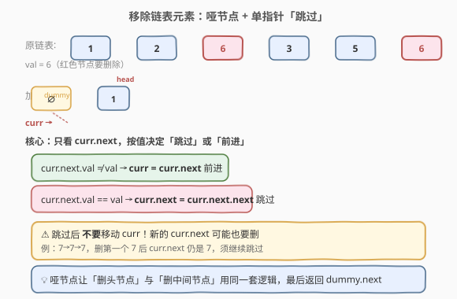
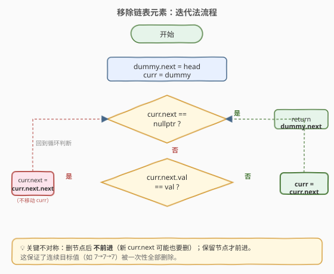
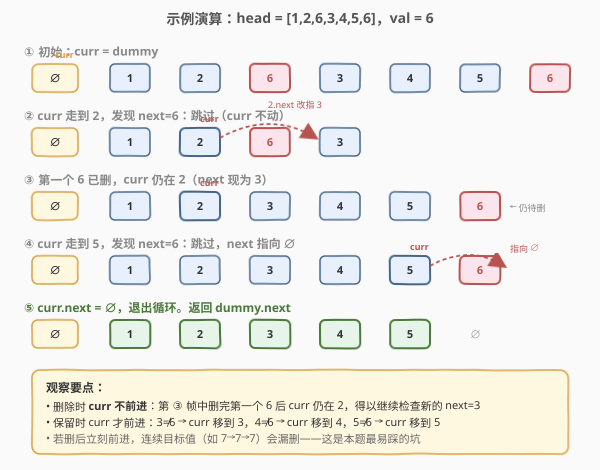

# LeetCode 移除链表元素 题解

## 1. 题目概述

- **标题 / 题号**：移除链表元素（#203，easy）
- **链接**：https://leetcode.cn/problems/remove-linked-list-elements/
- **难度**：简单
- **标签**：链表、哑节点、指针操作、递归

**题意**：给你一个链表的头节点 `head` 和一个整数 `val`，请你**删除链表中所有满足** `Node.val == val` 的节点，并返回**新的头节点**。

**示例 1**：

```text
输入：head = [1,2,6,3,4,5,6], val = 6
输出：[1,2,3,4,5]
```

**示例 2**：

```text
输入：head = []
输出：[]
```

**示例 3**：

```text
输入：head = [7,7,7,7], val = 7
输出：[]
```

**约束**：

- 列表中的节点数目在范围 `[0, 10^4]` 内
- `1 <= Node.val <= 50`
- `0 <= val <= 50`

**进阶要求**：能否同时用迭代与递归两种方式实现？

## 2. 解题思路

### 2.1 暴力思路：遍历收集再重建

遍历链表把所有「值不等于 `val`」的节点值存入数组，再用这些值重建一条新链表。能用，但：

- 需要 `O(n)` 额外空间。
- 只搬运值不改原链表，一旦节点带额外信息（如随机指针、附带数据），这种「取值重建」会丢失信息。
- 面试官通常期望你**原地修改指针**。

正确做法是在原链表上**改 `next` 指针把目标节点「跳过」**，让它们从链表中脱链。

### 2.2 核心观察：哑节点 + 单指针「跳过」



直接从头节点开始删除会遇到一个麻烦：**如果头节点本身就要删**，头指针必须不断后移，边界处理啰嗦。解决方案是引入一个**哑节点（dummy / sentinel）**，让它的 `next` 指向 `head`，这样「删头节点」就变成了「删 `dummy` 的下一个节点」，和删中间节点完全一致——**统一了边界**。

有了哑节点后，只需一个游标 `curr` 从 `dummy` 出发，**始终盯住 `curr.next`** 做判断：

1. 若 `curr.next.val == val`：让 `curr.next` 直接指向 `curr.next.next`，即把目标节点「跳过」。**注意此时 `curr` 不前进**。
2. 若 `curr.next.val != val`：让 `curr = curr.next`，正常前进一格。

当 `curr.next` 为 `nullptr` 时循环结束，返回 `dummy.next` 即为新头。

> ⚠️ **最关键的不对称**：删除节点后**不要移动 `curr`**。因为跳过目标节点后，新的 `curr.next`（原目标节点的下一个）**可能也等于 `val`**，必须继续检查。如果删完立刻前进，连续的目标值（如 `7→7→7`）就会漏删。只有当 `curr.next` 确认保留时，`curr` 才前进。

> 💡 **为什么用「看下一个」而不是「看当前」？** 因为单链表节点没有前驱指针，删除一个节点必须拿到它的**前驱**来改 `next`。让 `curr` 停在被删节点的前一个位置，恰好能改 `curr.next` 跳过它。这是单链表删除的通用姿势。

### 2.3 算法流程图



迭代法只需一次遍历，每轮根据 `curr.next` 是否为空、其值是否等于 `val` 做三分支决策：

| 维度 | 迭代法 | 递归法 |
|------|--------|--------|
| 思路 | 哑节点 + 单指针顺扫 | 先递归处理 `head.next`，再决定 `head` 去留 |
| 空间 | O(1) | O(n)（调用栈） |
| 长链表 | 安全 | 可能栈溢出 |
| 代码量 | 略长 | 极简 |

> 💡 **一句话总结**：面试默认写迭代法（O(1) 空间、不会爆栈）；递归法作为思路展示，体现「把问题拆成 head 和子链表」的递归思维。

### 2.4 示例演算



以 `1→2→6→3→4→5→6`、`val = 6` 为例，红色节点表示待删，绿色表示已保留的最终结果：

- **第 ① 步**：`curr = dummy`，`curr.next = 1`（≠6）→ `curr` 前进到 1。
- **第 ② 步**：`curr = 2`，`curr.next = 6`（==6）→ 跳过，`2.next` 改指 3，`curr` **不动**。
- **第 ③ 步**：第一个 6 已脱链，`curr` 仍在 2，此时 `curr.next = 3`（≠6）→ `curr` 前进到 3。
- `curr` 依次经过 3、4、5（均≠6，正常前进）。
- **第 ④ 步**：`curr = 5`，`curr.next = 6`（==6）→ 跳过，`5.next` 改指 `∅`，`curr` **不动**。
- **第 ⑤ 步**：`curr.next = ∅`，循环结束，返回 `dummy.next`，结果为 `1→2→3→4→5`。

整个过程中 `curr` 只前进、不后退，每个节点最多被检查一次，连续的目标值（如示例末尾的 6）被同一位置的 `curr` 连续跳过。

## 3. 参考代码

### C++（迭代法，推荐）

```cpp
/**
 * Definition for singly-linked list.
 * struct ListNode {
 *     int val;
 *     ListNode *next;
 *     ListNode() : val(0), next(nullptr) {}
 *     ListNode(int x) : val(x), next(nullptr) {}
 *     ListNode(int x, ListNode *next) : val(x), next(next) {}
 * };
 */
class Solution {
  public:
    ListNode* removeElements(ListNode* head, int val) {
        ListNode dummy(0, head);          // 哑节点，next 指向 head
        ListNode* curr = &dummy;          // 游标从 dummy 出发
        while (curr->next != nullptr) {
            if (curr->next->val == val) {
                curr->next = curr->next->next; // 跳过目标节点，curr 不动
            } else {
                curr = curr->next;            // 保留，curr 前进
            }
        }
        return dummy.next;
    }
};
```

### Python（迭代法）

```python
class Solution:
    def removeElements(self, head: Optional[ListNode], val: int) -> Optional[ListNode]:
        dummy = ListNode(0, head)
        curr = dummy
        while curr.next:
            if curr.next.val == val:
                curr.next = curr.next.next  # 跳过目标节点，curr 不动
            else:
                curr = curr.next            # 保留，curr 前进
        return dummy.next
```

## 4. 复杂度分析

| 维度 | 复杂度 | 说明 |
|------|--------|------|
| 时间复杂度 | O(n) | `curr` 只前进不后退，每个节点至多被访问一次 |
| 空间复杂度 | O(1) | 仅用 dummy 与 curr 两个指针，原地修改 |

## 5. 扩展：递归法

递归的思路是「先删掉 `head.next` 开头子链表里所有等于 `val` 的节点，再决定 `head` 本身留不留」：

```cpp
class Solution {
  public:
    ListNode* removeElements(ListNode* head, int val) {
        if (head == nullptr) return nullptr;
        head->next = removeElements(head->next, val); // 先清理子链表
        return head->val == val ? head->next : head;  // 再决定 head 去留
    }
};
```

**关键理解点**：递归到链表末尾返回 `nullptr`，回溯时每一层先拿到「已清理干净的子链表新头」并接回 `head->next`，然后判断 `head` 自身：等于 `val` 就丢弃（返回 `head->next`），否则保留（返回 `head`）。这相当于**从尾向头**逐个决定节点去留，与迭代法「从头向尾」方向相反但效果一致。

> ⚠️ **注意**：递归法空间复杂度 `O(n)`（调用栈深度为 n），链表超过几千个节点时可能栈溢出。面试中作为「另一种思路」回答即可，默认实现用迭代法。

## 6. 面试要点

1. **为什么需要哑节点？**

   - 如果头节点本身要删，不引入哑节点就必须在循环外额外写一段「不断后移 head」的逻辑。哑节点让「删头」变成「删 `dummy` 的下一个节点」，与删中间节点用同一套 `curr.next = curr.next.next` 逻辑，**消除特例**。最后统一返回 `dummy.next`。

2. **删除节点后为什么 `curr` 不能前进？**

   - 跳过目标节点后，新的 `curr.next`（原目标的下一个）可能也等于 `val`。若立刻 `curr = curr.next`，这个新节点就被当成「已确认保留」跳过了检查，导致连续目标值（如 `7→7→7`）漏删。只有 `curr.next` 确认保留时才前进。

3. **为什么判断 `curr.next` 而不是 `curr` 自身？**

   - 单链表节点没有前驱指针，删除一个节点必须握住它的**前驱**来改 `next`。让 `curr` 停在被删节点的前一个位置，才能用 `curr->next = curr->next->next` 脱链。这是单链表删除的通用姿势，对照 83/82 删除排序链表中的重复元素也是同理。

4. **迭代法和递归法的空间复杂度？**

   - 迭代 O(1)（只用常数指针）；递归 O(n)（调用栈深度为 n）。长链表首选迭代，避免栈溢出。

5. **递归法中 `head->next = removeElements(head->next, val)` 这一句的作用？**

   - 先递归清理 `head` 之后的子链表，把返回的「干净子链表新头」接回 `head->next`。这样后续判断 `head` 去留时，`head` 之后已经没有等于 `val` 的节点了，只需看 `head` 自身即可。

6. **如果要求删除「等于 val 的连续段」只保留一个，或改成删除出现次数超过 k 次的值，怎么做？**

   - 本题是「全删」语义。改成「保留一个」就是 83 题的逻辑（用计数或前驱值判断重复段，整段跳过）；改成「按次数」则需要先一轮计数再决定。核心仍是哑节点 + `curr` 盯 `curr.next` 的脱链模板，只是判断条件变化。

## 同类练习题

| # | 题目 | 与本题的关联 |
|---|------|-------------|
| 83 | [删除排序链表中的重复元素](https://leetcode.cn/problems/remove-duplicates-from-sorted-list/)（[题解](../0001-0100/83_删除排序链表中的重复元素.md)） | 本题的「重复值」变体——有序链表中删除多余重复节点只留一个，同样用哑节点 + 单指针脱链，对照「全删」与「留一」 |
| 82 | [删除排序链表中的重复元素 II](https://leetcode.cn/problems/remove-duplicates-from-sorted-list-ii/)（[题解](../0001-0100/82_删除排序链表中的重复元素II.md)） | 本题的「全删重复值」进阶——有序链表中把出现超过一次的值整段删除，需整段跳过，逻辑更接近本题的连续跳过 |
| 19 | [删除链表的倒数第 N 个节点](https://leetcode.cn/problems/remove-nth-node-from-end-of-list/)（[题解](../0001-0100/19_删除链表的倒数第N个节点.md)） | 同样是「删一个节点」需握前驱，哑节点统一删头边界，配合快慢双指针定位倒数第 n 个的前驱 |
| 237 | [删除链表中的节点](https://leetcode.cn/problems/delete-node-in-a-linked-list/) | 无法拿到前驱时的「值后移」删除法——把下一节点值复制到当前节点再跳过下一节点，对照本题「握前驱脱链」的标准姿势 |
