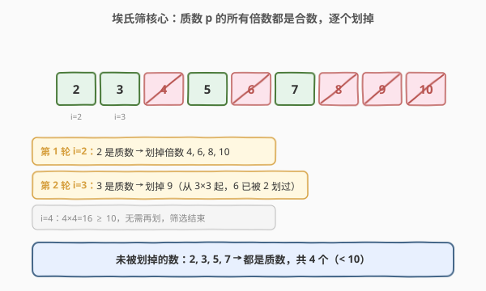
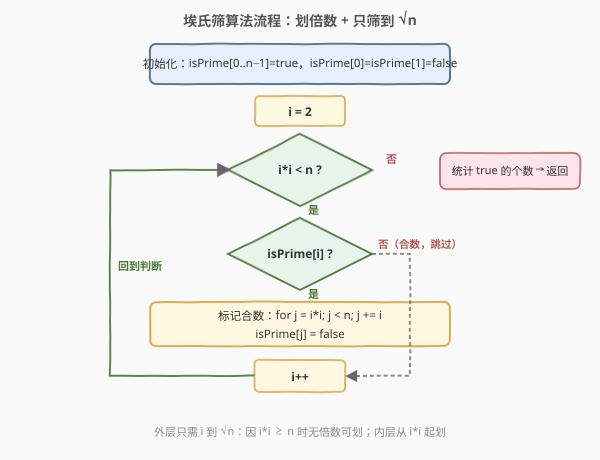
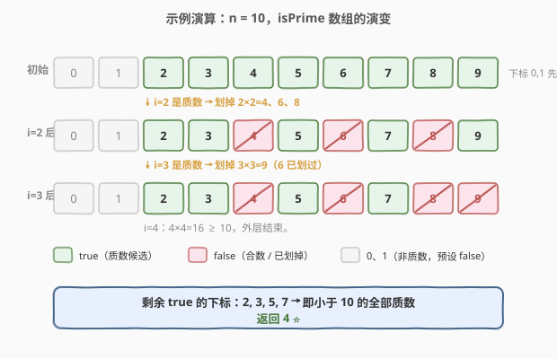

# 计数质数

- **题目名称**：计数质数
- **链接**：[204. 计数质数](https://leetcode.cn/problems/count-primes/)
- **难度**：中等
- **标签**：数学、数论、埃氏筛

## 1. 题目概述

给定整数 `n`，返回**所有小于非负整数 `n` 的质数的数量**。

**示例 1**：

```text
输入：n = 10
输出：4
解释：小于 10 的质数一共有 4 个，它们是 2, 3, 5, 7。
```

**示例 2**：

```text
输入：n = 0
输出：0
```

**示例 3**：

```text
输入：n = 1
输出：0
```

**约束条件**：

- `0 <= n <= 5 * 10^6`

**进阶要求**：朴素逐个判断的 `O(n√n)` 算法在 `n = 5 * 10^6` 时会超时，必须用更优的筛法。

---

## 2. 解题思路

### 2.1 暴力思路：逐个判断质数

最直观的做法是对每个 `i ∈ [2, n)`，用「试除法」判断它是否为质数：枚举 `j ∈ [2, √i]`，若 `i` 能被某个 `j` 整除则 `i` 是合数，否则是质数。

```text
for i in 2..n-1:
    if isPrime(i):  # 试除到 √i
        ans += 1
```

单个判断 `O(√i)`，总和约为 `O(n√n)`。当 `n = 5 * 10^6` 时 `√n ≈ 2236`，总操作约 `10^10` 量级，必然超时。问题在于：**大量合数被反复试除**——例如 `6` 在判断 `2、3、6、12…` 时都会被整除检测，做了重复功。我们换个视角：与其"逐个数去验证"，不如"**主动把合数标记掉**"，剩下的就是质数。

### 2.2 核心观察：埃氏筛（Sieve of Eratosthenes）



关键直觉：**一个质数 `p` 的所有倍数 `2p, 3p, 4p, …` 都必然是合数**（它们至少含有因子 `p`）。所以从最小的质数 `2` 开始，每遇到一个还没被划掉的数 `i`，它就一定是质数（因为更小的质数都没能划掉它），紧接着把它的所有倍数划掉。

上图以 `n = 10` 展示了这一过程：

- **第 1 轮 `i=2`**：`2` 未被划掉 → 是质数；划掉它的倍数 `4, 6, 8, 10`。
- **第 2 轮 `i=3`**：`3` 未被划掉 → 是质数；划掉它的倍数 `9`（注意 `6` 已被 `2` 划过，不必再划）。
- **`i=4`**：`4×4=16 ≥ 10`，外层结束（原因见下）。
- 剩余未被划掉的 `2, 3, 5, 7` 即为质数，共 `4` 个。

> 💡 **为什么"未被划掉就一定是质数"？** 若 `i` 是合数，则它可分解为 `i = a × b`，其中 `a, b ≥ 2`，那么 `a ≤ √i`，即 `i` 一定有某个小于等于 `√i` 的因子 `a`。当我们处理到更小的质数 `a` 时，就已经把 `i`（作为 `a` 的倍数）划掉了。所以如果 `i` 撑到被处理时仍未被划掉，它就没有更小的质因子，必然是质数。

### 2.3 两个关键优化

朴素埃氏筛（从 `2p` 开始划、外层跑到 `n`）已经够用，但有两处可显著减少重复标记：

1. **内层从 `i*i` 开始划**，而不是从 `2*i`。因为 `i` 的更小倍数 `2*i, 3*i, …, (i-1)*i` 早就被比 `i` 更小的质因子划过了（例如 `i=5` 时，`10=2×5` 已在 `i=2` 划掉、`15=3×5` 已在 `i=3` 划掉）。
2. **外层只需 `i` 到 `√n`**，即循环条件 `i*i < n`。因为任何小于 `n` 的合数 `c` 必有不超过 `√c ≤ √n` 的质因子，已经被更小的 `i` 划掉了；当 `i*i ≥ n` 时，`i` 的最小未划倍数 `i*i` 已经 ≥ `n`，没有可划的目标了。



### 2.4 示例演算



以 `n = 10` 为例，跟踪 `isPrime[0..9]` 的演变：

| 阶段 | 划掉的数 | `isPrime` 中仍为 `true` 的下标 |
|------|---------|-------------------------------|
| 初始 | 0、1 预置 `false` | 2, 3, 4, 5, 6, 7, 8, 9 |
| `i=2`（`2×2=4 < 10`） | 4, 6, 8 | 2, 3, 5, 7, 9 |
| `i=3`（`3×3=9 < 10`） | 9 | 2, 3, 5, 7 |
| `i=4`（`4×4=16 ≥ 10`） | 结束 | 2, 3, 5, 7 |

最终统计 `true` 的个数为 `4`，与示例 1 一致 ⭐。

> ⚠️ 注意"**小于 n**"而非"小于等于 n"：`n = 10` 时不统计 `10` 本身，故 `isPrime` 数组长度就是 `n`（下标 `0..n-1`）。`n ≤ 1` 时直接返回 `0`。

---

## 3. 参考代码

### C++（埃氏筛）

```cpp
class Solution {
  public:
    int countPrimes(int n) {
        if (n < 3) return 0; // 0、1、2 时没有小于 n 的质数
        vector<bool> isPrime(n, true);
        isPrime[0] = isPrime[1] = false;

        for (int i = 2; i * i < n; ++i) {        // 只筛到 √n
            if (!isPrime[i]) continue;            // i 已被划掉，是合数
            for (int j = i * i; j < n; j += i) {  // 从 i*i 起划倍数
                isPrime[j] = false;
            }
        }

        int ans = 0;
        for (bool p : isPrime) if (p) ++ans;
        return ans;
    }
};
```

### Python

```python
class Solution:
    def countPrimes(self, n: int) -> int:
        if n < 3:
            return 0
        is_prime = [True] * n
        is_prime[0] = is_prime[1] = False

        i = 2
        while i * i < n:                  # 只筛到 √n
            if is_prime[i]:
                for j in range(i * i, n, i):  # 从 i*i 起划倍数
                    is_prime[j] = False
            i += 1

        return sum(is_prime)  # True 计为 1
```

> 💡 **`vector<bool>` 的空间优势**：C++ 中 `vector<bool>` 是特化版本，每个布尔值仅占 1 bit（类似位集），`n = 5 * 10^6` 时约占 `0.6 MB`，远小于 `vector<char>` 的 `5 MB`。Python 中可用 `bytearray` 进一步省内存，但 `list[bool]` 在本题规模下已足够。

---

## 4. 复杂度分析

| 维度 | 复杂度 | 说明 |
|------|--------|------|
| 时间复杂度 | $O(n \log \log n)$ | 调和级数变形：$\sum_{p \le \sqrt n} \frac{n}{p} \approx n \log \log n$，接近线性 |
| 空间复杂度 | $O(n)$ | `isPrime` 数组占 `n` 个标记位 |

> ⚠️ 时间复杂度不是直观的 $O(n \log n)$。埃氏筛的标记总次数为 $\sum_{\text{质数 } p \le \sqrt n} \frac{n}{p}$，由**梅尔滕斯定理**（Mertens' theorem）知质数倒数和 $\sum_{p \le x} \frac{1}{p} \approx \log \log x$，故总量为 $n \log \log n$。对 $n = 5 \times 10^6$，$\log \log n \approx 2.6$，实际操作约 $1.3 \times 10^7$ 次，远优于暴力的 $10^{10}$。

---

## 5. 扩展：线性筛（欧拉筛）

埃氏筛仍存在**重复标记**：例如 `12 = 2×6 = 3×4`，会被 `2` 和 `3` 各划一次。若要求严格 $O(n)$，可用**线性筛（欧拉筛）**——让每个合数**只被它的最小质因子划掉一次**。

```cpp
class Solution {
  public:
    int countPrimes(int n) {
        if (n < 3) return 0;
        vector<bool> isPrime(n, true);
        isPrime[0] = isPrime[1] = false;
        vector<int> primes; // 收集已发现的质数

        for (int i = 2; i < n; ++i) {
            if (isPrime[i]) primes.push_back(i);
            for (int p : primes) {            // 用每个已知质数 p 去划 i*p
                if ((long long)i * p >= n) break;
                isPrime[i * p] = false;
                if (i % p == 0) break;        // 关键：保证 p 是 i*p 的最小质因子
            }
        }
        return primes.size();
    }
};
```

**核心是 `if (i % p == 0) break;`**：当 `p` 能整除 `i` 时，`p` 就是 `i` 的最小质因子，那么 `i * p` 的最小质因子也是 `p`。若继续用更大的质数 `p'` 去划 `i * p'`，则 `i * p'` 的最小质因子本应是 `p`（而非 `p'`），会被重复标记——所以立即 `break`，把 `i * p'` 留到将来由它的最小质因子 `p`（配合更大的 `i`）来划。这样每个合数恰被标记一次，总时间严格 $O(n)$。

| 解法 | 时间 | 空间 | 适用场景 |
|------|------|------|----------|
| 埃氏筛 | $O(n \log \log n)$ | $O(n)$ | 代码简洁，常数小，本题及绝大多数筛法题首选 |
| 线性筛 | $O(n)$ | $O(n)$ | 需要严格线性、或需要顺便求每个数的最小质因子（如积性函数） |

> 💡 实际工程中埃氏筛因**无分支、缓存友好**，在 $n \le 10^7$ 时往往不比线性筛慢，甚至更快。线性筛的价值在"需要最小质因子数组"的进阶场景（如求欧拉函数 $\varphi$、莫比乌斯函数 $\mu$）。

---

## 6. 面试要点

1. **为什么埃氏筛是 $O(n \log \log n)$ 而不是 $O(n \log n)$？**

   - 标记总次数为 $\sum_{p \le \sqrt n} \frac{n}{p}$，即 $n$ 乘以"质数倒数和"。由梅尔滕斯定理，质数倒数和 $\sum_{p \le x} \frac{1}{p} \approx \log \log x$，故总量为 $n \log \log n$。$\log \log n$ 增长极慢（$n=10^6$ 时仅约 2.6），所以接近线性。

2. **为什么内层从 `i*i` 开始，外层只到 `√n`？**

   - 从 `i*i`：更小的倍数 `2*i … (i-1)*i` 已被 `i` 的更小质因子划过。外层到 `√n`（`i*i < n`）：任何 $< n$ 的合数都有 $\le \sqrt n$ 的质因子，已被更小的 `i` 划掉；`i*i ≥ n` 时无可划目标。

3. **`i * i` 会不会溢出？怎么写更稳？**

   - 本题 $n \le 5 \times 10^6$，$\sqrt n \approx 2236$，`i*i` 最大约 $5 \times 10^6$，远在 `int` 范围内，不溢出。若 $n$ 更大（如 $10^9$），可改写为 `i <= n / i` 或 `(long long)i * i < n` 规避溢出，是面试常考的边界细节。

4. **埃氏筛和线性筛的区别？什么时候必须用线性筛？**

   - 埃氏筛一个合数会被多个质因子重复划（如 `12` 被 `2`、`3` 各划一次），$O(n \log \log n)$；线性筛通过 `i % p == 0` 保证每个合数只被最小质因子划一次，严格 $O(n)$。仅求质数个数时埃氏筛足够；当需要**每个数的最小质因子数组**或求积性函数（欧拉函数、莫比乌斯函数）时才必须用线性筛。

5. **如果内存有限，能否不用 `O(n)` 数组？**

   - 可用**分段筛（Segmented Sieve）**：把 `[0, n)` 切成长度为 $\sqrt n$ 的若干段，只用 $\sqrt n$ 大小的数组配合"小于 $\sqrt n$ 的质数表"逐段筛，空间降到 $O(\sqrt n)$，时间仍 $O(n \log \log n)$。常用于超大区间筛质数。

---

## 7. 同类练习题

- [912. 排序数组](https://leetcode.cn/problems/sort-an-array/)（[站内题解](../0001-0100/912_排序数组.md)）：同为"基础算法模板必背"题，筛法与快排/归并一样是手撕基本功
- [263. 丑数](https://leetcode.cn/problems/ugly-number/)：判断单数是否只含指定质因子，试除法的直接应用
- [264. 丑数 II](https://leetcode.cn/problems/ugly-number-ii/)（[站内题解](../0201-0300/264_丑数II.md)）：三指针多路归并生成序列，与筛法"按倍数推进"思想相通
- [172. 阶乘后的零](https://leetcode.cn/problems/factorial-trailing-zeroes/)：数论题，统计因子 5 的个数，与质因子分析同源
- [762. 二进制表示中质数个计算置位](https://leetcode.cn/problems/prime-number-of-set-bits-in-binary-representation/)：用小规模筛法预置质数集合后查表，筛法的微型应用
