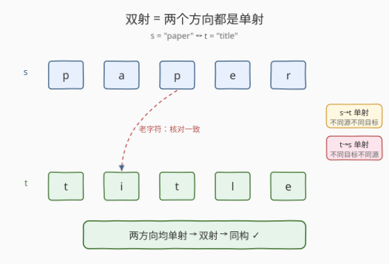
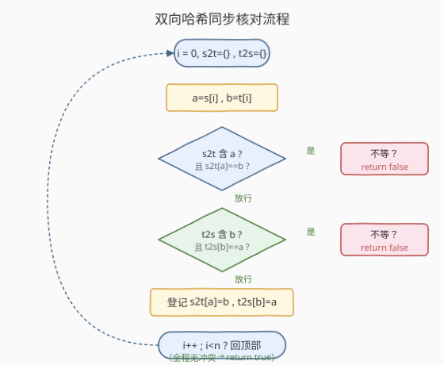
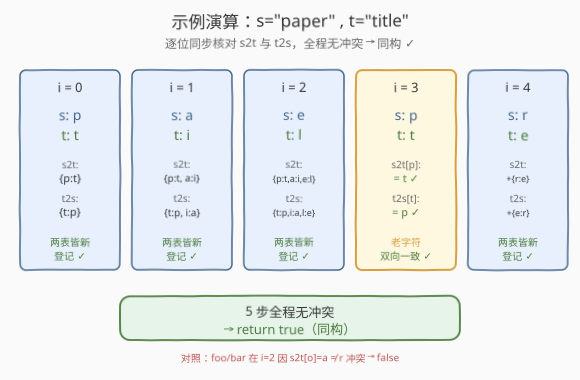

# 同构字符串

- **题目名称**：同构字符串
- **链接**：[205. 同构字符串](https://leetcode.cn/problems/isomorphic-strings/)
- **难度**：简单
- **标签**：哈希表、字符串

## 1. 题目概述

给定两个字符串 `s` 和 `t`，判断它们是否**同构**。

同构的定义：可以把 `s` 中的字符**替换**为别的字符得到 `t`（包括 `t` 自己用过的字符）。这个替换必须满足：

1. **同一个字符每次出现都替换成同一个目标字符**——不能这次换 `a` 下次换 `b`；
2. **不同字符不能替换成同一个目标字符**——两个源字符不能挤到同一个目标上（即映射是**双射**）。
3. 替换**只发生在字符层面**，不改变字符的顺序与长度。

换言之，`s` 与 `t` 的字符之间存在一个**一一对应的双射**。

**示例 1**：

```text
输入：s = "egg", t = "add"
输出：true
解释：e → a，g → d；两个 g 都映射到 d，映射一一对应。
```

**示例 2**：

```text
输入：s = "foo", t = "bar"
输出：false
解释：f → b，o → a 之后，第二个 o 必须也映射到 a，
      但 t 的第三个字符是 r，与既有映射 o → a 冲突。
```

**示例 3**：

```text
输入：s = "paper", t = "title"
输出：true
解释：p → t，a → i，e → l，r → e；逐位一一对应。
```

**约束条件**：

- `1 <= s.length <= 5 * 10⁴`
- `t.length == s.length`
- `s` 和 `t` 由任意有效的 ASCII 字符组成。

> 💡 同构的本质是**字符级双射**。它和 [290 单词模式](https://leetcode.cn/problems/word-pattern/)（单词到字符的双射）、[890 查找和替换模式](https://leetcode.cn/problems/find-and-replace-pattern/)（列表中所有同构于 pattern 的词）是完全同一套模板。判定双射只需保证「**两个方向都是单射**」——既不能多对一（`s→t` 方向），也不能一对多（`t→s` 方向）。

---

## 2. 解题思路

### 2.1 暴力思路：只建一张 s→t 的映射表

最直觉的做法：扫一遍 `s` 和 `t`，用哈希表 `s2t` 记录 `s[i] → t[i]` 的映射。遇到新字符就登记，遇到老字符就核对是否和已登记的一致，不一致立刻返回 `false`。

```text
s2t = {}
for i in range(n):
    a, b = s[i], t[i]
    if a in s2t and s2t[a] != b: return false
    s2t[a] = b
return true
```

但这只保证了 **`s→t` 是单射**（同一个 `s` 字符不会映射到两个不同的 `t` 字符），却漏掉了反向：`t→s` 方向可能 **多对一**——两个不同的 `s` 字符映射到了同一个 `t` 字符。

反例：`s = "badc"`，`t = "baba"`。

| `i` | `s[i]` | `t[i]` | `s2t` 登记结果 |
|-----|--------|--------|----------------|
| 0 | b | b | `b→b` |
| 1 | a | a | `a→a` |
| 2 | d | b | **冲突**？`d` 没登记过，登记 `d→b` |
| 3 | c | a | `c` 没登记过，登记 `c→a` |

单表扫完不报错，返回 `true`。但 `b→b` 和 `d→b` 意味着 `s` 中的 `b`、`d` 两个不同字符都映射到了 `t` 中的 `b`，**不是双射**，正确答案应是 `false`。

> ⚠️ 单表的陷阱：只查了「同一个源是否换了不同目标」，没查「不同源是否换了同一目标」。要保证双射，必须**双向都查**。

### 2.2 核心观察：双射 = 两个方向的单射

双射（一一对应）等价于：**`s→t` 单射** 且 **`t→s` 单射**。两个方向各建一张哈希表，扫描时同步核对即可：

- `s2t[a]` 存在 → 必须等于 `b`；不存在 → 登记 `s2t[a] = b`；
- `t2s[b]` 存在 → 必须等于 `a`；不存在 → 登记 `t2s[b] = a`；
- 任一方向冲突 → 返回 `false`；
- 全程无冲突 → 返回 `true`。



> 💡 **为什么必须两张表？** 因为「单射」是**有方向**的。`s→t` 单射只保证 `s` 中不同字符映到 `t` 中不同字符；要反过来也成立，就得再查 `t→s` 方向。两个方向的单射合起来才是双射。这和 [1 两数之和](../0001-0100/1_两数之和.md)「一次遍历一边查一边插」的思路同源——只不过这里查的是**两个方向**的映射一致性。

### 2.3 算法流程图



一次遍历 `O(n)`，两张哈希表 `O(字符集大小)` 空间。由于题目字符集是 ASCII（至多 128/256 个），空间可视为 `O(1)`。

### 2.4 示例演算

以 `s = "paper"`、`t = "title"` 为例（同构，全程无冲突）：



| `i` | `s[i]` | `t[i]` | `s2t`（核对后） | `t2s`（核对后） | 动作 |
|-----|--------|--------|-----------------|-----------------|------|
| 0 | p | t | `{p:t}` | `{t:p}` | 两边都新，登记 |
| 1 | a | i | `{p:t, a:i}` | `{t:p, i:a}` | 两边都新，登记 |
| 2 | e | l | `{p:t, a:i, e:l}` | `{t:p, i:a, l:e}` | 两边都新，登记 |
| 3 | p | t | `s2t[p]==t` ✓ | `t2s[t]==p` ✓ | 老字符，双向往返一致 |
| 4 | r | e | `+{r:e}` | `+{e:r}` | 两边都新，登记 |

全程无冲突 → 返回 `true`。

**反例演算**：`s = "foo"`、`t = "bar"`。

| `i` | `s[i]` | `t[i]` | 核对结果 |
|-----|--------|--------|----------|
| 0 | f | b | 登记 `f→b`、`b→f` |
| 1 | o | a | 登记 `o→a`、`a→o` |
| 2 | o | r | `s2t[o]==a`，但当前 `t[i]=r`，**`s→t` 方向冲突** → 返回 `false` |

第二个 `o` 想映到 `r`，但 `o` 已经约定映到 `a`，破坏了 `s→t` 单射。

---

## 3. 参考代码

### C++

```cpp
// 同构字符串.cpp —— 双向哈希双射判定，O(n) 时间 / O(字符集) 空间
// 编译: g++ -O2 -std=c++17 同构字符串.cpp -o iso
class Solution {
  public:
    bool isIsomorphic(string s, string t) {
        if (s.size() != t.size()) return false;
        unordered_map<char, char> s2t, t2s;          // 双向映射表
        for (int i = 0; i < (int)s.size(); ++i) {
            char a = s[i], b = t[i];
            if (s2t.count(a) && s2t[a] != b) return false;   // s→t 单射被破坏
            if (t2s.count(b) && t2s[b] != a) return false;   // t→s 单射被破坏
            s2t[a] = b;
            t2s[b] = a;
        }
        return true;
    }
};
```

### Python

```python
class Solution:
    def isIsomorphic(self, s: str, t: str) -> bool:
        if len(s) != len(t):
            return False
        s2t, t2s = {}, {}                       # 双向映射表
        for a, b in zip(s, t):
            if s2t.get(a, b) != b:              # s→t 方向核对
                return False
            if t2s.get(b, a) != a:              # t→s 方向核对
                return False
            s2t[a] = b
            t2s[b] = a
        return True
```

> 💡 Python 用 `s2t.get(a, b) != b` 一行同时覆盖「未登记时默认值是 `b`（必相等，放行去登记）」和「已登记时取旧值与 `b` 比较」两种情况，省去 `in` 判断。注意默认值必须取**当前目标 `b`**，不能取 `None`——否则 `b` 恰为 `None` 时会误判（本题字符非空，取 `b` 最稳妥）。

---

## 4. 复杂度分析

| 维度 | 双向哈希 | 首次出现位置法 |
|------|----------|----------------|
| **时间复杂度** | $O(n)$ | $O(n)$ |
| **空间复杂度** | $O(\|\Sigma\|)$，ASCII 即 $O(1)$ | $O(\|\Sigma\|)$ |
| **实现难度** | 直观，推荐面试首选 | 巧妙但需理解转换原理 |
| **扩展性** | 易推广到 290/890 | 仅适合同构判定 |

> ⚠️ **时间 $O(n)$ 的来源**：一次遍历，每个字符哈希表操作 `O(1)`，共 `n` 次。空间上两张哈希表最多各存 `|\Sigma|` 个条目，ASCII 字符集大小为常数（128 或 256），故空间 `O(1)`；若字符集为 Unicode，则退化为 $O(n)$。

---

## 5. 扩展：首次出现位置法（单表转下标）

还有一种等价但更「绕」的判定法：**把每个字符替换成它首次出现的位置**，`s` 与 `t` 同构当且仅当它们转换后的下标序列**完全相同**。

思路：同构的本质是「**字符的出现模式相同**」——同一位置上的字符，在各自字符串里是不是「第一次出现」。如果 `s[i]` 第一次出现的位置和 `t[i]` 第一次出现的位置始终一致，两个字符串就有相同的结构模式，即同构。

```python
class Solution:
    def isIsomorphic(self, s: str, t: str) -> bool:
        # transform(c, i, seen)：c 的首次出现下标，没见过就登记并返回当前 i
        def transform(string):
            seen = {}
            return [seen.setdefault(c, i) for i, c in enumerate(string)]
        return transform(s) == transform(t)
```

> ⚠️ 这个方法把「双射」问题转换成「**模式编码相同**」问题——和 [290 单词模式](https://leetcode.cn/problems/word-pattern/) 用 `split` 后比对模式串、[890 查找和替换模式](https://leetcode.cn/problems/find-and-replace-pattern/) 用统一编码筛词是同一思想。代码短但需要解释「为什么位置序列相等 ⇔ 同构」，面试推荐先用双向哈希讲清双射，再提此法作为巧解。

---

## 6. 面试要点

1. **为什么单张 `s→t` 映射表不够？**

   - 单表只保证「同一个源字符始终映到同一个目标字符」，即 `s→t` 单射。
   - 但双射要求**两个方向都是单射**：`s→t` 单射 + `t→s` 单射。漏掉 `t→s` 方向，会出现「两个不同源字符映到同一目标」的反例（如 `s="badc"`、`t="baba"`），误判为 `true`。
   - 修复：再加一张 `t→s` 表，双向同步核对。

2. **能不能只用一张表 + 一个集合做到？**

   - 可以。`s2t` 表负责 `s→t` 单射；额外用一个 `used` 集合记录「已被某个源字符占用的目标字符」。登记 `s2t[a]=b` 前，若 `b` 已在 `used` 中（说明别的源字符占了它），返回 `false`。
   - 这等价于双向哈希——`t2s` 表的「值是否存在」就是 `used` 集合。两种写法等价，双向哈希更对称易读。

3. **同构和「两个字符串的字符频率相同」是一回事吗？**

   - 不是。频率相同只保证「**多集合**」相同，不保证位置模式一致。
   - 反例：`s="aabb"`、`t="abab"`，两者 `a`、`b` 各两个，频率相同，但 `a` 在 `s` 中映到 `a`、在 `t` 中却要映到 `a` 和 `b` 两种，**不是双射**，不同构。
   - 同构关心的是**位置上的出现模式**，频率只是副产品。

4. **本题和 290 单词模式、890 查找和替换模式的区别？**

   - **同**：核心都是「**字符/单词级双射判定**」，模板完全一致——双向哈希同步核对。
   - **异**：205 是字符到字符；290 是**单词到字符**的双射（`pattern` 的字符 ↔ `s` 的单词），需要先 `split`；890 是在列表里筛出所有同构于 `pattern` 的词，对每个词套一次 205 的判定。
   - 一句话：**同一套双射模板，换了映射的两端对象**。

5. **如果字符集很大（如 Unicode），空间还是 `O(1)` 吗？**

   - 不是。ASCII 字符集大小固定（128/256），哈希表最多存这么多条目，可视为 `O(1)`。
   - 若字符集为完整 Unicode（至多 $2^{21}$ 个码点），最坏情况两个字符串的字符全不相同，哈希表存 `n` 个条目，空间退化为 $O(n)$。
   - 题目约定「有效 ASCII 字符」，所以本题空间严格 `O(1)`。

> 💡 **一句话总结**：同构字符串 = 字符级双射判定。核心套路是**双向哈希同步核对**——`s2t` 与 `t2s` 两张表，任一方向映射不一致即返回 `false`。一次遍历 `O(n)` 时间、`O(字符集)` 空间。与 290（单词模式）、890（查找替换模式）同模板，合称双射判定三件套。

---

## 7. 同类练习题

- [290. 单词模式](https://leetcode.cn/problems/word-pattern/)：单词 ↔ 字符的双射，先 `split` 再套 205 的双向哈希模板
- [890. 查找和替换模式](https://leetcode.cn/problems/find-and-replace-pattern/)：对列表中每个词跑一次 205 判定，筛出所有同构于 `pattern` 的词
- [2115. 从给定原材料中找到所有下标](https://leetcode.cn/problems/find-all-possible-recipes-from-given-supplies/)：用「首次出现位置编码」统一结构模式，思想同第 5 节巧解
- [1. 两数之和](https://leetcode.cn/problems/two-sum/)（[题解](../0001-0100/1_两数之和.md)）：同样「一次遍历边查边插」的哈希套路，单向查找对照本题双向核对
