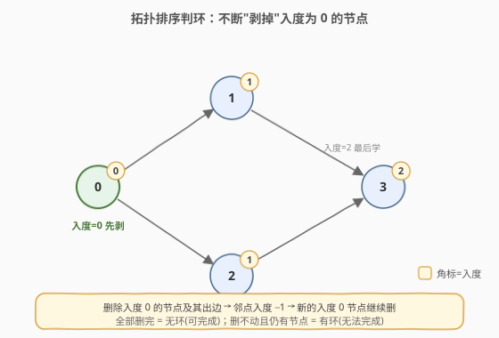
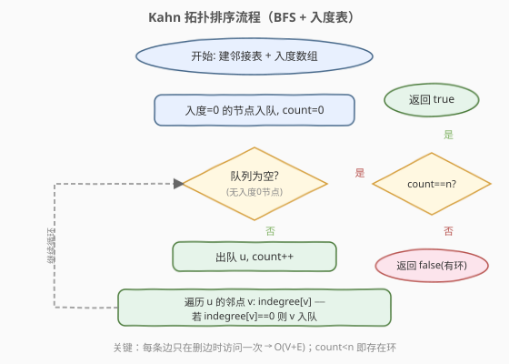
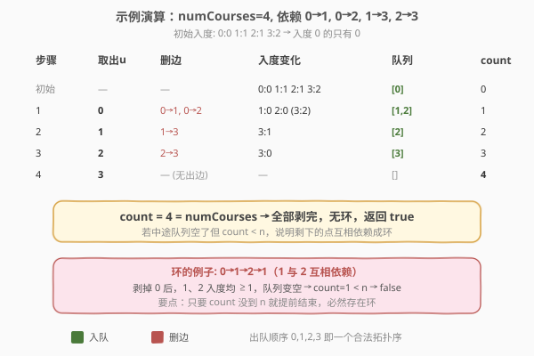

# LeetCode 课程表 题解

## 1. 题目概述

- **标题 / 题号**：课程表（#207，medium）
- **链接**：https://leetcode.cn/problems/course-schedule/
- **难度**：中等
- **标签**：深度优先搜索、广度优先搜索、图、拓扑排序

**题意**：你这个学期必须选修 `numCourses` 门课程，记为 `0` 到 `numCourses - 1`。数组 `prerequisites` 中 `prerequisites[i] = [a, b]` 表示**想学 `a` 必须先学 `b`**。判断是否可能完成所有课程的学习（即判断课程依赖关系构成的有向图是否存在环）。

**示例 1**：

```text
输入：numCourses = 2, prerequisites = [[1,0]]
输出：true
解释：总共 2 门课。学 1 之前要先学 0，这是可行的。
```

**示例 2**：

```text
输入：numCourses = 2, prerequisites = [[1,0],[0,1]]
输出：false
解释：总共 2 门课。学 1 前要先学 0，学 0 前又要先学 1，形成环，不可行。
```

**约束**：

- `1 <= numCourses <= 2000`
- `0 <= prerequisites.length <= 5000`
- `prerequisites[i].length == 2`
- `0 <= ai, bi < numCourses`，且 `ai != bi`
- 所有 `[ai, bi]` 互不相同

## 2. 解题思路

> ⚠️ **建图方向**：`[a, b]` 表示"学 `a` 前先学 `b`"，对应有向边 `b → a`（先修指向后修）。本文统一按 **`b → a`** 建邻接表，这是本题最易写反的细节。

### 2.1 暴力思路

模拟选课：每轮扫描所有课程，挑出"前置已全部完成"的课程标记完成，重复到某轮无新增为止。若最终完成数 `< numCourses`，说明剩下的课程互相依赖成环。每轮扫描 `O(V+E)`，最多 `V` 轮，总复杂度 `O(V·(V+E))`，能过但浪费——每轮都把已确认入度 0 的节点重新扫了一遍。

优化方向：用**入度数组 + 队列**，只在某条边被删除、使邻点入度恰好降为 0 时才把该邻点入队，避免重复扫描。这就是 Kahn 拓扑排序，复杂度降到 `O(V+E)`。

### 2.2 核心观察：拓扑排序判环（Kahn / BFS）



关键直觉：

- **入度 = 0 的课程没有前置**，可以立刻学；学完（"剥掉"）后，它指向的后修课程入度各 `−1`。
- 若某个后修课程的入度因此降到 0，说明它的前置全部学完了，加入"可学"队列。
- 像**剥洋葱**一样一层层去掉入度 0 的节点：
  - 若**全部节点都被剥掉** → 图中无环，可以完成全部课程。
  - 若**队列空了但仍剩节点** → 剩下的节点互相依赖，入度永远降不到 0，存在环，无法完成。

> 💡 一句话：**能被 Kahn 流程剥完的图就是 DAG（有向无环图）**。`count` 记录被剥掉的节点数，最后 `count == numCourses` 即可完成。

### 2.3 算法流程图



流程只有一重 `while`，每条边只在删边时被访问一次、每个节点至多入队出队各一次，因此总时间 `O(V+E)`。

### 2.4 示例演算



以 `numCourses = 4`、依赖 `0→1, 0→2, 1→3, 2→3` 为例（即 `prerequisites = [[1,0],[2,0],[3,1],[3,2]]`）：

| 步骤 | 取出 u | 删边 | 入度变化 | 队列 | count |
|------|--------|------|----------|------|-------|
| 初始 | — | — | 0:0 1:1 2:1 3:2 | `[0]` | 0 |
| 1 | 0 | 0→1, 0→2 | 1:0, 2:0 | `[1,2]` | 1 |
| 2 | 1 | 1→3 | 3:1 | `[2]` | 2 |
| 3 | 2 | 2→3 | 3:0 | `[3]` | 3 |
| 4 | 3 | — | — | `[]` | 4 |

`count = 4 = numCourses`，全部剥完，无环，返回 `true`。出队顺序 `0,1,2,3` 也恰好是一个合法选课顺序（拓扑序）。

> 💡 若中途队列变空但 `count < numCourses`（如依赖 `0→1→2→1` 成环，剥掉 0 后 1、2 入度均 ≥1 永远进不了队），即可提前判定存在环，返回 `false`。

## 3. 参考代码

### 方法一：BFS 拓扑排序（Kahn，推荐）

### C++

```cpp
class Solution {
  public:
    bool canFinish(int numCourses, vector<vector<int>>& prerequisites) {
        vector<vector<int>> adj(numCourses);
        vector<int> indegree(numCourses, 0);
        for (auto& p : prerequisites) {   // [a,b]: 学 a 前先学 b → b→a
            adj[p[1]].push_back(p[0]);
            indegree[p[0]]++;
        }

        queue<int> q;
        for (int i = 0; i < numCourses; ++i)
            if (indegree[i] == 0) q.push(i);

        int count = 0;                    // 已"剥掉"的节点数
        while (!q.empty()) {
            int u = q.front(); q.pop();
            count++;
            for (int v : adj[u])
                if (--indegree[v] == 0) q.push(v);   // 入度归零 → 入队
        }
        return count == numCourses;       // 全剥完 = 无环
    }
};
```

### Python

```python
from collections import deque

class Solution:
    def canFinish(self, numCourses: int, prerequisites: List[List[int]]) -> bool:
        adj = [[] for _ in range(numCourses)]
        indegree = [0] * numCourses
        for a, b in prerequisites:        # b -> a
            adj[b].append(a)
            indegree[a] += 1

        q = deque([i for i in range(numCourses) if indegree[i] == 0])
        count = 0
        while q:
            u = q.popleft()
            count += 1
            for v in adj[u]:
                indegree[v] -= 1
                if indegree[v] == 0:
                    q.append(v)
        return count == numCourses
```

### 方法二：DFS 三色标记法

维护每个节点的颜色：`0` 未访问、`1` 访问中（在当前递归栈里）、`2` 已完成。从某节点 `u` 出发 DFS，若在递归途中遇到一个仍为 `1` 的节点，说明绕回了栈中节点 → **回边 → 有环**。节点整棵子树搜完标记 `2`，避免重复搜索。

### C++

```cpp
class Solution {
    vector<vector<int>> adj;
    vector<int> color;                    // 0 未访问 / 1 访问中 / 2 已完成
    bool dfs(int u) {
        color[u] = 1;                     // 进入：访问中
        for (int v : adj[u]) {
            if (color[v] == 1) return false;        // 回边 → 环
            if (color[v] == 0 && !dfs(v)) return false;
        }
        color[u] = 2;                     // 离开：已完成
        return true;
    }
  public:
    bool canFinish(int numCourses, vector<vector<int>>& prerequisites) {
        adj.assign(numCourses, {});
        color.assign(numCourses, 0);
        for (auto& p : prerequisites) adj[p[1]].push_back(p[0]);  // b -> a
        for (int i = 0; i < numCourses; ++i)
            if (color[i] == 0 && !dfs(i)) return false;
        return true;
    }
};
```

### Python

```python
class Solution:
    def canFinish(self, numCourses: int, prerequisites: List[List[int]]) -> bool:
        adj = [[] for _ in range(numCourses)]
        for a, b in prerequisites:        # b -> a
            adj[b].append(a)
        color = [0] * numCourses          # 0 未访问 / 1 访问中 / 2 已完成

        def dfs(u: int) -> bool:
            color[u] = 1
            for v in adj[u]:
                if color[v] == 1:         # 回边 → 环
                    return False
                if color[v] == 0 and not dfs(v):
                    return False
            color[u] = 2
            return True

        return all(dfs(i) for i in range(numCourses) if color[i] == 0)
```

> 💡 **两种方法的选择**：BFS（Kahn）无递归、不会栈溢出，且出队顺序天然就是一个拓扑序，面试首选；DFS 三色是判断有向图环的通用模板，迁移到"求安全节点 / 拓扑逆序"等变体很方便。

## 4. 复杂度分析

| 维度 | 方法 | 复杂度 | 说明 |
|------|------|--------|------|
| 时间复杂度 | BFS（Kahn） | $O(V+E)$ | 建图 $O(E)$；每点入队出队各一次 $O(V)$；每条边在删边时访问一次 $O(E)$ |
| 空间复杂度 | BFS（Kahn） | $O(V+E)$ | 邻接表 $O(V+E)$，入度数组与队列 $O(V)$ |
| 时间复杂度 | DFS 三色 | $O(V+E)$ | 每点访问一次，每条边沿递归遍历一次 |
| 空间复杂度 | DFS 三色 | $O(V+E)$ | 邻接表 $O(V+E)$，颜色数组 $O(V)$，递归栈最深 $O(V)$ |

> ⚠️ DFS 在最坏情况下递归深度可达 $V$（链状图），`numCourses` 上界 2000 时一般安全，但若题目把规模放到 $10^5$，应改用 BFS 避免栈溢出。

## 5. 扩展：如何输出一个合法选课顺序？

把方法一的 `count` 换成"出队顺序数组"即可——Kahn 中节点的出队顺序本身就是**拓扑序**。这正是 [210. 课程表 II](https://leetcode.cn/problems/course-schedule-ii/) 的要求。DFS 三色则可用"节点离开时（标记 `2` 前）压栈"，最终栈的逆序也是拓扑序。

## 6. 面试要点

1. **为什么入度为 0 的节点可以先学？**
   - 入度 = 0 意味着没有任何前置依赖，随时可学；它不会破坏其它课程的先后约束，因此可安全"删除"。

2. **如何判断存在环？**
   - **BFS**：流程结束后 `count < numCourses`，说明有节点入度始终未归零，困在环里。
   - **DFS**：递归途中遇到颜色为 `1`（访问中）的节点，即从其后代指回了祖先，构成回边 → 环。

3. **BFS 和 DFS 该用哪个？**
   - 面试首选 BFS（Kahn）：无递归栈溢出风险，出队顺序即拓扑序，便于扩展到"输出顺序""求层数"等。DFS 三色更适合作为通用判环模板。

4. **`prerequisites` 的方向怎么建？**
   - `[a, b]` 表示学 `a` 前先学 `b`，即 `b → a`（先修指向后修）。建反了会把入度算到先修课上，导致拓扑序颠倒甚至误判。

5. **重复边 / 自环需要处理吗？**
   - 题目保证所有 `[ai, bi]` 互不相同且 `ai != bi`，因此无重边无自环；若题目不保证，需先去重，否则入度会被多算。

## 同类练习题

| # | 题目 | 与本题的关联 |
|---|------|-------------|
| 210 | [课程表 II](https://leetcode.cn/problems/course-schedule-ii/) | 把 `count` 换成出队顺序数组，直接输出拓扑序 |
| 802 | [找到最终的安全状态](https://leetcode.cn/problems/find-eventual-safe-states/) | DFS 三色判环变体，终点无出边/只通向安全节点的即为安全节点 |
| 329 | [矩阵中的最长递增路径](https://leetcode.cn/problems/longest-increasing-path-in-a-matrix/) | 拓扑排序 + DP，按拓扑序松弛求最长路径 |
| 1136 | [平行课程](https://leetcode.cn/problems/parallel-courses/) | Kahn 按层 BFS，最大层数即为最少学期数 |
