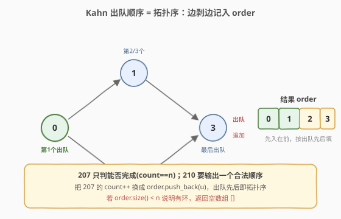
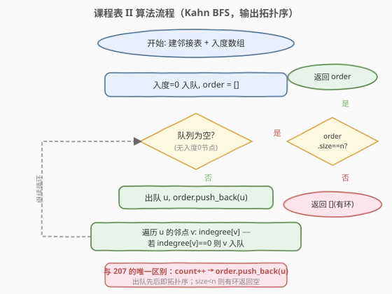
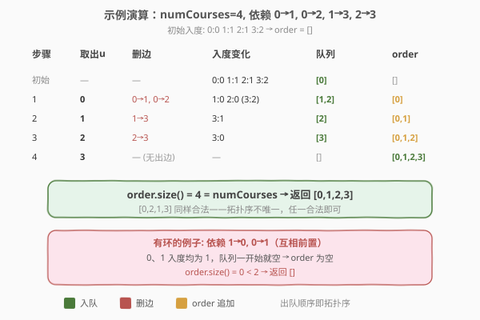
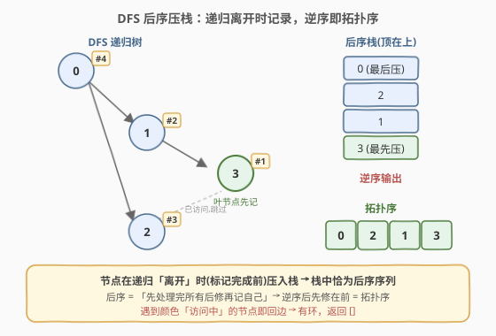

# LeetCode 课程表 II 题解

## 1. 题目概述

- **标题 / 题号**：课程表 II（#210，medium）
- **链接**：https://leetcode.cn/problems/course-schedule-ii/
- **难度**：中等
- **标签**：深度优先搜索、广度优先搜索、图、拓扑排序

**题意**：你这个学期必须选修 `numCourses` 门课程，记为 `0` 到 `numCourses - 1`。数组 `prerequisites` 中 `prerequisites[i] = [a, b]` 表示**想学 `a` 必须先学 `b`**。请你返回**一个可行的选课顺序**（拓扑序）；若无法完成所有课程（即存在环），返回**空数组**。

**示例 1**：

```text
输入：numCourses = 2, prerequisites = [[1,0]]
输出：[0,1]
解释：总共 2 门课。学 1 之前要先学 0，合法顺序为 [0,1]。
```

**示例 2**：

```text
输入：numCourses = 4, prerequisites = [[1,0],[2,0],[3,1],[3,2]]
输出：[0,2,1,3]
解释：一种合法的拓扑序。先修 0，再修 2 或 1，最后修 3。
```

**示例 3**：

```text
输入：numCourses = 1, prerequisites = []
输出：[0]
```

**约束**：

- `1 <= numCourses <= 2000`
- `0 <= prerequisites.length <= 5000`
- `prerequisites[i].length == 2`
- `0 <= ai, bi < numCourses`，且 `ai != bi`
- 所有 `[ai, bi]` 互不相同

## 2. 解题思路

> ⚠️ **建图方向**：`[a, b]` 表示"学 `a` 前先学 `b`"，对应有向边 `b → a`（先修指向后修）。本文统一按 **`b → a`** 建邻接表，这是本题最易写反的细节。

### 2.1 暴力思路

与 [207. 课程表](../0201-0300/207_课程表.md) 同源：每轮扫描所有课程，挑出"前置已全部完成"的记入结果并标记完成，重复到某轮无新增为止。若最终完成数 `< numCourses`，返回空数组。每轮扫描 `O(V+E)`，最多 `V` 轮，总复杂度 `O(V·(V+E))`，能过但浪费——每轮都把已确认入度 0 的节点重新扫了一遍。

优化方向：用**入度数组 + 队列**，只在某条边被删除、使邻点入度恰好降为 0 时才把该邻点入队，避免重复扫描。这就是 Kahn 拓扑排序，复杂度降到 `O(V+E)`。

### 2.2 核心观察：Kahn 出队顺序即拓扑序



本题是 207 的进阶版：207 只判"能否完成"（`count == n`），210 要**输出一个合法顺序**。关键直觉：

- **入度 = 0 的课程没有前置**，可以立刻学；学完（"剥掉"）后，它指向的后修课程入度各 `−1`。
- 若某个后修课程的入度因此降到 0，说明它的前置全部学完了，加入"可学"队列。
- 像**剥洋葱**一样一层层去掉入度 0 的节点。

> 💡 一句话：**Kahn 中节点的「出队先后」天然就是一个拓扑序**。只需把 207 里的 `count++` 换成 `order.push_back(u)`——先出队的先修在前，后出队的后修在后，恰好满足所有依赖约束。最后 `order.size() == numCourses` 即成功，否则有环返回 `[]`。

### 2.3 算法流程图



流程只有一重 `while`，每条边只在删边时被访问一次、每个节点至多入队出队各一次，因此总时间 `O(V+E)`。与 207 的流程几乎一致，唯一区别是把 `count` 换成 `order` 数组。

### 2.4 示例演算



以 `numCourses = 4`、依赖 `0→1, 0→2, 1→3, 2→3` 为例（即 `prerequisites = [[1,0],[2,0],[3,1],[3,2]]`）：

| 步骤 | 取出 u | 删边 | 入度变化 | 队列 | order |
|------|--------|------|----------|------|-------|
| 初始 | — | — | 0:0 1:1 2:1 3:2 | `[0]` | `[]` |
| 1 | 0 | 0→1, 0→2 | 1:0, 2:0 | `[1,2]` | `[0]` |
| 2 | 1 | 1→3 | 3:1 | `[2]` | `[0,1]` |
| 3 | 2 | 2→3 | 3:0 | `[3]` | `[0,1,2]` |
| 4 | 3 | — | — | `[]` | `[0,1,2,3]` |

`order.size() = 4 = numCourses`，返回 `[0,1,2,3]`。注意 `[0,2,1,3]` 同样合法——**拓扑序不唯一**，队列里同入度 0 的节点谁先出都行，任一合法即可。

> 💡 若一开始所有节点入度都 `≥1`（如 `1→0, 0→1` 互相依赖），队列为空、`order` 始终为空，`size()=0 < n`，直接返回 `[]`。

## 3. 参考代码

### 方法一：BFS 拓扑排序（Kahn，推荐）

### C++

```cpp
class Solution {
  public:
    vector<int> findOrder(int numCourses, vector<vector<int>>& prerequisites) {
        vector<vector<int>> adj(numCourses);
        vector<int> indegree(numCourses, 0);
        for (auto& p : prerequisites) {   // [a,b]: 学 a 前先学 b → b→a
            adj[p[1]].push_back(p[0]);
            indegree[p[0]]++;
        }

        queue<int> q;
        for (int i = 0; i < numCourses; ++i)
            if (indegree[i] == 0) q.push(i);

        vector<int> order;               // 出队顺序即拓扑序
        while (!q.empty()) {
            int u = q.front(); q.pop();
            order.push_back(u);          // 关键：记录出队顺序
            for (int v : adj[u])
                if (--indegree[v] == 0) q.push(v);   // 入度归零 → 入队
        }
        if ((int)order.size() < numCourses) return {};   // 有环
        return order;
    }
};
```

### Python

```python
from collections import deque

class Solution:
    def findOrder(self, numCourses: int, prerequisites: List[List[int]]) -> List[int]:
        adj = [[] for _ in range(numCourses)]
        indegree = [0] * numCourses
        for a, b in prerequisites:        # b -> a
            adj[b].append(a)
            indegree[a] += 1

        q = deque([i for i in range(numCourses) if indegree[i] == 0])
        order = []
        while q:
            u = q.popleft()
            order.append(u)               # 关键：记录出队顺序
            for v in adj[u]:
                indegree[v] -= 1
                if indegree[v] == 0:
                    q.append(v)
        return order if len(order) == numCourses else []
```

### 方法二：DFS 后序压栈



另一种思路用 **DFS 三色标记**：维护每个节点的颜色 `0` 未访问 / `1` 访问中 / `2` 已完成。从节点 `u` 出发 DFS，**在递归「离开」`u` 时（所有后修都处理完、标记 `2` 之前）把 `u` 压入栈**。这样栈中恰为**后序序列**，逆序后先修在前、后修在后，即为拓扑序。

> 💡 **为什么后序逆序是拓扑序？** 后序 = "先处理完所有后修，再记自己"。所以越靠后修的节点越先被压栈（栈底），越靠先修的节点越晚被压栈（栈顶）。逆序输出就让先修排前面，符合依赖顺序。

若递归途中遇到颜色仍为 `1`（访问中）的节点，说明绕回了栈中节点 → **回边 → 有环**，返回空数组。

### C++

```cpp
class Solution {
    vector<vector<int>> adj;
    vector<int> color;                    // 0 未访问 / 1 访问中 / 2 已完成
    vector<int> order;
    bool hasCycle = false;

    void dfs(int u) {
        color[u] = 1;                     // 进入：访问中
        for (int v : adj[u]) {
            if (color[v] == 1) { hasCycle = true; return; }   // 回边 → 环
            if (color[v] == 0) dfs(v);
            if (hasCycle) return;
        }
        color[u] = 2;                     // 离开：已完成
        order.push_back(u);               // 后序压栈
    }
  public:
    vector<int> findOrder(int numCourses, vector<vector<int>>& prerequisites) {
        adj.assign(numCourses, {});
        color.assign(numCourses, 0);
        for (auto& p : prerequisites) adj[p[1]].push_back(p[0]);  // b -> a
        for (int i = 0; i < numCourses; ++i)
            if (color[i] == 0) {
                dfs(i);
                if (hasCycle) return {};
            }
        reverse(order.begin(), order.end());   // 后序逆序 = 拓扑序
        return order;
    }
};
```

### Python

```python
class Solution:
    def findOrder(self, numCourses: int, prerequisites: List[List[int]]) -> List[int]:
        adj = [[] for _ in range(numCourses)]
        for a, b in prerequisites:        # b -> a
            adj[b].append(a)
        color = [0] * numCourses          # 0 未访问 / 1 访问中 / 2 已完成
        order = []
        has_cycle = False

        def dfs(u: int) -> None:
            nonlocal has_cycle
            color[u] = 1
            for v in adj[u]:
                if color[v] == 1:         # 回边 → 环
                    has_cycle = True
                    return
                if color[v] == 0:
                    dfs(v)
                    if has_cycle:
                        return
            color[u] = 2
            order.append(u)               # 后序压栈

        for i in range(numCourses):
            if color[i] == 0:
                dfs(i)
                if has_cycle:
                    return []
        order.reverse()                   # 后序逆序 = 拓扑序
        return order
```

> 💡 **两种方法的选择**：BFS（Kahn）无递归、不会栈溢出，且出队顺序天然就是拓扑序，面试首选；DFS 后序压栈是"用 DFS 产拓扑序"的通用模板，迁移到"求强连通分量（Tarjan）""求拓扑逆序"等变体很方便。

## 4. 复杂度分析

| 维度 | 方法 | 复杂度 | 说明 |
|------|------|--------|------|
| 时间复杂度 | BFS（Kahn） | $O(V+E)$ | 建图 $O(E)$；每点入队出队各一次 $O(V)$；每条边在删边时访问一次 $O(E)$ |
| 空间复杂度 | BFS（Kahn） | $O(V+E)$ | 邻接表 $O(V+E)$，入度数组、队列与结果数组 $O(V)$ |
| 时间复杂度 | DFS 后序 | $O(V+E)$ | 每点访问一次，每条边沿递归遍历一次 |
| 空间复杂度 | DFS 后序 | $O(V+E)$ | 邻接表 $O(V+E)$，颜色数组与结果数组 $O(V)$，递归栈最深 $O(V)$ |

> ⚠️ DFS 在最坏情况下递归深度可达 $V$（链状图），`numCourses` 上界 2000 时一般安全，但若题目把规模放到 $10^5$，应改用 BFS 避免栈溢出。

## 5. 扩展：字典序最小的拓扑序

若题目进一步要求"在所有合法拓扑序中输出**字典序最小**的一个"，只需把 Kahn 中的普通队列换成**小根堆（优先队列）**：每次取出当前入度为 0 的节点中编号最小者即可。

```cpp
priority_queue<int, vector<int>, greater<int>> pq;   // 小根堆
for (int i = 0; i < numCourses; ++i)
    if (indegree[i] == 0) pq.push(i);
while (!pq.empty()) {
    int u = pq.top(); pq.pop();
    order.push_back(u);
    for (int v : adj[u])
        if (--indegree[v] == 0) pq.push(v);
}
```

复杂度从 `O(V+E)` 升到 `O((V+E) log V)`（堆操作）。常见于「并行课程」「课程表 IV」等变体。

## 6. 面试要点

1. **本题和 207 的区别是什么？**
   - 207 只判能否完成（返回布尔），用 `count` 统计剥掉的节点数；210 要输出一个合法顺序，把 `count++` 换成 `order.push_back(u)` 即可，出队先后天然就是拓扑序。

2. **拓扑序唯一吗？**
   - 不唯一。当某一时刻队列里有多于一个入度 0 的节点时，谁先出队都合法。若要求字典序最小，用小根堆代替普通队列。

3. **DFS 后序为什么逆序才是拓扑序？**
   - 后序是"处理完所有后修再记自己"，所以后修先入栈、先修后入栈；逆序后先修排前，恰好满足"先修在前、后修在后"的依赖约束。

4. **如何判断存在环？**
   - **BFS**：流程结束后 `order.size() < numCourses`，说明有节点入度始终未归零，困在环里，返回空数组。
   - **DFS**：递归途中遇到颜色为 `1`（访问中）的节点，即从其后代指回了祖先，构成回边 → 环，返回空数组。

5. **`prerequisites` 的方向怎么建？**
   - `[a, b]` 表示学 `a` 前先学 `b`，即 `b → a`（先修指向后修）。建反了会把入度算到先修课上，导致拓扑序颠倒甚至误判。

## 同类练习题

| # | 题目 | 与本题的关联 |
|---|------|-------------|
| 207 | [课程表](https://leetcode.cn/problems/course-schedule/)（[题解](207_课程表.md)） | 本题的判环版，`count == n` 即可完成 |
| 802 | [找到最终的安全状态](https://leetcode.cn/problems/find-eventual-safe-states/) | DFS 三色判环变体，终点无出边/只通向安全节点的即为安全节点 |
| 329 | [矩阵中的最长递增路径](https://leetcode.cn/problems/longest-increasing-path-in-a-matrix/)（[题解](../0301-0400/329_矩阵中的最长递增路径.md)） | 拓扑排序 + DP，按拓扑序松弛求最长路径 |
| 1136 | [平行课程](https://leetcode.cn/problems/parallel-courses/) | Kahn 按层 BFS，最大层数即为最少学期数；可扩展为字典序最小 |
| 2392 | [给定条件下构造矩阵](https://leetcode.cn/problems/build-a-matrix-with-conditions/) | 行、列分别做一次拓扑排序，Kahn 输出顺序填入矩阵 |
