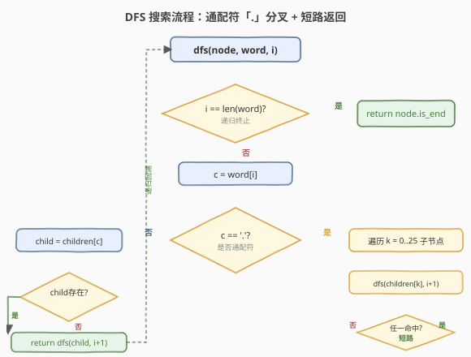

# 添加与搜索单词 - 数据结构设计

- **题目名称**：添加与搜索单词 - 数据结构设计
- **链接**：[211. 添加与搜索单词 - 数据结构设计](https://leetcode.cn/problems/design-add-and-search-words-data-structure/)
- **难度**：中等
- **标签**：字典树、深度优先搜索、设计、字符串

## 1. 题目概述

设计一个支持下列操作的数据结构：

- `addWord(word)`：添加单词 `word` 到数据结构中
- `search(word)`：判断是否有**任一**已添加的单词与 `word` 匹配。`word` 中可含通配符 `.`，每个 `.` 可以匹配**任意一个小写字母**

**示例 1**：

```text
输入：
["WordDictionary","addWord","addWord","addWord","search","search","search","search"]
[[],               ["bad"],  ["dad"],  ["mad"],  ["pad"],  ["bad"],  [".ad"],  ["b.."]]
输出：[null,null,null,null,false,true,true,true]

解释：
WordDictionary wordDictionary = new WordDictionary();
wordDictionary.addWord("bad");
wordDictionary.addWord("dad");
wordDictionary.addWord("mad");
wordDictionary.search("pad");   // false —— "pad" 未插入
wordDictionary.search("bad");   // true  —— 精确匹配
wordDictionary.search(".ad");   // true  —— '.' 匹配 b/d/m，故 bad/dad/mad 均命中
wordDictionary.search("b..");   // true  —— b→'.'→'.' 匹配 "bad"
```

**示例 2**：

```text
输入：
["WordDictionary","addWord","addWord","search","search","search","search","search","search"]
[[],               ["a"],     ["a"],    [".a"],  ["a."],  [".a."], [".."],  ["."]]
输出：[null,null,null,false,false,false,true,true]
```

**约束条件**：

- `1 <= word.length <= 25`
- `addWord` 中的 `word` 仅由小写英文字母组成
- `search` 中的 `word` 由小写英文字母或 `.` 组成
- 最多调用 `addWord` 和 `search` 各 $10^4$ 次

> ⚠️ 注意：`search` 的 `word` 可以含 `.`，这是与 [208. 实现 Trie](../0201-0300/208_实现Trie.md) 的关键区别——208 的 `search` 是确定性逐字符走子节点，而本题遇到 `.` 时**无法确定走哪个分支**，需要同时探索所有可能。

---

## 2. 解题思路

### 2.1 暴力思路

用一个列表存所有单词，`addWord` 直接 `append`（$O(L)$）；`search` 时遍历列表，逐单词与 `word` 比较——普通字符精确比对，`.` 视作匹配任意字母。

| 操作 | 时间复杂度 | 问题 |
|------|-----------|------|
| `addWord` | $O(L)$ | 可接受 |
| `search` | $O(N \cdot L)$ | $N$ 个单词每个比 $L$ 字符 |

当 `addWord` 与 `search` 各 $10^4$ 次、$L \le 25$ 时，`search` 总开销最坏 $O(10^4 \times 25 \times 10^4) = 2.5 \times 10^9$，必然超时。更关键的是：**大量单词共享前缀**（如 `bad` / `dad` / `mad` 共享后两字符 `ad`），逐个比较让前缀部分的工作完全重复。

### 2.2 核心观察：Trie + DFS 通配符分叉


关键转化沿用 [208. 实现 Trie](../0201-0300/208_实现Trie.md) 的前缀树，区别仅在 `search`：

- **普通字符**（`c != '.'`）：和 208 一样，走 `children[c]` 这一个确定分支；不存在即返回 `false`。
- **通配符 `.`**：无法确定走哪一支，于是**递归尝试当前节点所有非空子节点**，任一分支命中即返回 `true`。

> 💡 **本质**：`search` 从 208 的「迭代逐字符走」升级为「递归 DFS」——确定性字符是一条直线，通配符是一次分叉。整棵 Trie 限定了搜索空间：只走「确实有单词经过」的节点，不会无中生有地展开 26 条空分支。

插入 `bad`、`dad`、`mad` 后的 Trie 形如：

```text
root ─ b ─ a ─ d★
     ─ d ─ a ─ d★
     ─ m ─ a ─ d★
```

- `search(".ad")`：`.` 在 root 分叉到 `b`/`d`/`m` 三支，后续 `a→d★` 三条路全部命中 → `true`
- `search("b..")`：`b` 确定走 `b` 分支，第一 `.` 分叉到 `a`，第二 `.` 分叉到 `d★` → `true`
- `search("pad")`：`p` 不在 root 子节点 → `false`（无需展开）

### 2.3 算法流程图



`search` 的递归骨架：

```
dfs(node, word, i):
  if i == len(word):
      return node.is_end          # 走完全程，看是否落在单词结尾

  c = word[i]
  if c != '.':
      child = node.children[c]
      return child != null and dfs(child, word, i+1)
  else:                            # 通配符：枚举所有非空子节点
      for child in node.children:  # 遍历 26 个槽
          if child != null and dfs(child, word, i+1):
              return true          # 任一分支命中即可
      return false
```

要点：

- **递归终止**：`i == len(word)` 时不再看字符，而是检查 `node.is_end`——路径走完不等于单词存在，必须落在某个 `is_end` 节点上。
- **短路返回**：通配符分支中一旦某条递归返回 `true`，立即 `return true`，不再探索其余分支——这是把最坏 $O(26^L)$ 压到实际 $O(\text{节点数})$ 的关键。
- **`addWord` 完全照搬 208**：逐字符走/建子节点，末尾置 `is_end = true`。

### 2.4 示例演算

以插入 `bad` / `dad` / `mad` 后的 Trie 为例，分别演算三次 `search`：


| 步骤 | 查询 | 当前节点 | 字符 | 动作 | 结果 |
|------|------|---------|------|------|------|
| ① | `".ad"` | root | `.` | 分叉：尝试 b/d/m 三支 | — |
| ② | | b→a→d | a, d | 确定走 a→d，`is_end=T` | 命中 → `true` |
| ③ | `"b.."` | root | b | 确定走 b 分支 | — |
| ④ | | b | `.` | 分叉：只有 a 这一支非空 | — |
| ⑤ | | b→a | `.` | 分叉：只有 d 这一支非空，`is_end=T` | 命中 → `true` |
| ⑥ | `"pad"` | root | p | `children[p]` 不存在 | `false` |

> 💡 注意步骤 ②：`search(".ad")` 在 root 处展开 3 条分支，但只要第一条（`b→a→d`）命中就立即返回 `true`，不会再去试 `d`/`m` 分支。这是 DFS 短路剪枝的威力。

---

## 3. 参考代码

### C++

```cpp
class WordDictionary {
    struct TrieNode {
        TrieNode* children[26] = {};
        bool is_end = false;
    };
    TrieNode* root;

  public:
    WordDictionary() : root(new TrieNode()) {}

    void addWord(string word) {
        TrieNode* node = root;
        for (char c : word) {
            int idx = c - 'a';
            if (!node->children[idx])
                node->children[idx] = new TrieNode();
            node = node->children[idx];
        }
        node->is_end = true;
    }

    bool search(string word) {
        return dfs(root, word, 0);
    }

  private:
    bool dfs(TrieNode* node, const string& word, int i) {
        if (i == word.size())
            return node->is_end;
        char c = word[i];
        if (c != '.') {
            TrieNode* child = node->children[c - 'a'];
            return child && dfs(child, word, i + 1);
        }
        for (int k = 0; k < 26; ++k)
            if (node->children[k] && dfs(node->children[k], word, i + 1))
                return true;
        return false;
    }
};
```

### Python

```python
class WordDictionary:
    def __init__(self):
        self.root = {}

    def addWord(self, word: str) -> None:
        node = self.root
        for c in word:
            if c not in node:
                node[c] = {}
            node = node[c]
        node['#'] = True          # is_end 标记

    def search(self, word: str) -> bool:
        def dfs(node, i):
            if i == len(word):
                return '#' in node
            c = word[i]
            if c != '.':
                return c in node and dfs(node[c], i + 1)
            for k, child in node.items():
                if k != '#' and dfs(child, i + 1):
                    return True
            return False
        return dfs(self.root, 0)
```

> 💡 Python 版用嵌套 dict 复用 208 的写法：`'#'` 键标记 `is_end`，通配符分支时需跳过 `'#'` 键只遍历字符子节点。C++ 版用 `children[26]` 数组，遍历更紧凑且无需区分 `'#'`。

---

## 4. 复杂度分析

| 维度 | 复杂度 | 说明 |
|------|--------|------|
| `addWord` 时间 | $O(L)$ | $L$ = 单词长度，逐字符走/建节点 |
| `search` 时间（无 `.`） | $O(L)$ | 确定性逐字符走，退化为 208 的 `search` |
| `search` 时间（含 `.`） | $O(\min(26^L,\, N_{\text{node}}))$ | 最坏全 `.` 时理论上界 $26^L$，但 Trie 只展开非空子节点，实际受已有节点数约束 |
| 空间 | $O(\sum \lvert \text{word}_i \rvert)$ | Trie 节点总数；递归栈深 $O(L) \le O(25)$ |

> 💡 $L \le 25$ 且调用次数 $\le 10^4$，即便每次 `search` 全通配，Trie 限定的搜索空间也远小于 $26^{25}$——真实测试集中 `search` 的递归展开通常只触达几十到几百节点。

---

## 5. 扩展：按长度分桶的哈希解法

若 `search` 的通配符极少，也可不用 Trie，改用「按单词长度分桶 + 哈希集合」：

- `addWord`：把 `word` 加入 `buckets[len(word)]`（一个 `set`）。
- `search`：只在 `buckets[len(word)]` 中逐个比对，`.` 视作匹配任意字母。

| 解法 | `addWord` | `search`（无 `.`） | `search`（含 `.`） | 适合场景 |
|------|----------|-------------------|-------------------|---------|
| Trie + DFS | $O(L)$ | $O(L)$ | $O(\text{节点数})$ | 通配符较多、追求前缀剪枝 |
| 长度分桶 + 哈希 | $O(L)$ | $O(L)$（命中哈希） | $O(N_L \cdot L)$，$N_L$ 为同长单词数 | 通配符稀少、实现简单 |

> ⚠️ 长度分桶法在 `search` 全是 `.` 时退化为遍历同长全部单词，与暴力无异；Trie 的优势在于**沿前缀自动剪枝**——前缀不匹配的分支根本不展开。

---

## 6. 面试要点

1. **这题和 208 实现 Trie 有什么区别？**

   - `addWord` 完全一样，都是标准 Trie 插入。
   - 208 的 `search` 是确定性逐字符走（迭代即可）；本题 `search` 的 `word` 可含 `.`，遇到 `.` 必须同时探索所有子节点，**必须用递归 DFS**。
   - 本质：把 208 的「一条直线」推广为「遇 `.` 分叉的搜索树」。

2. **为什么通配符 `.` 不能迭代处理？**

   - 普通字符只对应一个子节点，迭代走单链即可；`.` 对应**多个**子节点，需要同时维护多条候选路径。递归天然表达「分叉 → 合并结果」的语义，迭代则需要显式栈模拟。

3. **`search` 的最坏时间复杂度是多少？实际为什么快很多？**

   - 理论上界 $O(26^L)$（全 `.` 且 Trie 是满 26 叉树）。但 Trie 只为**已插入单词**建节点，绝大多数槽位是空的，`for k in 0..25` 中非空子节点很少；加上短路返回（任一分支命中即返回），实际展开的节点数远小于上界。

4. **递归终止条件为什么要检查 `is_end`？**

   - `i == len(word)` 只说明「路径走完了」，但 Trie 中某条路径存在不代表它是某单词的结尾。例如只插入 `"apple"` 时，`search("app")` 走完 `a→p→p` 但 `is_end=false`，必须返回 `false`。这与 208 的 `search` / `startsWith` 区别同理。

5. **能否用 BFS 或并查集替代 DFS？**

   - BFS 也可（把 `(node, i)` 状态入队，遇 `.` 把所有非空子节点批量入队），但 DFS 的递归短路更简洁、常数更小。并查集处理连通性，不匹配「枚举所有匹配路径」的语义，不适合。

---

## 7. 同类练习题

- [208. 实现 Trie（前缀树）](https://leetcode.cn/problems/implement-trie-prefix-tree/)（[题解](../0201-0300/208_实现Trie.md)）：Trie 的基础模板，本题的前置知识——`addWord` 即 208 的 `insert`，`search` 在 208 基础上加 `.` 分叉
- [212. 单词搜索 II](https://leetcode.cn/problems/word-search-ii/)（[题解](../0201-0300/212_单词搜索II.md)）：Trie + DFS 回溯的另一经典应用，把 words 建成 Trie 限制 board 搜索方向，思路与本题「Trie 限定搜索空间」一脉相承
- [648. 单词替换](https://leetcode.cn/problems/replace-words/)：Trie 前缀匹配，找最短前缀替换派生词
- [676. 实现魔法字典](https://leetcode.cn/problems/implement-magic-dictionary/)：Trie + 精确匹配至多差一位，变体通配——允许恰好一个字符不同
- [720. 词典中最长的单词](https://leetcode.cn/problems/longest-word-in-dictionary/)：Trie + 排序，逐字符验证前缀连续可构成的最长词
