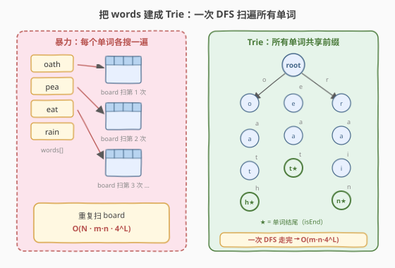
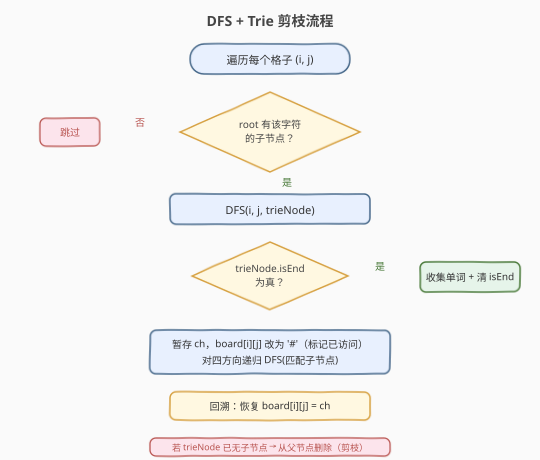
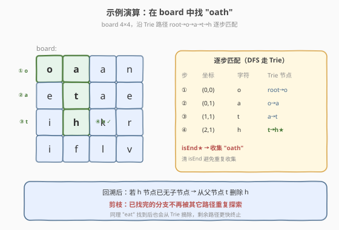

# 单词搜索 II

- **题目名称**：单词搜索 II
- **链接**：[212. 单词搜索 II](https://leetcode.cn/problems/word-search-ii/)
- **难度**：困难
- **标签**：字典树、回溯、深度优先搜索、数组

## 1. 题目概述

给定一个 `m x n` 的字符网格 `board` 和一个单词列表 `words`，返回**所有**在网格中出现的单词。每个单词必须由**顺序相邻**的单元格构成（水平或垂直相邻），同一个单元格在**同一个单词中不能重复使用**。

**示例 1**：

```text
输入：board = [["o","a","a","n"],["e","t","a","e"],["i","h","k","r"],["i","f","l","v"]]
      words = ["oath","pea","eat","rain"]
输出：["eat","oath"]
解释：oath 的路径为 (0,0)→(0,1)→(1,1)→(2,1)；eat 的路径为 (0,3)→(1,3)→(1,2)（或其它可行路径）。
```

**示例 2**：

```text
输入：board = [["a","b"],["c","d"]], words = ["abcb"]
输出：[]
解释：所有可能路径均会重复使用单元格，不满足条件。
```

**约束条件**：

- `m == board.length`，`1 <= m, n <= 12`
- `board[i][j]` 为小写英文字母
- `1 <= words.length <= 3 * 10^4`
- `1 <= words[i].length <= 10`，`words[i]` 由小写字母组成且**互不相同**

> ⚠️ 注意：`words` 最多可达 $3 \times 10^4$ 个，若对每个单词单独搜索 board，重复扫描代价极高——这是本题必须用 Trie 的根本原因。

---

## 2. 解题思路

### 2.1 暴力思路

对 `words` 中每个单词跑一遍 [79. 单词搜索](../0001-0100/79_单词搜索.md) 的回溯 DFS。单次搜索 $O(m \cdot n \cdot 4^L)$（$L$ 为单词长度），$N$ 个单词总计 $O(N \cdot m \cdot n \cdot 4^L)$。当 $N = 3 \times 10^4$ 时必然超时，且**大量单词共享前缀**（如 `eat` / `ear` / `early`），重复扫描 board 是巨大浪费。

### 2.2 核心观察：把 words 建成 Trie，一次 DFS 走完



关键转化：**不是「对每个单词在 board 上找」，而是「在 board 上 DFS 时，用 Trie 限制只能走存在单词的方向」**。

1. 将所有 `words` 插入一棵 Trie，节点存 `word`（非空表示此处是某单词结尾）。
2. 从 `board` 每个格子出发做 DFS：只要当前字符在 Trie 当前节点的子节点中，就继续往下走。
3. 走到 `word` 非空的节点 → 收集该单词，并把 `word` 清空（避免重复收集）。
4. 四方向递归完毕后**回溯**恢复格子。

> 💡 **核心收益**：所有共享前缀的单词共用同一条 Trie 路径，board 只需扫一遍；一旦某字符不在 Trie 子节点中，整条分支立即剪掉，不再深入。

### 2.3 算法流程图



要点：

- **原地标记已访问**：把 `board[i][j]` 暂存为 `ch`，改写为 `'#'`（非字母哨兵），递归回来后恢复为 `ch`。这样无需额外的 `visited` 矩阵。
- **收集即清除**：找到单词后 `node->word.clear()`，同一单词只入结果一次。
- **叶子剪枝**：若回溯后发现 `node` 已无子节点、也不再是单词结尾，就从父节点把它摘除——后续其它路径不会再走这条死分支，显著降低常数。

### 2.4 示例演算

以示例 1 的 `board` 查找 `"oath"` 为例，沿 Trie 路径 `root→o→a→t→h` 逐步匹配：



| 步骤 | 坐标 | 字符 | Trie 节点 | 动作 |
|------|------|------|-----------|------|
| ① | (0,0) | o | root→o | 进入子节点 o |
| ② | (0,1) | a | o→a | 进入子节点 a |
| ③ | (1,1) | t | a→t | 进入子节点 t |
| ④ | (2,1) | h | t→h | `isEnd★` → 收集 `"oath"`，清空 word |

收集后回溯：`h` 节点已无子节点且 word 已清空 → 从父节点 `t` 摘除 `h`，此后其它路径不会再探索这条分支。同理 `"eat"` 找到后也会从 Trie 摘除，剩余搜索更快终止。

---

## 3. 参考代码

### C++

```cpp
struct TrieNode {
    TrieNode* children[26] = {};
    string word;  // 非空 ⇒ 此节点为某单词结尾，直接存单词便于收集
};

class Solution {
    int m, n;
    vector<string> ans;

    bool isEmpty(TrieNode* t) {
        for (auto c : t->children)
            if (c) return false;
        return t->word.empty();
    }

    void dfs(vector<vector<char>>& B, int i, int j, TrieNode* parent) {
        char ch = B[i][j];
        if (ch == '#') return;                       // 已访问
        TrieNode* node = parent->children[ch - 'a'];
        if (!node) return;                           // Trie 无此分支 → 剪枝
        if (!node->word.empty()) {
            ans.push_back(node->word);
            node->word.clear();                      // 同一单词只收集一次
        }
        B[i][j] = '#';                               // 原地标记已访问
        const int dx[4] = {1, -1, 0, 0};
        const int dy[4] = {0, 0, 1, -1};
        for (int k = 0; k < 4; ++k) {
            int ni = i + dx[k], nj = j + dy[k];
            if (ni >= 0 && ni < m && nj >= 0 && nj < n && B[ni][nj] != '#')
                dfs(B, ni, nj, node);
        }
        B[i][j] = ch;                                // 回溯恢复
        if (isEmpty(node)) {                         // 已是叶子 ⇒ 摘除，避免重复探索
            parent->children[ch - 'a'] = nullptr;
            delete node;
        }
    }

  public:
    vector<string> findWords(vector<vector<char>>& board, vector<string>& words) {
        TrieNode root;
        for (auto& w : words) {
            TrieNode* cur = &root;
            for (char c : w) {
                int idx = c - 'a';
                if (!cur->children[idx]) cur->children[idx] = new TrieNode();
                cur = cur->children[idx];
            }
            cur->word = w;
        }
        m = board.size();
        n = board[0].size();
        for (int i = 0; i < m; ++i)
            for (int j = 0; j < n; ++j)
                dfs(board, i, j, &root);
        return ans;
    }
};
```

### Python

```python
class TrieNode:
    __slots__ = ("children", "word")
    def __init__(self):
        self.children = {}
        self.word = ""

class Solution:
    def findWords(self, board: List[List[str]], words: List[str]) -> List[str]:
        root = TrieNode()
        for w in words:                       # 把所有单词建成一棵 Trie
            cur = root
            for c in w:
                if c not in cur.children:
                    cur.children[c] = TrieNode()
                cur = cur.children[c]
            cur.word = w

        m, n = len(board), len(board[0])
        ans = []

        def dfs(i: int, j: int, parent: TrieNode) -> None:
            ch = board[i][j]
            if ch == "#":
                return
            node = parent.children.get(ch)
            if not node:                      # Trie 无此分支 → 剪枝
                return
            if node.word:
                ans.append(node.word)
                node.word = ""                # 同一单词只收集一次
            board[i][j] = "#"                 # 原地标记已访问
            for dx, dy in ((1, 0), (-1, 0), (0, 1), (0, -1)):
                ni, nj = i + dx, j + dy
                if 0 <= ni < m and 0 <= nj < n and board[ni][nj] != "#":
                    dfs(ni, nj, node)
            board[i][j] = ch                  # 回溯恢复
            if not node.children and not node.word:
                del parent.children[ch]       # 剪枝：摘除叶子

        for i in range(m):
            for j in range(n):
                dfs(i, j, root)
        return ans
```

---

## 4. 复杂度分析

| 维度 | 复杂度 | 说明 |
|------|--------|------|
| 时间复杂度 | $O(m \cdot n \cdot 4^{L})$ | 最坏情况每个格子出发都要走满深度 $L$（最长单词长度）；建 Trie 为 $O(\sum \lvert words[i]\rvert)$。实际因 Trie 剪枝远好于此上界 |
| 空间复杂度 | $O(\sum \lvert words[i]\rvert)$ | Trie 节点总数；递归栈深度 $O(L)$（原地标记已访问，无额外 visited 矩阵） |

> 💡 这里 $L \le 10$（约束给出），故 $4^L \le 2^{20}$ 的常数很小，配合剪枝在 $m,n \le 12$ 上轻松通过。

---

## 5. 扩展：剪枝与常数优化

| 优化 | 作用 | 说明 |
|------|------|------|
| **收集即清 word** | 去重 | 同一单词在 Trie 中只挂一个终点，清空后不会被二次收集，省去对结果去重 |
| **叶子摘除** | 减分支 | 回溯时若节点已成叶子（无子、无 word），就从父节点删除。已被找完的单词分支不会再被其它起点重复探索 |
| **首字符计数预判** | 早退 | 建 Trie 前统计 board 出现的字符集合，若某单词含 board 没有的字符直接不插入；对 board 中未在任一单词首字符出现的格子也可跳过起点 |
| **`__slots__` / 数组存子节点** | 降常数 | Python 用 `__slots__` 减少对象内存；C++ 用 `children[26]` 数组比哈希表更快 |

---

## 6. 面试要点

1. **为什么不能用「每个单词各搜一遍」的暴力？**
   - `words` 最多 $3 \times 10^4$ 个，且大量单词共享前缀。暴力会让 board 被重复扫描 $N$ 次，前缀部分的工作完全重复，必然超时。Trie 把所有单词的前缀合并成一棵树，board 只扫一遍。

2. **为什么把 `word` 直接存在 Trie 节点里，而不是只存 `isEnd` 标记？**
   - 存 `word` 便于在到达终点时直接收集结果，免去「沿 Trie 路径还原字符串」的额外维护；收集后 `clear()` 即去重，逻辑更简洁。

3. **如何处理「同一单元格不能重复使用」？**
   - 原地改写：进入格子时把 `board[i][j]` 暂存并改为哨兵 `'#'`，递归回来后恢复。无需额外 `visited` 矩阵，空间更省、缓存更友好。

4. **叶子摘除剪枝的原理是什么？**
   - 一个 Trie 节点若是叶子且不再是任何单词的结尾，说明它对应的单词已被找完、下面没有任何待找内容，整条分支对后续搜索毫无价值。摘除后其它起点走到此处会因 `children[ch]` 为空直接 return，避免无谓的递归。

5. **能否用并查集 / BFS 解决？**
   - 不适合。本题需要枚举所有可达的字符序列路径，路径有方向性且不能重用单元格，本质是回溯搜索；并查集处理连通性、BFS 求最短路径，都不匹配「枚举所有合法路径」的语义。

---

## 7. 同类练习题

- [79. 单词搜索](https://leetcode.cn/problems/word-search/)（[题解](../0001-0100/79_单词搜索.md)）：单个单词的回溯，本题退化为 $N=1$ 的版本
- [208. 实现 Trie（前缀树）](https://leetcode.cn/problems/implement-trie-prefix-tree/)（[题解](../0201-0300/208_实现Trie.md)）：Trie 的基础数据结构，本题的前置知识
- [211. 添加与搜索单词 - 数据结构设计](https://leetcode.cn/problems/design-add-and-search-words-data-structure/)：Trie + 通配符 `.` 的 DFS，思路与本题的「Trie 限制搜索方向」一脉相承
- [425. 单词方块](https://leetcode.cn/problems/word-squares/)：回溯 + Trie 剪枝的另一个经典应用，按列前缀约束下一行候选
- [139. 单词拆分](https://leetcode.cn/problems/word-break/)（[题解](../0101-0200/139_单词拆分.md)）：用 Trie/记忆化加速字符串切分搜索，对比「Trie 作为搜索空间」的不同用法
