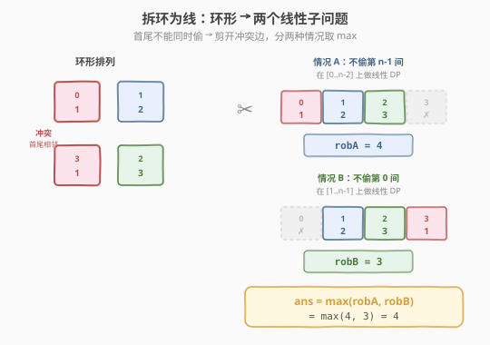
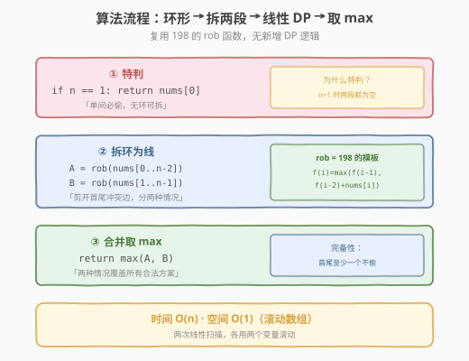
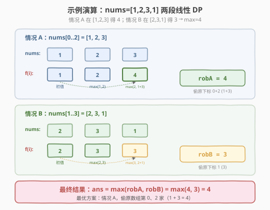

# LeetCode 打家劫舍 II 题解

## 1. 题目概述

- **标题 / 题号**：打家劫舍 II（#213，medium）
- **链接**：https://leetcode.cn/problems/house-robber-ii/
- **难度**：中等
- **标签**：动态规划

**题意**：你是一个专业的小偷，计划沿街偷窃房屋。每间房内都藏有一定的现金，**相邻的房屋装有相互连通的防盗系统**——如果两间相邻的房屋在同一晚上被小偷闯入，系统会自动报警。

与 [198. 打家家舍](../0101-0200/198_打家劫舍.md) 的唯一区别：**房屋排成一个环**（首尾相邻），即第 0 间和第 `n-1` 间也视为相邻，不能同时偷。给定非负整数数组 `nums`，求能偷到的最高金额。

**示例 1**：

```text
输入：nums = [2,3,2]
输出：3
解释：首尾两个 2 相邻（环形），只能偷中间的 3。
```

**示例 2**：

```text
输入：nums = [1,2,3,1]
输出：4
解释：偷第 0 家（1）+ 第 2 家（3）= 4。注意第 3 家（1）与第 0 家环形相邻，不能同时偷。
```

**约束**：

- `1 <= nums.length <= 100`
- `0 <= nums[i] <= 1000`

> 💡 这是 [198. 打家劫舍](../0101-0200/198_打家劫舍.md) 的**环形变体**——线性 DP 的转移方程完全不变，唯一的麻烦是首尾相邻导致 `f(0)` 和 `f(n-1)` 产生耦合。破局的关键是一个通用技巧：**「拆环为线」**——把环形问题拆成两个线性子问题取 max。掌握这个技巧后，所有「环形约束 + 线性 DP」的题都能秒杀。

## 2. 解题思路

### 2.1 暴力思路：枚举所有偷法

与 198 相同，用 DFS 枚举每间房「偷/不偷」，但额外检查首尾不同时偷：

```text
dfs(i, prev_robbed, first_robbed):
    if i == n: return 0
    best = dfs(i+1, false, first_robbed)          # 不偷 i
    if not prev_robbed:
        if i == n-1 and first_robbed: skip        # 首尾不能同时偷
        else: best = max(best, nums[i] + dfs(i+1, true, first_robbed))
    return best
```

时间复杂度 `O(2^n)`，`n=100` 时严重超时。而且首尾耦合让记忆化变得棘手——状态需要额外记录 `first_robbed`。

> ⚠️ 暴力法的真正启示：**首尾耦合**是环形问题的核心难点。线性打家劫舍里 `f(i)` 只依赖前两个状态，无后效性；但环形后，`f(n-1)` 的决策会回头影响 `f(0)`，后效性出现了。要消除这种后效性，就得把环「剪开」。

### 2.2 核心观察：拆环为线

**关键洞察**：第 0 间和第 `n-1` 间不能**同时**偷。那它们至少有一个「不被偷」。于是只需分两种情况：

| 情况 | 含义 | 转化成的线性问题 |
|------|------|----------------|
| **A：不偷第 `n-1` 间** | 第 0 间可偷可不偷，首尾约束自动满足 | 在 `nums[0..n-2]` 上做线性打家劫舍 |
| **B：不偷第 0 间** | 第 `n-1` 间可偷可不偷，首尾约束自动满足 | 在 `nums[1..n-1]` 上做线性打家劫舍 |

两种情况**覆盖了所有合法方案**（首尾至少一个不偷，必属于 A 或 B 之一），且无重叠遗漏。最终答案：

$$\text{ans} = \max\big(\text{rob}(\text{nums}[0..n\!-\!2]),\ \text{rob}(\text{nums}[1..n\!-\!1])\big)$$



> 💡 **「拆环为线」是通用技巧**：凡是「环形排列 + 首尾冲突」的问题，都可以把环在某条边上剪开，分「包含这条边的一端」和「包含另一端」两种情况，各自化为线性问题。本题剪开的是 `0 ↔ n-1` 这条边，分出的两段恰好是 `[0..n-2]` 和 `[1..n-1]`。这个技巧也见于环形数组求最大子数组和等问题。

> ⚠️ **边界情况**：`n == 1` 时，`[0..n-2]` 和 `[1..n-1]` 都是空数组，需单独返回 `nums[0]`。`n == 2` 时两段各剩一个元素，取 `max(nums[0], nums[1])` 即可，通用代码也能处理。

### 2.3 算法流程图



**三步法**：

1. **特判**：`n == 1` 直接返回 `nums[0]`。
2. **拆环**：分别对 `nums[0..n-2]` 和 `nums[1..n-1]` 调用 198 的线性 `rob` 函数（滚动数组 `O(1)` 空间）。
3. **合并**：返回两者较大值。

> 💡 线性 `rob` 的转移方程与 198 **完全一致**：`f(i) = max(f(i-1), f(i-2) + nums[i])`，初值 `f(0)=nums[0]`、`f(1)=max(nums[0], nums[1])`。本题没有发明新 DP，只是把环形拆成两次线性 DP——**复用已有模板**，这正是「拆环为线」的魅力。

### 2.4 示例演算

以 `nums = [1,2,3,1]` 为例：



**情况 A**：在 `nums[0..2] = [1,2,3]` 上做线性打家劫舍

| i | nums[i] | 不偷: f(i-1) | 偷: f(i-2)+nums[i] | f(i) | 说明 |
|---|---------|-------------|-------------------|------|------|
| 0 | 1 | — | — | **1** | 初值：只有 1 间，偷 |
| 1 | 2 | 1 | — | **2** | 初值：max(1,2)=2 |
| 2 | 3 | 2 | 1+3=4 | **4** | 偷 0+2 = 4 > 不偷=2 |

`robA = 4`，对应偷第 0、2 家（1+3=4）。

**情况 B**：在 `nums[1..3] = [2,3,1]` 上做线性打家劫舍

| i | nums[i] | 不偷: f(i-1) | 偷: f(i-2)+nums[i] | f(i) | 说明 |
|---|---------|-------------|-------------------|------|------|
| 0 | 2 | — | — | **2** | 初值：只有 1 间，偷 |
| 1 | 3 | 2 | — | **3** | 初值：max(2,3)=3 |
| 2 | 1 | 3 | 2+1=3 | **3** | 不偷=3 ≥ 偷=3 |

`robB = 3`，对应偷第 1 家（3），或第 0'+2' 家（2+1=3）。

**最终**：`ans = max(4, 3) = 4`。最优方案是情况 A——偷原数组的第 0、2 家。

> 💡 注意情况 B 里第 0 间（原数组下标 0，值为 1）被排除，所以即使原数组的第 3 家（值 1）被偷也不违反环形约束。但情况 B 的最优只有 3，不如情况 A 的 4。两种情况取 max 保证了不漏掉任何合法方案。

## 3. 参考代码

### C++

```cpp
// 打家劫舍II.cpp —— 拆环为线 + 线性 DP 滚动数组
// 编译: g++ -O2 -std=c++17 打家劫舍II.cpp -o rob2
#include <vector>
#include <algorithm>
using namespace std;

class Solution {
  public:
    int rob(vector<int>& nums) {
        int n = nums.size();
        if (n == 1) return nums[0];
        // 拆环为线：[0..n-2] 与 [1..n-1] 各做一次线性打家劫舍
        return max(robRange(nums, 0, n - 2),   // 情况 A：不偷最后一间
                   robRange(nums, 1, n - 1));   // 情况 B：不偷第一间
    }

  private:
    // 线性打家劫舍：区间 [lo, hi] 上的最高金额（滚动数组 O(1) 空间）
    int robRange(vector<int>& nums, int lo, int hi) {
        if (lo == hi) return nums[lo];
        int prev2 = nums[lo];                        // f(0)
        int prev1 = max(nums[lo], nums[lo + 1]);     // f(1)
        for (int i = lo + 2; i <= hi; ++i) {
            int cur = max(prev1, prev2 + nums[i]);   // f(i) = max(f(i-1), f(i-2)+nums[i])
            prev2 = prev1;
            prev1 = cur;
        }
        return prev1;
    }
};
```

### Python

```python
class Solution:
    def rob(self, nums: list[int]) -> int:
        n = len(nums)
        if n == 1:
            return nums[0]

        def rob_range(lo: int, hi: int) -> int:
            """线性打家劫舍：区间 [lo, hi] 上的最高金额"""
            prev2, prev1 = nums[lo], max(nums[lo], nums[lo + 1])
            for i in range(lo + 2, hi + 1):
                prev2, prev1 = prev1, max(prev1, prev2 + nums[i])
            return prev1

        return max(rob_range(0, n - 2),   # 情况 A：不偷最后一间
                   rob_range(1, n - 1))   # 情况 B：不偷第一间
```

> 💡 `robRange` 就是 198 的 `rob` 函数加了区间参数。整个 213 的代码 = 「特判 + 两次调用 198 + 取 max」，没有新增任何 DP 逻辑。**复用模板**是本题的核心思想——遇到变体先想「能否拆成已解决的问题」。

## 4. 复杂度分析

| 维度 | 复杂度 | 说明 |
|------|--------|------|
| **时间复杂度** | `O(n)` | 两次线性扫描，各 `O(n)`，总计 `O(n)` |
| **空间复杂度** | `O(1)` | `robRange` 用两个变量滚动，无额外数组 |

## 5. 扩展：打家劫舍系列全景

| 题目 | 排列结构 | 核心改动 | 与本题关系 |
|------|---------|---------|-----------|
| [198 打家劫舍](../0101-0200/198_打家劫舍.md) | 线性 | 一维 DP 模板 | 本题的基础 |
| **213 打家劫舍 II（本题）** | **环形** | **拆环为线，两次线性 DP** | 198 的环形变体 |
| [337 打家劫舍 III](../0301-0400/337_打家劫舍III.md) | 二叉树 | 树形 DP，后序返回 (偷, 不偷) | 从线性到树形 |
| 2560 打家劫舍 IV | 线性 + 限量 | 二分 + 贪心判定 | 加了数量约束 |

### 5.1 拆环为线的通用性

「拆环为线」不限于打家劫舍，任何「环形 + 首尾冲突」的最优化问题都能用：

- **环形数组最大子数组和**：分「不含首」和「不含尾」两段，各求最大子数组和，取 max（注意全负数的特判）。
- **环形加油站（134）**：若总油量 ≥ 总耗量，则从某点出发一定能走完一圈——也是把环拆成线性累积差值来分析。
- **环形约瑟夫问题**：递推公式 `f(n) = (f(n-1) + m) % n`，本质是把环删一个元素后映射回线性。

> 💡 一句话：**环 = 线 + 一条首尾边**。剪掉那条边，就回到熟悉的线性世界。剪哪条边、怎么分情况，是变体之间的唯一区别。

### 5.2 能否一次 DP 解决环形？

理论上可以用「状态机」把首尾是否被偷编码进状态，但需要 `f(i, firstRobbed)` 二维 DP，常数大且不直观。相比之下「拆两次」写法简洁、复用模板，是面试首选。**能复用已有模板就别造新轮子**。

## 6. 面试要点

1. **为什么拆成 `[0..n-2]` 和 `[1..n-1]` 两段就完备了？**

   - 环形约束是「第 0 间和第 n-1 间不能同时偷」。任意合法方案中，首尾至少有一个不被偷：
     - 若第 n-1 间不被偷 → 方案落在 `[0..n-2]` 上（情况 A 覆盖）
     - 若第 0 间不被偷 → 方案落在 `[1..n-1]` 上（情况 B 覆盖）
   - 两者并集 = 所有合法方案（因为「首尾都偷」本身非法，其余必属 A 或 B）。取 max 不遗漏。

2. **两段有重叠（`[1..n-2]`），会重复计算吗？**

   - 不会影响正确性。两段各自求的是「该区间内的最优」，重叠部分的方案在两段中都合法，但取 max 只会保留更优的那个。这不是重复计数，而是**覆盖同一个合法方案两次**——取 max 不改变结果。
   - 若追求「不重复」，可分三段，但无必要且更复杂。

3. **`n == 1` 为什么要特判？**

   - `n == 1` 时 `[0..n-2]` = `[0..-1]`（空）、`[1..n-1]` = `[1..0]`（空），两段都空。线性 `rob` 对空区间无定义，所以单独返回 `nums[0]`。
   - `n == 2` 时两段各剩一个元素，`robRange` 的 `if (lo == hi)` 分支处理，无需额外特判。

4. **和 198 的代码相比改了什么？**

   - 只多了「拆环 + 两次调用 + 取 max」。`robRange` 内部的转移方程、初值、滚动数组与 198 **逐字相同**。
   - 这说明本题考查的不是 DP 难度，而是**建模能力**——能否识别「环形 = 两次线性」并复用模板。面试时先讲清「为什么能拆」，再展示复用 198 的代码，体现工程思维。

5. **如果首尾不是「不能同时偷」而是「不能同时不偷」呢？**

   - 约束反过来：首尾至少偷一个。拆法变为：情况 A「必偷首」+ 情况 B「必偷尾」，各自在剩余线性段上 DP。本质相同——**把环形冲突的那条边剪开，分两种情况**。技巧可迁移到任何环形约束变体。

> 💡 **一句话总结**：213 是「拆环为线」技巧的标准教学题——环形首尾冲突无法直接 DP，但剪开冲突边、分两种情况各做线性 DP 取 max，就能复用 198 的全部模板。掌握这个「环 → 线」的降维思路，你就拿到了所有环形 DP 问题的万能钥匙。

## 同类练习题

| # | 题目 | 与本题的关联 |
|---|------|-------------|
| 198 | [打家劫舍](https://leetcode.cn/problems/house-robber/)（[题解](../0101-0200/198_打家劫舍.md)） | 本题的线性基础，转移方程与初值完全一致 |
| 337 | [打家劫舍 III](https://leetcode.cn/problems/house-robber-iii/)（[题解](../0301-0400/337_打家劫舍III.md)） | 从线性/环形升级到树形，后序 DFS 返回两状态 |
| 740 | [删除并获得点数](https://leetcode.cn/problems/delete-and-earn/) | 把值域压缩后转化为打家劫舍，复用同模板 |
| — | [剑指 Offer II 090. 环形房屋偷盗](https://leetcode.cn/problems/PzWKhm/) | 与本题完全相同，换皮练习「拆环为线」 |
