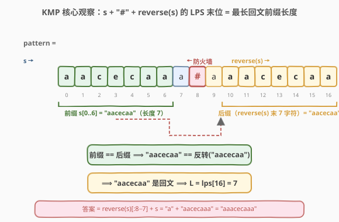
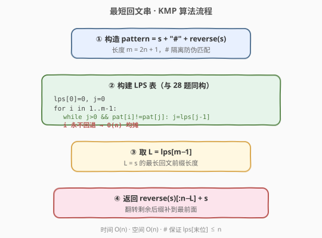
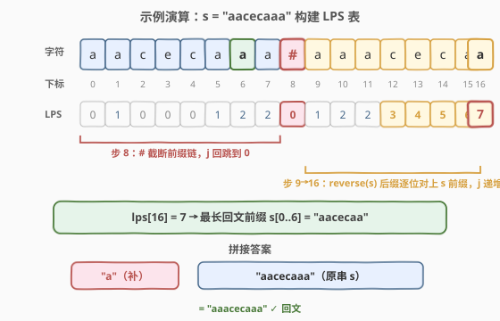

# LeetCode 最短回文串 题解

## 1. 题目概述

- **标题 / 题号**：最短回文串（#214，hard）
- **链接**：https://leetcode.cn/problems/shortest-palindrome/
- **难度**：困难
- **标签**：字符串、KMP、回文

**题意**：给定一个字符串 `s`，你可以通过在 `s` **前面**添加字符将其转换为回文串。找到并返回可以用这种方式转换成的**最短回文串**。

**示例 1**：

```text
输入：s = "aacecaaa"
输出："aaacecaaa"
解释：在前面添加 "a"，得到 "aaacecaaa"，已是回文串。
```

**示例 2**：

```text
输入：s = "abcd"
输出："dcbabcd"
解释：在前面添加 "dcb"，得到 "dcbabcd"，已是回文串。
```

**约束**：

- $0 \leq \text{s.length} \leq 5 \times 10^4$
- `s` 仅由小写英文字母组成

> 💡 这是把 [5. 最长回文子串](../0001-0100/5_最长回文子串.md) 的"找最长"翻转成"补最短"的变体，但关键约束是**只能在前面加字符**。这把问题从"任意位置找回文"收窄为"找最长的回文前缀"——一旦定位了 `s` 的最长回文前缀，只需把剩下的后缀翻转补到最前面即可。而"找最长回文前缀"恰恰能用 [28. KMP](../0001-0100/28_找出字符串中第一个匹配项的下标.md) 的 LPS 表在 $O(n)$ 内一击命中，是 KMP 在"非匹配"场景下的经典妙用。

## 2. 解题思路

### 2.1 暴力思路：从长到短枚举前缀判回文

题目只允许在**前面**加字符，所以补出来的回文串必然形如：

$$
\text{reverse}(s[L:]) \;+\; s
$$

其中 `s[0..L-1]` 是 `s` 的某个**回文前缀**。要让补出来的串最短，就要让**保留的原串前缀最长**——即找到 `s` 的**最长回文前缀**。

暴力做法很直接：从最长前缀（整个 `s`）开始往短枚举，逐个判断 `s[0..end]` 是否回文，第一个命中的就是最长回文前缀。

```text
for end in n-1 down to 0:
    if s[0..end] 是回文:
        return reverse(s[end+1..n-1]) + s
```

- 每次"判回文"要 $O(n)$（反转比较），共 $O(n)$ 个前缀，总 $O(n^2)$。
- $n = 5 \times 10^4$ 时约 $2.5 \times 10^9$，**超时**。

> ⚠️ 暴力法的瓶颈：**重复比较**。判断 `s[0..end]` 是回文时比较过的字符，在判断 `s[0..end-1]` 时又可能重比一遍。回文的"对称性"信息没有被跨前缀复用——这恰好是 KMP 的 LPS 表擅长固化的东西。

### 2.2 核心观察：KMP 的 LPS 表「秒找」最长回文前缀

**关键转化**：构造字符串 $\text{pattern} = s + \text{"\#"} + \text{reverse}(s)$，对它跑一遍 KMP 的 LPS 表构建。最终 $\text{lps}[|\text{pattern}|-1]$ 就是 `s` 的最长回文前缀长度。



**为什么成立？** 逐层拆解：

1. **LPS 的定义**：$\text{lps}[i]$ = `pattern[0..i]` 的「最长相同真前后缀」长度。所以 $\text{lps}[\text{末位}]$ = 整个 `pattern` 的最长相同真前后缀长度。

2. **`#` 的隔离作用**：`#` 不出现在 `s` 中，所以任何"既是前缀又是后缀"的子串**不能跨越 `#`**。于是这个公共前后缀必然是：
   - 前缀部分来自 `pattern` 的开头，即 `s` 的某个前缀 `s[0..k-1]`；
   - 后缀部分来自 `pattern` 的结尾，即 `reverse(s)` 的某个后缀。

3. **后缀 = 前缀的翻转**：`reverse(s)` 的长度为 $k$ 的后缀，恰好是 `s[0..k-1]` 的**反转**。

4. **前缀 == 翻转后缀 ⟺ 回文**：要求 `s[0..k-1]` == `reverse(s[0..k-1])`，即 `s[0..k-1]` **是回文**。

综上，$\text{lps}[\text{末位}]$ = `s` 的最长回文前缀长度 $L$。代入公式即得答案。

> 💡 **一句口诀**：`s + # + reverse(s)` 的 LPS 末位值 = 最长回文前缀长度。`#` 是"防火墙"，确保匹配不会串到 `reverse(s)` 那半边去，只允许 `s` 的前缀和 `reverse(s)` 的后缀（即前缀的翻转）对齐。

### 2.3 算法流程图



**完整步骤**：

1. **构造 pattern**：`pattern = s + '#' + reverse(s)`，长度 $m = 2n + 1$。
2. **构建 LPS 表**（复用 [28 题](../0001-0100/28_找出字符串中第一个匹配项的下标.md) 的骨架）：
   - `lps[0] = 0`，`j = 0`。
   - 对 `i` 从 1 到 $m-1$：
     - `while j > 0 且 pattern[i] != pattern[j]`：`j = lps[j-1]`（回跳）。
     - `if pattern[i] == pattern[j]`：`j += 1`。
     - `lps[i] = j`。
3. **取最长回文前缀长度**：`L = lps[m-1]`。
4. **拼接答案**：`return reverse(s)[0 .. n-L-1] + s`，即 `reverse(s[L..n-1]) + s`。

> ⚠️ 第 4 步的等价写法：`reverse(s)[:n-L] + s`。因为 `reverse(s)` 的前 $n-L$ 个字符正是 `s[L..n-1]` 的反转。当 $L = n$（`s` 本身已是回文）时，`n - L = 0`，补空串，直接返回 `s`。

### 2.4 示例演算

以 `s = "aacecaaa"` 为例，`reverse(s) = "aaacecaa"`，`pattern = "aacecaaa#aaacecaa"`（长度 17）：



逐位构建 LPS（只列关键步，`j` 为当前已匹配的前缀长度）：

| 步骤 | i | pat[i] | j(前) | 动作 | lps[i] |
|------|---|--------|-------|------|--------|
| — | 0 | a | — | 初始 | 0 |
| 1 | 1 | a | 0 | a==a → j=1 | 1 |
| 2 | 2 | c | 1 | c≠a→j=lps[0]=0; c≠a | 0 |
| 3 | 3 | e | 0 | e≠a | 0 |
| 4 | 4 | c | 0 | c≠a | 0 |
| 5 | 5 | a | 0 | a==a → j=1 | 1 |
| 6 | 6 | a | 1 | a==a → j=2 | 2 |
| 7 | 7 | a | 2 | a≠c→j=lps[1]=1; a==a → j=2 | 2 |
| 8 | 8 | # | 2 | #≠c→j=1; #≠a→j=0; #≠a | 0 |
| 9 | 9 | a | 0 | a==a → j=1 | 1 |
| 10 | 10 | a | 1 | a==a → j=2 | 2 |
| 11 | 11 | a | 2 | a≠c→j=1; a==a → j=2 | 2 |
| 12 | 12 | c | 2 | c==c → j=3 | 3 |
| 13 | 13 | e | 3 | e==e → j=4 | 4 |
| 14 | 14 | c | 4 | c==c → j=5 | 5 |
| 15 | 15 | a | 5 | a==a → j=6 | 6 |
| 16 | 16 | a | 6 | a==a → j=7 ⭐ | 7 |

最终 `lps = [0, 1, 0, 0, 0, 1, 2, 2, 0, 1, 2, 2, 3, 4, 5, 6, 7]`，末位 `lps[16] = 7`。

- **最长回文前缀** `s[0..6] = "aacecaa"`（验证：反转仍是 `aacecaa` ✓）。
- **补全**：`reverse(s)[:8-7] = "a"`，答案 = `"a" + "aacecaaa"` = `"aaacecaaa"` ✓。

> 💡 重点看步骤 8（`#` 位）：`#` 与任何字母都不匹配，`j` 一路回跳到 0，`lps[8] = 0`。这正是 `#` "防火墙"生效的地方——它**截断**了前半段 `s` 的 LPS 链（`j=2` 归零），保证后半段 `reverse(s)` 从零开始重新累积，最终只能与 `s` 的前缀对齐。若不加 `#`，`reverse(s)` 的后缀可能直接接上 `s` 的前缀产生"伪匹配"，得到错误的最大长度。

## 3. 参考代码

### 方法一：KMP（$O(n)$，推荐）

### C++

```cpp
// 最短回文串.cpp —— KMP 的 LPS 表秒找最长回文前缀
// 编译: g++ -O2 -std=c++17 最短回文串.cpp -o shortestpalindrome
#include <string>
#include <vector>
#include <algorithm>
using namespace std;

class Solution {
  public:
    string shortestPalindrome(string s) {
        int n = s.size();
        if (n < 2) return s;                  // 空串或单字符本身即回文

        string rev(s.rbegin(), s.rend());
        string pattern = s + "#" + rev;       // # 隔离，防止跨段伪匹配
        int m = pattern.size();

        // 构建 LPS 表（与 28 题 strStr 的构建段完全同构）
        vector<int> lps(m, 0);
        for (int i = 1, j = 0; i < m; ++i) {
            while (j > 0 && pattern[i] != pattern[j]) j = lps[j - 1];
            if (pattern[i] == pattern[j]) ++j;
            lps[i] = j;
        }

        int L = lps[m - 1];                   // 最长回文前缀长度
        return rev.substr(0, n - L) + s;      // 翻转剩余后缀补到最前
    }
};
```

### Python

```python
class Solution:
    def shortestPalindrome(self, s: str) -> str:
        n = len(s)
        if n < 2:
            return s

        rev = s[::-1]
        pattern = s + "#" + rev
        m = len(pattern)

        # 构建 LPS 表（与 28 题 strStr 的构建段完全同构）
        lps = [0] * m
        j = 0
        for i in range(1, m):
            while j > 0 and pattern[i] != pattern[j]:
                j = lps[j - 1]
            if pattern[i] == pattern[j]:
                j += 1
            lps[i] = j

        L = lps[-1]                          # 最长回文前缀长度
        return rev[:n - L] + s               # 翻转剩余后缀补到最前
```

> 💡 这段 LPS 构建代码与 [28 题](../0001-0100/28_找出字符串中第一个匹配项的下标.md) 的"构建段"**逐行相同**——区别仅在于 28 题构建完 LPS 后继续用它去匹配主串，而本题构建完直接读末位值。把 28 题的 LPS 骨架背下来，本题就是"建表 + 读末位"两步。

### 方法二：双指针判前缀回文（$O(n^2)$，易理解）

不引入 KMP，用"双指针从两端往中间比较"来判断每个前缀是否回文。从最长前缀开始尝试，命中即返回：

### C++

```cpp
class Solution {
  public:
    string shortestPalindrome(string s) {
        int n = s.size();
        // 从最长前缀开始，找第一个回文前缀
        for (int end = n - 1; end >= 0; --end) {
            if (isPalindrome(s, 0, end)) {
                string add = s.substr(end + 1);
                reverse(add.begin(), add.end());
                return add + s;
            }
        }
        return s;
    }
  private:
    bool isPalindrome(const string& s, int l, int r) {
        while (l < r) {
            if (s[l++] != s[r--]) return false;
        }
        return true;
    }
};
```

### Python

```python
class Solution:
    def shortestPalindrome(self, s: str) -> str:
        n = len(s)
        for end in range(n - 1, -1, -1):
            sub = s[:end + 1]
            if sub == sub[::-1]:            # 判断前缀是否回文
                return s[end + 1:][::-1] + s
        return s
```

> Python 的切片判断 `sub == sub[::-1]` 虽是 $O(n)$，但底层是 C 实现，常数极小。本题数据范围下方法二在 Python 中往往能 AC，但 C++/Java 的逐字符比较在 $n = 5 \times 10^4$ 的全 `a` 用例下仍会超时——面试追问"能不能 $O(n)$"时必须给出方法一。

## 4. 复杂度分析

| 维度 | 方法 | 复杂度 | 说明 |
|------|------|--------|------|
| 时间复杂度 | KMP | $O(n)$ | pattern 长度 $m = 2n+1$，构建 LPS 单趟扫描 $O(m) = O(n)$；拼接答案 $O(n)$ |
| 空间复杂度 | KMP | $O(n)$ | LPS 表长度 $2n+1$，外加 pattern 字符串 $O(n)$ |
| 时间复杂度 | 双指针 | $O(n^2)$ | 最坏枚举 $n$ 个前缀，每次判回文 $O(n)$（如全相同字符 `aaaa...a`） |
| 空间复杂度 | 双指针 | $O(n)$ | 存放翻转后的补全串（Python 切片）/ 原地比较 $O(1)$ 额外空间 |

> ⚠️ KMP 的 `while` 嵌在 `for` 里看似 $O(n^2)$，实为 $O(n)$：`i` 单调不减，`j` 每次回跳都会让"已匹配长度"减少，而该长度总共增加不超过 $m$ 次，故 `j` 回跳总次数 $\leq m$。这是经典的**均摊分析**，与 [28 题](../0001-0100/28_找出字符串中第一个匹配项的下标.md) 完全同理。

## 5. 扩展：为何「只在前面加」等价于「找最长回文前缀」

### 5.1 正确性证明

设 `s` 的最长回文前缀为 `s[0..L-1]`，记 `tail = s[L..n-1]`。构造答案 `ans = reverse(tail) + s`：

- `ans` = `reverse(tail) + s[0..L-1] + tail`。
- 由于 `s[0..L-1]` 是回文，`s[0..L-1] = reverse(s[0..L-1])`。
- 于是 `ans` 的前半段 `reverse(tail) + reverse(s[0..L-1])` 恰好是后半段 `s[0..L-1] + tail` 的反转，故 `ans` 是回文。✓

**最短性**：任何"在前面加字符"得到的回文串，其原串部分必然以 `s` 的某个回文前缀为"对称中心前缀"。保留的前缀越长，需要补的字符越少。取最长回文前缀 $L$ 时，补的字符数 $n - L$ 最小。✓

### 5.2 如果换成「可以在任意位置加字符」

那就退化成 [5. 最长回文子串](../0001-0100/5_最长回文子串.md) 的对偶问题——找最长回文**子序列**（不是前缀），把不在子序列中的字符成对地补进去。难度和套路都不同：本题的"只在前面加"约束反而是更紧的，催生了 KMP 的妙用。

### 5.3 不加 `#` 会怎样

若 `pattern = s + reverse(s)`（无分隔符），LPS 末位可能超过 $n$，得到错误长度。例如 `s = "aaa"`：`pattern = "aaaaaa"`，`lps[5] = 5`，但最长回文前缀显然是 3（整个串）。`#` 强制截断跨段匹配，保证 `lps[末位] <= n`。

## 6. 面试要点

1. **为什么「只在前面加字符」能转化为「找最长回文前缀」？**

   - 在前面加字符得到的回文串，原串 `s` 必然整体出现在答案的**右半部分**。以答案的对称轴为界，左半部分是"补的字符 + `s` 的回文前缀"，右半部分是 `s` 本身。要让 `s` 的右半部分能镜像过来，`s` 的开头必须是回文——保留的回文前缀越长，补的越少。故"最短"⟺"最长回文前缀"。

2. **`s + "#" + reverse(s)` 的 LPS 末位为什么恰好是回文前缀长度？**

   - LPS 末位 = 整个 pattern 的"最长相同真前后缀"长度。`#` 不在 `s` 中，阻止匹配跨越中点，所以公共前后缀只能是"`s` 的前缀"与"`reverse(s)` 的后缀"。而 `reverse(s)` 的长度 $k$ 后缀 = `s` 的长度 $k$ 前缀的反转。前缀 == 自身反转 ⟺ 回文，故该长度即最长回文前缀长度。

3. **`#` 可以换成别的字符吗？**

   - 可以，只要该字符**不出现在 `s` 中**即可。本题 `s` 只含小写字母，用 `#`、`$`、`*` 都行。若 `s` 字符集未知，需选一个保证不在其中的分隔符，否则"防火墙"失效，可能产生跨段伪匹配导致 $L > n$ 的错误结果。

4. **KMP 的 LPS 表和本题的关系，与 28 题有何异同？**

   - **同**：LPS 表的构建代码逐行相同，都是 `for i` + `while 回跳` + `if 匹配 j++`。
   - **异**：28 题构建完 LPS 后**继续用它匹配主串**，本题构建完**直接读末位值**。28 题的 LPS 描述"模式串自身的重复结构"，本题借它描述"`s` 前缀与 `reverse(s)` 后缀的重叠"——同一张表，两种语义。

5. **时间复杂度为什么是 $O(n)$？**

   - pattern 长度 $m = 2n+1$。LPS 构建中 `i` 单调递增从 1 到 $m-1$，`j` 的增加总量 $\leq m$，回跳总量 $\leq$ 增加总量，故构建 $O(m) = O(n)$。拼接答案 $O(n)$。总计 $O(n)$。

6. **暴力法在什么用例下会退化？**

   - 全相同字符如 `s = "aaaa...ab"`：最长回文前缀是前 $n-1$ 个 `a`，但暴力会从 `end = n-1` 开始判整个串（非回文，比到末尾才失败），再判 `end = n-2`（回文，命中），共比了约 $2n$ 次——这种情况反而不慢。
   - 真正退化的是 `s = "ababab...ab"`（无长回文前缀）：每个前缀都要比到中间才失败，共 $O(n^2)$。此时 KMP 的 $O(n)$ 优势最明显。

> 💡 **一句话总结**：214 最短回文串 = 「只在前面加字符」⟺「找最长回文前缀」+ KMP 的 LPS 表一击命中。构造 `s + "#" + reverse(s)` 跑一遍 LPS，末位值即所求长度，$O(n)$ 解决。`#` 是隔离前缀与翻转后缀的"防火墙"，保证 LPS 只反映回文前缀长度。这是 KMP 在"非字符串匹配"场景下的经典妙用——LPS 表本质上刻画的是"串的前缀与后缀的重叠结构"，回文前缀恰好是"前缀与自身反转的重叠"，二者天然契合。

## 同类练习题

| # | 题目 | 与本题的关联 |
|---|------|-------------|
| 5 | [最长回文子串](https://leetcode.cn/problems/longest-palindromic-substring/)（[题解](../0001-0100/5_最长回文子串.md)） | 中心扩展找任意位置最长回文，本题是其"只找前缀 + 翻转补全"的变体 |
| 28 | [找出字符串中第一个匹配项的下标](https://leetcode.cn/problems/find-the-index-of-the-first-occurrence-in-a-string/)（[题解](../0001-0100/28_找出字符串中第一个匹配项的下标.md)） | KMP 母题，本题直接复用其 LPS 表构建骨架 |
| 459 | [重复的子字符串](https://leetcode.cn/problems/repeated-substring-pattern/) | LPS 表的另一妙用——`n % (n - lps[n-1]) == 0` 判循环节 |
| 1392 | [最长快乐前缀](https://leetcode.cn/problems/longest-happy-prefix/) | `lps[n-1]` 即最长相同前后缀，本题思路的"开箱即用"版 |
| 647 | [回文子串](https://leetcode.cn/problems/palindromic-substrings/) | 中心扩展计数回文，与本题共享"回文对称性"内核但问法不同 |
