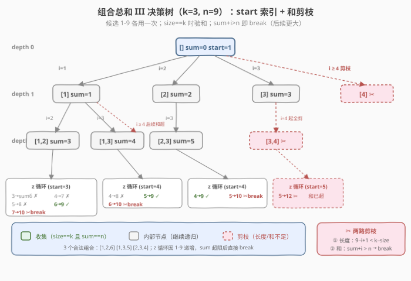
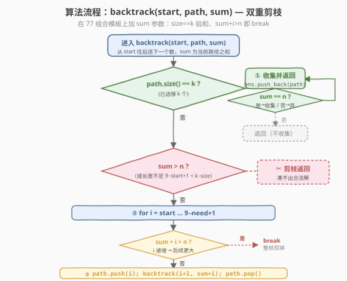
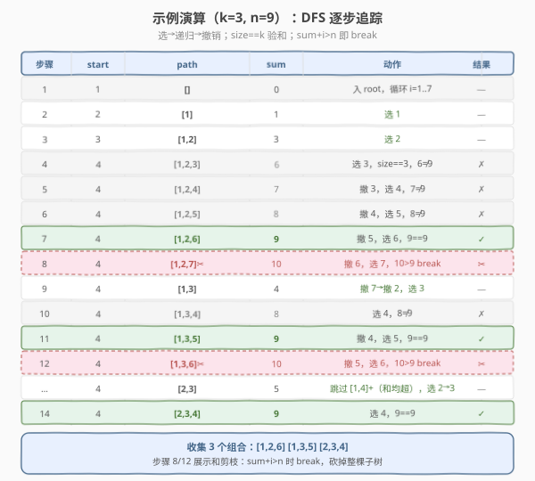

# 组合总和 III

- **题目名称**：组合总和 III
- **链接**：[216. 组合总和 III](https://leetcode.cn/problems/combination-sum-iii/)
- **难度**：中等
- **标签**：回溯、剪枝

## 1. 题目概述

只使用数字 `1` 到 `9`，找出所有相加之和为 `n` 的 `k` 个数的组合。每个数字**最多使用一次**（候选集固定为 `1-9`、无重复），返回所有可能的组合列表。答案不能包含重复组合。

**示例 1**：

```text
输入：k = 3, n = 7
输出：[[1,2,4]]
解释：1 + 2 + 4 = 7，且 1-9 中再无其它 3 个互不相同的数之和为 7。
```

**示例 2**：

```text
输入：k = 3, n = 9
输出：[[1,2,6],[1,3,5],[2,3,4]]
解释：1+2+6=9，1+3+5=9，2+3+4=9。
```

**示例 3**：

```text
输入：k = 4, n = 1
输出：[]
解释：4 个互不相同的正数最小和为 1+2+3+4=10 > 1，无解。
```

**约束条件**：

- `2 <= k <= 9`
- `1 <= n <= 60`

> 💡 这是 [77. 组合](../0001-0100/77_组合.md) 与 [39. 组合总和](../0001-0100/39_组合总和.md) 的「合体」：候选集缩小并固定为 `1-9`、每个数用一次（同 77 的 `start+1`），但又多了一个「和为 `n`」的硬约束（同 39 的 `remain`）。本质上就是把 77 的 `start` 索引模板再加一个 `sum` 参数与**和剪枝**——是组合题族里最适合检验「双重剪枝」思维的题。

---

## 2. 解题思路

### 2.1 暴力思路：枚举所有 k-子集再验和

从 `1-9` 中选 `k` 个数的所有组合共 $\binom{9}{k}$ 个（`k` 最大 9 时也仅 1 个、`k=4` 或 5 时最多 126 个），逐个验证和是否为 `n`。

这个思路其实**总量并不大**（$\sum_{k=2}^{9}\binom{9}{k}=511$），朴素枚举也能过。但面试官会追问「如果候选集更大、或 `n` 更严苛怎么办」——纯枚举没有利用「和」约束提前剪枝，会白白展开大量注定凑不到 `n` 的分支。

> ⚠️ 这道题的价值不在「能不能过」，而在「能否用 `sum` 约束做剪枝」。组合总和系列的核心技巧就是把**约束信息前移到搜索过程中**，让无效分支在进入前就被砍掉。

### 2.2 核心观察：77 组合模板 + 和约束剪枝

关键直觉：**直接复用 77 的 `start` 索引循环回溯骨架，再叠加一个 `sum` 参数追踪路径之和**。每选一个数 `i` 就把 `sum + i` 传给下一层，并在两个时机做剪枝：

- **收集时机**：`path.size() == k` 时不再无条件收集，而是**二次判定 `sum == n`** 才收集（区别于 77 的「满 k 即收」）。
- **和剪枝（关键）**：由于候选 `1-9` 递增、`start` 只往后选，路径和**单调递增**。一旦 `sum + i > n`，当前及更大的 `i` 都不可能，直接 `break` 砍掉整棵子树——这是从 39 组合总和搬来的同款剪枝。



与组合题族其它成员的对比：

| 维度 | 77 组合 | 39 组合总和 | 216 组合总和 III（本题） |
|------|---------|-------------|--------------------------|
| 候选集 | `1..n` | 给定数组（可排序） | 固定 `1..9` |
| 可重复选 | 否 | 是（`backtrack(i)`） | 否（`backtrack(i+1)`） |
| 长度约束 | `size == k` | 无（和为 0 即收） | `size == k` |
| 和约束 | 无 | `remain == 0` | `sum == n` |
| 收集条件 | `size==k` 即收 | `remain==0` 即收 | `size==k` **且** `sum==n` |
| 剪枝 | 长度（上界收紧） | 和（`break`） | **双重**：长度 + 和 |

> 💡 **216 = 77 的「固定 k」+ 39 的「和剪枝」**。两者叠加后，每个 `size==k` 的叶节点要再过一道 `sum==n` 的关，而和剪枝让大量 `sum` 已经超标的中间分支提前 `break`，连叶节点都到不了。

### 2.3 算法流程图



**完整步骤**：

1. **长度收集判定**：若 `path.size() == k`，转而判定 `sum == n`——相等则把 `path` 拷贝存入答案，无论相等与否都 `return`（长度已满不能再选）。
2. **剪枝判定**：若 `sum > n`（路径和已超标）或剩余候选 `9 - start + 1 < k - path.size()`（凑不够 k 个），`return`。
3. **循环选数**：`for i = start … 9`：
   - **上界收紧**（长度剪枝融入循环）：`i <= 9 - (k - path.size()) + 1`，不够凑满 k 个的分支不进循环。
   - **和剪枝**：若 `sum + i > n`，由于 `i` 递增、后续更大，直接 `break`。
   - **选**：`path.push(i)`
   - **递归**：`backtrack(i + 1, path, sum + i)` —— 只往后选 + 累加和
   - **撤销**：`path.pop()`

> ⚠️ **`break` 不是 `continue`**：候选 `1-9` 天然递增，`sum + i > n` 意味着 `sum + (i+1)`、`sum + (i+2)`… 都只会更大，必然也超标。用 `break` 能一次砍掉当前层后面所有分支；若写成 `continue` 只跳过 `i` 本身，后面的数仍会进入循环后被逐个判掉，剪枝形同虚设。这与 [39. 组合总和](../0001-0100/39_组合总和.md) 的剪枝完全同源。

### 2.4 示例演算

以 `k=3, n=9` 为例，DFS 从 `start=1`、`path=[]`、`sum=0` 出发：



| 步骤 | start | path | sum | 动作 | 结果 |
|------|-------|------|-----|------|------|
| 1 | 1 | `[]` | 0 | 入 root，循环 i=1..7 | — |
| 2 | 2 | `[1]` | 1 | 选 1 | — |
| 3 | 3 | `[1,2]` | 3 | 选 2 | — |
| 4 | 4 | `[1,2,3]` | 6 | 选 3，size==3，6≠9 | ✗ |
| 5 | 4 | `[1,2,4]` | 7 | 撤 3，选 4，7≠9 | ✗ |
| 6 | 4 | `[1,2,5]` | 8 | 撤 4，选 5，8≠9 | ✗ |
| 7 | 4 | `[1,2,6]` | 9 | 撤 5，选 6，9==9 | `[1,2,6]` ✓ |
| 8 | 4 | `[1,2,7]✂` | 10 | 撤 6，选 7，10>9 break | ✂ |
| 9 | 4 | `[1,3]` | 4 | 撤 7→撤 2，选 3 | — |
| 10 | 4 | `[1,3,4]` | 8 | 选 4，8≠9 | ✗ |
| 11 | 4 | `[1,3,5]` | 9 | 撤 4，选 5，9==9 | `[1,3,5]` ✓ |
| 12 | 4 | `[1,3,6]✂` | 10 | 撤 5，选 6，10>9 break | ✂ |
| … | 4 | `[2,3]` | 5 | 跳过 `[1,4]+`（和均超），选 2→3 | — |
| 14 | 4 | `[2,3,4]` | 9 | 选 4，9==9 | `[2,3,4]` ✓ |

最终收集 3 个组合：`[1,2,6]`、`[1,3,5]`、`[2,3,4]`。

> 💡 注意步骤 4-6：`[1,2,3]`、`[1,2,4]`、`[1,2,5]` 都到了 `size==3` 但 `sum≠9`，**被收集判定拒绝**而非被剪枝——它们是「合法长度但不合法和」的叶节点，区别于步骤 8/12 那种「和已超标、连叶都到不了」的 `break` 剪枝。理解这两种「不收集」的来源，是把握回溯剪枝语义的关键。

---

## 3. 参考代码

### C++

```cpp
// 组合总和III.cpp —— 77 组合模板 + sum 参数与和剪枝
// 编译: g++ -O2 -std=c++17 组合总和III.cpp -o combinationsum3
#include <vector>
using namespace std;

class Solution {
  public:
    vector<vector<int>> combinationSum3(int k, int n) {
        vector<vector<int>> ans;
        vector<int> path;
        backtrack(k, n, 1, 0, path, ans);
        return ans;
    }

  private:
    // start: 当前能选的最小值；sum: 已选元素之和
    void backtrack(int k, int n, int start, int sum,
                   vector<int>& path, vector<vector<int>>& ans) {
        // ① 长度收集：选够 k 个，验和后无论结果都返回
        if ((int)path.size() == k) {
            if (sum == n) ans.push_back(path);
            return;
        }
        // ② 循环选数，上界收紧做长度剪枝：
        //    还需 need = k - path.size() 个，i 最多到 9 - need + 1
        int need = k - (int)path.size();
        for (int i = start; i <= 9 - need + 1; i++) {
            if (sum + i > n) break;           // 和剪枝：后续更大，整枝 break
            path.push_back(i);                // 选 i
            backtrack(k, n, i + 1, sum + i, path, ans); // 只往后选 + 累加和
            path.pop_back();                  // 撤销
        }
    }
};
```

### Python

```python
class Solution:
    def combinationSum3(self, k: int, n: int) -> list[list[int]]:
        ans: list[list[int]] = []
        path: list[int] = []

        def backtrack(start: int, cur_sum: int) -> None:
            if len(path) == k:            # ① 长度收集 + 验和
                if cur_sum == n:
                    ans.append(path[:])   # 拷贝！
                return
            # ② 循环选数，上界收紧做长度剪枝
            need = k - len(path)
            for i in range(start, 9 - need + 2):  # +2 因 range 右开
                if cur_sum + i > n:      # 和剪枝：后续更大，整枝 break
                    break
                path.append(i)           # 选 i
                backtrack(i + 1, cur_sum + i)  # 只往后选 + 累加和
                path.pop()               # 撤销

        backtrack(1, 0)
        return ans
```

> ⚠️ **Python 必须** `ans.append(path[:])` **拷贝**：`path` 是同一个列表，回溯 `pop()` 会改写它，直接 `append(path)` 最终 `ans` 里全是同一引用（且被清空）。C++ 的 `push_back(path)` 会自动拷贝 `vector`，无需额外处理。这个坑与 [77. 组合](../0001-0100/77_组合.md)、[78. 子集](../0001-0100/78_子集.md) 完全一致。

> 💡 **为什么不写 `sum > n` 的显式剪枝判定？** 因为它已被「循环内 `if (sum + i > n) break`」吸收：既然 `sum + i` 已超标就 `break`，那么能进入递归的分支都满足 `sum + i ≤ n`，下一层入口的 `sum` 必然 `≤ n`。显式判定与 `break` 二选一即可，这里采用更简洁的 `break` 版。长度剪枝同理融进了循环上界 `9 - need + 1`。

---

## 4. 复杂度分析

| 维度 | 复杂度 | 说明 |
|------|--------|------|
| **时间复杂度** | $O\!\left(\binom{9}{k} \cdot k\right)$ | 最坏遍历所有 k-子集，每个构造/拷贝 $O(k)$；和剪枝只降常数 |
| **空间复杂度** | $O(k)$ | 递归栈 + path 深度，最大 k 层；结果数组不计入 |
| **实际常数** | 很小 | 候选仅 9 个 + 双重剪枝，最大 $\binom{9}{4}=126$ 个答案 |

> ⚠️ 由于候选集固定为 `1-9`、`k ≤ 9`，本题规模上界极小（所有 k-子集总数 $\sum_{k}\binom{9}{k}=511$）。复杂度分析的意义更多在于**说明剪枝不改变渐近界但显著降常数**：以 `k=3, n=9` 为例，无和剪枝会多展开 `[1,2,7/8/9]`、`[1,3,6/7/8/9]`、`[2,3,5/6/7/8/9]` 等十几个 `sum` 已超标的分支，加上和剪枝后这些分支在 `break` 处一刀切掉。

> 💡 若把候选集推广到 `1..N`（N 较大），渐近界仍是 $O\!\left(\binom{N}{k} \cdot k\right)$——这是 k-子集枚举的理论下界，因为答案本身就可能有 $\binom{N}{k}$ 个。此时和剪枝的常数收益才真正显现：当 `n` 远小于 `k` 个最大数之和时，剪枝能把实际搜索量压到远低于 $\binom{N}{k}$。

---

## 5. 扩展：下界剪枝与组合题族迁移

### 5.1 上界剪枝 vs 下界剪枝

本题用了两路剪枝，都属于「上界」（和太大就砍）。还可再加一路**下界剪枝**判断「和是否还够凑到 `n`」：

| 剪枝类型 | 条件 | 作用 |
|----------|------|------|
| 长度上界 | `i <= 9 - need + 1` | 凑不够 k 个的不进循环 |
| 和上界（本题用） | `sum + i > n → break` | 和已超标，整枝砍掉 |
| 和下界（可选） | `sum +` 剩余最小 `need` 个数之和 `> n` → 即使全选最小也超 | 提前退出 |

下界剪枝的写法：当前还需 `need = k - path.size()` 个数，从 `start` 往后最小的 `need` 个是 `start, start+1, …, start+need-1`，其和为 $\frac{(2\cdot start + need - 1)\cdot need}{2}$。若 `sum + 该最小和 > n`，则无论怎么选都超标，可直接 `return`。本题候选仅 9 个、收益有限，故参考代码省略；但候选集变大时这路剪枝很值。

> 💡 对称地还有「最大可选之和 `< n`」的下界反向剪枝：若 `sum +` 剩余最大 `need` 个数（`9, 8, …, 9-need+1`）之和 `< n`，则即使全选最大也凑不到 `n`，可 `return`。两路下界剪枝合用能把搜索树压到极窄。

### 5.2 组合题族模板迁移

216 是组合题族「`start` 索引循环回溯」模板的再一次复用，只调三个旋钮：

| 题号 | 题目 | 候选 | 可重复选 | 收集条件 | 与 216 的差异 |
|------|------|------|----------|----------|---------------|
| [77](../0001-0100/77_组合.md) | 组合 | `1..n` | 否 | `size==k` | 无和约束 |
| [216](https://leetcode.cn/problems/combination-sum-iii/) | 组合总和 III | `1..9` | 否 | `size==k` 且 `sum==n` | 本题 |
| [39](../0001-0100/39_组合总和.md) | 组合总和 | 给定数组 | 是 | `remain==0` | 长度不限、可重复选 |
| [40](../0001-0100/40_组合总和II.md) | 组合总和 II | 给定数组（有重复） | 否 | `remain==0` | 排序 + 同层去重 |
| [78](../0001-0100/78_子集.md) | 子集 | 给定数组 | 否 | 每节点都收 | 无 k 限制、无和限制 |

> 💡 **一句话总结**：216 = 77 的 `start+1`（不可重复选）+ 39 的 `sum`/`break`（和约束）+ 收集时「`size==k` 且 `sum==n`」的双判定。掌握 77 这一个母模板，调三个旋钮即可在 216/39/40/78 间自由切换。

---

## 6. 面试要点

1. **216 和 77、39 的关系是什么？**

   - 216 的骨架是 77：候选 `1-9`、每个数用一次（递归传 `i+1`）、`size==k` 时停止。
   - 216 的和约束是 39：用 `sum`（或 `remain = n - sum`）追踪路径和，靠「`sum+i > n → break`」做剪枝。
   - 收集条件是两者的「与」：`size==k` **且** `sum==n` 才收集。可以说 216 是 77 与 39 的最小合体，是检验是否真正理解组合回溯模板的试金石。

2. **为什么收集时是「`size==k` 后再判 `sum==n`」而不是「`sum==n` 后再判 `size==k`」？**

   - 两者等价，但先判 `size==k` 更高效：长度判定 $O(1)$ 且能立即 `return`（长度已满不能再选），而和判定可能伴随比较与拷贝。更关键的是，`size==k` 后**必须 `return`**——因为再选就超过 k 个，违反题意；而 `sum==n` 但 `size<k` 时**不能**收集也不能 `return`（后面还可能选更小的数凑到 k 个？不，由于 `start` 只往后选、数递增，`sum` 只增不减，`sum==n` 后再选必然 `sum>n`，下一层会 `break`）。所以把 `size==k` 作为主判定更贴合控制流。

3. **和剪枝为什么是 `break` 而不是 `continue`？**

   - 候选 `1-9` 递增、`start` 只往后选，`i` 在循环中递增。一旦 `sum + i > n`，对任意 `j > i` 都有 `sum + j > sum + i > n`，后续必然也超标。`break` 一次砍掉当前层剩余所有分支；`continue` 只跳过 `i`，后面的 `j` 仍会进入循环再被判定一次，剪枝失效。这与 [39. 组合总和](../0001-0100/39_组合总和.md) 的剪枝完全同源，是「有序候选 + 单调约束」下的通用技巧。

4. **如果不排序（候选天然无序）还能用和剪枝吗？**

   - 本题候选 `1-9` 天然递增，无需排序。若候选无序（如 39 的数组），必须**先排序**才能用 `break` 剪枝——否则 `sum + i > n` 不能推出后续也超标。排序是和剪枝的前提，这也是 39 解法第一步 `sort(candidates)` 的原因。

5. **`need = k - path.size()` 的循环上界是怎么推的？**

   - 当前已选 `path.size()` 个，还需 `need` 个。若本轮选 `i`，后面要从 `i+1, …, 9` 中选 `need - 1` 个，至少要求 `9 - (i+1) + 1 = 9 - i ≥ need - 1`，即 `i ≤ 9 - need + 1`。把上界从 `9` 收紧到 `9 - need + 1`，让凑不够 k 个的分支根本不进循环。Python 的 `range` 右端开区间，故写 `9 - need + 2`。这与 77 的剪枝推导一字不差。

> 💡 **一句话总结**：216 是组合题族的「双重剪枝」综合练手题——77 的 `start+1` 保去重、39 的 `sum` + `break` 做和剪枝、长度上界收紧做长度剪枝，收集时 `size==k 且 sum==n` 双判定。时间 $O\!\left(\binom{9}{k} \cdot k\right)$、空间 $O(k)$。候选仅 9 个规模极小，重点在剪枝思维而非性能。

---

## 7. 同类练习题

- [77. 组合](../0001-0100/77_组合.md)：216 的母模板，`start` 索引循环 + 长度剪枝，无和约束
- [39. 组合总和](../0001-0100/39_组合总和.md)：和剪枝 `break` 的源头题，元素可重复选（递归传 `i` 而非 `i+1`）
- [40. 组合总和 II](../0001-0100/40_组合总和II.md)：含重复元素 + 每个数用一次，排序后同层去重，剪枝与 216 同源
- [78. 子集](../0001-0100/78_子集.md)：对比题——去掉 `size==k` 条件改为每节点收集，无和约束
- [46. 全排列](../0001-0100/46_全排列.md)：对比题——关心顺序，用 `used` 数组而非 `start` 索引去重
