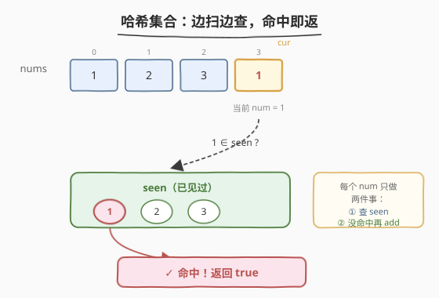
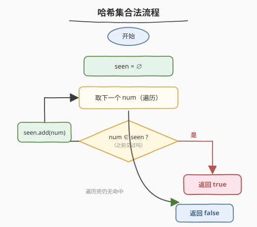
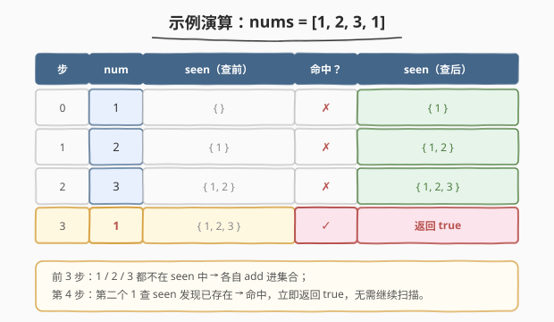

# 存在重复元素

- **题目名称**：存在重复元素
- **链接**：[217. 存在重复元素](https://leetcode.cn/problems/contains-duplicate/)
- **难度**：简单
- **标签**：数组、哈希表、排序

## 1. 题目概述

给定一个整数数组 `nums`，如果数组中**存在任意一个值出现至少两次**，返回 `true`；如果数组中**每个元素互不相同**，返回 `false`。

**示例 1**：

```text
输入：nums = [1,2,3,1]
输出：true
解释：元素 1 出现了两次（下标 0 与下标 3）。
```

**示例 2**：

```text
输入：nums = [1,2,3,4]
输出：false
解释：所有元素互不相同。
```

**示例 3**：

```text
输入：nums = [1,1,1,3,3,4,3,2,4,2]
输出：true
解释：1、2、3、4 均出现了不止一次。
```

**约束条件**：

- $1 \leq \text{nums.length} \leq 10^5$
- $-10^9 \leq \text{nums[i]} \leq 10^9$

> 💡 这是一道「判定型」题目——只问**有没有**重复，不问**哪个**重复、重复**几次**。判定型问题往往能用一次扫描 + 一个「见证集合」解决：扫到一个数先问「之前见过吗」，没见过就记下。`10^5` 的规模直接排除了 $O(n^2)$ 暴力（约 $10^{10}$ 次比较必然超时），把思路推向 $O(n)$ 的哈希或 $O(n \log n)$ 的排序。

---

## 2. 解题思路

### 2.1 暴力思路：两层循环枚举所有数对

最直观的做法是用两层循环，枚举所有 $(i, j)$ 数对（$i < j$），判断 `nums[i] == nums[j]`。

```text
for i in 0..n-1:
    for j in i+1..n-1:
        if nums[i] == nums[j]: return true
return false
```

时间复杂度 $O(n^2)$，对 $10^5$ 规模约 $5 \times 10^9$ 次比较，**必然超时**。问题在于：对每个 `nums[i]`，判断「后面有没有相同值」用了 $O(n)$ 线性扫描——这正是哈希表能优化到 $O(1)$ 的地方。

### 2.2 核心观察：哈希集合做「见过」账本，O(1) 查重



关键直觉：要判断「是否出现过重复」，只需维护一个**已见过的值的集合** `seen`。遍历到 `num` 时先问一句——

> 💡 **`num` 在 `seen` 里吗？**
> - **在** → 说明 `num` 之前出现过，现在又出现，**重复！立即返回 `true`**。
> - **不在** → 把 `num` 放进 `seen`，继续往后扫。

扫完整轮都没命中，说明所有元素互不相同，返回 `false`。

> ⚠️ **顺序很重要：先查后加**。若先 `add` 再 `count`/`find`，集合里已含当前值，会把自己误判成重复。正确做法是「**先查是否存在，不存在再加入**」，让 `seen` 始终代表「严格在当前元素之前出现过的值集合」。

### 2.3 算法流程图



整个流程是单层循环：取下一个 `num` → 查 `seen` → 命中返回 `true` / 未命中 `add` 继续。每个元素至多被查一次、加一次，总时间 $O(n)$，额外空间 $O(n)$（最坏情况所有元素互不相同，集合存满 $n$ 个）。

### 2.4 示例演算

以 `nums = [1, 2, 3, 1]` 为例，关键在第 4 步第二个 `1` 命中已存的 `1`：



| 步 | num | seen（查前） | 命中？ | 动作 | seen（查后） |
|----|-----|--------------|--------|------|--------------|
| 0 | 1 | { } | ✗ | add 1 | { 1 } |
| 1 | 2 | { 1 } | ✗ | add 2 | { 1, 2 } |
| 2 | 3 | { 1, 2 } | ✗ | add 3 | { 1, 2, 3 } |
| 3 | 1 | { 1, 2, 3 } | ✓ | 返回 true | — |

前 3 步每个数都是「新面孔」依次入集合；第 4 步第二个 `1` 查询时发现 `seen` 已含 `1`，立即返回 `true`，无需扫到末尾——**提前终止**是哈希法优于排序法的最大优势（当重复出现得早时）。

---

## 3. 参考代码

### C++

```cpp
class Solution {
  public:
    bool containsDuplicate(vector<int>& nums) {
        unordered_set<int> seen;
        for (int num : nums) {
            if (seen.count(num)) return true;   // 先查：之前见过 → 重复
            seen.insert(num);                   // 没见过 → 记下
        }
        return false;                           // 全程无命中 → 无重复
    }
};
```

### Python

```python
class Solution:
    def containsDuplicate(self, nums: List[int]) -> bool:
        seen = set()
        for num in nums:
            if num in seen:          # 先查：之前见过 → 重复
                return True
            seen.add(num)            # 没见过 → 记下
        return False                 # 全程无命中 → 无重复
```

> 💡 **Python 一行流**：`return len(set(nums)) < len(nums)`。把数组转集合会自动去重，若长度变短说明确有重复。语义清晰但**无法提前终止**——必须把所有元素都塞进集合才比较长度。当重复出现在数组前段时，上面的「边扫边查」写法能更早返回，常数更优。面试中两种都讲，说明你懂取舍。

---

## 4. 复杂度分析

| 维度 | 复杂度 | 说明 |
|------|--------|------|
| 时间复杂度 | $O(n)$ | 每个元素至多一次 `find` + 一次 `add`，哈希操作均摊 $O(1)$；最坏（无重复）扫满 $n$ 个 |
| 空间复杂度 | $O(n)$ | 最坏情况所有元素互不相同，`seen` 存满 $n$ 个；命中越早占用越少 |

---

## 5. 扩展：排序法（空间 O(1) 权衡）

若**额外空间受限**（如嵌入式场景禁用大哈希表），可先排序再查相邻：排序后相同值必然相邻，只需检查 `nums[i] == nums[i-1]` 即可。

```cpp
bool containsDuplicate(vector<int>& nums) {
    sort(nums.begin(), nums.end());
    for (int i = 1; i < (int)nums.size(); ++i) {
        if (nums[i] == nums[i - 1]) return true;
    }
    return false;
}
```

```python
class Solution:
    def containsDuplicate(self, nums: List[int]) -> bool:
        nums.sort()
        for i in range(1, len(nums)):
            if nums[i] == nums[i - 1]:
                return True
        return False
```

| 维度 | 哈希集合法 | 排序法 |
|------|-----------|--------|
| 时间 | $O(n)$ | $O(n \log n)$ |
| 额外空间 | $O(n)$ | $O(1)$¹（原地排序） |
| 是否修改输入 | 否 | **是**（排序改变原数组） |
| 能否提前终止 | 能（命中即返） | 不能（必须先排完） |

> ¹ 取决于排序实现：C++ `std::sort` 通常为内省排序，额外空间 $O(\log n)$（递归栈）；Python `list.sort` 为 Timsort，最坏 $O(n)$。这里「$O(1)$」指**不依赖输入规模量级**的辅助结构，相对哈希法的 $O(n)$ 是显著节省。

> ⚠️ **排序法会修改原数组**。若调用方要求保持原序，需先拷贝再排序，空间又回到 $O(n)$，此时哈希法更直接。面试讲清这一权衡是加分项。

---

## 6. 面试要点

1. **为什么是「先查后加」而不是「先加后查」？**
   - `seen` 必须代表「严格在当前元素之前出现过的值」。若先 `add` 再查，当前元素已在集合中，会把「自己」误判为重复。正确顺序是 `if (seen.count(num)) return true; seen.insert(num);`，让查询针对的是「之前的快照」。

2. **哈希法与排序法各自的适用场景？**
   - 哈希法：时间敏感、内存充裕、要求不修改输入、重复可能出现在前段（可提前终止）。
   - 排序法：内存受限、允许修改输入或可接受拷贝、后续还要用到排序结果（一劳永逸）。

3. **`nums[i]` 范围达 $10^9$，能否用「值域数组/位图」替代哈希？**
   - 不能。$10^9$ 个 `int` 的直接寻址表占约 4GB，位图也要约 125MB，且负数还需偏移。哈希表按「实际元素个数」而非「值域大小」分配空间，$O(n)$ 远小于 $O(\text{值域})$，是正确选择。

4. **最坏情况哈希法也会退化吗？**
   - 理论上若所有元素哈希冲突（同桶链表退化），单次操作退化为 $O(n)$，总 $O(n^2)$。但 `std::unordered_set` / Python `set` 的实现对抗冲突有优化（如 C++ 的拉链 + 负载因子重哈希、Python 的开放寻址 + 随机化哈希种子），实际工程中几乎不会触发。若面试官追问，可提「可用平衡树（`std::set`）换 $O(n \log n)$ 稳定上界」。

5. **若题目改成「返回重复的值」或「统计每个值出现次数」呢？**
   - 「返回重复值」：把 `seen` 升级为 `unordered_map<int,int>` 计数，首次发现 `count == 2` 时返回该值；或沿用集合，命中时直接返回当前 `num`。
   - 「统计次数」：改为完整计数后遍历 map 输出。这是 217 → [349. 前 K 个高频单词](https://leetcode.cn/problems/top-k-frequent-words/)、[451. 根据字符出现频率排序](https://leetcode.cn/problems/sort-characters-by-frequency/) 等题的起点。

---

## 7. 同类练习题

- [219. 存在重复元素 II](https://leetcode.cn/problems/contains-duplicate-ii/)：在 217 基础上加「下标差不超过 k」约束——哈希表改为存「最近下标」，查询时比距离，是 217 的滑动窗口化延伸
- [220. 存在重复元素 III](https://leetcode.cn/problems/contains-duplicate-iii/)：再加「值差不超过 t」约束——需桶分桶或有序集合 + `lower_bound`，是 217/219 的难度升级版
- [287. 寻找重复数](https://leetcode.cn/problems/find-the-duplicate-number/)（[题解](../0201-0300/287_寻找重复数.md)）：同样找重复，但禁止修改数组 + 限制 $O(1)$ 空间，逼出 Floyd 快慢指针判圈——对照 217 的「能用哈希就别上指针」
- [136. 只出现一次的数字](https://leetcode.cn/problems/single-number/)：217 的「对偶」——其余都出现两次、只有一个落单，用异或消除成对元素，$O(n)/O(1)$
- [268. 丢失的数字](https://leetcode.cn/problems/missing-number/)：数组含 $n$ 个 $[0,n]$ 中的数、缺一个，用求和或异或找缺——与 217 同属「数组中的元素身份问题」家族
