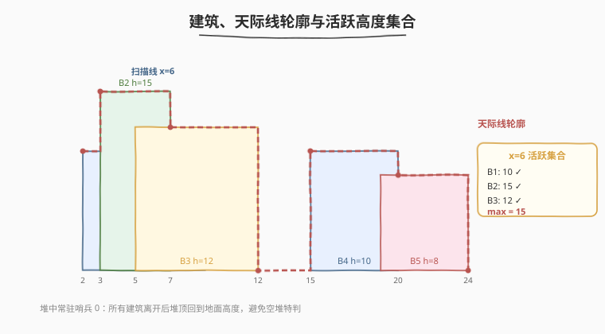
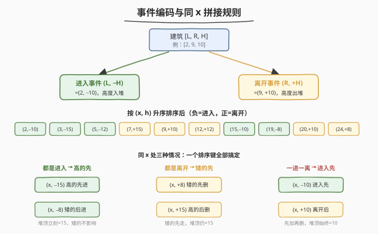
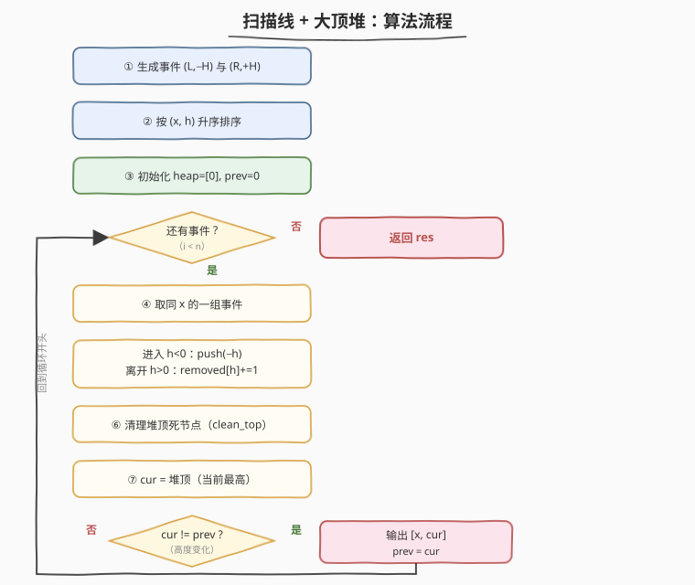
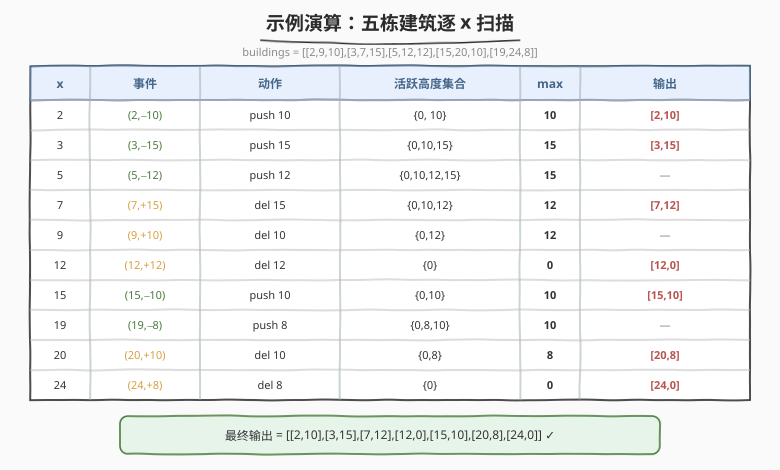

# 天际线问题

- **题目名称**：天际线问题
- **链接**：[218. 天际线问题](https://leetcode.cn/problems/the-skyline-problem/)
- **难度**：困难
- **标签**：扫描线、堆（优先队列）、分治、线段树

## 1. 题目概述

城市的**天际线**是从远处看去时所有建筑共同构成的外轮廓线。给定每栋建筑的几何信息，求这条轮廓线。

每栋建筑用三元组 `buildings[i] = [left_i, right_i, height_i]` 表示一个坐落在高度 `0` 的平地上的完美矩形：

- `left_i`：左边缘的 x 坐标；
- `right_i`：右边缘的 x 坐标（建筑占据的区间是 **左闭右开** `[left_i, right_i)`）；
- `height_i`：建筑高度。

要求返回**关键点**列表 `[[x1,y1],[x2,y2],...]`，按 x 坐标升序排列。每个关键点是一条水平轮廓段的**左端点**（即此处高度发生了变化），最后一个点固定为 `[x, 0]` 表示轮廓终止回到地面。

**约束条件**：

- `1 <= buildings.length <= 10^4`
- `0 <= left_i < right_i <= 2^31 - 1`
- `1 <= height_i <= 2^31 - 1`
- `buildings` 按 `left_i` **非递减**排序

**示例 1**：

```text
输入：buildings = [[2,9,10],[3,7,15],[5,12,12],[15,20,10],[19,24,8]]
输出：[[2,10],[3,15],[7,12],[12,0],[15,10],[20,8],[24,0]]
解释：
建筑 B1[2,9,10]、B2[3,7,15]、B3[5,12,12] 在 [2,12] 区间相互叠加；
B4[15,20,10]、B5[19,24,8] 在 [15,24] 区间叠加。
轮廓在 x=3 升到 15（B2 最高），x=7 B2 消失后降到 12（B3 接管），
x=12 B3 结束回到地面 0，以此类推。
```

**示例 2**：

```text
输入：buildings = [[0,2,3],[2,5,3]]
输出：[[0,3],[5,0]]
解释：两栋等高建筑首尾相接，轮廓是一条连续的水平线，中间 x=2 不产生拐点。
```

> 💡 本题是**扫描线（sweep line）**的经典招牌题。核心矛盾是：轮廓只在「某栋建筑的边缘」处可能变化，但一栋建筑进入会**抬高**当前高度、离开会**压低**当前高度，必须实时维护「当前所有活跃建筑的最高点」。把每栋建筑拆成「进入 / 离开」两个事件、用**大顶堆维护活跃高度集合**，就能在 $O(n \log n)$ 内求出轮廓。

---

## 2. 解题思路

### 2.1 暴力思路：枚举所有关键 x

最直觉的做法：把所有 `left_i`、`right_i` 收集起来作为「关键 x」，对每个关键 x，扫描全部建筑，找出所有 `[L, R)` 包含 x 的建筑里最高的那栋，得到该 x 的轮廓高度 $H(x)$。相邻关键 x 若高度不同就产生一个拐点。

- 关键 x 有 $O(n)$ 个，每次扫描所有建筑 $O(n)$，总计 $O(n^2)$，会超时（$n = 10^4$ 时 $10^8$ 量级，且常数大）。
- 还需小心「建筑边缘相接」「同一 x 多个事件」等边界，易错。

> ⚠️ 暴力法慢在「每个关键 x 都重新扫一遍所有建筑」。但建筑是**依次进出**的——从左到右扫过去时，活跃建筑集合只发生「加一个 / 减一个」的增量变化。这正是扫描线 + 增量数据结构（堆 / multiset）的用武之地。

### 2.2 核心观察：扫描线 + 事件拆分 + 大顶堆



关键洞察分三步：

**① 轮廓只在建筑边缘变化**。天际线的任何拐点一定发生在某栋建筑的 `left` 或 `right` 处（除此之外 x 轴上的高度不会变）。所以只需在这些「事件点」上检查高度。

**② 把每栋建筑拆成两个事件**。一栋 `[L, R, H]` 拆为：

- **进入事件** `(L, +H)`：在 x=L 处，高度 H 加入活跃集合；
- **离开事件** `(R, -H)`：在 x=R 处，高度 H 移出活跃集合。

**③ 用大顶堆（multiset）维护活跃高度集合**。从左到右扫事件，每到一个 x：先把该 x 上所有进入事件的高度塞进堆，再把所有离开事件的高度从堆里删掉，然后**堆顶 = 当前最高活跃高度**。若它与上一个记录的高度不同，就输出一个关键点 `[x, 当前最高]`。

> 💡 **堆里要放一个永久的 `0` 作为哨兵**：当所有建筑都离开时，堆顶应回到地面高度 0，而不是空堆。这样查询 `堆顶` 永远有效，无需特判。

#### 事件排序的同 x 处理（成败关键）



多个事件可能共享同一个 x（建筑边缘相接、重叠），**同 x 事件的执行顺序决定正确性**。直接给每个事件编一个排序键：

- 进入事件编码为 `(x, -H)`（高度取负）；
- 离开事件编码为 `(x, +H)`（高度取正）；
- 按 `(x, H)` **升序**排序。

这一个排序键同时满足三条拼接规则：

| 同 x 的情况 | 排序结果 | 为什么这样对 |
|------------|----------|-------------|
| **都是进入** | $-H$ 更小者先 → **高的先进** | 高的先进堆，堆顶立刻变高；低的随后进，堆顶不变，不产生多余拐点 |
| **都是离开** | $+H$ 更小者先 → **矮的先出** | 矮的先离开不影响堆顶（高的还在）；若高的先离开会让堆顶短暂下跌再被另一栋顶住，产生假拐点 |
| **一进一离** | $-H < +H$ → **进入先于离开** | 先把新高度加入，再删旧高度，避免「旧刚删、新未加」的瞬间跌到 0 的假拐点 |

> ⚠️ 这三条规则是本题最容易踩坑的地方。统一用「进入取负、离开取正、按 $(x, h)$ 升序」一行代码搞定，是竞赛圈的经典写法。

### 2.3 算法流程图



整体流程：

1. **生成事件**：每栋 `[L,R,H]` → `(L,-H)` 与 `(R,+H)`；
2. **排序**：按 `(x, h)` 升序；
3. **初始化**：堆 `heap = [0]`（哨兵），`prev = 0`，结果 `res = []`；
4. **扫描**（按 x 分组处理同 x 的所有事件）：
   - 进入事件（h<0）：把 $-h$ 压入堆；
   - 离开事件（h>0）：把 $h$ 标记为待删除（懒删除）；
   - 清理堆顶：若堆顶是被标记删除的高度，弹出并减计数，直到堆顶有效；
   - 取 `cur = 堆顶`；若 `cur != prev`：`res.append([x, cur])`，`prev = cur`；
5. **返回** `res`。

> 💡 **按 x 分组**是为了「同 x 的所有事件全部处理完之后才查一次堆顶」，每个 x 至多产生一个关键点，避免同 x 重复输出。若不分组而逐事件查询，靠排序规则也能对，但代码更绕、易出重复点，分组写法最稳。

### 2.4 示例演算

以 `buildings = [[2,9,10],[3,7,15],[5,12,12],[15,20,10],[19,24,8]]` 为例：



事件（已按 `(x, h)` 排序）：

| x | 事件 | 动作 | 活跃高度集合（含哨兵 0） | 堆顶 max | 输出 |
|---|------|------|--------------------------|----------|------|
| 2 | (2,-10) 进入 10 | push 10 | {0,10} | 10 | 10≠0 → **[2,10]** |
| 3 | (3,-15) 进入 15 | push 15 | {0,10,15} | 15 | 15≠10 → **[3,15]** |
| 5 | (5,-12) 进入 12 | push 12 | {0,10,12,15} | 15 | 15=15 → 不输出 |
| 7 | (7,+15) 离开 15 | lazy-del 15 | {0,10,12} | 12 | 12≠15 → **[7,12]** |
| 9 | (9,+10) 离开 10 | lazy-del 10 | {0,12} | 12 | 12=12 → 不输出 |
| 12 | (12,+12) 离开 12 | lazy-del 12 | {0} | 0 | 0≠12 → **[12,0]** |
| 15 | (15,-10) 进入 10 | push 10 | {0,10} | 10 | 10≠0 → **[15,10]** |
| 19 | (19,-8) 进入 8 | push 8 | {0,8,10} | 10 | 10=10 → 不输出 |
| 20 | (20,+10) 离开 10 | lazy-del 10 | {0,8} | 8 | 8≠10 → **[20,8]** |
| 24 | (24,+8) 离开 8 | lazy-del 8 | {0} | 0 | 0≠8 → **[24,0]** |

最终输出：

```text
[[2,10],[3,15],[7,12],[12,0],[15,10],[20,8],[24,0]]
```

与官方答案完全一致 ✓。

> 💡 注意 x=5 处：B3 进入 12，但堆顶仍是 15（B2 没走），所以不产生拐点——这正是「矮的进入不影响堆顶」的体现。x=9 处同理：B1 离开 10，但堆顶仍是 12（B3 还在），也不输出。

---

## 3. 参考代码

### C++（multiset，$O(n \log n)$）

```cpp
class Solution {
  public:
    vector<vector<int>> getSkyline(vector<vector<int>>& buildings) {
        vector<pair<int, int>> events;                 // (x, h)，进入 h=-H，离开 h=+H
        events.reserve(buildings.size() * 2);
        for (auto& b : buildings) {
            events.emplace_back(b[0], -b[2]);          // 左边缘：进入
            events.emplace_back(b[1],  b[2]);          // 右边缘：离开
        }
        sort(events.begin(), events.end());            // 按 (x, h) 升序，自带三条拼接规则

        vector<vector<int>> res;
        multiset<int> heights;                         // 活跃高度集合
        heights.insert(0);                             // 哨兵，保证堆顶永远有效
        int prev = 0;

        int i = 0, n = events.size();
        while (i < n) {
            int x = events[i].first;
            // 一次性处理同 x 的所有事件
            while (i < n && events[i].first == x) {
                int h = events[i].second;
                if (h < 0) heights.insert(-h);         // 进入：加入高度
                else      heights.erase(heights.find(h)); // 离开：只删一个等于 h 的元素
                ++i;
            }
            int cur = *heights.rbegin();               // 当前最高
            if (cur != prev) {
                res.push_back({x, cur});
                prev = cur;
            }
        }
        return res;
    }
};
```

### Python（大顶堆 + 懒删除，$O(n \log n)$）

```python
class Solution:
    def getSkyline(self, buildings: List[List[int]]) -> List[List[int]]:
        events = []                                    # (x, h)，进入 h=-H，离开 h=+H
        for L, R, H in buildings:
            events.append((L, -H))                     # 左边缘：进入
            events.append((R,  H))                     # 右边缘：离开
        events.sort()                                  # 按 (x, h) 升序，自带三条拼接规则

        import heapq
        heap = [0]                                     # 大顶堆（存 -h），哨兵保证非空
        removed = collections.Counter()                # 待删除高度计数（懒删除）
        prev = 0
        res = []
        i, n = 0, len(events)

        def clean_top():
            # 弹出堆顶所有已被标记删除的高度
            while heap and removed[-heap[0]] > 0:
                removed[-heap[0]] -= 1
                heapq.heappop(heap)

        while i < n:
            x = events[i][0]
            # 一次性处理同 x 的所有事件
            while i < n and events[i][0] == x:
                h = events[i][1]
                if h < 0:                              # 进入：压入高度
                    heapq.heappush(heap, h)            # 存 -H
                else:                                  # 离开：标记待删
                    removed[h] += 1
                i += 1
            clean_top()
            cur = -heap[0]                             # 当前最高
            if cur != prev:
                res.append([x, cur])
                prev = cur
        return res
```

> 💡 **C++ 用 `multiset`**：`erase(find(h))` 只删**一个**等于 h 的元素（若用 `erase(h)` 会删掉所有等于 h 的，错杀同高建筑）。**Python 没有内置 multiset**，用「大顶堆（存 $-h$）+ `Counter` 懒删除」等效：离开时不真删，只在 `removed[h]` 计数；查询堆顶前 `clean_top` 把死节点弹掉。两者复杂度都是 $O(n \log n)$。

---

## 4. 复杂度分析

| 维度 | 复杂度 | 说明 |
|------|--------|------|
| 时间复杂度 | $O(n \log n)$ | $2n$ 个事件排序 $O(n \log n)$；每个事件一次堆/ multiset 的插入或删除 $O(\log n)$，共 $O(n \log n)$；`clean_top` 摊还 $O(\log n)$ |
| 空间复杂度 | $O(n)$ | 事件数组 $O(n)$；堆/ multiset 至多存 $n$ 个活跃高度 |

> ⚠️ **懒删除为何是 $O(n \log n)$ 而非退化**：每个高度至多被 `push` 一次、`pop` 一次，所以 `clean_top` 的总弹出次数 $\le n$，摊还到每步 $O(\log n)$。务必在「同 x 全部处理完之后」才调一次 `clean_top`，避免重复清理。

---

## 5. 扩展：分治法与线段树

### 5.1 分治法 $O(n \log n)$

模仿归并排序：把建筑按中间下标分成左右两半，分别求出子天际线，再**合并两条已排序的关键点序列**。合并时同步推进左右两半的 x 游标，维护「左半当前高度 `hl`、右半当前高度 `hr`」，在每个 x 取 $\max(hl, hr)$，若与上一个输出高度不同就产生拐点。

- 时间 $T(n) = 2T(n/2) + O(n) = O(n \log n)$，空间 $O(n)$（不含递归栈）。
- 不依赖堆，思路对称、易讲，是面试中「不想用堆」时的优雅替代。

### 5.2 线段树 / 离散化区间最值

把所有出现过的 x 离散化为 $2n$ 个坐标点，建一棵维护「区间最大高度」的线段树。每栋建筑是一次区间更新 `[L, R)` 取 `max`（因为高度只增不减地覆盖取最大）。最后逐坐标查询最大值，相邻变化即为关键点。

- 需处理「左闭右开」与「坐标离散化」的对应（常用 `[L, R-1]` 或差分技巧）。
- 适合处理**海量更新 + 少量查询**的变体；本题查询也是 $O(n)$，总 $O(n \log n)$。

三种方法对比：

| 方法 | 时间 | 空间 | 特点 |
|------|------|------|------|
| 扫描线 + 堆 | $O(n \log n)$ | $O(n)$ | **首选**，思路清晰、常数小，事件排序一行搞定同 x 规则 |
| 分治归并 | $O(n \log n)$ | $O(n)$ | 不依赖堆，合并逻辑类似归并，适合手撕 |
| 线段树 | $O(n \log n)$ | $O(n)$ | 区间取 max 更新，适合后续扩展为「动态建筑」变体 |

> 💡 面试推荐：主讲扫描线 + 堆（最通用、最易实现），若被追问其它解法，补分治法体现递归思维，线段树留作扩展。

---

## 6. 面试要点

1. **为什么把 `[L,R,H]` 拆成 `(L,-H)` 与 `(R,+H)`，而不是分别用两个数组？**

   - 拆成带符号的高度后，所有事件可以放进**同一个数组**按 `(x, h)` 一次排序完成。负号既标记了「进入」、又让同 x 的进入事件排在离开前面、还让同是进入时高的排在前面——一个排序键同时编码了三条拼接规则，是最简洁的写法。

2. **同 x 处「一进一离」为什么必须先处理进入？**

   - 假设 x=10 处一栋 H=5 的建筑离开、另一栋 H=5 的建筑进入。若先离开：堆顶会先跌到 0（5 被删），再升回 5（新 5 加入），产生假拐点 `[10,0]` 和 `[10,5]`。先进入则堆顶始终是 5，不产生任何拐点。统一用「进入取负、离开取正」的排序天然保证进入在前。

3. **C++ 用 `multiset::erase(h)` 会出什么 bug？**

   - `erase(h)` 会删掉**所有**等于 h 的元素。若当前有两栋高度都是 5 的建筑活跃，一栋离开会把另一个 5 也删掉，导致堆顶错误下跌。正确写法是 `erase(find(h))` 或 `erase(一个迭代器)`，只删一个。Python 没有这个问题（用懒删除计数）。

4. **为什么堆里要预先放一个 0？**

   - 当所有建筑都离开、活跃集合为空时，地面高度应是 0。哨兵 0 保证 `堆顶` 永远非空可查，无需对空堆特判，最后一栋建筑离开后能自然输出 `[x, 0]` 收尾。

5. **建筑区间是左闭右开 `[L, R)`，对算法有何影响？**

   - 右边缘 R 是「离开事件」的 x，表示建筑在 `[L, R)` 内活跃、到 R 就不再占据。所以 x=R 处若还有别的建筑接管，堆顶不变、不输出拐点；若没有建筑接管，堆顶跌到 0，输出 `[R, 0]`。这与示例 2「等高首尾相接不产生中间拐点」一致：`[0,2,3]` 在 x=2 离开、`[2,5,3]` 在 x=2 进入，先进入使堆顶始终 3。

---

## 7. 同类练习题

- [252. 会议室](https://leetcode.cn/problems/meeting-rooms/)：同样把区间拆成「开始/结束」事件排序扫描，判断是否有重叠，扫描线入门版
- [253. 会议室 II](https://leetcode.cn/problems/meeting-rooms-ii/)（[题解](./253_会议室II.md)）：扫描线 + 最小堆维护「正在开的会议」，求同时进行的最大会议数，与本题同骨架（堆维护活跃集合）
- [352. 将数据流变为多个不相交区间](https://leetcode.cn/problems/data-stream-as-disjoint-intervals/)：动态维护区间并集，扫描线思想的在线版，可用有序集合/并查集
- [732. 我的日程安排表 III](https://leetcode.cn/problems/my-calendar-iii/)：差分扫描线（事件 +1/-1 后按 x 排序累加），求最大重叠层数，对照本题的「维护最大高度」
- [699. 掉落的方块](https://leetcode.cn/problems/falling-squares/)：方块依次落下叠放，求每次落下后的最高高度，区间取 max 更新，可看作本题的「在线动态」变体
