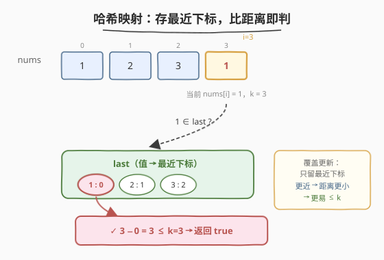
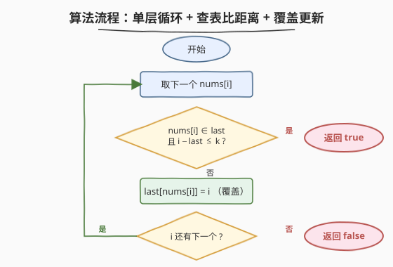

# LeetCode 存在重复元素 II 题解

## 1. 题目概述

- **标题 / 题号**：存在重复元素 II（#219，easy）
- **链接**：https://leetcode.cn/problems/contains-duplicate-ii/
- **难度**：简单
- **标签**：数组、哈希表、滑动窗口

**题意**：给定一个整数数组 `nums` 与一个整数 `k`，判断是否存在**两个不同下标** `i` 和 `j`，使得 `nums[i] == nums[j]` 且 `abs(i - j) <= k`。存在则返回 `true`，否则返回 `false`。

**示例 1**：

```text
输入：nums = [1,2,3,1], k = 3
输出：true
解释：nums[0] == nums[3] == 1，且 abs(0 - 3) = 3 <= 3。
```

**示例 2**：

```text
输入：nums = [1,0,1,1], k = 1
输出：true
解释：nums[2] == nums[3] == 1，且 abs(2 - 3) = 1 <= 1。
```

**示例 3**：

```text
输入：nums = [1,2,3,1,2,3], k = 2
输出：false
解释：所有相同值的下标对距离都为 3（> 2），无满足条件者。
```

**约束**：

- $1 \leq \text{nums.length} \leq 10^5$
- $-10^9 \leq \text{nums[i]} \leq 10^9$
- $0 \leq k \leq 10^5$

> 💡 这是 [217. 存在重复元素](../0201-0300/217_存在重复元素.md) 的「带距离约束版」——217 只问「有没有重复」，本题加了一句「**重复的两个下标还要靠得足够近**（距离 $\leq k$）」。约束一加，217 的「集合只存值」就不够用了：集合记不下「上次出现在哪」，无法比距离。把集合升级成「值 → 最近下标」的映射，便是本题的最优解。

## 2. 解题思路

### 2.1 暴力思路：两层循环枚举所有数对

最直观的做法是枚举所有下标对 $(i, j)$（$i < j$），判断 `nums[i] == nums[j]` 且 $j - i \leq k$。

```text
for i in 0..n-1:
    for j in i+1..min(i+k, n-1):     # 只看 i 之后 k 个
        if nums[i] == nums[j]: return true
return false
```

内层只扫 $k$ 个，时间 $O(n \cdot k)$。当 $k$ 与 $n$ 同阶（$10^5$）时约 $10^{10}$ 次比较，**必然超时**。问题在于：对每个 `nums[i]`，判断「后面 $k$ 步内有没有相同值」用了线性扫描——这正是哈希表能优化到 $O(1)$ 的地方。

> ⚠️ 注意暴力法内层是「$j$ 从 $i+1$ 到 $i+k$」而非「全数组」，因为距离 $> k$ 的对必然不满足。但即便如此 $O(nk)$ 在 $k$ 大时仍不可接受。

### 2.2 核心观察：哈希表存「最近下标」，只需比一次距离



关键直觉来自一个**贪心观察**：

> 💡 **对每个值，只记它「最近一次出现的下标」就足够了。**

理由：假设值 $v$ 之前出现过多次，下标为 $p_1 < p_2 < \dots < p_m < i$（$i$ 是当前位置）。要判断「是否存在某个 $p$ 使 $i - p \leq k$」，显然**越近的 $p$ 越容易满足**——若最近的 $p_m$ 都不满足（$i - p_m > k$），更早的 $p_1, p_2, \dots$ 距离更大，更不可能满足。

所以哈希表只需维护一个映射 `val → 最近下标`：

- 遇到 `nums[i]`：先查 `val` 在不在表里；
  - **在**且 $i - \text{last}[val] \leq k$ ⇒ **命中！返回 `true`**；
  - **不在**或距离 $> k$ ⇒ 把 `last[val] = i`（**覆盖**更新，只留最近的）。
- 扫完整轮无命中，返回 `false`。

> ⚠️ **「覆盖更新」是精髓**：217 里集合一旦加入就不动；219 里映射要不断用更近的下标覆盖旧值。因为只有最近的下标才有机会满足 $\leq k$，留着远的只会白白占空间、还可能误判（远的下标若恰好满足 $k$ 但被更近的覆盖了？不会——更近的若不满足，远的更不满足；更近的若满足，已经直接返回 `true` 了，根本走不到覆盖那步）。所以「先查后覆盖」的顺序同样关键。

### 2.3 算法流程图



整个流程是单层循环：取下一个 `nums[i]` → 查 `last` 表 → 命中（在表且距离 $\leq k$）返回 `true` / 未命中则 `last[nums[i]] = i` 继续。每个元素至多被查一次、写一次，总时间 $O(n)$，额外空间 $O(\min(n, k))$（实际取决于不同值的数量，最坏 $O(n)$）。

### 2.4 示例演算

以 `nums = [1, 2, 3, 1]`、`k = 3` 为例，关键在第 4 步第二个 `1` 命中已存的最近下标 `0`，距离恰为 $3 \leq 3$：

![示例演算：nums = [1,2,3,1], k = 3](../images/cd2_example_walkthrough.svg)

| 步 | i | nums[i] | last（查前） | 距离 | 命中？ | 动作 | last（查后） |
|----|---|---------|--------------|------|--------|------|--------------|
| 0 | 0 | 1 | { } | — | ✗ | last[1]=0 | { 1:0 } |
| 1 | 1 | 2 | { 1:0 } | — | ✗ | last[2]=1 | { 1:0, 2:1 } |
| 2 | 2 | 3 | { 1:0, 2:1 } | — | ✗ | last[3]=2 | { 1:0, 2:1, 3:2 } |
| 3 | 3 | 1 | { 1:0, 2:1, 3:2 } | 3-0=3 | ✓ | 返回 true | — |

前 3 步每个值都是「新面孔」依次入表；第 4 步第二个 `1` 查表发现 `last[1]=0`，距离 $3 - 0 = 3 \leq 3$，立即返回 `true`。

**再看一个不命中的例子** `nums = [1, 2, 3, 1, 2, 3]`、`k = 2`：第 4 步 `nums[3]=1` 查得 `last[1]=0`，距离 $3 > 2$，未命中，**覆盖** `last[1]=3`；第 5 步 `nums[4]=2` 查得 `last[2]=1`，距离 $3 > 2$，覆盖 `last[2]=4`；第 6 步 `nums[5]=3` 查得 `last[3]=2`，距离 $3 > 2$，覆盖 `last[3]=5`。全程无命中，返回 `false`。注意：若不覆盖（仍用旧下标 `0/1/2`），第 4~6 步距离会变成 $4/5/6$ 更大，更不可能命中——这印证了「只留最近下标」的正确性：覆盖后距离变小，反而给了后续同值更多命中机会。

> 💡 **对比 217**：217 的集合「加进去就不动」，因为只问「有没有」；219 的映射「不断覆盖」，因为要问「近不近」。从「存不存在」到「最近在哪」，是集合到映射的一步升级，也是判定型到约束型的典型跨越。

## 3. 参考代码

### C++

```cpp
class Solution {
  public:
    bool containsNearbyDuplicate(vector<int>& nums, int k) {
        unordered_map<int, int> last;          // val -> 最近下标
        for (int i = 0; i < (int)nums.size(); ++i) {
            auto it = last.find(nums[i]);
            if (it != last.end() && i - it->second <= k) {
                return true;                    // 同值且距离 <= k
            }
            last[nums[i]] = i;                  // 覆盖：只留最近下标
        }
        return false;                           // 全程无命中
    }
};
```

### Python

```python
class Solution:
    def containsNearbyDuplicate(self, nums: List[int], k: int) -> bool:
        last = {}                               # val -> 最近下标
        for i, num in enumerate(nums):
            if num in last and i - last[num] <= k:
                return True                     # 同值且距离 <= k
            last[num] = i                       # 覆盖：只留最近下标
        return False                            # 全程无命中
```

> 💡 两版骨架与 217 几乎一致，仅两处变化：① `unordered_set` / `set` 换成 `unordered_map` / `dict`（多存一个下标）；② 查询从「在不在」升级为「在且距离 $\leq k$」，命中条件多一个 `i - last[num] <= k` 的合取。「覆盖更新」用 `last[nums[i]] = i` / `last[num] = i` 一行完成，无论 `num` 是否已在表中都直接赋值，省去 `if-else` 分支。

> ⚠️ **C++ 用 `find` 而非 `count`**：因为查询后还要读 `it->second` 比距离。若用 `count` 再 `[]` 取值，会触发两次哈希查找。`find` 一次查找拿到迭代器，命中时直接解引用读下标，常数更优。Python 的 `in` + `[]` 也是两次，但 Python 字典开销本就高，常数差异不如 C++ 明显；若追求极致可写 `prev = last.get(num)` + `prev is not None and i - prev <= k`，一次查找。

## 4. 复杂度分析

| 维度 | 复杂度 | 说明 |
|------|--------|------|
| 时间复杂度 | $O(n)$ | 每个元素至多一次 `find` + 一次赋值，哈希操作均摊 $O(1)$；最坏（无命中）扫满 $n$ 个 |
| 空间复杂度 | $O(\min(n, \text{不同值数}))$ | 表中条目数 $\leq$ 不同值个数 $\leq n$；命中越早占用越少 |
| 与 217 对比 | 相同 | 两者均为 $O(n)$ 时间 / $O(n)$ 空间，219 仅多存一个 `int` 下标，常数略大 |

> 💡 空间上界是 $O(\min(n, V))$，其中 $V$ 为值域不同值个数。本题 $V$ 可达 $10^9$ 但实际元素仅 $10^5$ 个，故上界由 $n$ 决定。若数据分布使大量元素相同，表会很小（同值只占一条）——这恰是「覆盖更新」带来的隐含收益：相同值不堆积。

## 5. 扩展：滑动窗口法（窗口大小 k 的集合）

把 219 换个角度看：维护一个**大小 $\leq k$ 的滑动窗口**，窗口内是 `nums[i-k..i-1]`（当前位置 $i$ 之前的 $k$ 个元素）。问「`nums[i]` 是否在窗口内出现过」——这又回到了 217 的「集合查重」，只是集合只装最近 $k$ 个元素。

```cpp
bool containsNearbyDuplicate(vector<int>& nums, int k) {
    unordered_set<int> win;                       // 窗口内元素集合
    for (int i = 0; i < (int)nums.size(); ++i) {
        if (win.count(nums[i])) return true;      // 窗口内有相同值
        win.insert(nums[i]);
        if ((int)win.size() > k) win.erase(nums[i - k]);   // 窗口右移，踢出最老的
    }
    return false;
}
```

```python
class Solution:
    def containsNearbyDuplicate(self, nums: List[int], k: int) -> bool:
        win = set()
        for i, num in enumerate(nums):
            if num in win:
                return True
            win.add(num)
            if len(win) > k:                      # 窗口右移，踢出最老的
                win.remove(nums[i - k])
        return False
```

**两种视角对照**：

| 维度 | 哈希映射法（主解） | 滑动窗口法（扩展） |
|------|-------------------|---------------------|
| 数据结构 | `map<val, 最近下标>` | `set<窗口内元素>` |
| 查询逻辑 | 在表且 $i - \text{last} \leq k$ | 在集合里（集合只装近 $k$ 个） |
| 维护方式 | 覆盖更新下标 | 入窗 + 满载踢出最老 |
| 空间上界 | $O(\min(n, V))$（按不同值） | $O(\min(n, k+1))$（按窗口大小） |
| 与 217 关系 | 217 集合 → 升级为映射 | 217 集合 → 加「窗口淘汰」机制 |
| $k$ 很小时 | 空间仍可能 $O(n)$（不同值多） | **空间 $O(k)$，更省** |
| $k$ 很大时 | $O(n)$，一次扫完 | $O(n)$，但每个元素增删两次 |

> 💡 **何时选哪种？** $k \ll n$ 时滑动窗口法空间更优（$O(k)$ vs $O(n)$）；$k$ 接近 $n$ 时两者空间相当，哈希映射法只需一次查找（窗口法要一查一删），常数更小。面试中两种都讲，说明你理解了「约束型查重」的两种建模：**要么记住每个值的最近位置（映射），要么只看近邻窗口（集合 + 淘汰）**。后者直接通向 [220. 存在重复元素 III](https://leetcode.cn/problems/contains-duplicate-iii/) 的桶分桶解法。

> ⚠️ 窗口法的 `erase` 时机：必须在 `insert` 之后判 `size > k` 再踢，不能提前踢 `nums[i - k - 1]`。因为 `i - k` 这个位置在加入 `nums[i]` 后才算「滑出窗口」（窗口是 $[i-k, i]$，含 $k+1$ 个元素，超过 $k$ 才踢最老的）。若 $k = 0$，窗口大小为 1，每轮加入后立即踢出自己——等价于「不允许任何同值对」，恒返回 `false`，与题意 $k=0$ 时 `abs(i-j) <= 0` 但 $i \neq j$ 矛盾故必 `false` 一致。

## 6. 面试要点

1. **为什么只需记「最近下标」，记所有下标会不会更稳？**

   > 贪心：对当前位置 $i$，要判断「之前某次出现 $p$ 是否满足 $i - p \leq k$」，最近的 $p$ 给出最小距离，最近的不满足则更早的更不满足。记所有下标徒增空间（最坏 $O(n)$ 条目且多数无用），却不会改变判定结果。覆盖更新让表始终是「每个值一条」的精简形态，是空间与正确性的双赢。

2. **「覆盖更新」会不会丢失本来能命中的信息？**

   > 不会。设值 $v$ 在 $p_1 < p_2$ 出现过，当前位置 $i$。若 $p_2$ 已被覆盖掉 $p_1$（即 $p_2$ 是更近的），用 $p_2$ 判定：$i - p_2 \leq k$ 则命中返回；$i - p_2 > k$ 则 $i - p_1 > i - p_2 > k$，$p_1$ 也必不满足。故覆盖 $p_1$ 不丢任何命中机会。反之若不覆盖、仍用 $p_1$ 判，反而可能因 $i - p_1 > k$ 误判不命中，而真正能满足的 $p_2$ 被忽略——这才是 bug。

3. **`k = 0` 时返回什么？为什么？**

   > 恒返回 `false`。题意要求两个**不同**下标 $i \neq j$ 且 $\text{abs}(i - j) \leq k$。$k = 0$ 时 $\text{abs}(i - j) \leq 0$ 强制 $i = j$，与「不同下标」矛盾，故无解。代码上：哈希映射法首次遇到值时 `last` 中无记录，不进 `if`，写入后该值最近下标即自身；后续遇到同值时 $i - \text{last} \geq 1 > 0 = k$，永不命中。窗口法在 $k=0$ 时窗口大小 1，加入即踢出，集合恒空，`count` 恒为 0。两者自洽。

4. **哈希映射法与滑动窗口法在 $k$ 极小时的取舍？**

   > $k \ll n$（如 $k = 5$）时，窗口法空间 $O(k) = O(1)$，远优于映射法的 $O(n)$（不同值多时）。代价是窗口法每元素一查一增一可能的删，共 2~3 次哈希操作，而映射法仅一查一写。当 $k$ 小到可视为常数时，窗口法空间优势压倒常数劣势，更优；$k$ 与 $n$ 同阶时，映射法常数更小且空间上界相同，更优。

5. **若改成「返回所有满足条件的下标对」呢？**

   > 退化为枚举问题，最坏 $O(n^2)$ 对（如全相同值且 $k \geq n$）。可用映射存「每个值的所有下标列表」，对每个值用双指针在有序下标列表上统计距离 $\leq k$ 的对数，总复杂度 $O(n + \text{答案数})$。这是从「判定型」到「计数/枚举型」的典型升级，思路同 [1. 两数之和](https://leetcode.cn/problems/two-sum/)（判定）→ [15. 三数之和](https://leetcode.cn/problems/3sum/)（枚举）的跨越。

> 💡 **一句话总结**：219 的灵魂是「**217 的集合升级为『值→最近下标』映射，多比一次距离**」——贪心只记最近下标（更近的下标给更小距离、更易满足 $\leq k$，覆盖旧的不会丢命中），查询时 `在表且 i - last <= k` 即命中。从「存不存在」到「最近在哪」，是判定型到约束型的标准一步。滑动窗口法是另一种建模（集合 + 淘汰最老），$k$ 小时空间更优，直接通向 220 的桶分桶。

## 同类练习题

| # | 题目 | 与本题的关联 |
|---|------|-------------|
| 217 | [存在重复元素](https://leetcode.cn/problems/contains-duplicate/)（[题解](../0201-0300/217_存在重复元素.md)） | 本题的「无距离约束版」——只问有没有重复，集合存值即可，是 219 的母题 |
| 220 | [存在重复元素 III](https://leetcode.cn/problems/contains-duplicate-iii/) | 再加「值差不超过 $t$」约束——需桶分桶（按 $\lfloor v/(t+1) \rfloor$ 分桶，同桶或邻桶内找值差 $\leq t$）或有序集合 + `lower_bound`，是 217/219 的难度升级版 |
| 287 | [寻找重复数](https://leetcode.cn/problems/find-the-duplicate-number/)（[题解](../0201-0300/287_寻找重复数.md)） | 同样找重复，但禁止修改数组 + 限制 $O(1)$ 空间，逼出 Floyd 快慢指针判圈——对照 219 的「能用哈希就别上指针」 |
| 1 | [两数之和](https://leetcode.cn/problems/two-sum/)（[题解](../0001-0100/1_两数之和.md)） | 同样是「扫描 + 哈希表查历史信息」，219 查「同值最近下标」，1 查「互补数」——哈希表存「值→下标」映射的最经典应用 |
| 3 | [无重复字符的最长子串](https://leetcode.cn/problems/longest-substring-without-repeating-characters/)（[题解](../0001-0100/3_无重复字符的最长子串.md)） | 滑动窗口 + 哈希判重，与 219 的窗口法同属「窗口内集合查重」家族，只是 3 维护窗口最大长度、219 判窗口内是否命中 |
