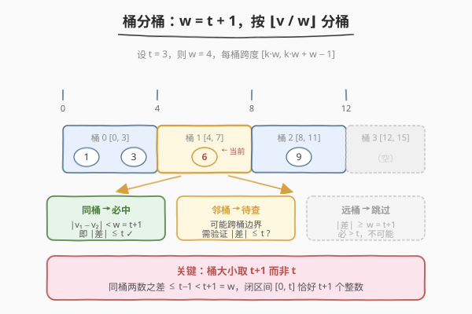
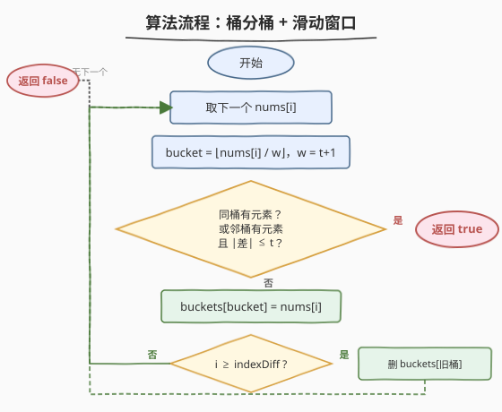

# 存在重复元素 III

- **题目名称**：存在重复元素 III
- **链接**：[220. 存在重复元素 III](https://leetcode.cn/problems/contains-duplicate-iii/)
- **难度**：困难
- **标签**：数组、哈希表、滑动窗口、桶排序

## 1. 题目概述

给定一个整数数组 `nums` 和两个整数 `indexDiff` 与 `valueDiff`，判断是否存在**两个不同下标** `i` 和 `j`，使得 $\text{abs}(i - j) \leq \text{indexDiff}$ 且 $\text{abs}(\text{nums}[i] - \text{nums}[j]) \leq \text{valueDiff}$。存在则返回 `true`，否则返回 `false`。

**示例 1**：

```text
输入：nums = [1,2,3,1], indexDiff = 3, valueDiff = 0
输出：true
解释：nums[0] = 1, nums[3] = 1，abs(0 − 3) = 3 ≤ 3 且 abs(1 − 1) = 0 ≤ 0。
```

**示例 2**：

```text
输入：nums = [1,5,9,1,5,9], indexDiff = 2, valueDiff = 3
输出：false
解释：窗口内任意两数差均 > 3（如 |5−1|=4、|9−5|=4），无满足条件者。
```

**约束条件**：

- $1 \leq \text{nums.length} \leq 10^5$
- $-2^{31} \leq \text{nums[i]} \leq 2^{31} - 1$
- $1 \leq \text{indexDiff} \leq \text{nums.length}$
- $0 \leq \text{valueDiff} \leq 2^{31} - 1$

> 💡 这是 [219. 存在重复元素 II](../0201-0300/219_存在重复元素II.md) 的「双重约束升级版」——219 只要求「值相同 + 下标近」，本题再加一句「**值也要足够接近**（差 $\leq t$）」。219 的哈希映射只存「值→最近下标」，碰到「值差 $\leq t$」就无能为力：你无法在 $O(1)$ 内从哈希表里找到「与当前值相差不超过 $t$ 的历史值」。把值域切成大小 $t+1$ 的桶，让「同桶必近、邻桶待查、远桶跳过」，便是本题的核心解法——桶分桶 + 滑动窗口。

---

## 2. 解题思路

### 2.1 暴力思路：两层循环枚举所有数对

最直观的做法是枚举所有下标对 $(i, j)$，判断下标差与值差是否同时满足约束。

```text
for i in 0..n-1:
    for j in i+1..min(i+indexDiff, n-1):   # 只看 indexDiff 步内
        if abs(nums[i] - nums[j]) <= valueDiff: return true
return false
```

内层只扫 $\text{indexDiff}$ 个，时间 $O(n \cdot \text{indexDiff})$。当 $\text{indexDiff}$ 与 $n$ 同阶（$10^5$）时约 $10^{10}$ 次比较，**必然超时**。问题在于：对每个 `nums[i]`，判断「窗口内有没有值差 $\leq t$ 的元素」用了线性扫描——这正是桶分桶能优化到 $O(1)$ 的地方。

### 2.2 核心观察：桶分桶——同桶必中、邻桶待查、远桶跳过



关键直觉来自一个**值域划分**思想：

> 💡 **把值域切成大小为 $w = t + 1$ 的桶，让「值差 $\leq t$」的判定从「逐个比较」变成「看桶号」。**

为什么桶大小取 $t + 1$ 而非 $t$？因为我们要保证**同一桶内任意两数之差 $\leq t$**：若桶覆盖闭区间 $[k \cdot w,\ k \cdot w + w - 1]$，则同桶两数最大差为 $w - 1 = t$。若取 $w = t$，同桶最大差为 $t - 1 < t$，虽也成立但会**把本可同桶的相邻值（差恰为 $t$）拆到两个桶**，徒增邻桶检查。

每个数 `nums[i]` 的桶号为 $\lfloor \text{nums[i]} / w \rfloor$。判定时只需查三个桶：

| 桶关系 | 差的范围 | 动作 |
|--------|---------|------|
| **同桶** | $\leq w - 1 = t$ | **必中**，直接返回 `true` |
| **左右邻桶** | 可能 $\leq t$ 也可能 $> t$（跨桶边界） | **取出验证** $\text{abs}(\text{差}) \leq t$ |
| **更远的桶** | $\geq w = t + 1 > t$ | **跳过**，不可能满足 |

> ⚠️ **邻桶只需查左右各一个**：桶号差 $\geq 2$ 时，两数之差 $\geq w = t + 1 > t$，必不满足。所以每个元素只查同桶 + 左邻 + 右邻共至多 3 个桶，$O(1)$ 完成。

**配合滑动窗口管下标约束**：桶表中只保留窗口 $[i - \text{indexDiff},\ i - 1]$ 内的元素。处理完 `nums[i]` 后入桶，若 $i \geq \text{indexDiff}$，则把 `nums[i - indexDiff]` 从其桶中删除——这承自 [219](../0201-0300/219_存在重复元素II.md) 的滑动窗口视角，只是窗口从「集合」升级为「桶映射」。

> 💡 **关键不变式**：同一桶在任何时刻至多存一个元素。因为若两个元素落入同桶，在第二个入桶前检查时就会发现同桶已有元素 → 直接返回 `true`。所以「一桶一元素」是算法正确性（删除时可直接整桶删除）与空间上界（桶数 $\leq \text{indexDiff} + 1$）的共同保证。

### 2.3 算法流程图



整个流程是单层循环：取下一个 `nums[i]` → 算桶号 → 查同桶/邻桶（命中返回 `true`）→ 入桶 → 若 $i \geq \text{indexDiff}$ 删旧桶 → 继续。每个元素至多查 3 个桶 + 一次入桶 + 一次可能的删桶，总时间 $O(n)$，额外空间 $O(\min(n, \text{indexDiff} + 1))$。

### 2.4 示例演算

以 `nums = [1, 5, 9, 1, 5, 9]`、`indexDiff = 2`、`valueDiff = 3` 为例（$w = 4$，桶号：$1 \to 0,\ 5 \to 1,\ 9 \to 2$），全程邻桶值差均为 $4 > 3$，窗口内无满足条件者：

![示例演算：nums = [1,5,9,1,5,9], indexDiff = 2, valueDiff = 3](../images/cd3_example_walkthrough.svg)

| 步 | i | nums[i] | 桶号 | buckets（查前） | 命中？ | buckets（查后） |
|----|---|---------|------|------------------|--------|------------------|
| 0 | 0 | 1 | 0 | { } | ✗ | { 0:1 } |
| 1 | 1 | 5 | 1 | { 0:1 } | ✗ 邻桶0: \|5−1\|=4>3 | { 0:1, 1:5 } |
| 2 | 2 | 9 | 2 | { 0:1, 1:5 } | ✗ 邻桶1: \|9−5\|=4>3 | { 1:5, 2:9 }（删桶0） |
| 3 | 3 | 1 | 0 | { 1:5, 2:9 } | ✗ 邻桶1: \|1−5\|=4>3 | { 0:1, 2:9 }（删桶1） |
| 4 | 4 | 5 | 1 | { 0:1, 2:9 } | ✗ 两邻桶均>3 | { 0:1, 1:5 }（删桶2） |
| 5 | 5 | 9 | 2 | { 0:1, 1:5 } | ✗ 邻桶1: \|9−5\|=4>3 | { 1:5, 2:9 }（删桶0） |

前 2 步建桶无删除（$i < \text{indexDiff}$）；第 3 步起每步先查后删——查时窗口仍含 $i - \text{indexDiff}$ 的元素，删后窗口右移一格。全程邻桶差恰为 $4 = t + 1 > t$，恰好差一步命中，最终返回 `false`。

**再看一个命中的例子** `nums = [1, 2, 3, 1]`、`indexDiff = 3`、`valueDiff = 0`（$w = 1$，每个值独占一桶，退化为 [219](../0201-0300/219_存在重复元素II.md) 的等值查重）：第 4 步 `nums[3]=1` 查得桶 0 已有 `1`，同桶 → $|1-1|=0 \leq 0$，立即返回 `true`。这印证了 $t = 0$ 时桶大小 $w = 1$，桶号 $=$ 值本身，同桶即等值——220 自然包摄 219。

> 💡 **对比 219**：219 的哈希映射「值→最近下标」只解决「值相同 + 下标近」；220 的桶映射「桶号→值」解决「值相近 + 下标近」。从「精确等值」到「近似等值」，是哈希查重到桶分桶的一步升级，也是 219 扩展节预告的「直接通向 220 的桶分桶」。

---

## 3. 参考代码

### C++

```cpp
class Solution {
  public:
    bool containsNearbyAlmostDuplicate(vector<int>& nums, int indexDiff, int valueDiff) {
        unordered_map<long long, long long> buckets;   // 桶号 -> 值
        long long w = (long long)valueDiff + 1;        // 桶大小，+1 防 valueDiff=INT_MAX 溢出

        auto getID = [&](long long x) -> long long {
            // C++ 除法向零截断，负数需调整为向下取整
            return x >= 0 ? x / w : (x + 1) / w - 1;
        };

        for (int i = 0; i < (int)nums.size(); ++i) {
            long long val = nums[i];
            long long id = getID(val);

            // 同桶：必满足 |差| <= t
            if (buckets.count(id)) return true;

            // 左邻桶：取出验证
            auto lit = buckets.find(id - 1);
            if (lit != buckets.end() && val - lit->second <= valueDiff) return true;

            // 右邻桶：取出验证
            auto rit = buckets.find(id + 1);
            if (rit != buckets.end() && rit->second - val <= valueDiff) return true;

            // 入桶
            buckets[id] = val;

            // 滑动窗口：删除滑出窗口的元素
            if (i >= indexDiff) {
                long long oldID = getID(nums[i - indexDiff]);
                buckets.erase(oldID);
            }
        }
        return false;
    }
};
```

### Python

```python
class Solution:
    def containsNearbyAlmostDuplicate(
        self, nums: List[int], indexDiff: int, valueDiff: int
    ) -> bool:
        buckets = {}                              # 桶号 -> 值
        w = valueDiff + 1                         # 桶大小

        def get_id(x: int) -> int:
            return x // w                         # Python // 天然向下取整

        for i, val in enumerate(nums):
            bid = get_id(val)

            # 同桶：必满足 |差| <= t
            if bid in buckets:
                return True

            # 左邻桶：取出验证
            if bid - 1 in buckets and val - buckets[bid - 1] <= valueDiff:
                return True

            # 右邻桶：取出验证
            if bid + 1 in buckets and buckets[bid + 1] - val <= valueDiff:
                return True

            # 入桶
            buckets[bid] = val

            # 滑动窗口：删除滑出窗口的元素
            if i >= indexDiff:
                old_id = get_id(nums[i - indexDiff])
                buckets.pop(old_id, None)         # 防御：桶可能已被覆盖

        return False
```

> 💡 两版骨架完全一致，核心是「算桶号 → 查三桶 → 入桶 → 删旧」四步循环。差异仅在语言细节：C++ 的 `getID` 需手动处理负数向下取整（`(x + 1) / w - 1`），Python 的 `//` 天然向下取整无需调整；C++ 用 `long long` 防 `valueDiff = INT_MAX` 时 `w = t + 1` 溢出 `int`，Python 整数无限精度无此忧。

> ⚠️ **C++ 负数桶号**：C++11 起整数除法向零截断（`-1 / 4 = 0`），而我们需要向下取整（`-1 / 4 = -1`）。公式 `(x + 1) / w - 1` 对 $x < 0$ 修正：验证 $x = -1, w = 4$ → $(-1+1)/4 - 1 = 0 - 1 = -1$ ✓；$x = -4, w = 4$ → $(-4+1)/4 - 1 = 0 - 1 = -1$ ✓（$-4$ 与 $0$ 不同桶，因 $[-4, -1]$ 是一桶）。若不修正，$-1$ 会被分到桶 0（与 $0 \sim 3$ 同桶），$|-1 - 0| = 1 \leq t$ 可能误判——但 $-1$ 和 $0$ 差为 1，当 $t \geq 1$ 时确实应匹配，只是桶号错误会导致**删除时找不到正确的桶**，从而破坏滑动窗口的正确性。

> ⚠️ **Python 的 `pop(old_id, None)`**：理论上桶中的旧元素一定还在（同桶第二个元素入桶前就会返回 `true`），但用 `pop(key, None)` 比 `del buckets[key]` 更安全——若担心边界 bug，防御性删除不会出错。

---

## 4. 复杂度分析

| 维度 | 复杂度 | 说明 |
|------|--------|------|
| 时间复杂度 | $O(n)$ | 每个元素至多 3 次哈希查 + 1 次入桶 + 1 次可能的删桶，均摊 $O(1)$ |
| 空间复杂度 | $O(\min(n, \text{indexDiff} + 1))$ | 桶表中条目数 $\leq$ 窗口大小 $\text{indexDiff} + 1$；一桶一元素保证不膨胀 |
| 与 219 对比 | 相同 | 两者均为 $O(n)$ 时间；220 空间受窗口大小约束，219 空间受不同值数约束 |

> 💡 空间上界来自**一桶一元素不变式**：同一桶第二个元素入桶前必触发同桶命中返回 `true`，故非终止路径中每桶至多一条。窗口淘汰机制保证桶表大小 $\leq \text{indexDiff} + 1$。最坏情况（全程无命中）扫满 $n$ 个，桶表始终保持 $\leq \text{indexDiff} + 1$ 条。

---

## 5. 扩展：有序集合法（TreeSet + lower_bound）

把 220 换个角度看：维护一个**大小 $\leq \text{indexDiff}$ 的滑动窗口**，窗口内元素保持有序。对每个 `nums[i]`，在有序集合中找 $\geq \text{nums[i]} - t$ 的最小元素（`lower_bound`），若它 $\leq \text{nums[i]} + t$ 则命中。

```cpp
#include <set>
class Solution {
  public:
    bool containsNearbyAlmostDuplicate(vector<int>& nums, int indexDiff, int valueDiff) {
        set<long long> win;                          // 有序集合
        for (int i = 0; i < (int)nums.size(); ++i) {
            long long val = nums[i];
            // 找 >= val - t 的最小元素
            auto it = win.lower_bound(val - valueDiff);
            if (it != win.end() && *it - val <= valueDiff) return true;

            win.insert(val);
            if ((int)win.size() > indexDiff)
                win.erase((long long)nums[i - indexDiff]);
        }
        return false;
    }
};
```

**两种视角对照**：

| 维度 | 桶分桶法（主解） | 有序集合法（扩展） |
|------|-------------------|---------------------|
| 数据结构 | `哈希表<桶号, 值>` | `set<long long>`（红黑树） |
| 查询逻辑 | 同桶 + 邻桶 $O(1)$ 查 | `lower_bound` $O(\log k)$ 查 |
| 维护方式 | 入桶 + 满载删旧桶 | `insert` + `erase` |
| 时间复杂度 | $O(n)$ | $O(n \log k)$ |
| 空间上界 | $O(\min(n, k+1))$ | $O(\min(n, k+1))$ |
| Python 可用性 | ✅ 原生哈希表 | ⚠️ `bisect` + `list` 为 $O(k)$，`SortedList` 非标准库 |
| $t$ 极大时 | 桶数极少，退化但仍 $O(n)$ | 集合很大，$O(n \log k)$ 稳定 |

> 💡 **何时选哪种？** 面试中桶分桶是**最优解**（$O(n)$ 时间 + $O(k)$ 空间 + Python 友好），应作为主解。有序集合法是**备选方案**，思路更直观（「窗口内找最近值」直接对应 `lower_bound`），适合作为引出桶分桶的铺垫：先讲「暴力 $O(nk)$ → 有序集合 $O(n \log k)$ → 桶分桶 $O(n)$」的优化链路，展现从「逐个比较」到「二分查找」再到「哈希分桶」的三级跳跃。

---

## 6. 面试要点

1. **为什么桶大小取 $t + 1$ 而非 $t$？**

   > 要保证同桶两数之差 $\leq t$。桶覆盖 $[k \cdot w,\ k \cdot w + w - 1]$，同桶最大差 $= w - 1$。令 $w - 1 = t$ 得 $w = t + 1$。若取 $w = t$，同桶最大差 $t - 1 < t$ 虽也安全，但会把差恰为 $t$ 的两数（如 $t = 3$ 时的 $3$ 和 $6$）拆到不同桶——它们本可同桶直接命中，现在要靠邻桶检查补回，徒增一次显式验证。$w = t + 1$ 让「差 $\leq t$」恰为「同桶」的充分条件，无遗漏也无冗余。

2. **「一桶一元素」为什么成立？删除时直接删桶安全吗？**

   > 假设桶 $b$ 已有元素 $v_1$，新来 $v_2$ 也映射到桶 $b$。在入桶前检查同桶时就会发现 $v_1$，且 $|v_1 - v_2| \leq w - 1 = t$，直接返回 `true`。所以非终止路径中不会有两个元素共存于同桶。删除时，旧元素的桶一定还存着它自身（未被覆盖），直接删桶即可。Python 的 `pop(old_id, None)` 多一层防御，理论上不需要但更稳健。

3. **C++ 负数桶号为什么不能直接用 `x / w`？**

   > C++ 整数除法向零截断：`-1 / 4 = 0`，而向下取整应为 `-1`。若不修正，`-1` 被分到桶 0（与 $0 \sim 3$ 同桶），`-5` 被分到桶 $-1$（与 $-4 \sim -1$ 不同桶）——桶号与值域区间错位。后果是删除旧元素时算出的桶号与入桶时不一致，删错桶或删空桶，破坏滑动窗口。修正公式 `(x + 1) / w - 1`（$x < 0$ 时）等价于 $\lfloor x / w \rfloor$。Python 的 `//` 天然向下取整，无需修正。

4. **`valueDiff = 0` 时退化为什么？**

   > $w = 1$，桶号 $=$ 值本身，同桶即等值。题目退化为 [219. 存在重复元素 II](https://leetcode.cn/problems/contains-duplicate-ii/)——「窗口内有没有相同值」。桶分桶法的同桶检查等价于 219 的哈希查重，邻桶检查因 $t = 0$ 而 `|差| ≤ 0` 即等值（邻桶不可能满足，因邻桶值差 $\geq 1 > 0$）。所以 220 的代码在 $t = 0$ 时自然退化解决 219，无需特判。

5. **`valueDiff` 极大（如 $2^{31} - 1$）时会怎样？**

   > $w = 2^{31}$，几乎所有数都落入桶 0 或桶 $-1$（正负分界）。第一个正数入桶 0 后，后续任何正数同桶 → 命中（差 $\leq t$ 恒成立，因 $t$ 本身就极大）。若全为同号数，第一个之后立即返回 `true`；若有正有负，跨桶 $-1$ 与 $0$ 为邻桶，也只需一次验证。算法不退化，仍 $O(n)$。注意 C++ 中 `w = (long long)valueDiff + 1` 必须用 `long long`，否则 `INT_MAX + 1` 溢出为 `INT_MIN`。

> 💡 **一句话总结**：220 的灵魂是「**把值域按 $t+1$ 切桶，同桶必中、邻桶待查、远桶跳过，配合滑动窗口管下标**」——用空间分桶把 $O(k)$ 的逐个比较降为 $O(1)$ 的三桶查，从 219 的「精确等值查重」升级为「近似等值查重」。一桶一元素不变式保证正确性与空间上界，是整个算法的基石。

---

## 7. 同类练习题

- [219. 存在重复元素 II](https://leetcode.cn/problems/contains-duplicate-ii/)（[题解](../0201-0300/219_存在重复元素II.md)）：本题的「无值差约束版」——只问窗口内有没有相同值，哈希映射或滑动窗口集合即可，是 220 的母题
- [217. 存在重复元素](https://leetcode.cn/problems/contains-duplicate/)（[题解](../0201-0300/217_存在重复元素.md)）：最简版——只问有没有重复，集合存值即可，217 → 219 → 220 是约束递进三部曲
- [378. 有序矩阵中第 K 小的元素](https://leetcode.cn/problems/kth-smallest-element-in-a-sorted-matrix/)（[题解](../0301-0400/378_有序矩阵中第K小的元素.md)）：同样用桶思想做值域划分，不过这里是二分值域 + 计数，对照 220 的直接分桶
- [239. 滑动窗口最大值](https://leetcode.cn/problems/sliding-window-maximum/)（[题解](../0201-0300/239_滑动窗口最大值.md)）：同样是「窗口内查询」问题，但查询目标是最大值（单调队列）而非近似值（桶），对照两种窗口查询的不同数据结构选择
- [1. 两数之和](https://leetcode.cn/problems/two-sum/)（[题解](../0001-0100/1_两数之和.md)）：同样是「扫描 + 哈希查历史」，1 查互补数、219 查等值、220 查近似值——哈希表从「精确匹配」到「桶近似」的演进
