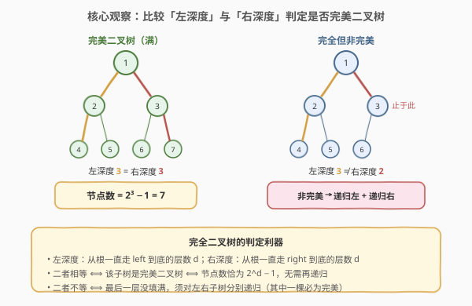
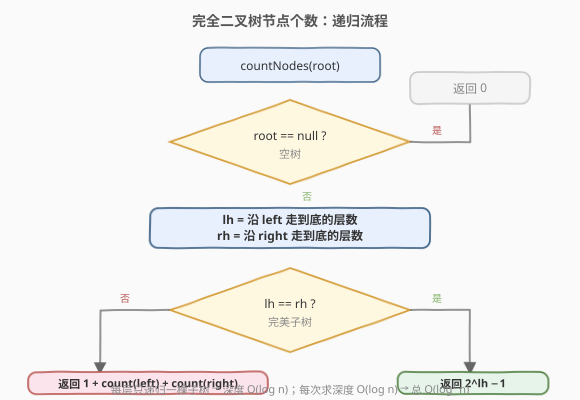
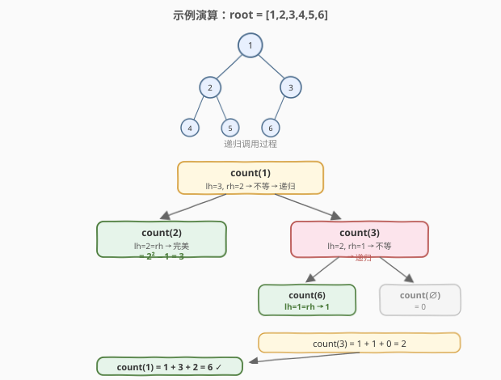

# LeetCode 完全二叉树的节点个数 题解

## 1. 题目概述

- **标题 / 题号**：完全二叉树的节点个数（#222，easy）
- **链接**：https://leetcode.cn/problems/count-complete-tree-nodes/
- **难度**：简单
- **标签**：树、二叉树、完全二叉树、二分查找、递归

**题意**：给你一棵**完全二叉树**的根节点 `root`，求出该树的节点个数。

> **完全二叉树**的定义：除了最后一层外，每一层都被完全填满；且最后一层的所有节点都尽可能靠左排列。

**示例 1**：

```text
输入：root = [1,2,3,4,5,6]
输出：6
解释：树结构如下，共 6 个节点。
        1
       / \
      2   3
     / \  /
    4  5 6
```

**示例 2**：

```text
输入：root = []
输出：0
```

**示例 3**：

```text
输入：root = [1]
输出：1
```

**约束**：

- 树中节点数目范围 `[0, 5 * 10^4]`
- `0 <= Node.val <= 5 * 10^4`
- 题目保证输入是一棵**完全二叉树**

**进阶**：遍历树来统计节点是一种时间复杂度为 `O(n)` 的简单做法。能否设计一个低于 `O(n)` 的算法？

## 2. 解题思路

### 2.1 暴力思路：遍历计数

用 DFS 或 BFS 遍历整棵树，每个节点访问一次，计数器 `+1`。时间复杂度 `O(n)`，空间复杂度 `O(h)`（递归栈）。

这能 AC，但**没有利用完全二叉树的性质**。题目进阶要求低于 `O(n)`，必须另寻突破口。

### 2.2 核心观察：左深度 vs 右深度判定完美子树



完全二叉树的关键性质：**从任意节点出发，沿 `left` 指针走到底的深度（左深度 `lh`）与沿 `right` 指针走到底的深度（右深度 `rh`）有明确关系**。

> 💡 对于以 `root` 为根的子树：
> - 若 `lh == rh`，则这棵子树是一棵**完美二叉树**（每一层都填满），节点数恰为 $2^{lh} - 1$，**无需递归**。
> - 若 `lh != rh`，则最后一层没填满，需对左右子树**分别递归**——而其中必有一棵是完美子树，递归会很快收敛。

为什么递归只会深入一棵子树？因为完全二叉树最后一层的节点**靠左排列**：左子树要么完美（最后一层填满），要么继续非完美；而右子树在左子树非完美时**必定完美**（高度少一层且被填满）。所以每一层递归实际只深入一侧，递归深度为 $O(\log n)$。

每层递归求一次深度需 $O(\log n)$，总时间复杂度 $O(\log^2 n)$，远低于 $O(n)$。

### 2.3 算法流程图



### 2.4 示例演算

以 `root = [1,2,3,4,5,6]` 为例：



递归过程：

| 调用 | 左深度 `lh` | 右深度 `rh` | 判定 | 结果 |
|------|------------|------------|------|------|
| `count(1)` | 3（1→2→4） | 2（1→3） | 不等 → 递归 | $1 + \text{count}(2) + \text{count}(3)$ |
| `count(2)` | 2（2→4） | 2（2→5） | 相等 → 完美 | $2^2 - 1 = 3$ |
| `count(3)` | 2（3→6） | 1（3） | 不等 → 递归 | $1 + \text{count}(6) + \text{count}(\text{null})$ |
| `count(6)` | 1 | 1 | 相等 → 完美 | $2^1 - 1 = 1$ |
| `count(null)` | — | — | 空树 | 0 |

回溯：`count(3) = 1 + 1 + 0 = 2`，`count(1) = 1 + 3 + 2 = 6`。✓

## 3. 参考代码

### C++

```cpp
class Solution {
  public:
    int countNodes(TreeNode* root) {
        if (root == nullptr) return 0;

        int lh = leftDepth(root);
        int rh = rightDepth(root);

        if (lh == rh) {
            return (1 << lh) - 1;
        }
        return 1 + countNodes(root->left) + countNodes(root->right);
    }

  private:
    int leftDepth(TreeNode* node) {
        int d = 0;
        while (node) {
            d++;
            node = node->left;
        }
        return d;
    }

    int rightDepth(TreeNode* node) {
        int d = 0;
        while (node) {
            d++;
            node = node->right;
        }
        return d;
    }
};
```

### Python

```python
class Solution:
    def countNodes(self, root: Optional[TreeNode]) -> int:
        if not root:
            return 0

        lh = self._left_depth(root)
        rh = self._right_depth(root)

        if lh == rh:
            return (1 << lh) - 1
        return 1 + self.countNodes(root.left) + self.countNodes(root.right)

    def _left_depth(self, node: Optional[TreeNode]) -> int:
        d = 0
        while node:
            d += 1
            node = node.left
        return d

    def _right_depth(self, node: Optional[TreeNode]) -> int:
        d = 0
        while node:
            d += 1
            node = node.right
        return d
```

> 💡 `(1 << lh) - 1` 等价于 $2^{lh} - 1$。注意 `lh` 是**层数**（含根节点），单节点 `lh = 1` → $2^1 - 1 = 1$，与公式一致。

## 4. 复杂度分析

| 维度 | 复杂度 | 说明 |
|------|--------|------|
| 时间复杂度 | $O(\log^2 n)$ | 递归深度 $O(\log n)$，每层求深度 $O(\log n)$ |
| 空间复杂度 | $O(\log n)$ | 递归调用栈深度等于树高；完全二叉树高 $O(\log n)$ |

> ⚠️ 暴力遍历计数为 $O(n)$，本题解利用完全二叉树性质优化到 $O(\log^2 n)$，是进阶要求的标准解法。

## 5. 扩展：二分查找 + 位运算

完全二叉树最后一层节点编号是**连续**的，因此可以用二分查找判断某个位置是否存在节点，时间复杂度同样为 $O(\log^2 n)$。

思路：
1. 设树高 `h`（根为第 1 层），则前 `h - 1` 层共有 $2^{h-1} - 1$ 个节点；最后一层节点数范围为 `[1, 2^(h-1)]`（根非空时）。
2. 在 `[0, 2^(h-1) - 1]` 上二分最后一层的「从左到右的序号」，用**位运算**判断该序号对应的节点是否存在：从根出发，序号的每一位 `0` 走左、`1` 走右（跳过最高位后的 `h-1` 位）。
3. 找到最后一个存在节点的序号 `idx`，答案为 $2^{h-1} - 1 + \text{idx} + 1$。

```cpp
class Solution {
  public:
    int countNodes(TreeNode* root) {
        if (!root) return 0;
        int h = 0;
        for (TreeNode* p = root; p; p = p->left) h++;
        int lo = 0, hi = (1 << (h - 1)) - 1;
        while (lo <= hi) {
            int mid = lo + (hi - lo) / 2;
            if (exists(root, h, mid)) lo = mid + 1;
            else hi = mid - 1;
        }
        return (1 << (h - 1)) - 1 + lo;
    }

  private:
    bool exists(TreeNode* root, int h, int idx) {
        TreeNode* p = root;
        for (int bit = (1 << (h - 2)); bit && p; bit >>= 1)
            p = (idx & bit) ? p->right : p->left;
        return p != nullptr;
    }
};
```

> 💡 两种方法时间复杂度都是 $O(\log^2 n)$。左/右深度法更直观、代码更短，是面试首选；二分 + 位运算法展示对完全二叉树编号的深刻理解，可作为加分项。

## 6. 面试要点

1. **为什么比较左深度和右深度能判定完美子树？**
   - 完全二叉树从根出发，左指针走到底和右指针走到底的深度若相等，说明最后一层也被填满（无缺位），即完美二叉树；否则最后一层靠左排列、右侧有缺，是非完美的完全二叉树。

2. **时间复杂度为什么是 $O(\log^2 n)$ 而不是 $O(n)$？**
   - 递归深度 $O(\log n)$（完全二叉树高 $O(\log n)$），且每次递归实际只深入一棵子树；每层调用求左右深度各 $O(\log n)$，故总 $O(\log^2 n)$。

3. **`lh` 和 `rh` 为什么用循环求而不是递归？**
   - 完全二叉树沿 `left`/`right` 走到底的路径是一条直链，循环 $O(\log n)$ 即可，无需递归；且避免了重复计算。若用普通递归求高度会退化成 $O(n)$，失去优化意义。

4. **题目保证是完全二叉树，这个前提能去掉吗？**
   - 不能。本算法依赖「最后一层靠左排列」的性质。对普通二叉树，左/右深度相等不能推出完美（如左子树某层缺右、右子树补齐的情形），只能退回 $O(n)$ 遍历计数。

5. **`lh == rh` 时返回 `(1 << lh) - 1`，这里的 `lh` 是层数还是边数？**
   - 是**层数**（节点数意义上的高度，单节点 `lh = 1`）。深度为 `d` 层的完美二叉树节点数为 $2^d - 1$。若把 `lh` 定义成边数，则公式相应变为 $2^{lh+1} - 1$，需保持一致。

## 同类练习题

| # | 题目 | 与本题的关联 |
|---|------|-------------|
| 104 | [二叉树的最大深度](https://leetcode.cn/problems/maximum-depth-of-binary-tree/) | 求树高的递归骨架，本题求深度的循环基础 |
| 110 | [平衡二叉树](https://leetcode.cn/problems/balanced-binary-tree/) | 自底向上求高度，体会「高度」定义的细节 |
| 958 | [二叉树的完全性检验](https://leetcode.cn/problems/check-completeness-of-a-binary-tree/) | 用层序遍历判定一棵树是否完全，与本题「完全」定义呼应 |
| 662 | [二叉树最大宽度](https://leetcode.cn/problems/maximum-width-of-binary-tree/) | 完全二叉树编号思想（左孩子 `2*i`、右孩子 `2*i+1`）的应用 |
