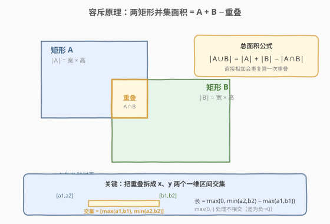
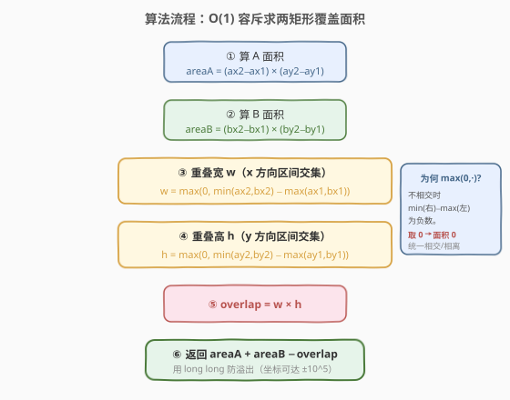
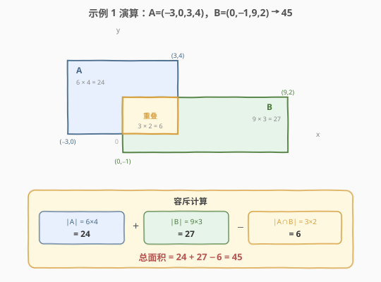

# 矩形面积

- **题目名称**：矩形面积
- **链接**：[223. 矩形面积](https://leetcode.cn/problems/rectangle-area/)
- **难度**：中等
- **标签**：几何、数学

## 1. 题目概述

给你**两个轴对齐的矩形**在二维平面上的坐标，每个矩形用其**左下角**与**右上角**两点表示，即矩形 A 为 `(ax1, ay1, ax2, ay2)`、矩形 B 为 `(bx1, by1, bx2, by2)`。请计算这两个矩形**覆盖到的总面积**。

> ⚠️ 两个矩形可能**重叠**，重叠部分只能算一次；坐标允许为负；矩形保证 `x1 < x2`、`y1 < y2`。

**示例 1**：

```text
输入：ax1 = -3, ay1 = 0, ax2 = 3, ay2 = 4
     bx1 = 0,  by1 = -1, bx2 = 9, by2 = 2
输出：45
解释：A 面积 = 6×4 = 24，B 面积 = 9×3 = 27，重叠 = 3×2 = 6，合计 24+27−6 = 45。
```

**示例 2**：

```text
输入：ax1 = -2, ay1 = -2, ax2 = 2, ay2 = 2
     bx1 = -2, by1 = -2, bx2 = 2, by2 = 2
输出：16
解释：两矩形完全重合，总面积即单个矩形面积 4×4 = 16。
```

**示例 3**：

```text
输入：ax1 = -2, ay1 = -2, ax2 = 2, ay2 = 2
     bx1 = 3,  by1 = 3,  bx2 = 4,  by2 = 4
输出：17
解释：两矩形互不重叠，总面积 = 16 + 1 = 17。
```

**约束条件**：

- $-10^5 \le ax1 \le ax2 \le 10^5$
- $-10^5 \le ay1 \le ay2 \le 10^5$
- $-10^5 \le bx1 \le bx2 \le 10^5$
- $-10^5 \le by1 \le by2 \le 10^5$

> ⚠️ 单个矩形最大面积可达 $(2\times10^5)^2 = 4\times10^{10}$，两矩形面积和可达 $8\times10^{10}$，**超过 32 位 int 上界**（约 $2.1\times10^9$）。C++ 必须用 `long long`，Python 整数天然任意精度无此问题。

> 💡 本题是 [836. 矩形重叠](https://leetcode.cn/problems/rectangle-overlap/)（只判是否相交）的进阶——不仅判相交，还要把**相交区域的面积**算出来。思路一致，区别仅在「判定」与「度量」。

---

## 2. 解题思路

### 2.1 暴力思路

一种过度设计的做法是**扫描线 / 离散化网格**：把所有 x 坐标、y 坐标排序去重，将平面切成若干小格子，逐格判断是否被任一矩形覆盖再累加面积。

- 对**两个**矩形来说，这是杀鸡用牛刀：逻辑繁琐、边界条件多，还引入不必要的排序与区间维护。
- 坐标范围 $\pm10^5$，朴素网格法 $O(\text{range}^2)$ 直接不可行；即便离散化也只有少量区间，仍是杀鸡用牛刀。
- 真正的扫描线法要到「**多个**矩形求并集面积」（如 [850. 矩形面积 II](https://leetcode.cn/problems/rectangle-area-ii/)）才显出价值——那里才需要线段树维护区间被覆盖长度。本题只有两个矩形，**容斥一行公式**即可。

### 2.2 核心观察：容斥原理 + 重叠仍是矩形



两个集合的并集大小满足**容斥原理**：

$$
|A \cup B| = |A| + |B| - |A \cap B|
$$

直接 `|A| + |B|` 会把**重叠部分算了两次**，减去一次重叠即得真实覆盖面积。关键在于两步：

1. **轴对齐矩形的交集仍是一个轴对齐矩形**（若相交）。所以 $|A \cap B|$ 仍是「宽 × 高」。
2. **把交集矩形拆成 x、y 两个独立的一维区间交集**。一维上两个区间 $[a_1, a_2]$ 与 $[b_1, b_2]$ 的交集为：

$$
[a_1, a_2] \cap [b_1, b_2] = \big[\max(a_1, b_1),\ \min(a_2, b_2)\big]
$$

其长度为：

$$
\text{overlap}_x = \min(a_2, b_2) - \max(a_1, b_1)
$$

- 若区间**相交**，右端取两右端的较小者、左端取两左端的较大者，差为正，即重叠长度。
- 若区间**不相交**（一个完全在另一个左侧），则 $\min(a_2,b_2) < \max(a_1,b_1)$，差为负。

为统一处理「相交 / 不相交」两种情况，外层套一个 $\max(0, \cdot)$：差为负时取 0，意味着该方向无重叠。

$$
w = \max\big(0,\ \min(ax_2, bx_2) - \max(ax_1, bx_1)\big)
$$
$$
h = \max\big(0,\ \min(ay_2, by_2) - \max(ay_1, by_1)\big)
$$

$$
|A \cap B| = w \times h
$$

> 💡 **为何 x、y 可独立处理？** 因为轴对齐矩形的相交条件是「x 方向区间相交 **且** y 方向区间相交」。两个方向独立求交集长度，只要其中一方不相交（长度为 0），乘积即为 0，整体重叠面积自然归 0——这正是一维套 $\max(0,\cdot)$ 的妙处：把「是否相交」的判定**隐式地吸收**到「面积为 0」里，无需单独 if 分支。

> ⚠️ 注意 `[a1,a2]` 是**闭区间**还是半开区间不影响结论：本题坐标是整数点但矩形是连续区域，公式 $\min(\text{右}) - \max(\text{左})$ 给出的就是重叠的几何长度，与端点归属无关。

### 2.3 算法流程图



维护变量：

- `areaA`、`areaB`：两矩形各自面积；
- `w`、`h`：重叠矩形的宽与高；
- `overlap`：重叠面积 $= w \times h$。

**主流程**：

1. `areaA = (ax2 - ax1) * (ay2 - ay1)`。
2. `areaB = (bx2 - bx1) * (by2 - by1)`。
3. `w = max(0, min(ax2, bx2) - max(ax1, bx1))`。
4. `h = max(0, min(ay2, by2) - max(ay1, by1))`。
5. `overlap = w * h`。
6. 返回 `areaA + areaB - overlap`。

> 💡 全程常数次算术运算，**时间 $O(1)$、空间 $O(1)$**——几何题应有的味道。

### 2.4 示例演算

以示例 1 为例，在坐标平面上画出两矩形与重叠区：



逐项套公式：

| 项 | 计算 | 结果 |
|----|------|------|
| `areaA` | $(3 - (-3)) \times (4 - 0) = 6 \times 4$ | 24 |
| `areaB` | $(9 - 0) \times (2 - (-1)) = 9 \times 3$ | 27 |
| `w` | $\max(0, \min(3,9) - \max(-3,0)) = \max(0, 3 - 0)$ | 3 |
| `h` | $\max(0, \min(4,2) - \max(0,-1)) = \max(0, 2 - 0)$ | 2 |
| `overlap` | $3 \times 2$ | 6 |
| **总面积** | $24 + 27 - 6$ | **45** |

注意 x 方向：A 的右端 `ax2=3` 小于 B 的右端 `bx2=9`，故重叠右界取 `3`；A 的左端 `ax1=-3` 小于 B 的左端 `bx1=0`，故重叠左界取 `0`。y 方向同理：下界取 `max(0, -1)=0`、上界取 `min(4, 2)=2`。这正体现了「**交集的左端是两左端的较大者，右端是两右端的较小者**」。

再看示例 3（不相交）：x 方向 $\min(ax_2, bx_2) = \min(2, 4) = 2$，$\max(ax_1, bx_1) = \max(-2, 3) = 3$，差为 $2 - 3 = -1$，被 $\max(0, \cdot)$ 截为 0，故 $w = 0$、`overlap = 0`，总面积 $= 16 + 1 - 0 = 17$。**一个分支都不用写**，不相交自然归 0。

---

## 3. 参考代码

### C++

```cpp
class Solution {
  public:
    int computeArea(int ax1, int ay1, int ax2, int ay2,
                    int bx1, int by1, int bx2, int by2) {
        long long areaA = (long long)(ax2 - ax1) * (ay2 - ay1);
        long long areaB = (long long)(bx2 - bx1) * (by2 - by1);
        long long w = max(0LL, (long long)min(ax2, bx2) - max(ax1, bx1));
        long long h = max(0LL, (long long)min(ay2, by2) - max(ay1, by1));
        long long overlap = w * h;
        return (int)(areaA + areaB - overlap);
    }
};
```

> ⚠️ **溢出细节**：`(ax2 - ax1)` 在 `int` 范围内（差最大 $2\times10^5$），但**两个 int 相乘**会在 `int` 域溢出，故先转 `long long` 再相乘。`min/max` 的比较也可在 `int` 域完成后再转，但为统一安全，下面给出一个更紧凑的写法：用 `long long` 容器装下所有中间量。

### C++（紧凑版）

```cpp
class Solution {
  public:
    int computeArea(int ax1, int ay1, int ax2, int ay2,
                    int bx1, int by1, int bx2, int by2) {
        long long ax1l = ax1, ay1l = ay1, ax2l = ax2, ay2l = ay2;
        long long bx1l = bx1, by1l = by1, bx2l = bx2, by2l = by2;
        long long areaA = (ax2l - ax1l) * (ay2l - ay1l);
        long long areaB = (bx2l - bx1l) * (by2l - by1l);
        long long w = max(0LL, min(ax2l, bx2l) - max(ax1l, bx1l));
        long long h = max(0LL, min(ay2l, by2l) - max(ay1l, by1l));
        return (int)(areaA + areaB - w * h);
    }
};
```

### Python

```python
class Solution:
    def computeArea(self,
                    ax1: int, ay1: int, ax2: int, ay2: int,
                    bx1: int, by1: int, bx2: int, by2: int) -> int:
        area_a = (ax2 - ax1) * (ay2 - ay1)
        area_b = (bx2 - bx1) * (by2 - by1)
        w = max(0, min(ax2, bx2) - max(ax1, bx1))
        h = max(0, min(ay2, by2) - max(ay1, by1))
        return area_a + area_b - w * h
```

---

## 4. 复杂度分析

| 维度 | 复杂度 | 说明 |
|------|--------|------|
| 时间复杂度 | $O(1)$ | 仅常数次加减乘与 min/max 比较 |
| 空间复杂度 | $O(1)$ | 只用几个标量变量 |

---

## 5. 扩展：多矩形并集面积与扫描线

本题只有**两个**矩形，容斥一行公式足矣。但若矩形数量增加到 $n$ 个（如 [850. 矩形面积 II](https://leetcode.cn/problems/rectangle-area-ii/)），容斥的项数随 $n$ 指数增长（$2^n$ 个子集交并交替求和），不再可行。通解是**扫描线 + 线段树**：

1. 把所有矩形的左右竖边作为「事件」`(x, type, y1, y2)`，按 `x` 排序；
2. 用线段树维护当前 `y` 方向上**被覆盖的总长度**；
3. 相邻两个事件 `x_i, x_{i+1}` 之间的贡献面积 $= \text{覆盖长度} \times (x_{i+1} - x_i)$；
4. 累加所有相邻区间的贡献。

> 💡 **从 2 个到 n 个**：$n=2$ 时容斥最简；$n$ 大时扫描线是标准武器。本题正是理解「为何两个矩形用容斥、多个矩形用扫描线」这一分界线的最佳入口。

**另一变体——只判相交不求面积**：[836. 矩形重叠](https://leetcode.cn/problems/rectangle-overlap/) 只问是否相交，等价于检查 $w > 0$ 且 $h > 0$（注意 836 的矩形用 `[x1,y1,x2,y2]` 但要求**正面积**且排除边界相切）。把本题的 $w, h$ 拿来判正即可，是同一公式的退化应用。

---

## 6. 面试要点

1. **为什么用容斥而不是直接求并集区域？**
   - 两个轴对齐矩形的交集仍是矩形，面积可由 x、y 两个一维区间交集直接给出，容斥 $|A|+|B|-|A\cap B|$ 把「求并」转化为「求交」，避免了去构造并集这个可能为非矩形的复杂形状。

2. **一维区间交集公式是怎么来的？**
   - 交集区间的左端是两左端的较大者（最靠右的那个左端才同时属于两个区间），右端是两右端的较小者（最靠左的那个右端才同时属于两个区间）。差即为长度。若左端 ≥ 右端则不相交，长度 ≤ 0。

3. **`max(0, ...)` 的作用是什么？**
   - 把「不相交时差为负」统一归零，从而**合并相交与相离两种情况**为同一条计算路径，省去 if 分支。它本质是把「相交判定」吸收进了「面积为 0」。

4. **为什么要用 `long long`？**
   - 坐标可达 $\pm10^5$，单矩形面积可达 $4\times10^{10}$，两面积和可达 $8\times10^{10}$，超过 32 位 int 上界 $2.1\times10^9$。两个 `int` 相乘在赋给 `long long` 之前就已发生溢出，故需在**相乘前**把操作数转为 `long long`。Python 整数无此问题。

5. **x、y 两个方向为什么可以独立处理？**
   - 轴对齐矩形的相交条件是「x 方向区间相交 **且** y 方向区间相交」，二者解耦。任一方向长度为 0，乘积即 0，整体重叠归 0——无需单独的「是否相交」判断。

---

## 7. 同类练习题

- [836. 矩形重叠](https://leetcode.cn/problems/rectangle-overlap/)：只判是否相交，等价于本题 $w>0$ 且 $h>0$，公式的退化应用，建议先做
- [850. 矩形面积 II](https://leetcode.cn/problems/rectangle-area-ii/)：多个矩形求并集面积，扫描线 + 线段树，是本题从 $n=2$ 推广到 $n$ 个的进阶
- [939. 最小面积矩形](https://leetcode.cn/problems/minimum-area-rectangle/)：给定点集找能构成面积最小轴对齐矩形，哈希 + 枚举对角点，几何枚举思路
- [1401. 圆和矩形是否有重叠](https://leetcode.cn/problems/circle-and-rectangle-overlapping/)：把「矩形 vs 矩形」升级为「圆 vs 矩形」的相交判定，最近距离思想
- [223. 矩形面积](https://leetcode.cn/problems/rectangle-area/)：本题，容斥 + 一维区间交集模板
