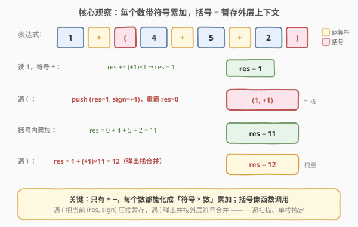
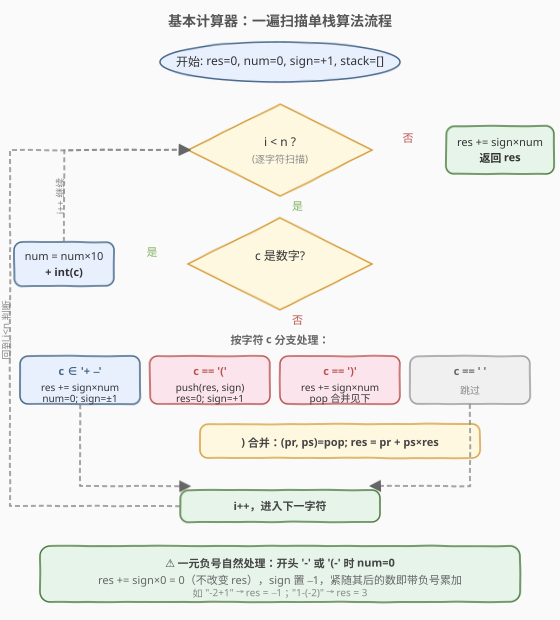
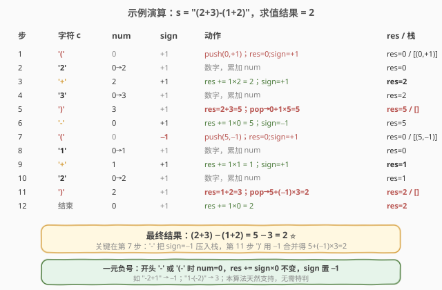

# LeetCode 基本计算器 题解

## 1. 题目概述

- **标题 / 题号**：基本计算器（#224，hard）
- **链接**：https://leetcode.cn/problems/basic-calculator/
- **难度**：困难
- **标签**：栈、字符串、数学、递归

**题意**：给定一个字符串表达式 `s`，包含**非负整数**、运算符 `+`、`-`、括号 `(`、`)` 以及若干空格。求表达式的值。

- `s` 至少有一个有效字符，保证表达式合法。
- 运算符只有 `+` 和 `-`，**没有** `*` `/`。
- 出现的括号一定匹配；可能出现一元负号（如 `-2+1`、`1-(-2)`）。
- 中间结果与最终结果都在 32 位整数范围内。

**示例 1**：

```text
输入：s = "1 + 1"
输出：2
```

**示例 2**：

```text
输入：s = " 2-1 + 2 "
输出：3
```

**示例 3**：

```text
输入：s = "(1+(4+5+2)-3)+(6+8)"
输出：23
解释：(1 + (11) - 3) + (14) = 9 + 14 = 23。
```

**约束**：

- `1 <= s.length <= 3 * 10^5`
- `s` 由数字、`'+'`、`'-'`、`'('`、`')'`、`' '` 组成
- `' '` 只作分隔，不参与运算

> 💡 本题**只有 `+ -` 和括号**，没有乘除，因此不需要优先级表。难点全在「括号嵌套」和「一元负号」上。一旦加上 `* /`（227、772），就要在带符号入栈的基础上再叠一个「立即结合」。

## 2. 解题思路

### 2.1 暴力思路

两种常规做法都可行，但都偏繁琐：

1. **递归**：遇到 `'('` 就找到匹配的 `')'`，对中间子串递归求值；遇到 `')'` 就返回当前层结果。本质是把括号当函数调用。需要额外维护括号匹配位置或用全局下标，写起来易错。
2. **双栈**：操作数栈 + 运算符栈，遇到 `')'` 一直归约到 `'('`。配合一张优先级表能统一处理 `+ - * / ( )`，但本题没有 `* /`，优先级表是杀鸡用牛刀。

其实只含 `+ -` 时，所有运算符**同优先级**，可以更优雅地用**单栈 + 符号变量**一遍扫完。

### 2.2 核心观察：每个数带符号累加，括号 = 暂存外层上下文



关键直觉有两点：

**① 只有 `+ -`，每个数都能化成「符号 × 数」累加进 `res`。**

维护一个 `sign`（取值 `+1` 或 `−1`），表示**下一个数**该加还是该减。每当读到一个运算符（或括号、串尾）时，前一个数 `num` 已经读完整，就执行：

$$\text{res} \mathrel{+}= \text{sign} \times \text{num}$$

- 读到 `'+'` → `sign = +1`
- 读到 `'-'` → `sign = −1`

**② 括号内是一个子表达式，用栈保存「进入括号前的现场」`(res, sign)`，遇到 `')'` 再合并。**

把 `'('` 看作函数调用：进入前把当前的 `(res, sign)` 压栈，然后 `res=0, sign=+1` 在括号内「重新开始」算；遇到 `')'` 时，括号内的值已经算完（记得先 `res += sign * num` 落地最后一个数），再弹出栈顶 `(prev\_res, prev\_sign)`，按外层符号合并：

$$\text{res} = \text{prev\_res} + \text{prev\_sign} \times \text{res}$$

> 为什么这样能处理嵌套？因为栈天然记录了每一层的现场。例如 `(1+(4+5+2)-3)`：外层 `'('` 压 `(0,+1)`，读到 `1+` 后遇到内层 `'('` 再压 `(1,+1)`；内层算出 `11`，遇 `')'` 弹 `(1,+1)` 合并得 `1+1×11=12`；继续 `-3` 后遇外层 `')'` 弹 `(0,+1)` 合并得 `0+1×9=9`。

> ⚠️ **一元负号怎么处理？** 开头 `'-'` 或 `'(-'` 时，`num=0`，执行 `res += sign×0 = 0`（`res` 不变），然后 `sign` 被置为 `−1`，紧随其后的数就带负号累加。例如 `-2+1`：`'-'` → `res += 1×0=0, sign=−1`；`2` → `num=2`；`'+'` → `res += −1×2 = −2, sign=+1`；`1` → `num=1`；结束 `res += 1×1 = −1`。**无需任何特判**。

### 2.3 算法流程图



整体只有一重循环，每个字符处理 `O(1)`，总复杂度 `O(n)`。

> ⚠️ **三个易错点**：
> 1. **数字可能多位**：边读边 `num = num * 10 + int(c)` 累加。
> 2. **最后一个数字没有后继运算符**：循环结束后必须补做一次 `res += sign * num`，否则末尾的数会被漏掉（如 `"2-1 + 2 "` 的最后一个 `2`）。
> 3. **`')'` 内要先落地再合并**：遇 `')'` 时不能直接弹栈合并，要先 `res += sign * num` 把括号内最后一个数算进去，再弹 `(prev_res, prev_sign)` 合并；同时把 `num` 清零，避免重复累加。

### 2.4 示例演算



逐步跟踪 `s = "(2+3)-(1+2)"`，重点看第 7 步 `'('` 把 `sign=−1` 压入栈，以及第 11 步 `')'` 用 `−1` 合并得到 `5 + (−1)×3 = 2`：

- `'('`：`push(0,+1)`；`res=0, sign=+1`，栈 `[(0,+1)]`
- `'2'`：`num=2`
- `'+'`：`res += 1×2 = 2`；`sign=+1`
- `'3'`：`num=3`
- `')'`：`res = 2+3 = 5`；`pop(0,+1)` → `res = 0 + 1×5 = 5`，栈 `[]`
- `'-'`：`res += 1×0 = 5`；`sign=−1`
- `'('`：`push(5,−1)`；`res=0, sign=+1`，栈 `[(5,−1)]`
- `'1'`：`num=1`
- `'+'`：`res += 1×1 = 1`；`sign=+1`
- `'2'`：`num=2`
- `')'`：`res = 1+2 = 3`；`pop(5,−1)` → `res = 5 + (−1)×3 = 2`，栈 `[]`
- 串尾：`res += 1×0 = 2`

最终结果 `2`。

## 3. 参考代码

### C++

```cpp
class Solution {
  public:
    int calculate(string s) {
        stack<pair<long long, int>> st;  // (prev_res, prev_sign)
        long long res = 0;
        long long num = 0;
        int sign = 1;
        for (char c : s) {
            if (isdigit(c)) {
                num = num * 10 + (c - '0');
            } else if (c == '+' || c == '-') {
                res += sign * num;
                num = 0;
                sign = (c == '+') ? 1 : -1;
            } else if (c == '(') {
                st.push({res, sign});
                res = 0;
                sign = 1;
            } else if (c == ')') {
                res += sign * num;
                num = 0;
                auto [prev_res, prev_sign] = st.top();
                st.pop();
                res = prev_res + prev_sign * res;
            }
            // 空格直接跳过
        }
        res += sign * num;  // 落地最后一个数
        return (int)res;
    }
};
```

### Python

```python
class Solution:
    def calculate(self, s: str) -> int:
        stack = []  # 存 (prev_res, prev_sign)
        res = 0
        num = 0
        sign = 1
        for c in s:
            if c.isdigit():
                num = num * 10 + int(c)
            elif c in "+-":
                res += sign * num
                num = 0
                sign = 1 if c == "+" else -1
            elif c == "(":
                stack.append((res, sign))
                res = 0
                sign = 1
            elif c == ")":
                res += sign * num
                num = 0
                prev_res, prev_sign = stack.pop()
                res = prev_res + prev_sign * res
            # 空格直接跳过
        res += sign * num  # 落地最后一个数
        return res
```

> 💡 **为什么 C++ 用 `long long`？** 题目保证最终结果在 32 位范围内，但中途 `res` 可能短暂超出（如累加多个大数后再减），用 `long long` 累加、最后再转 `int` 返回更稳妥，避免溢出踩坑。Python 整数任意精度，无需担心。

> ⚠️ **结构化绑定 `auto [a, b] = ...`** 需要 C++17。若编译环境为 C++11/14，改成 `auto p = st.top(); st.pop(); res = p.first + p.second * res;`。

## 4. 复杂度分析

| 维度 | 复杂度 | 说明 |
|------|--------|------|
| 时间复杂度 | O(n) | 每个字符处理一次 `O(1)`；栈操作均摊 `O(1)` |
| 空间复杂度 | O(n) | 栈深度等于括号嵌套层数，最坏 `O(n)`（如 `((((...))))`） |

## 5. 扩展：加上 `* /` 怎么办（227 / 772）

一旦出现 `* /`，运算符有了两级优先级，单靠「符号变量」就不够了。两种进阶做法：

1. **双栈 + 优先级表**：操作数栈 + 运算符栈，扫到运算符时，只要栈顶运算符优先级 ≥ 当前运算符，就先归约栈顶。`(` 入运算符栈、`)` 归约到 `(`。一张 `{+:-, *:*, /:/, (}` 的优先级表统一处理。适合 `+ - * / ( )` 全功能（772 基本计算器 III）。
2. **「带符号入栈 + 立即结合」**（[227. 基本计算器 II](../0201-0300/227_基本计算器II.md) 的做法）：维护 `preOp`，遇 `+ -` 把数带符号压栈，遇 `* /` 立即与栈顶结合；括号则用本题的递归/单栈思路套在外面。

> 本题的「括号暂存上下文」是基础：227 把 `* /` 叠加在「带符号入栈」上；772 则是 224（括号）+ 227（乘除）的合体。掌握本题，再加上 227 的「立即结合」，就能覆盖整族计算器题。

## 6. 面试要点

1. **为什么用单栈存 `(res, sign)` 而不是双栈存操作数和运算符？**

   - 本题只有 `+ -`，同优先级，不需要运算符栈做优先级比较。把每个数化成「符号 × 数」累加进 `res`，运算符信息已被 `sign` 吸收；唯一需要「记」的是括号层级处的 `res` 和 `sign`，一个栈存元组即可。比双栈 + 优先级表更短、更不容易写错。

2. **括号嵌套时，栈里存的是什么？为什么弹栈合并是 `prev_res + prev_sign * res`？**

   - 存的是「进入 `(` 之前的现场」：外层已累加的结果 `prev_res`，以及**这个括号整体该带的符号** `prev_sign`（即 `(` 前面那个运算符决定的 `sign`）。括号内算出的 `res` 是括号整体的绝对值，所以合并时按外层符号乘回去再加：`prev_res + prev_sign * res`。这正对应数学上 `a - (b + c) = a - 1×(b+c)`。

3. **一元负号为什么不用特判？**

   - 开头 `'-'` 或 `'(-'` 出现时，`num=0`，执行 `res += sign×0 = 0` 不会污染 `res`，紧接着 `sign` 被置 `−1`，后面的数自然带负号。`1-(-2)` 中内层 `'(-'`：进入括号后 `sign=+1`，遇 `'-'` 把 `sign` 置 `−1`，`2` 累加成 `res = −2`，弹栈时 `prev_sign=−1` 合并得 `1 + (−1)×(−2) = 3`。一元负号被「`sign` 的传递」天然消化。

4. **最后一个数为什么容易漏？**

   - 最后一个数后面没有运算符/括号来触发 `res += sign * num`。所以循环结束后必须补做一次 `res += sign * num`。这是表达式求值类题的通病，227 也有同样问题（227 靠「在串尾补一个 `+`」或循环后补做」解决）。

5. **能把空间优化到 O(1) 吗？**

   - 不能。括号嵌套层数最多 `O(n)`，栈至少要存这么多层现场。不像 227（无括号）可以用 `last` + `ans` 两个变量优化到 `O(1)`，本题的栈是结构性需求。不过实际嵌套深度通常很小，常数因子很低。

## 同类练习题

| # | 题目 | 与本题的关联 |
|---|------|-------------|
| 227 | [基本计算器 II](https://leetcode.cn/problems/basic-calculator-ii/)（[题解](../0201-0300/227_基本计算器II.md)） | 本题去掉括号、加上 `* /`，学「带符号入栈 + 乘除立即结合」 |
| 150 | [逆波兰表达式求值](https://leetcode.cn/problems/evaluate-reverse-polish-notation/) | 后缀表达式直接用栈求值，遇到运算符就 pop 两个数算，是最纯粹的栈求值 |
| 394 | [字符串解码](https://leetcode.cn/problems/decode-string/)（[题解](../0301-0400/394_字符串解码.md)） | 同样用栈处理「延迟落地」的嵌套结构，栈里存的是外层上下文 |
| 20 | [有效的括号](https://leetcode.cn/problems/valid-parentheses/)（[题解](../0001-0100/20_有效括号.md)） | 栈的最基础应用，匹配即消去 |
| 772 | [基本计算器 III](https://leetcode.cn/problems/basic-calculator-iii/) | 本题 + 227 的合体，含 `+ - * / ( )`，用双栈 + 优先级表统一处理 |
