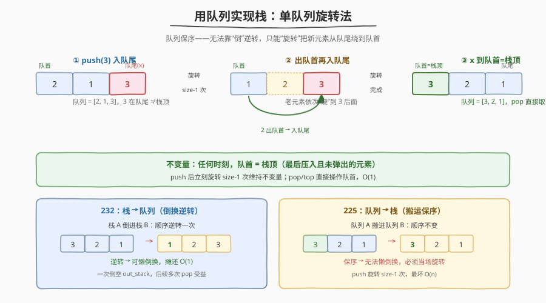
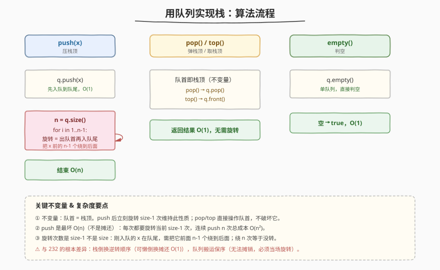
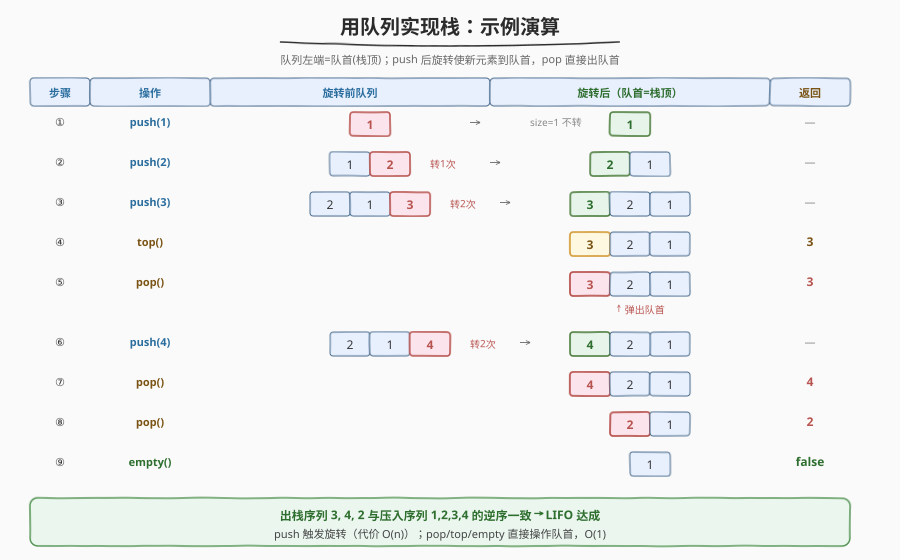

# LeetCode 用队列实现栈 题解

## 1. 题目概述

- **标题 / 题号**：用队列实现栈（#225，easy）
- **链接**：https://leetcode.cn/problems/implement-stack-using-queues/
- **难度**：简单
- **标签**：队列、设计、栈

**题意**：请你仅使用队列实现一个后入先出（LIFO）的栈，并支持普通栈的全部四种操作：

- `MyStack()`：初始化栈
- `void push(int x)`：将元素 x 压入栈顶
- `int pop()`：移除并返回**栈顶**元素
- `int top()`：返回栈顶元素（不移除）
- `boolean empty()`：栈为空返回 `true`，否则 `false`

**说明**：

- 你**只能**使用队列的标准操作（`push to back`、`peek/pop from front`、`size`、`is empty`）。
- 假设所有操作都是合法的（例如对空栈不会调用 `pop` / `top`）。

**示例 1**

```text
输入：
  MyStack myStack = new MyStack();
  myStack.push(1);     // 栈: [1]
  myStack.push(2);     // 栈: [1, 2]
  myStack.top();       // 返回 2
  myStack.pop();       // 返回 2，栈: [1]
  myStack.empty();     // 返回 false
```

**约束**：

- `1 <= x <= 9`
- 最多调用 `100` 次 `push`、`pop`、`top`、`empty`
- 假设所有操作都是合法的

> 💡 本题是 [232. 用栈实现队列](232_用栈实现队列.md) 的**对偶题**：232 用两个 LIFO 拼 FIFO，225 用 FIFO 拼 LIFO。但二者并非对称——栈“倒一次”会**逆转**顺序，队列“倒一次”却**保持**顺序。这一差异决定了 225 无法像 232 那样靠“懒倒换”让所有操作摊还 $O(1)$，必须在 `push` 或 `pop` 之一老老实实付出 $O(n)$。

## 2. 解题思路

### 2.1 暴力思路

用一个队列 `q` 直接存数据：`push(x)` 时 `q.push(x)`，元素依次排在队尾。此时队列里**队首是最早压入的、队尾是最新压入的**——而栈顶恰恰是最新压入的（队尾）。

问题来了：标准队列只能从**队首**出队，取不到队尾。要 `pop()` 栈顶，只能把队尾前面的 $n-1$ 个元素逐个出队再重新入队（绕回队尾），让原来的队尾“转”到队首，最后再出队一次。

```
pop() 暴力：
  for i in 1..n-1:           // 把前 n-1 个绕到后面
      t = q.front(); q.pop()
      q.push(t)
  return q.pop()             // 原队尾现在在队首，出队
```

- `push` $O(1)$，`pop` $O(n)$，`top` 同样 $O(n)$（要绕一遍才能看到队尾）。
- 用一个临时队列暂存前 $n-1$ 个元素也能做到同样效果（两队列版，见第 5 节）。

> ⚠️ 暴力法把代价全堆在 `pop`/`top` 上。而真实栈的典型用法是 `push` 多、`pop`/`top` 频繁且要求快——能否把 $O(n)$ 挪到 `push`，让 `pop`/`top` 变 $O(1)$？

### 2.2 核心观察：单队列 + push 时旋转



关键洞察：**“循环出队再入队”这个动作可以前置到 `push`**。`push(x)` 时先把 `x` 入队到队尾，紧接着把队列里的前 $n-1$ 个元素（`x` 之前的所有元素）依次出队再入队——这一步叫**旋转**。旋转完后，`x` 就从队尾“绕”到了队首，成为新的栈顶。

于是队列始终保持一个不变量：**队首 = 栈顶**（最新压入的元素）。

- `push(x)`：入队 + 旋转 `size-1` 次，$O(n)$。
- `pop()`：直接出队队首，$O(1)$。
- `top()`：直接看队首，$O(1)$。
- `empty()`：判队列空，$O(1)$。

> 💡 **为什么 225 不能像 232 那样摊还 $O(1)$？** 232 的精髓是“栈倒一次逆转顺序”——把 `in_stack` 倒进 `out_stack`，顺序逆转一次，于是 `out_stack` 栈顶变成队首；而且这个“倒”可以**懒触发**，一次倒空后后续多次 `pop` 都受益，成本被摊销。队列没有这个性质：把队列 A 的元素依次出队再入队到队列 B，**顺序完全不变**（FIFO 保序）。所以“倒队列”无法制造逆转，无法用懒倒换摊销成本——必须老老实实在单队列里旋转 $n-1$ 次，把队尾绕到队首。这是两道对偶题最深刻的差异。

### 2.3 算法流程



```
push(x):
    q.push(x)                       // 先入队到队尾
    n = q.size()
    for i in 1..n-1:                // 旋转 n-1 次，把 x 绕到队首
        t = q.front(); q.pop()
        q.push(t)

pop():
    return q.pop()                  // 队首即栈顶，O(1)

top():
    return q.front()                // 只看出队首，O(1)

empty():
    return q.empty()
```

**关键不变量**：任何时刻，队列的**队首元素就是当前栈顶**（最后压入且未被弹出的元素）。`push` 后立刻旋转维持此不变量；`pop` 直接取队首不破坏它。

### 2.4 示例演算



以 `push(1), push(2), push(3), top(), pop(), push(4), pop(), pop(), empty()` 为例（队列左端为队首）：

| 步骤 | 操作 | 旋转前队列 | 旋转后队列（队首=栈顶） | 返回 |
|------|------|------------|--------------------------|------|
| ① | `push(1)` | [1] | [1]（size=1，不转） | — |
| ② | `push(2)` | [1, **2**] | [**2**, 1]（转 1 次） | — |
| ③ | `push(3)` | [2, 1, **3**] | [**3**, 2, 1]（转 2 次） | — |
| ④ | `top()` | [3, 2, 1] | — | **3** |
| ⑤ | `pop()` | [3, 2, 1] | [2, 1] | **3** |
| ⑥ | `push(4)` | [2, 1, **4**] | [**4**, 2, 1]（转 2 次） | — |
| ⑦ | `pop()` | [4, 2, 1] | [2, 1] | **4** |
| ⑧ | `pop()` | [2, 1] | [1] | **2** |
| ⑨ | `empty()` | [1] | — | **false** |

出栈顺序 `3, 4, 2` 与压入顺序 `1, 2, 3, 4` 的逆序一致——LIFO 达成。注意 ②③⑥ 三次旋转：每次 `push` 后队列里元素越多，旋转次数越多（`size-1`），这正是 `push` 为 $O(n)$ 的来源。

> 💡 观察 ⑤：`pop()` 不触发任何旋转，直接出队队首 `3`，$O(1)$。对比暴力法每次 `pop` 都要绕 $n-1$ 次——把旋转前置到 `push` 后，`pop`/`top` 变成纯 $O(1)$，更贴合真实栈“压入慢可忍、弹出必须快”的使用直觉。

## 3. 参考代码

### C++

```cpp
class MyStack {
    queue<int> q;

  public:
    void push(int x) {
        q.push(x);
        int n = q.size();
        for (int i = 1; i < n; i++) {   // 旋转 n-1 次，把 x 绕到队首
            q.push(q.front());
            q.pop();
        }
    }

    int pop() {
        int v = q.front();
        q.pop();
        return v;
    }

    int top() {
        return q.front();
    }

    bool empty() {
        return q.empty();
    }
};
```

### Python

```python
class MyStack:
    def __init__(self):
        self.q = deque()

    def push(self, x: int) -> None:
        self.q.append(x)
        for _ in range(len(self.q) - 1):   # 旋转 n-1 次，把 x 绕到队首
            self.q.append(self.q.popleft())

    def pop(self) -> int:
        return self.q.popleft()

    def top(self) -> int:
        return self.q[0]

    def empty(self) -> bool:
        return not self.q
```

> 💡 旋转次数是 `len(q) - 1` 而非 `len(q)`：刚 `append` 进去的 `x` 在队尾，需要把它前面的 $n-1$ 个元素绕到后面，`x` 才会到队首。绕 $n$ 次等于没转（队列回到原状），是常见 off-by-one 坑。

## 4. 复杂度分析

| 维度 | 复杂度 | 说明 |
|------|--------|------|
| **时间（单次 push）** | $O(n)$ | 入队 $1$ 次 + 旋转 $n-1$ 次（每次出队+入队），$n$ 为压入前栈大小 |
| **时间（单次 pop / top / empty）** | $O(1)$ | 队首即栈顶，直接出队 / 取首 / 判空，无需旋转 |
| **空间** | $O(n)$ | 单队列存 $n$ 个元素，无辅助结构 |

> ⚠️ **与 232 的复杂度对比**（核心）：232 用双栈懒倒换，`push`/`pop`/`peek` 均**摊还** $O(1)$；225 用单队列旋转，`push` 是**最坏** $O(n)$、`pop` 最坏 $O(1)$。差异的根源是数据结构的“逆转”能力：栈倒换逆转顺序（可懒触发摊销），队列倒换保序（无法摊销，必须当场旋转）。所以 225 不存在“全操作摊还 $O(1)$”的方案——无论用单队列还是两队列，$O(n)$ 都躲不掉，只能选择放在 `push` 还是 `pop`。

## 5. 扩展：两队列的两种实现

单队列旋转法已是最简方案（只需一个队列）。若题目要求“必须用两个队列”，下面两种写法等价于把旋转动作拆到不同时机，复杂度与单队列版一致。

### 5.1 两队列：O(n) push / O(1) pop（对应单队列旋转法）

`q1` 始终保持“队首=栈顶”。`push(x)` 时：把 `x` 先放进空的 `q2`，再把 `q1` 里所有元素依次出队入 `q2`（保序搬运），最后交换 `q1`/`q2`。这样 `x` 排在 `q1` 队首，老元素跟在后面。

```cpp
class MyStack {
    queue<int> q1, q2;
  public:
    void push(int x) {
        q2.push(x);
        while (!q1.empty()) { q2.push(q1.front()); q1.pop(); }
        swap(q1, q2);            // q1 队首 = x = 栈顶
    }
    int pop()   { int v = q1.front(); q1.pop(); return v; }
    int top()   { return q1.front(); }
    bool empty(){ return q1.empty(); }
};
```

> 本质与单队列旋转**完全等价**：`q2.push(x)` + 把 `q1` 搬空到 `q2`，就是把“`x` 前的 $n-1$ 个元素绕到 `x` 后面”换了种写法。`swap` 后 `q1` 队首仍是 `x`。

### 5.2 两队列：O(1) push / O(n) pop（对应 2.1 暴力法）

`push(x)` 永远直接入 `q1`，$O(1)$。`pop()` 时把 `q1` 里前 $n-1$ 个元素搬到 `q2`，`q1` 剩下的最后一个（栈顶）出队返回，再 `swap(q1, q2)`。

```cpp
class MyStack {
    queue<int> q1, q2;
  public:
    void push(int x) { q1.push(x); }
    int pop() {
        while (q1.size() > 1) { q2.push(q1.front()); q1.pop(); }
        int v = q1.front(); q1.pop();
        swap(q1, q2);
        return v;
    }
    int top()   { /* 同 pop 但保留最后元素，或先 pop 再 push 回 q1 */ return /* 略 */; }
    bool empty(){ return q1.empty(); }
};
```

> `top()` 在此方案下也需 $O(n)$（要绕一遍才能看到队尾），不如 5.1 优雅。这就是第 2 节选择“把 $O(n)$ 放在 `push`”的原因：让 `pop`/`top` 都 $O(1)$，更符合栈的使用习惯。

## 6. 面试要点

1. **为什么 225 不能像 232 那样做到全操作摊还 O(1)？**

   - 232 靠“栈倒换逆转顺序”实现懒倒栈：一次倒空 `out_stack` 后，后续多次 `pop` 都直接受益，倒栈成本被摊销到 $O(1)$。队列没有逆转能力——把队列 A 的元素依次搬进队列 B，顺序不变。所以“倒队列”无法制造 LIFO，无法用懒触发摊销成本，必须在 `push` 或 `pop` 之一付出 $O(n)$。这是两道对偶题最本质的差异。

2. **单队列旋转法为什么是旋转 `size-1` 次而不是 `size` 次？**

   - `push(x)` 后 `x` 在队尾，前面有 $n-1$ 个老元素。把这 $n-1$ 个元素依次出队再入队（绕到 `x` 后面），`x` 就到了队首。旋转 `size` 次等于把所有元素绕一圈回到原状，`x` 仍在队尾——白做功。常见 off-by-one 坑。

3. **push 是 O(n) 最坏还是摊还？**

   - **最坏** $O(n)$。每次 `push` 都要旋转当前 `size-1` 次，与历史操作无关，没有“攒一次倒栈后续多次受益”的摊销机制。连续 `push` $n$ 次的总成本是 $0+1+2+\dots+(n-1)=O(n^2)$，单次平均 $O(n)$，但这是平均不是摊还——每次 `push` 单独看就是实打实的 $O(n)$ 最坏。

4. **如果面试官要求 push 和 pop 都尽量快，怎么办？**

   - 用队列实现栈的场景下，$O(n)$ 是信息论下界决定的不可避免代价（队列保序，要变 LIFO 必须重排）。只能权衡放在哪：栈典型用法是 `push` 少、`pop`/`top` 多且要求快，所以选“`push` $O(n)$、`pop`/`top` $O(1)$”（本题解法）。若反过来 `push` 极多、`pop` 极少，可选 5.2 的 `push` $O(1)$、`pop` $O(n)$。

5. **能用一个队列实现吗？还是必须两个？**

   - 一个队列足够（本题解法）。LeetCode 官方 Follow-up 也明确说“能否只用一个队列”。两队列版（第 5 节）只是把旋转动作显式拆成两个队列间的搬运，本质等价，空间略大。

## 同类练习题

| # | 题目 | 与本题的关联 |
|---|------|-------------|
| 232 | [用栈实现队列](https://leetcode.cn/problems/implement-queue-using-stacks/)（[题解](232_用栈实现队列.md)） | 本题的对偶题，用两个栈拼队列。对比体会“栈倒换逆转→可摊还 O(1)”与“队列倒换保序→必须 O(n)”的深刻不对称 |
| 155 | [最小栈](https://leetcode.cn/problems/min-stack/)（[题解](../0101-0200/155_最小栈.md)） | 栈设计题，用一个辅助栈维护额外信息（最小值），体会“辅助结构”思想在设计题中的复用 |
| 946 | [验证栈序列](https://leetcode.cn/problems/validate-stack-sequences/)（[题解](../0901-1000/946_验证栈序列.md)） | 用真实栈模拟压栈/弹栈序列合法性，反向体会栈 LIFO 行为 |
| — | [面试题 03.04. 化栈为队](https://leetcode.cn/problems/implement-queue-using-stacks-lcci/) | 与 232 同题，双栈倒换模板；做完 225/232 这对偶题可顺带巩固 |
