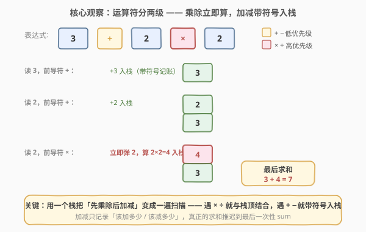
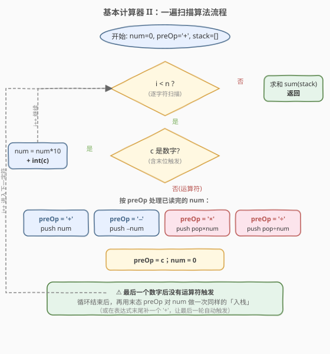
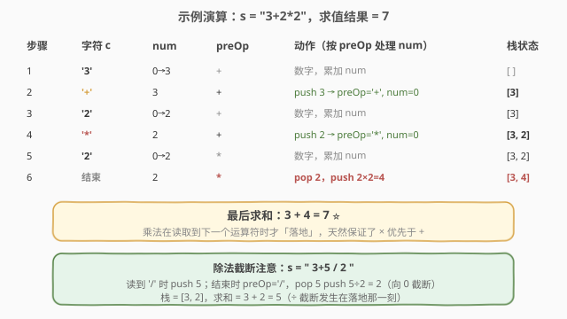

# 基本计算器 II

- **题目名称**：基本计算器 II
- **链接**：[227. 基本计算器 II](https://leetcode.cn/problems/basic-calculator-ii/)
- **难度**：中等
- **标签**：栈、字符串、数学

## 1. 题目概述

给定一个字符串表达式 `s`，包含**非负整数**和运算符 `+`、`-`、`*`、`/`，以及若干空格。求表达式的值。

- **整数除法**只保留**整数部分**（向零截断，即 $\text{trunc}(a/b)$）。
- 保证表达式合法、无负数、无除以零，中间结果在 32 位整数范围内。

**示例 1**：

```text
输入：s = "3+2*2"
输出：7
解释：2*2 先算得 4，3 + 4 = 7。
```

**示例 2**：

```text
输入：s = " 3/2 "
输出：1
解释：3 / 2 向零截断为 1。
```

**示例 3**：

```text
输入：s = " 3+5 / 2 "
输出：5
解释：5 / 2 = 2，3 + 2 = 5。
```

**约束条件**：

- `1 <= s.length <= 3 * 10^5`
- `s` 由数字和 `'+'`、`'-'`、`'*'`、`'/'`、`' '` 组成
- `' '` 只作分隔，不参与运算

> 💡 本题**没有括号**，运算符只有两级优先级（`*` `/` 高于 `+` `-`），这是「一遍扫描 + 一个栈」解法可行的前提。一旦加上括号（224），就要改成递归 / 双栈处理。

---

## 2. 解题思路

### 2.1 暴力思路

用两个栈（操作数栈 + 运算符栈）模拟经典「表达式求值」：扫到运算符时，按优先级决定是否先把栈顶更高或同等优先级的运算符「归约」掉。时间 `O(n)`、空间 `O(n)`，但**双栈 + 优先级表**写起来繁琐、易错。本题没有括号，可以更简单。

### 2.2 核心观察：运算符分两级 —— 乘除立即算，加减带符号入栈



关键直觉是**用一个栈消除优先级差异**：让 `*` `/` 在读取到下一个运算符时**立刻与栈顶结合**，而 `+` `-` 只把数字**带符号压栈**，真正的加减推迟到最后一轮 `sum(stack)`。

具体地，维护当前正在读的数字 `num` 和**它的前导运算符** `preOp`（初始为 `'+'`）。每当**读到一个运算符**（或到达串尾）时，说明 `num` 已完整，就根据 `preOp` 处理它：

- `preOp == '+'`：`stack.push(num)` —— 该加的数记账
- `preOp == '-'`：`stack.push(-num)` —— 该减的数记成负数
- `preOp == '*'`：`stack.push(stack.pop() * num)` —— **立即**与栈顶结合
- `preOp == '/'`：`stack.push(trunc(stack.pop() / num))` —— **立即**与栈顶结合

处理完后更新 `preOp = 当前运算符`、`num = 0`，继续往下读。

> 为什么这样能保证优先级？因为 `*` `/` 在「触发」的瞬间就与栈顶（左侧已经落地的数）相乘除，结果作为一个整体重新入栈；而 `+` `-` 只是「记账」，不会提前相加。等扫描结束，栈里剩下的就是若干个**带符号的项**，加起来即答案。例如 `3+2*2`：`3`、`2` 先带 `+` 入栈得 `[3,2]`，遇到末尾的 `*` 触发 `pop 2 → push 4`，栈变 `[3,4]`，求和 `7`。

### 2.3 算法流程图



整体只有一重循环，每个字符处理 `O(1)`，总复杂度 `O(n)`。

> ⚠️ **两个易错点**：
> 1. **数字可能多位**：需要边读边 `num = num * 10 + int(c)` 累加。
> 2. **最后一个数字没有后继运算符**：循环结束后，必须**再用末态 `preOp` 对 `num` 做一次同样的入栈**（或在 `s` 末尾补一个 `'+'`，让最后一轮自动触发），否则最后一个数会被漏掉。

### 2.4 示例演算



逐步跟踪 `s = "3+2*2"`：

- 读 `'3'`：`num = 3`（`preOp='+'`）。
- 读 `'+'`：触发 `preOp='+'` → `push 3`，栈 `[3]`；更新 `preOp='+'`、`num=0`。
- 读 `'2'`：`num = 2`。
- 读 `'*'`：触发 `preOp='+'` → `push 2`，栈 `[3,2]`；更新 `preOp='*'`、`num=0`。
- 读 `'2'`：`num = 2`。
- 串尾：触发 `preOp='*'` → `pop 2`，`push 2*2=4`，栈 `[3,4]`。
- 求和：`3 + 4 = 7`。

---

## 3. 参考代码

### C++

```cpp
class Solution {
  public:
    int calculate(string s) {
        vector<long long> st;          // 用 vector 当栈
        long long num = 0;
        char preOp = '+';
        int n = s.size();
        for (int i = 0; i < n; i++) {
            char c = s[i];
            if (isdigit(c)) {
                num = num * 10 + (c - '0');
            }
            // 是运算符（跳过空格），或是最后一个字符 -> 触发处理 num
            if ((c != ' ' && !isdigit(c)) || i == n - 1) {
                if (preOp == '+') st.push_back(num);
                else if (preOp == '-') st.push_back(-num);
                else if (preOp == '*') st.back() *= num;
                else if (preOp == '/') st.back() /= num;   // C++ 整除向零截断
                preOp = c;
                num = 0;
            }
        }
        long long ans = 0;
        for (long long x : st) ans += x;
        return (int)ans;
    }
};
```

### Python

```python
class Solution:
    def calculate(self, s: str) -> int:
        stack = []
        num = 0
        pre_op = "+"
        s = s + "+"                       # 末尾补一个运算符，自动触发最后一个 num
        for c in s:
            if c.isdigit():
                num = num * 10 + int(c)
            elif c in "+-*/":
                if pre_op == "+":
                    stack.append(num)
                elif pre_op == "-":
                    stack.append(-num)
                elif pre_op == "*":
                    stack.append(stack.pop() * num)
                elif pre_op == "/":
                    # 注意：Python // 向下取整，负数会错，用 int(a/b) 向零截断
                    stack.append(int(stack.pop() / num))
                pre_op = c
                num = 0
        return sum(stack)
```

> ⚠️ **Python 除法陷阱**：`-3 // 2 == -2`（向下取整），但题目要求向零截断应为 `-1`。由于本题数字非负、栈里被除数可能为负（来自 `-`），所以必须用 `int(a / b)`（或 `int(a / b)` 配合浮点，量级内安全）而不是 `//`。更稳妥的写法是 `a // b if a >= 0 else -(-a // b)`，避免大数浮点精度问题。C++ 整除天然向零截断，无此问题。

---

## 4. 复杂度分析

| 维度 | 复杂度 | 说明 |
|------|--------|------|
| 时间复杂度 | O(n) | 每个字符处理一次 `O(1)`；最后对栈求和，栈大小不超过运算符数，仍 `O(n)` |
| 空间复杂度 | O(n) | 栈最多存放所有「项」（数字个数级别） |

---

## 5. 扩展：带括号怎么办（224. 基本计算器）

一旦出现括号，括号内是一个**子问题**。两种通用做法：

1. **递归**：遇到 `'('` 就找到匹配的 `')'`，对中间子串递归求值；遇到 `')'` 就返回当前层结果。本质是把括号当作「函数调用」。
2. **双栈**：操作数栈 + 运算符栈，遇到 `'('` 把当前上下文压栈，遇到 `')'` 归约到 `'('`。配合一张优先级表即可统一处理 `+ - * / ( )`。

本题的「带符号入栈」技巧仍是基础：224 只有 `+ -` 和括号时，把 `+ -` 转成「带符号入栈 + 括号递归」即可；加上 `* /` 后再叠一个「立即结合」就回到本题。

---

## 6. 面试要点

1. **为什么 `*` `/` 要立刻与栈顶结合，而 `+` `-` 只入栈？**

   - `*` `/` 优先级更高，它的左操作数就是**左边最近落地的那个项**（即栈顶）。读到下一个运算符时，左操作数和右操作数都齐了，必须立刻算掉，否则后续的 `+` `-` 会错误地把它当作普通项参与提前相加。`+` `-` 优先级最低，没有「抢着算」的必要，带符号入栈、最后统一求和即可。

2. **为什么要维护 `preOp` 而不是看到运算符就直接算？**

   - 一个运算符的**右操作数**要等把它后面的数字读完才知道。所以读到运算符 `c` 时，能处理的其实是**上一个运算符 `preOp`** 和**已经读完的 `num`**。`c` 自己只是被记下，等下一个数字读完再触发。这是一种「延迟一步」的处理节奏。

3. **最后一个数字怎么不漏？**

   - 最后一个数字后面没有运算符来触发处理。两种修法：循环结束后补做一次 `preOp` 处理（C++ 版）；或在 `s` 末尾补一个 `'+'`，让循环自然触发（Python 版）。两者等价。

4. **Python 为什么不能用 `//`？**

   - Python 的 `//` 对负数**向下取整**（`-3 // 2 == -2`），而题目要求**向零截断**（`-1`）。由于 `-` 会把数以负数入栈，被除数可能为负，直接 `//` 会得到错误结果。用 `int(a / b)` 向零截断；若担心大数浮点精度，可用 `a // b if a >= 0 else -(-a // b)`。

5. **能把空间优化到 O(1) 吗？**

   - 可以。观察到栈里只有「最后一个项」可能被后续 `*` `/` 取出来结合，前面的项之后只会被 `sum`。于是用一个变量 `last` 记录「栈顶项」，一个变量 `ans` 累加「已确定不会再被 `*` `/` 碰到的项」：
     - `+`：`ans += last; last = num`
     - `-`：`ans += last; last = -num`
     - `*`：`last *= num`
     - `/`：`last = trunc(last / num)`
   - 最后 `return ans + last`。这样空间降到 `O(1)`，是面试加分项。

---

## 7. 同类练习题

- [394. 字符串解码](https://leetcode.cn/problems/decode-string/)（[题解](../0301-0400/394_字符串解码.md)）：同样用栈处理「延迟落地」的嵌套结构，栈里存的是上层上下文
- [20. 有效的括号](https://leetcode.cn/problems/valid-parentheses/)（[题解](../0001-0100/20_有效括号.md)）：栈的最基础应用，匹配即消去
- [150. 逆波兰表达式求值](https://leetcode.cn/problems/evaluate-reverse-polish-notation/)：后缀表达式直接用栈求值，遇到运算符就 pop 两个数算，是本题「立即结合」的纯栈版
- [224. 基本计算器](https://leetcode.cn/problems/basic-calculator/)：本题加括号的进阶版，用递归 / 双栈处理子表达式
- [722. 删除注释](https://leetcode.cn/problems/remove-comments/)：同为「一遍扫描 + 状态机」式的字符串处理题，练手字符级扫描
