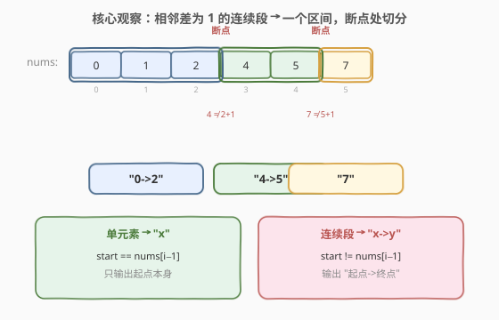
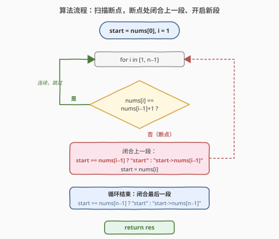
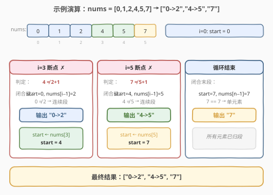

# 汇总区间

- **题目名称**：汇总区间
- **链接**：[228. 汇总区间](https://leetcode.cn/problems/summary-ranges/)
- **难度**：中等
- **标签**：数组、一次遍历、双指针

## 1. 题目概述

给定一个**无重复元素**且**已升序排序**的整数数组 `nums`，返回其**最小**的区间列表，使每个数字恰好落入某个区间。区间格式为：

- 单独一个数 `a` → `"a"`；
- 连续的一段 `a, a+1, ..., b`（长度 ≥ 2）→ `"a->b"`。

**示例 1**：

```text
输入：nums = [0,1,2,4,5,7]
输出：["0->2","4->5","7"]
解释：0,1,2 连续成一段；4,5 连续成一段；7 单独一段。
```

**示例 2**：

```text
输入：nums = [0,2,3,4,6,8,9]
输出：["0","2->4","6","8->9"]
解释：0 单独；2,3,4 连续；6 单独；8,9 连续。
```

**约束条件**：

- $0 \leq \text{nums.length} \leq 20$
- $-2^{31} \leq \text{nums[i]} \leq 2^{31} - 1$
- `nums` 中的所有值**互不相同**
- `nums` 已按**升序**排列

> 💡 数据规模虽小（$n \leq 20$），但题目要求的是 $O(n)$ 的线性扫描思路，面试中常作为「热身题」考察边界处理与字符串拼接。注意 `nums[i]` 可达 `INT_MIN`/`INT_MAX`，做 `nums[i] + 1` 时要当心溢出——用 `nums[i] - nums[i-1] == 1` 判断更稳妥。

---

## 2. 解题思路

### 2.1 暴力思路

从下标 `0` 起，对每个起点 `i` 尝试向后扩展终点 `j`，只要 `nums[j+1] == nums[j] + 1` 就继续右移 `j`，直到断开，输出 `nums[i]..nums[j]` 这一段，再令 `i = j + 1` 重复。这其实已是最优思路的雏形，但若用「外层枚举起点 + 内层枚举终点」的两重循环框架书写，代码不够简洁，且容易忽略「终点和起点重合时输出单元素」的边界。

### 2.2 核心观察：相邻差为 1 即连续，断点处切分



由于数组**已排序且无重复**，连续性可由一个极其简单的判据刻画：

> 💡 **断点判据**：对相邻两元素，若 $\text{nums}[i] == \text{nums}[i-1] + 1$，则它们同属一段；否则在 $i$ 处出现**断点**，前一段在此闭合，$i$ 开启新一段。

于是只需维护一个变量 `start`（当前段的起点值），从左到右扫描一次：

- 遇到**断点**（或扫描结束）时，把 `[start, nums[i-1]]` 这一段按格式输出：
  - 若 `start == nums[i-1]`：段长为 1，输出 `"start"`；
  - 否则：输出 `"start->nums[i-1]"`。
- 随后令 `start = nums[i]`，开始新一段。

每个元素只访问一次，时间 $O(n)$，额外空间 $O(1)$（不计输出）。

> ⚠️ **为何用 `nums[i] - nums[i-1] == 1` 而非 `nums[i] == nums[i-1] + 1`？** 当 `nums[i-1] == INT_MAX` 时，`nums[i-1] + 1` 会溢出为 `INT_MIN`，导致误判。做减法判断可规避溢出（两数差不溢出，因为 `nums` 已排序无重复，相邻差为正且不超过 `INT_MAX`）。本题数据范围虽允许直接加 1，但养成此习惯在类似题（如 [201. 数字范围按位与](https://leetcode.cn/problems/bitwise-and-of-numbers-range/)）中能避免踩坑。

### 2.3 算法流程图



维护变量：

- `start`：当前连续段的起点值，初始为 `nums[0]`；
- `res`：结果字符串数组。

**主循环**（`i` 从 `1` 到 `n-1`）：

1. 判断 `nums[i]` 与 `nums[i-1]` 是否相邻（差为 1）。
2. **是**（连续）：跳过，`start` 不变，段继续延伸。
3. **否**（断点）：闭合上一段——按 `start` 与 `nums[i-1]` 是否相等决定输出 `"start"` 或 `"start->nums[i-1]"`，然后 `start = nums[i]`。

**循环结束后**：别忘了闭合最后一段（`[start, nums[n-1]]`），这是最易漏的边界。

### 2.4 示例演算

以 `nums = [0,1,2,4,5,7]` 为例，关键步是两个断点与一次末段闭合：



| i | nums[i] | 相邻？ | 动作 | start | res |
|---|---------|--------|------|-------|-----|
| 0 | 0 | — | 初始化 start=0 | 0 | [] |
| 1 | 1 | ✓ (1==0+1) | 连续，跳过 | 0 | [] |
| 2 | 2 | ✓ (2==1+1) | 连续，跳过 | 0 | [] |
| 3 | 4 | ✗ (4≠2+1) | 闭合 "0->2"，start←4 | 4 | ["0->2"] |
| 4 | 5 | ✓ (5==4+1) | 连续，跳过 | 4 | ["0->2"] |
| 5 | 7 | ✗ (7≠5+1) | 闭合 "4->5"，start←7 | 7 | ["0->2","4->5"] |
| 结束 | — | — | 闭合末段 "7" | 7 | ["0->2","4->5","7"] |

最终返回 `["0->2","4->5","7"]`。

---

## 3. 参考代码

### C++

```cpp
class Solution {
  public:
    vector<string> summaryRanges(vector<int>& nums) {
        vector<string> res;
        int n = nums.size();
        if (n == 0) return res;
        int start = nums[0];
        for (int i = 1; i < n; ++i) {
            if (nums[i] - nums[i - 1] != 1) {          // 断点：闭合上一段
                res.push_back(rangeStr(start, nums[i - 1]));
                start = nums[i];
            }
        }
        res.push_back(rangeStr(start, nums[n - 1]));   // 闭合最后一段
        return res;
    }
  private:
    string rangeStr(long long lo, long long hi) {      // 用 long long 规避 to_string 溢出
        return lo == hi ? to_string(lo) : to_string(lo) + "->" + to_string(hi);
    }
};
```

### Python

```python
class Solution:
    def summaryRanges(self, nums: List[int]) -> List[str]:
        res = []
        n = len(nums)
        if n == 0:
            return res
        start = nums[0]
        for i in range(1, n):
            if nums[i] - nums[i - 1] != 1:             # 断点：闭合上一段
                res.append(self._range(start, nums[i - 1]))
                start = nums[i]
        res.append(self._range(start, nums[n - 1]))    # 闭合最后一段
        return res

    def _range(self, lo: int, hi: int) -> str:
        return str(lo) if lo == hi else f"{lo}->{hi}"
```

---

## 4. 复杂度分析

| 维度 | 复杂度 | 说明 |
|------|--------|------|
| 时间复杂度 | $O(n)$ | 仅一次线性扫描，每个元素在断点判定与至多一次闭合输出中被访问 |
| 空间复杂度 | $O(1)$ | 除结果数组外只用 `start` 一个变量；结果空间不计入额外开销 |

---

## 5. 扩展：双指针写法

上面的写法用「值 `start`」记录段起点。也可以用「下标双指针」`l`、`r` 表达同一段逻辑：`r` 不断右扩直到断开，输出 `nums[l]..nums[r-1]`，再令 `l = r` 继续。两种写法等价，下标版的好处是无需单独处理 `INT_MIN` 的减法溢出风险（比较的是相邻下标对应的值）。

```cpp
vector<string> summaryRanges(vector<int>& nums) {
    vector<string> res;
    int n = nums.size(), l = 0;
    while (l < n) {
        int r = l;
        while (r + 1 < n && nums[r + 1] == nums[r] + 1) ++r;  // 扩到断点前
        res.push_back(l == r ? to_string(nums[l])
                             : to_string(nums[l]) + "->" + to_string(nums[r]));
        l = r + 1;
    }
    return res;
}
```

> 💡 这正是 2.1 暴力思路的优雅版本：内层 `while` 把连续段一次性吃完，外层 `while` 跳到下一段起点，两指针都不回退，均摊 $O(n)$。面试中可两种写法都默写一遍，说明「值起点」与「下标双指针」完全等价。

---

## 6. 面试要点

1. **为什么必须单独处理「最后一段」？**
   - 主循环只在「遇到断点」时闭合一段，而最后一段的末尾没有断点触发它。若忘了循环后补一次闭合，会漏掉末段。这是本题最高频的踩坑点。

2. **单元素段和连续段如何区分输出格式？**
   - 比较 `start` 与 `nums[i-1]`（或下标版中 `l` 与 `r`）：相等说明段长为 1，输出 `"x"`；不等则输出 `"x->y"`。判据与「段内是否有多于一个元素」一一对应。

3. **数组未排序或含重复元素会怎样？**
   - 本题保证排序且无重复，故「相邻差为 1」等价于「连续」。若去掉这两个前提，相邻差为 1 不再保证全局连续（如 `[1,2,1,2]`），需先排序去重或改用并查集/哈希，思路完全不同（参考 [128. 最长连续序列](../0101-0200/128_最长连续序列.md)）。

4. **`nums[i-1] == INT_MAX` 时 `+1` 会溢出吗？怎么避免？**
   - 会。`INT_MAX + 1` 在有符号 32 位下溢为 `INT_MIN`。用 `nums[i] - nums[i-1] == 1` 做差判断可规避（已排序无重复保证差为正且不溢出）；或将元素转 `long long` 再比较。养成习惯可避免类似边界题踩坑。

5. **能否原地输出，不额外开结果数组？**
   - 题目要求返回字符串列表，结果数组不可避免。但扫描过程中除 `start`/`l`/`r` 外无需其他辅助变量，额外空间确为 $O(1)$。若改成「打印」形式，则可做到完全原地。

---

## 7. 同类练习题

- [56. 合并区间](https://leetcode.cn/problems/merge-intervals/)（[题解](../0001-0100/56_合并区间.md)）：同样是「把一段段区间归并输出」，但 56 处理任意重叠区间需先排序再贪心合并；本题区间由连续性天然确定，无需合并
- [57. 插入区间](https://leetcode.cn/problems/insert-interval/)（[题解](../0001-0100/57_插入区间.md)）：在已有区间列表中插入新区间并合并，对比「区间列表」与「连续段」的异同
- [128. 最长连续序列](https://leetcode.cn/problems/longest-consecutive-sequence/)（[题解](../0101-0200/128_最长连续序列.md)）：数组未排序时求最长连续段长度，用哈希集合而非线性扫描，对比「有序」与「无序」两种前提下的解法选择
- [163. 缺失的区间](https://leetcode.cn/problems/missing-ranges/)：本题的「对偶」——给定区间上下界，输出排序数组中**缺失**的连续区间，断点判定与格式化逻辑完全可复用
- [352. 将数据流变为多个不相交区间](https://leetcode.cn/problems/data-stream-as-disjoint-intervals/)：动态维护连续区间集合的进阶版，需用有序结构（ TreeMap / 并查集）支持插入与区间汇总
