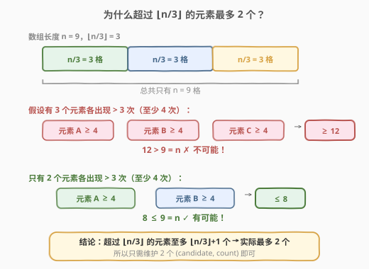
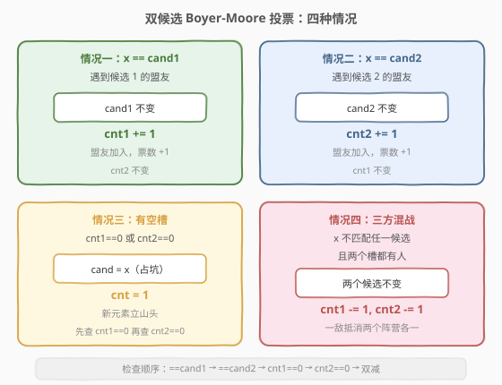
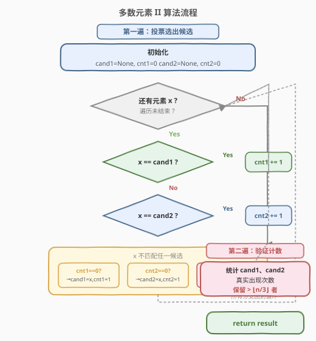
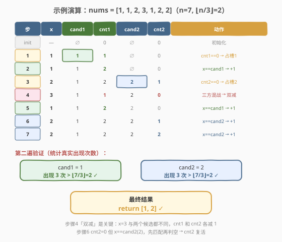

# LeetCode 多数元素 II 题解

## 1. 题目概述

- **标题 / 题号**：多数元素 II（#229，medium）
- **链接**：https://leetcode.cn/problems/majority-element-ii/
- **难度**：中等
- **标签**：数组、哈希表、Boyer-Moore 投票算法

**题意**：给定一个大小为 `n` 的整数数组，找出其中所有出现次数**超过 `⌊n/3⌋`** 的元素。要求时间复杂度 $O(n)$、空间复杂度 $O(1)$（不含输出列表）。

**示例 1**：

```text
输入：nums = [3,2,3]
输出：[3]
解释：3 出现 2 次，大于 ⌊3/3⌋ = 1。
```

**示例 2**：

```text
输入：nums = [1]
输出：[1]
解释：1 出现 1 次，大于 ⌊1/3⌋ = 0。
```

**示例 3**：

```text
输入：nums = [1,2]
输出：[1,2]
解释：1 和 2 各出现 1 次，大于 ⌊2/3⌋ = 0。
```

**约束**：

- `1 <= nums.length <= 5 * 10^4`
- $-2^{31}$ `<= nums[i] <=` $2^{31} - 1$

> **进阶要求**：尝试设计时间 $O(n)$、空间 $O(1)$ 的算法。这正是 Boyer-Moore 投票算法的用武之地。

## 2. 解题思路

### 2.1 暴力思路

用哈希表统计每个元素的出现次数，再筛出计数大于 `⌊n/3⌋` 的元素。时间 $O(n)$、空间 $O(n)$，能过但不符合进阶的空间要求。

### 2.2 核心观察：超过 ⌊n/3⌋ 的元素最多 2 个



关键洞察：如果 3 个元素各出现超过 `n/3` 次，则总出现次数超过 $n$，而数组长度只有 $n$——矛盾！因此**满足条件的元素至多 2 个**。

> 💡 **推广**：出现次数超过 `⌊n/k⌋` 的元素至多 `k−1` 个。`k=2` 时最多 1 个（即 [169. 多数元素](../0101-0200/169_多数元素.md)），`k=3` 时最多 2 个（本题）。这意味着只需维护 **2 个** `(candidate, count)` 对即可。

### 2.3 双候选 Boyer-Moore 投票算法



算法维护两组 `(cand, cnt)`，遍历每个元素 `x` 时按以下**顺序**判断：

1. **`x == cand1`** → `cnt1 += 1`（盟友加入阵营 1）
2. **`x == cand2`** → `cnt2 += 1`（盟友加入阵营 2）
3. **`cnt1 == 0`** → `cand1 = x, cnt1 = 1`（空槽 1 占坑）
4. **`cnt2 == 0`** → `cand2 = x, cnt2 = 1`（空槽 2 占坑）
5. **以上都不满足** → `cnt1 -= 1, cnt2 -= 1`（三方混战，双减）

> ⚠️ **检查顺序至关重要**：必须先判断 `x == cand1/2`，再判断 `cnt == 0`。否则当一个候选的 `cnt` 已为 0、但其旧值恰好等于 `x` 时，会错误地"复活"而非重新占坑。虽然两种路径最终状态相同，但先匹配再判空的逻辑更直观，也保证了 C++ 中无需特殊哨兵值。

> 💡 **与 169 题的关系**：169 题保证存在过半元素，1 个候选足矣且无需验证；本题**不保证存在**超过 `⌊n/3⌋` 的元素，2 个候选只是"嫌疑犯"，必须**第二遍扫描**统计真实次数后才能定论。

### 2.4 算法流程图



算法分为两遍：
- **第一遍（投票）**：遍历数组，用双候选投票选出 2 个"嫌疑犯"。
- **第二遍（验证）**：重新统计两个候选的真实出现次数，保留超过 `⌊n/3⌋` 者。

### 2.5 示例演算

以 `nums = [1, 1, 2, 3, 1, 2, 2]`（`n=7`，`⌊n/3⌋ = 2`）为例：



| 步骤 | x | cand1 | cnt1 | cand2 | cnt2 | 动作 |
|------|---|-------|------|-------|------|------|
| init | — | ∅ | 0 | ∅ | 0 | 初始化 |
| 1 | 1 | 1 | 1 | ∅ | 0 | cnt1==0 → 占槽1 |
| 2 | 1 | 1 | 2 | ∅ | 0 | x==cand1 → +1 |
| 3 | 2 | 1 | 2 | 2 | 1 | cnt2==0 → 占槽2 |
| 4 | 3 | 1 | 1 | 2 | 0 | 三方混战 → 双减 |
| 5 | 1 | 1 | 2 | 2 | 0 | x==cand1 → +1 |
| 6 | 2 | 1 | 2 | 2 | 1 | x==cand2 → +1 |
| 7 | 2 | 1 | 2 | 2 | 2 | x==cand2 → +1 |

第一遍结束：候选为 `cand1=1`、`cand2=2`。第二遍验证：`1` 出现 3 次 $> 2$ ✓，`2` 出现 3 次 $> 2$ ✓。返回 `[1, 2]`。

> 💡 **步骤 4 是关键**：`x=3` 与两个候选都不同，触发"双减"，`cnt2` 从 1 降到 0。步骤 6 中 `cnt2` 虽为 0，但 `x=2 == cand2` 先匹配，`cnt2` 直接"复活"为 1——这正是先判匹配再判空的好处。

## 3. 参考代码

### C++

```cpp
class Solution {
  public:
    vector<int> majorityElement(vector<int>& nums) {
        int cand1 = 0, cand2 = 0, cnt1 = 0, cnt2 = 0;

        // 第一遍：投票选出 2 个候选
        for (int x : nums) {
            if (cnt1 > 0 && x == cand1) {
                cnt1++;
            } else if (cnt2 > 0 && x == cand2) {
                cnt2++;
            } else if (cnt1 == 0) {
                cand1 = x;
                cnt1 = 1;
            } else if (cnt2 == 0) {
                cand2 = x;
                cnt2 = 1;
            } else {
                cnt1--;
                cnt2--;
            }
        }

        // 第二遍：验证候选的真实出现次数
        int n = nums.size();
        cnt1 = cnt2 = 0;
        for (int x : nums) {
            if (x == cand1) cnt1++;
            else if (x == cand2) cnt2++;
        }

        vector<int> res;
        if (cnt1 > n / 3) res.push_back(cand1);
        if (cnt2 > n / 3) res.push_back(cand2);
        return res;
    }
};
```

### Python

```python
class Solution:
    def majorityElement(self, nums: List[int]) -> List[int]:
        cand1, cand2, cnt1, cnt2 = None, None, 0, 0

        # 第一遍：投票选出 2 个候选
        for x in nums:
            if x == cand1:
                cnt1 += 1
            elif x == cand2:
                cnt2 += 1
            elif cnt1 == 0:
                cand1, cnt1 = x, 1
            elif cnt2 == 0:
                cand2, cnt2 = x, 1
            else:
                cnt1 -= 1
                cnt2 -= 1

        # 第二遍：验证候选的真实出现次数
        n = len(nums)
        cnt1 = cnt2 = 0
        for x in nums:
            if x == cand1:
                cnt1 += 1
            elif x == cand2:
                cnt2 += 1

        res = []
        if cnt1 > n // 3:
            res.append(cand1)
        if cnt2 > n // 3:
            res.append(cand2)
        return res
```

> 💡 **C++ vs Python 的细微差异**：Python 用 `None` 初始化候选，`x == None` 对整数恒为 `False`，无需额外判断；C++ 的 `int` 无空值，用 `cnt > 0 &&` 守卫避免匹配到未激活的候选。两种写法逻辑等价。

> ⚠️ **第二遍计数用 `elif`**：虽然算法保证 `cand1 != cand2`（当两者 `cnt > 0` 时），但用 `elif` 可以防止边界情况下同一元素被重复计数。

## 4. 复杂度分析

| 维度 | 复杂度 | 说明 |
|------|--------|------|
| 时间复杂度 | $O(n)$ | 两遍线性扫描，每遍 $O(n)$ |
| 空间复杂度 | $O(1)$ | 仅用 4 个变量 `cand1, cnt1, cand2, cnt2`，输出列表不计 |

> 💡 时间已达下界 $O(n)$（必须至少看一遍所有元素），空间为常数——这是该题的最优解。

## 5. 扩展：推广到 ⌊n/k⌋

本题是 Boyer-Moore 投票算法的 `k=3` 推广。一般地，求出现次数超过 `⌊n/k⌋` 的所有元素：

- 这类元素至多 `k−1` 个，维护 `k−1` 组 `(candidate, count)`。
- 遍历时：先匹配已有候选 → 再填空槽 → 否则全部减 1。
- 最后二次验证。

| 参数 | 候选数 | 代表题目 |
|------|--------|----------|
| $k=2$ | 1 个 | [169. 多数元素](../0101-0200/169_多数元素.md) |
| $k=3$ | 2 个 | [229. 多数元素 II](https://leetcode.cn/problems/majority-element-ii/)（本题） |
| 一般 $k$ | $k−1$ 个 | 面试题 17.22 / LCP 44 等 |

当 $k$ 较大时，用哈希表维护 `k−1` 个候选更实用（退化为 $O(n)$ 空间），Boyer-Moore 的常数空间优势主要体现在 $k=2,3$ 的小规模场景。

## 6. 面试要点

1. **为什么最多 2 个元素能超过 ⌊n/3⌋？**
   - 反证法：若 3 个元素各超过 `n/3` 次，总次数 $> n$，矛盾。一般地，超过 `⌊n/k⌋` 的元素至多 `k−1` 个。

2. **为什么需要第二遍验证？**
   - 本题**不保证**存在满足条件的元素（如 `nums = [1,2,3]` 无元素超过 `⌊3/3⌋=1` 次）。第一遍只选出"嫌疑犯"，必须二次统计确认。

3. **双减的直觉是什么？**
   - 当 `x` 不匹配任何候选且两个槽都非空时，`x` 同时"对抗"两个阵营。把 `x` 与两个候选各配对消去一个，等价于三组各损失一票，不影响相对优势。

4. **检查顺序为什么先匹配再判空？**
   - 若 `cnt1==0` 但 `cand1` 旧值恰好等于 `x`，先匹配会"复活"该候选（`cnt1: 0→1`），先判空则会重新赋值（结果相同）。但先匹配的写法在 Python 中可省去 `cnt>0` 守卫，更简洁。

5. **C++ 中为什么要加 `cnt > 0 &&` 守卫？**
   - C++ 的 `int` 没有 `None`，初始值 `0` 可能是合法元素。不加守卫时，若 `cand2` 初始为 `0` 且 `x=0`，会错误匹配未激活的 `cand2`。Python 用 `None` 天然避免此问题。

6. **和 169 题的核心区别是什么？**
   - 169 保证存在过半元素 → 1 个候选、无需验证。229 不保证存在 → 2 个候选、必须验证。从 $k=2$ 到 $k=3$，候选数从 1 变 2，且引入了"双减"这一新操作。

## 同类练习题

| # | 题目 | 与本题的关联 |
|---|------|-------------|
| 169 | [多数元素](https://leetcode.cn/problems/majority-element/)（[题解](../0101-0200/169_多数元素.md)） | Boyer-Moore 投票的 $k=2$ 基础版，1 个候选、无需验证 |
| — | [面试题 17.10. 主要元素](https://leetcode.cn/problems/find-majority-element-lcci/) | 不保证存在过半元素，Boyer-Moore + 二次验证的标准变体 |
| 1150 | [检查一个数是否在数组中占绝大多数](https://leetcode.cn/problems/check-if-a-number-is-majority-element-in-a-sorted-array/) | 有序数组中验证某值是否过半，可用二分边界模板 |
| 34 | [在排序数组中查找元素的第一个和最后一个位置](https://leetcode.cn/problems/find-first-and-last-position-of-element-in-sorted-array/)（[题解](../0001-0100/34_在排序数组中查找元素的第一个和最后一个位置.md)） | 配合二分可在有序数组中 $O(\log n)$ 统计某元素次数 |
| 剑指 Offer 39 | [数组中出现次数超过一半的数字](https://leetcode.cn/problems/shu-zu-zhong-chu-xian-ci-shu-chao-guo-yi-ban-de-shu-zi-lcof/) | 169 题的中文版经典题，Boyer-Moore 入门 |
