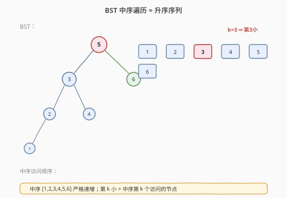
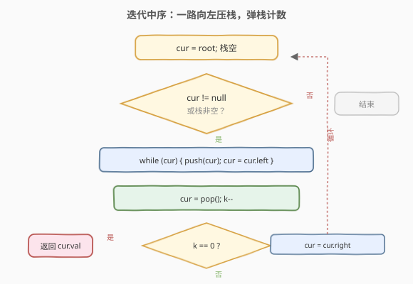
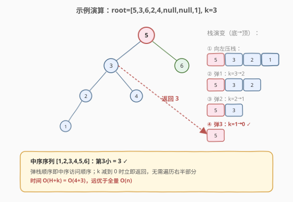

# LeetCode 二叉搜索树中第K小的元素 题解

## 1. 题目概述

- **标题 / 题号**：二叉搜索树中第K小的元素（#230，medium）
- **链接**：https://leetcode.cn/problems/kth-smallest-element-in-a-bst/
- **难度**：中等
- **标签**：树、BST、中序遍历

**题意**：给定一棵**二叉搜索树（BST）**的根节点 `root` 和一个整数 `k`，请返回树中第 `k` 小的元素（从 1 开始计数）。

**示例 1**：

```text
输入：root = [3,1,4,null,2], k = 1
输出：1
```

**示例 2**：

```text
输入：root = [5,3,6,2,4,null,null,1], k = 3
输出：3
```

**约束**：

- 树中节点数在 `[1, 10^4]` 范围内
- `0 <= Node.val <= 10^4`
- `1 <= k <= 树中节点数`
- **进阶**：若 BST 经常被修改（插入/删除）且需要频繁查找第 k 小，如何优化？

## 2. 解题思路

### 2.1 暴力思路：全量中序 + 取第 k

对 BST 做一次完整中序遍历，把所有值存入数组，返回 `arr[k-1]`。简单但需 `O(n)` 空间存全部元素，且无法提前终止。

### 2.2 核心观察：BST 中序是升序，遍历到第 k 个即停



BST 的核心性质：**中序遍历得到严格递增序列**。因此第 `k` 小元素就是中序遍历访问的第 `k` 个节点。用迭代中序遍历（栈），访问到第 `k` 个时立即返回，无需遍历整棵树：

1. 维护栈模拟中序「一路向左压栈」。
2. 弹栈即「访问根」，计数 `++cnt`；若 `cnt == k`，返回当前节点值。
3. 转向右子树，继续向左压栈。

> 💡 迭代中序的优势：**可提前终止**。递归中序虽也能用全局计数器 + 标志位提前返回，但栈帧仍需逐层弹出；迭代版直接 `break` 更干脆。

### 2.3 算法流程图



### 2.4 示例演算



以 `root = [5,3,6,2,4,null,null,1]`，`k = 3` 为例：

| 步骤 | 栈（底→顶） | 弹出节点 | cnt | 动作 |
|------|-------------|----------|-----|------|
| 1    | [5,3,2,1]   | —        | 0   | 一路向左压栈到 1 |
| 2    | [5,3,2]     | 1        | 1   | 1 无右孩子，继续弹 |
| 3    | [5,3]       | 2        | 2   | 2 无右孩子，继续弹 |
| 4    | [5]         | 3        | 3   | cnt==k=3，返回 3 |

中序序列为 `[1,2,3,4,5,6]`，第 3 小是 `3`，验证正确。

## 3. 参考代码

### C++

```cpp
class Solution {
  public:
    int kthSmallest(TreeNode* root, int k) {
        stack<TreeNode*> st;
        TreeNode* cur = root;
        while (cur || !st.empty()) {
            while (cur) {                    // 一路向左压栈
                st.push(cur);
                cur = cur->left;
            }
            cur = st.top(); st.pop();        // 访问根
            if (--k == 0) return cur->val;   // 第 k 个，立即返回
            cur = cur->right;                // 转向右子树
        }
        return -1;                            // 不会到达（k 合法）
    }
};
```

### Python

```python
class Solution:
    def kthSmallest(self, root: Optional[TreeNode], k: int) -> int:
        stack = []
        cur = root
        while cur or stack:
            while cur:                        # 一路向左压栈
                stack.append(cur)
                cur = cur.left
            cur = stack.pop()                 # 访问根
            k -= 1
            if k == 0:
                return cur.val                # 第 k 个，立即返回
            cur = cur.right                   # 转向右子树
        return -1                             # 不会到达
```

> 💡 用 `k` 本身做计数器（每弹一个节点 `k--`，`k==0` 即第 k 小），省去单独的 `cnt` 变量。

**递归中序版（提前终止）**：

```cpp
class Solution {
    int ans = 0, k;
  public:
    int kthSmallest(TreeNode* root, int k) {
        this->k = k;
        inorder(root);
        return ans;
    }
    void inorder(TreeNode* node) {
        if (!node || k <= 0) return;          // 剪枝：已找到或空节点
        inorder(node->left);
        if (--k == 0) { ans = node->val; return; }
        inorder(node->right);
    }
};
```

## 4. 复杂度分析

| 维度 | 复杂度 | 说明 |
|------|--------|------|
| 时间复杂度 | O(H + k) | 最坏访问 H（向左压栈）+ k（弹出计数）个节点；H 为树高 |
| 空间复杂度 | O(H) | 栈深度等于树高；平衡时 O(log n)，链状 O(n) |

> 💡 比「全量中序 O(n)」更优：当 `k` 很小时几乎不遍历右半部分。

## 5. 扩展：频繁查找的优化（进阶）

若 BST 频繁插入/删除且需频繁查第 k 小，每次 `O(H+k)` 太慢。两种优化方向：

**方案一：节点维护子树大小**

在每个节点额外存 `size`（以该节点为根的子树节点数）。插入/删除时沿路径更新 `size`。查找第 k 小时：

- 若 `left.size == k-1`，当前节点即第 k 小。
- 若 `left.size >= k`，在左子树找第 k 小。
- 若 `left.size < k-1`，在右子树找第 `k - left.size - 1` 小。

查找 `O(H)`，插入/删除 `O(H)`。

**方案二：BST + 有序结构**

维护一个**顺序统计树**（Order Statistic Tree），本质是带 `size` 的平衡 BST（如红黑树扩展）。或用**平衡 BST 库**（C++ 的 `std::set` 不支持 rank，需手写或用 `pb_ds` 库的 `tree`）。

> ⚠️ LeetCode 本题只需单次查询，`O(H+k)` 足够。进阶讨论是为了展示「数据结构增强」的思路。

## 6. 面试要点

1. **为什么 BST 中序遍历是升序？**
   - BST 定义：左子树值 < 根值 < 右子树值。中序遍历顺序是「左-根-右」，恰好按值从小到大访问，因此严格递增。这是 BST 一切「第 k 小」「排名」「范围查询」应用的基础。

2. **迭代中序为什么比递归中序更适合本题？**
   - 迭代版用显式栈，可在 `cnt == k` 时直接 `break` 返回，控制流清晰。递归版需用全局变量 + 剪枝条件，且即便剪枝，已入栈的递归帧仍需逐层返回，终止不够干脆。

3. **时间复杂度是 O(n) 还是 O(H+k)？**
   - 严格说是 `O(H+k)`。一路向左压栈需 `O(H)`，之后弹出 k 个节点。当 k 接近 n 时退化为 `O(n)`，但平均优于全量遍历。若只问渐近上界，写 `O(n)` 也对。

4. **如何找第 k 大？**
   - 改为「右-根-左」的**逆中序**遍历，访问的第 k 个即第 k 大。或先求总节点数 n，第 k 大 = 第 `n-k+1` 小，复用本题逻辑。

5. **进阶：频繁查询怎么优化？**
   - 给每个节点加 `size` 字段记录子树大小，查找按「左子树 size 与 k 比较」二分下降，`O(H)` 完成。插入/删除时沿路径更新 size。本质是把 BST 升级为顺序统计树。

## 同类练习题

| # | 题目 | 与本题的关联 |
|---|------|-------------|
| 94 | [二叉树的中序遍历](https://leetcode.cn/problems/binary-tree-inorder-traversal/)（[题解](../0001-0100/94_二叉树的中序遍历.md)） | 中序遍历的基础模板 |
| 98 | [验证二叉搜索树](https://leetcode.cn/problems/validate-binary-search-tree/)（[题解](../0001-0100/98_验证二叉搜索树.md)） | 利用中序单调性验证 |
| 173 | [二叉搜索树迭代器](https://leetcode.cn/problems/binary-search-tree-iterator/) | 迭代中序的延迟求值应用 |
| 285 | [二叉搜索树中的中序后继](https://leetcode.cn/problems/inorder-successor-in-bst/) | 中序遍历找下一个节点 |
| 108 | [将有序数组转换为二叉搜索树](https://leetcode.cn/problems/convert-sorted-array-to-binary-search-tree/)（[题解](../0101-0200/108_将有序数组转换为二叉搜索树.md)） | BST 与有序序列的关系 |
