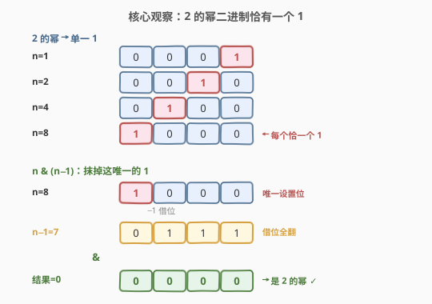
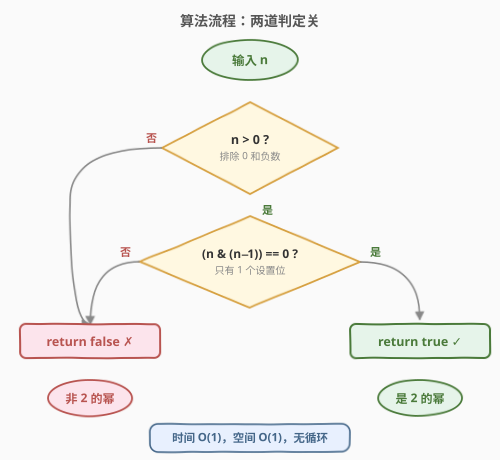
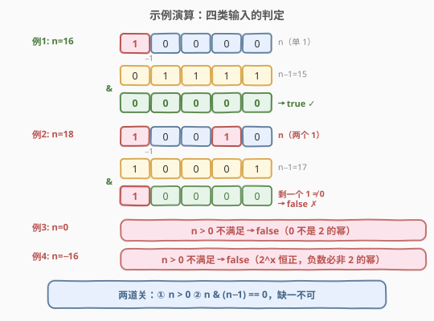

# 2 的幂

- **题目名称**：2 的幂
- **链接**：[231. 2 的幂](https://leetcode.cn/problems/power-of-two/)
- **难度**：简单
- **标签**：位运算、数学

## 1. 题目概述

给定一个整数 `n`，判断它是否为 **2 的幂**——即是否存在整数 `x` 使得 $n = 2^x$。是则返回 `true`，否则返回 `false`。

**示例 1**：

```text
输入：n = 1
输出：true
解释：2^0 = 1
```

**示例 2**：

```text
输入：n = 16
输出：true
解释：2^4 = 16
```

**示例 3**：

```text
输入：n = 3
输出：false
```

**约束条件**：

- $-2^{31} \le n \le 2^{31} - 1$

> 💡 **进阶**：不使用循环 / 递归完成？答案是位运算 `n & (n-1)`——一次按位与即可判定，$O(1)$ 无循环。它与 [191. 位 1 的个数](../0001-0100/191_位1的个数.md) 共用同一 Brian Kernighan 技巧：191 用它「数 1 的个数」，231 用它「判 1 的个数是否恰为 1」。

---

## 2. 解题思路

### 2.1 暴力思路：反复除 2

2 的幂满足：不断除以 2 最终会到 1，且过程中始终为偶数（除 1 外）。故：

```text
若 n <= 0：返回 false
while n % 2 == 0：
    n //= 2
返回 n == 1
```

时间 $O(\log n)$（除到 1 最多 $\log_2 n$ 次），空间 $O(1)$。能 AC，但**用了循环**——不满足进阶的「无循环」要求，且对大数（如 $n = 2^{30}$）要循环 30 次。

> 💡 转机：2 的幂的二进制形态极其特殊——**只有一个 1**。能否用一次位运算直接判定「1 的个数是否恰为 1」？

### 2.2 核心观察：2 的幂二进制恰有一个 1



列出前几个 2 的幂的二进制：

| n | 二进制 | 1 的个数 |
|---|--------|---------|
| $2^0=1$ | `0001` | 1 |
| $2^1=2$ | `0010` | 1 |
| $2^2=4$ | `0100` | 1 |
| $2^3=8$ | `1000` | 1 |
| $2^4=16$ | `10000` | 1 |

规律显而易见：**$2^x$ 的二进制恰有一个 `1`**，且位于第 $x$ 位（从 0 起编号）。这是因为 $2^x$ 在二进制下就是「1 后跟 $x$ 个 0」。

> 💡 **关键转化**：判定「$n$ 是 2 的幂」$\iff$ 判定「$n > 0$ 且 $n$ 的二进制恰有一个 `1`」。后者可用 [191](../0001-0100/191_位1的个数.md) 的 Brian Kernighan 技巧一次完成。

### 2.3 核心解法：`n & (n-1) == 0`

[191. 位 1 的个数](../0001-0100/191_位1的个数.md) 的核心技巧是：`n & (n - 1)` 会抹掉 `n` 的**最低设置位**（最右边的 `1`），使 `1` 的个数恰减 1。

把这个技巧用到 231：

- 若 `n` 是 2 的幂（恰一个 `1`），抹掉这个唯一的 `1` 后结果为 `0`，即 `(n & (n-1)) == 0`；
- 若 `n` 不是 2 的幂（有 $\ge 2$ 个 `1`），抹掉最低 `1` 后仍剩 $\ge 1$ 个 `1`，结果 $\ne 0$。

**为什么还要加 `n > 0`？** 两个边界：

1. **`n = 0`**：二进制全 `0`，没有设置位。`0 & (0-1) = 0 & (-1) = 0`，满足 `== 0`，但 `0` 显然不是 2 的幂（$2^x > 0$ 恒成立）。必须用 `n > 0` 排除。
2. **`n < 0`**：负数不是 2 的幂（同上，$2^x > 0$）。且负数在补码下有多个 `1`，`n & (n-1)` 行为复杂，直接用 `n > 0` 一刀切。

> ⚠️ **C++ 的溢出安全**：先判 `n > 0` 再算 `n - 1`。`n > 0` 时 $n \ge 1$，故 $n - 1 \ge 0$，不会触发 `INT_MIN - 1` 的未定义行为。短路求值保证 `n <= 0` 时根本不计算 `n & (n-1)`。

### 2.4 算法流程图



算法是**两道串联的判定关**，缺一不可：

1. **第一关 `n > 0`**：排除 `0` 和负数（2 的幂恒正）。
2. **第二关 `(n & (n-1)) == 0`**：判定恰有一个设置位。

两关都过 → `true`；任一关不过 → `false`。整个判定**无循环、无递归**，一次比较 + 一次按位与即完成。

### 2.5 示例演算

以四类典型输入为例（正幂、正非幂、零、负数）：



| 输入 | 二进制 | 第一关 `n > 0` | 第二关 `n & (n-1) == 0` | 结果 |
|------|--------|---------------|-------------------------|------|
| `n = 16` | `10000` | ✅ | `10000 & 01111 = 00000` ✅ | `true` |
| `n = 18` | `10010` | ✅ | `10010 & 10001 = 10000` ≠ 0 ✗ | `false` |
| `n = 0` | `0` | ✗ | —（短路跳过） | `false` |
| `n = -16` | 补码多 `1` | ✗ | —（短路跳过） | `false` |

注意 `n = 18 = 10010` 有**两个** `1`，`n & (n-1)` 只抹掉最低的那个（bit 1），剩 bit 4 的 `1` 不为 0 → 非幂。这正是「恰一个 1」判据的精髓：多一个都不行。

---

## 3. 参考代码

### C++

```cpp
class Solution {
  public:
    bool isPowerOfTwo(int n) {
        return n > 0 && (n & (n - 1)) == 0;
    }
};
```

### Python

```python
class Solution:
    def isPowerOfTwo(self, n: int) -> bool:
        return n > 0 and (n & (n - 1)) == 0
```

> 💡 **一行即终**。`(n & (n-1)) == 0` 判定「至多一个 1」，`n > 0` 排除 `0`（0 也满足前者但非幂）。两者合起来等价于「恰一个 1 且为正」，即 2 的幂。Python 整数无限精度，负数补码有无限前导 `1`，但 `n > 0` 短路保护，无需额外截断。

---

## 4. 复杂度分析

| 维度 | 位运算法 | 暴力除法 |
|------|---------|---------|
| **时间复杂度** | $O(1)$ | $O(\log n)$ |
| **空间复杂度** | $O(1)$ | $O(1)$ |
| **无循环** | ✅ 满足进阶 | ✗ 用 while 循环 |

> ⚠️ 位运算法的时间严格是 $O(1)$：一次比较、一次减法、一次按位与、一次等于比较，固定 4 步，与 $n$ 大小无关。对 32 位整数，`n & (n-1)` 是单条 CPU 指令。

---

## 5. 扩展：其他判定 2 的幂的写法

判定「恰一个设置位」有多种位运算写法，思路各异。

### 5.1 `n & (-n) == n`：取最低设置位

`-n` 在补码下等于 `~n + 1`。`n & (-n)` 会**隔离出 `n` 的最低设置位**（只保留最右边的 `1`，其余清零），这个值在树状数组（BIT / Fenwick Tree）中称作 **lowbit**。

- 若 `n` 是 2 的幂，最低设置位就是**唯一**的设置位，故 `n & (-n) == n`；
- 若 `n` 有多个 `1`，`n & (-n)` 只剩最低那个，必然 $\ne n$。

```cpp
return n > 0 && (n & (-n)) == n;
```

> 💡 这是树状数组 `lowbit(x) = x & -x` 的同一运算。在 231 里它「取唯一 1」，在树状数组里它「定区间的管辖范围」。一题两用。

### 5.2 `(1 << 30) % n == 0`：用最大幂取模

32 位有符号整数范围内，最大的 2 的幂是 $2^{30} = 1073741824$（$2^{31}$ 已溢出上界 $2^{31}-1$）。所有范围内的 2 的幂（$2^0, 2^1, \ldots, 2^{30}$）都是 $2^{30}$ 的**因数**。故：

```cpp
return n > 0 && (1 << 30) % n == 0;
```

> ⚠️ 这个写法**不对 `n` 本身做位运算**，思路最朴素：2 的幂互相整除。优点是好理解；缺点是依赖「范围上限是 $2^{30}$」这一前提，换 64 位就要改成 `1LL << 62`，泛化性弱于 `n & (n-1)`。

### 5.3 各写法对比

| 写法 | 核心思想 | 与其他题的联系 |
|------|---------|----------------|
| **`n & (n-1) == 0`** | 抹掉最低 1 看是否归零 | [191](../0001-0100/191_位1的个数.md) 数 1 的个数 |
| `n & (-n) == n` | 取最低 1 看是否等于自身 | 树状数组 lowbit |
| `(1 << 30) % n == 0` | 2 的幂互相整除 | [326. 3 的幂](https://leetcode.cn/problems/power-of-three/) 同模板 |

三种写法复杂度均为 $O(1)$，面试首推 `n & (n-1)`——它直接复用 191 的 Brian Kernighan 技巧，体现「同一技巧，数 1 / 判 1」的迁移。

---

## 6. 面试要点

1. **为什么 `n & (n-1) == 0` 能判定 2 的幂？**

   - `n & (n-1)` 抹掉 `n` 的最低设置位，使 `1` 的个数恰减 1（Brian Kernighan 技巧，详见 [191](../0001-0100/191_位1的个数.md)）。
   - 2 的幂二进制恰一个 `1`，抹掉后归零；非 2 的幂有 $\ge 2$ 个 `1`，抹掉最低位后仍剩 $\ge 1$ 个，结果非零。
   - 故 `(n & (n-1)) == 0` $\iff$ 「至多一个 1」。

2. **为什么必须加 `n > 0`？**

   - `n = 0`：二进制全 `0`，`0 & (-1) = 0` 满足 `== 0`，但 `0` 不是 2 的幂（$2^x > 0$）。
   - `n < 0`：负数非 2 的幂（$2^x > 0$ 恒成立），且补码下有多个 `1`，行为复杂。
   - `n > 0` 一刀切排除这两类，C++ 中还靠短路求值避免 `INT_MIN - 1` 的未定义行为。

3. **如何不使用循环 / 递归解决？**

   - `n & (n-1)` 是单次按位与，$O(1)$ 无循环，直接满足进阶。
   - 暴力除法 `while n % 2 == 0: n //= 2` 用了循环，不满足。
   - 进阶本质是考察「能否从 $O(\log n)$ 的循环优化到 $O(1)$ 的位运算」。

4. **本题和 191 位 1 的个数有什么关系？**

   - 共用 Brian Kernighan 技巧 `n & (n-1)`。
   - 191 反复执行它直到 `n = 0`，**循环次数 = 1 的个数**（popcount）。
   - 231 只执行一次看是否归零，**判定 1 的个数是否 $\le 1$**。
   - 加上 `n > 0` 排除 `0`（0 个 1），即等价于「恰 1 个」。

5. **`n & (-n) == n` 为什么也对？**

   - `-n = ~n + 1`（补码），`n & (-n)` 隔离出最低设置位（lowbit）。
   - 2 的幂最低设置位即唯一设置位，故 `n & (-n) == n`。
   - 多个 `1` 时 lowbit 只剩最低那个，必然 $\ne n$。
   - 同样要加 `n > 0`（`0 & 0 == 0` 会误判）。

> 💡 **一句话总结**：2 的幂二进制恰一个 `1`，用 `n & (n-1)` 抹掉它看是否归零，加 `n > 0` 排除零与负数——一行 `n > 0 && (n & (n-1)) == 0` 即终。与 191 共用 Brian Kernighan 技巧，从「数 1」到「判 1 恰为 1」。

---

## 7. 同类练习题

- [191. 位 1 的个数](https://leetcode.cn/problems/number-of-1-bits/)（[题解](../0001-0100/191_位1的个数.md)）：同一 Brian Kernighan 技巧的「数 1」版，231 是其「判 1 恰为 1」的特例
- [338. 比特位计数](https://leetcode.cn/problems/counting-bits/)（[题解](../0301-0400/338_比特位计数.md)）：对 `0..n` 每个数求 popcount，用 DP 复用 `ans[i & (i-1)]`，本题的「批量版」
- [342. 4 的幂](https://leetcode.cn/problems/power-of-four/)：在 231 基础上加判「唯一 1 落在偶数位」（`n & 0x55555555`），2 的幂的进一步筛选
- [326. 3 的幂](https://leetcode.cn/problems/power-of-three/)：非 2 的底数无法用位运算，改用「最大幂取模」（$3^{19} \bmod n == 0$），对照 5.2 的整数模板
