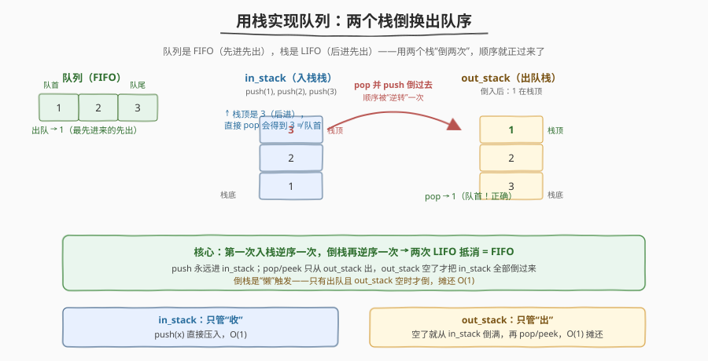
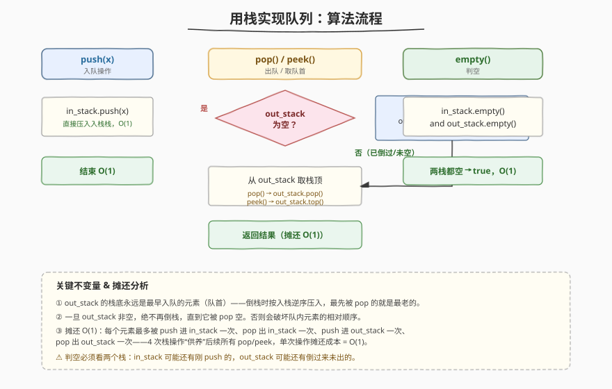
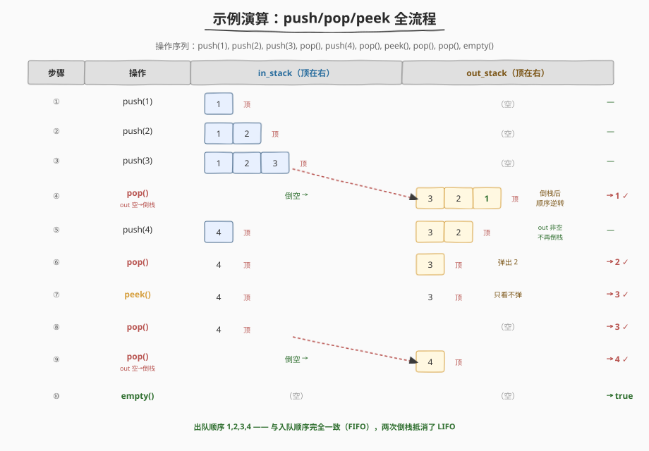

# LeetCode 用栈实现队列 题解

## 1. 题目概述

- **标题 / 题号**：用栈实现队列（#232，easy）
- **链接**：https://leetcode.cn/problems/implement-queue-using-stacks/
- **难度**：简单
- **标签**：栈、设计、队列

**题意**：请你仅使用**两个栈**实现一个先入先出（FIFO）的队列。队列应当支持一般队列支持的所有操作（`push`、`pop`、`peek`、`empty`）：

- `MyQueue()`：初始化队列
- `void push(int x)`：将元素 x 推到队列的末尾
- `int pop()`：从队列**开头**移除并返回元素
- `int peek()`：返回队列开头的元素（不移除）
- `boolean empty()`：队列为空返回 `true`，否则 `false`

**说明**：

- 你**只能**使用标准的栈操作（`push to top`、`peek/pop from top`、`size`、`is empty`）。
- 假设所有操作都是合法的（例如对空队列不会调用 `pop` / `peek`）。

**示例 1**

```text
输入：
  MyQueue myQueue = new MyQueue();
  myQueue.push(1);      // 队列: [1]
  myQueue.push(2);      // 队列: [1, 2]
  myQueue.peek();       // 返回 1
  myQueue.pop();        // 返回 1，队列: [2]
  myQueue.empty();      // 返回 false
```

**约束**：

- `1 <= x <= 9`
- 最多调用 `100` 次 `push`、`pop`、`peek`、`empty`
- 假设所有操作都是合法的

> 💡 难点不在写法，而在**想清楚**：栈是 LIFO（后进先出），队列是 FIFO（先进先出），方向相反。如何用两个 LIFO “拼”出一个 FIFO？答案是**倒两次**——一次入栈逆转，一次倒栈再逆转，两次抵消即恢复原序。

## 2. 解题思路

### 2.1 暴力思路

用一个栈 `s` 直接存数据：`push(x)` 时 `s.push(x)`。但 `pop()` 要取的是**栈底**元素（队首），单栈无法直接取到栈底——只能把栈里所有元素逐个弹出、暂存到别处，取走栈底后再压回去。这样每次 `pop` 都是 `O(n)`，且要借用额外结构（其实那正是第二个栈）。

> ⚠️ 暴力法的问题在于：每次 `pop` 都要把整个栈倒一遍再倒回来，做了大量重复搬运。

### 2.2 核心观察：双栈倒换（两次 LIFO = FIFO）



关键洞察：**一次入栈就把顺序逆了一次**（最先进入的在栈底，最后进入的在栈顶）。如果再把这个栈**整体倒进另一个栈**，顺序又被逆一次——两次逆转相互抵消，第二个栈的栈顶就变成了**最先入队的元素**（队首）。

于是把两个栈分工：

- **`in_stack`（入栈栈）**：`push(x)` 永远压到这里，负责“收”。
- **`out_stack`（出栈栈）**：`pop()` / `peek()` 永远从这里取栈顶，负责“出”。
- **懒倒栈**：只有当 `out_stack` 为空、且要 `pop` / `peek` 时，才把 `in_stack` 里的元素**全部**倒入 `out_stack`。

> 💡 为什么是“全部”倒、且只在 `out_stack` 空时倒？因为倒栈是按 LIFO 逆序压入的，必须一次性倒完才能保证 `out_stack` 从栈底到栈顶恰好是“从老到新”的入队顺序。若 `out_stack` 还没空就又倒，新倒进来的更老元素会压在 `out_stack` 现有元素之上，反而排在它们前面出队——顺序就错了。

### 2.3 算法流程



```
push(x):
    in_stack.push(x)                 // 直接压入，O(1)

pop():
    if out_stack 为空:
        while in_stack 非空:
            out_stack.push(in_stack.pop())   // 全部倒过去
    return out_stack.pop()           // 出栈栈顶 = 队首

peek():
    if out_stack 为空:
        while in_stack 非空:
            out_stack.push(in_stack.pop())
    return out_stack.top()           // 只看不弹

empty():
    return in_stack 为空 and out_stack 为空
```

**关键不变量**：`out_stack` 非空时，其栈底永远是当前队列里**最早入队**的元素；`out_stack` 为空时，队首藏在 `in_stack` 的栈底，倒一次就暴露出来。无论哪种状态，`out_stack.top()`（倒栈后）都等于队首。

### 2.4 示例演算



以 `push(1), push(2), push(3), pop(), push(4), pop(), peek(), pop(), pop(), empty()` 为例：

| 步骤 | 操作 | in_stack | out_stack | 返回 |
|------|------|----------|-----------|------|
| ① | `push(1)` | [1] | [] | — |
| ② | `push(2)` | [1, 2] | [] | — |
| ③ | `push(3)` | [1, 2, 3] | [] | — |
| ④ | `pop()` | [] (倒空) | [3, 2, **1**] → 弹 1 | **1** |
| ⑤ | `push(4)` | [4] | [3, 2] | — |
| ⑥ | `pop()` | [4] | [3] → 弹 2 | **2** |
| ⑦ | `peek()` | [4] | [3] | **3** |
| ⑧ | `pop()` | [4] | [] → 弹 3 | **3** |
| ⑨ | `pop()` | [] (倒空) | [4] → 弹 4 | **4** |
| ⑩ | `empty()` | [] | [] | **true** |

注意 ④ 和 ⑨ 两次“倒栈”触发：都是 `out_stack` 空、要出队时才把 `in_stack` 整个倒过去。出队顺序 `1, 2, 3, 4` 与入队顺序完全一致——FIFO 达成。

> 💡 观察 ⑤：`push(4)` 时 `out_stack` 还剩 `[3, 2]`，4 直接进 `in_stack`，**不倒栈**。等到 ⑨ `out_stack` 空了才倒，4 此时是 `in_stack` 唯一元素，倒过去后正好补在队尾。这就是“懒倒栈”省功夫的精髓。

## 3. 参考代码

### C++

```cpp
class MyQueue {
    stack<int> in_stack, out_stack;

    void transfer() {
        while (!in_stack.empty()) {
            out_stack.push(in_stack.top());
            in_stack.pop();
        }
    }

  public:
    void push(int x) {
        in_stack.push(x);
    }

    int pop() {
        if (out_stack.empty()) {
            transfer();
        }
        int v = out_stack.top();
        out_stack.pop();
        return v;
    }

    int peek() {
        if (out_stack.empty()) {
            transfer();
        }
        return out_stack.top();
    }

    bool empty() {
        return in_stack.empty() && out_stack.empty();
    }
};
```

### Python

```python
class MyQueue:
    def __init__(self):
        self.in_stack = []
        self.out_stack = []

    def _transfer(self):
        while self.in_stack:
            self.out_stack.append(self.in_stack.pop())

    def push(self, x: int) -> None:
        self.in_stack.append(x)

    def pop(self) -> int:
        if not self.out_stack:
            self._transfer()
        return self.out_stack.pop()

    def peek(self) -> int:
        if not self.out_stack:
            self._transfer()
        return self.out_stack[-1]

    def empty(self) -> bool:
        return not self.in_stack and not self.out_stack
```

> 💡 把“倒栈”抽成 `_transfer()` 私有方法，`pop` / `peek` 复用，避免两处重复写 `while` 循环。这是栈/队列设计题的常见重构套路。

## 4. 复杂度分析

| 维度 | 复杂度 | 说明 |
|------|--------|------|
| **时间（单次 push）** | $O(1)$ | 直接压入 `in_stack`，一次栈操作 |
| **时间（单次 pop/peek，摊还）** | $O(1)$ | 倒栈虽偶发 $O(n)$，但每个元素一生最多被搬 4 次，n 次 pop 摊到每次 = $O(1)$ |
| **空间** | $O(n)$ | 两个栈合计存 n 个元素，无额外结构 |

> ⚠️ **摊还分析**（核心）：把 `n` 次 `push` 后一次性 `pop` 的总成本拆开看——每个元素经历“进 `in_stack`、出 `in_stack`、进 `out_stack`、出 `out_stack`”共 4 次栈操作。`n` 个元素总共 $4n$ 次操作，分摊到 $n$ 次 `pop` 上每次 $O(1)$。这就是**势能法**的直觉：倒栈时 `out_stack` “充能”，后续 `pop` 直接“放电”，均摊后常数。

## 5. 扩展：均摊 O(1) 的严格证明（势能法）

设势函数 $\Phi =$ 两栈中元素总数（即队列长度）。显然 $\Phi \geq 0$。

- `push(x)`：实际代价 $1$，$\Phi$ 增加 $1$，摊还代价 $= 1 + 1 = 2 = O(1)$。
- `pop()` 不触发倒栈（`out_stack` 非空）：实际代价 $1$，$\Phi$ 减少 $1$，摊还代价 $= 1 - 1 = 0 = O(1)$。
- `pop()` 触发倒栈（`out_stack` 空，`in_stack` 有 $k$ 个）：实际代价 $k + 1$（$k$ 次搬运 + 1 次弹出）；倒完后两栈总元素减少 $1$（弹出去了），即 $\Phi$ 减少 $1$。摊还代价 $= (k + 1) - 1 = k$？

  这里换个视角更稳：触发倒栈前，`in_stack` 的 $k$ 个元素是在之前 $k$ 次 `push` 中“攒”下的势能。每次 `push` 时 $\Phi +1$，已为日后搬运预付 $1$。所以倒栈的 $k$ 次搬运由历史势能报销，本次实际多花的只有最后 $1$ 次弹出，摊还 $O(1)$。

结论：所有操作摊还代价均为 $O(1)$，且 $\Phi$ 始终非负，分析成立。

## 6. 面试要点

1. **为什么必须用两个栈，一个栈不行吗？**

   - 一个栈是纯 LIFO，取不到栈底（队首）。要取栈底只能把上面元素全弹出来暂存——那“暂存处”本质上就是第二个栈。所以两个栈是**最少**配置：一个负责收（保持入队顺序的逆序），一个负责出（倒一次后栈顶即队首）。

2. **为什么倒栈必须“全部倒完”，不能倒一半？**

   - 倒栈是 LIFO 逆序压入，只有全部倒完，`out_stack` 从栈底到栈顶才是严格的“从老到新”。倒一半的话，`in_stack` 里更老的元素还没过来，`out_stack` 现有元素反而先出队——老元素被插队，FIFO 被破坏。

3. **为什么 `out_stack` 非空时绝不能再倒栈？**

   - 同理。`out_stack` 非空时，栈底是当前最老的元素；此时若把 `in_stack` 倒进来，新进来的元素比 `out_stack` 现有的**更老**（更早入队的在 `in_stack` 栈底，倒过去会压在 `out_stack` 栈顶），结果更老的元素反而排在 `out_stack` 现有元素后面出队——顺序错乱。规则：**只有 `out_stack` 空才倒，且一次倒空**。

4. **怎么证明 pop 是 O(1) 摊还而不是 O(n) 平均？**

   - 用势能法（见第 5 节）：每个元素一生最多被搬运 4 次（进/出 `in_stack`、进/出 `out_stack`），$n$ 个元素总共 $O(n)$ 次栈操作分摊到 $n$ 次 `pop`，单次 $O(1)$。“摊还”不靠概率，是**最坏**情况下的均摊上界——即使连续 `push` n 次再连续 `pop` n 次，总成本仍是 $O(n)$。

5. **如果要求 `push` 也 O(1) 摊还、但 `pop` 可以 O(n)，怎么设计？**

   - 那就是暴力法：单栈，`pop` 时把栈倒空取栈底再倒回去，单次 `pop` $O(n)$、`push` $O(1)$。本题的双栈法把成本从 `pop` 转移到了“懒倒栈”，让 `push`/`pop` 都摊还 $O(1)$，是更优的工程权衡。

## 同类练习题

| # | 题目 | 与本题的关联 |
|---|------|-------------|
| 225 | [用队列实现栈](https://leetcode.cn/problems/implement-stack-using-queues/) | 对称问题，用队列实现 LIFO，体会“两个 FIFO 拼 LIFO”的倒换方向 |
| 155 | [最小栈](https://leetcode.cn/problems/min-stack/)（[题解](../0101-0200/155_最小栈.md)） | 同样“辅助栈”思想，用一个栈帮另一个栈维护额外信息，O(1) 查询 |
| 933 | [最近的请求次数](https://leetcode.cn/problems/number-of-recent-calls/) | 直接用队列（FIFO 天然适配“时间窗口”），体会队列相对栈的应用场景差异 |
| — | [面试题 03.04. 化栈为队](https://leetcode.cn/problems/implement-queue-using-stacks-lcci/) | 与 232 完全同题，剑指 Offer 09 的原题，双栈倒换模板 |
