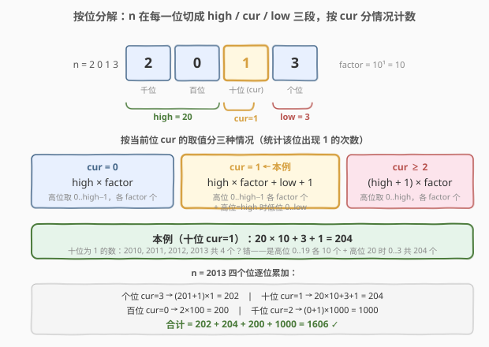
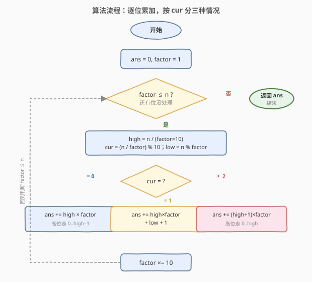
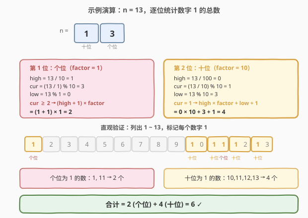

# LeetCode 数字 1 的个数 题解

## 1. 题目概述

- **标题 / 题号**：数字 1 的个数（#233，hard）
- **链接**：https://leetcode.cn/problems/number-of-digit-one/
- **难度**：困难
- **标签**：数学、数位 DP、按位计数

**题意**：给定一个整数 `n`，统计**所有小于等于 `n` 的非负整数**中数字 `1` 出现的**总次数**。

> 💡 注意是「数字 1 出现的总次数」，不是「含 1 的数的个数」。例如 `11` 中 `1` 出现了 **2 次**，要计 2。

**示例 1**：

```text
输入：n = 13
输出：6
解释：≤ 13 的数中数字 1 出现的位置如下（共 6 次）：
      1, 10, 11, 12, 13
      其中 1 出现 1 次，10 出现 1 次，11 出现 2 次，12 出现 1 次，13 出现 1 次，合计 6。
```

**示例 2**：

```text
输入：n = 0
输出：0
```

**约束**：

- $0 \le n \le 10^9$

> ⚠️ **进阶要求**：$n$ 高达 $10^9$，逐个数枚举 $O(n \log n)$ 必然超时。必须从**数的十进制结构**切入，按「位」做乘法级累加，把线性枚举压缩到对数次。

## 2. 解题思路

### 2.1 暴力思路：逐个数逐位检查

最直白的做法：遍历 $i \in [1, n]$，把 $i$ 转成字符串数其中 `1` 的个数，累加。

```text
ans = 0
for i in 1..n:
    ans += str(i).count('1')
```

每个数有 $O(\log_{10} n)$ 位，总复杂度 $O(n \log n)$。当 $n = 10^9$ 时约 $9 \times 10^9$ 次字符操作，必然超时。问题在于：**我们对每个数都从个位到最高位重新数了一遍**，做了海量重复功。换个视角：与其「逐个数」去数，不如「**逐个位**去统计——固定某一位，一次性算出该位在全区间 $[1, n]$ 上出现了多少次 1」。

### 2.2 核心观察：按位分解 + 分情况计数



关键直觉：把 $n$ 的十进制表示看作一串数字。固定考察**第 $i$ 位**（位权 $\text{factor} = 10^i$），把 $n$ 在该位上切成三段：

$$n = \text{high} \times 10^{i+1} + \text{cur} \times 10^{i} + \text{low}$$

- **high**：第 $i$ 位**之上**的高位部分，$= \lfloor n / (10^{i+1}) \rfloor = \lfloor n / (\text{factor} \times 10) \rfloor$；
- **cur**：第 $i$ 位**本身**的数字，$= \lfloor n / \text{factor} \rfloor \bmod 10$；
- **low**：第 $i$ 位**之下**的低位部分，$= n \bmod \text{factor}$。

现在问：在 $[1, n]$ 中，**第 $i$ 位等于 1 的数有多少个**？这等价于枚举所有「第 $i$ 位填 1」的合法数，高位与低位可以自由组合，但要受 $n$ 的上界约束。按 `cur` 的取值分三种情况：

| `cur` | 第 $i$ 位为 1 的个数 | 直觉解释 |
|-------|---------------------|----------|
| $= 0$ | $\text{high} \times \text{factor}$ | 高位只能取 $0 \dots \text{high}-1$（取到 high 时该位已不可能为 1，因为 cur=0 < 1），每个高位对应 factor 个低位组合 |
| $= 1$ | $\text{high} \times \text{factor} + \text{low} + 1$ | 高位取 $0 \dots \text{high}-1$ 各贡献 factor 个；高位取到 high 时，低位只能取 $0 \dots \text{low}$ 共 $\text{low}+1$ 个（贴住上界） |
| $\ge 2$ | $(\text{high} + 1) \times \text{factor}$ | 高位可取 $0 \dots \text{high}$（取到 high 时因 cur ≥ 2 > 1，第 i 位填 1 仍不越界），每个高位对应 factor 个 |

> 💡 **统一记忆**：当 `cur > 1` 时该位「能填 1 且不贴上界」，高位可放心走 $0 \dots \text{high}$，共 $(\text{high}+1) \times \text{factor}$；当 `cur == 1` 时该位「能填 1 但会贴上界」，高位走 $0 \dots \text{high}-1$ 是安全的（贡献 $\text{high} \times \text{factor}$），高位走 high 时低位被卡在 $0 \dots \text{low}$（再补 $\text{low}+1$）；当 `cur == 0` 时该位「填 1 必然越界」，高位只能走 $0 \dots \text{high}-1$，共 $\text{high} \times \text{factor}$。三式可合并为：
>
> $$\text{cnt}_i = \begin{cases} \text{high} \times \text{factor} & \text{cur} = 0 \\ \text{high} \times \text{factor} + \text{low} + 1 & \text{cur} = 1 \\ (\text{high} + 1) \times \text{factor} & \text{cur} \ge 2 \end{cases}$$

> ⚠️ **为什么是「第 i 位为 1 的个数」而不是「该数含几个 1」？** 因为我们按位独立计数后**求和**：每个 1 都唯一归属于某一位，逐位统计「该位出现 1 的次数」再累加，就得到数字 1 的总出现次数。这种「按维度拆解再求和」的思路与 [172. 阶乘后的零](../0101-0200/172_阶乘后的零.md) 用勒让德公式分层累加 $5$ 的因子数同源——都是把「全局计数」分解为「各幂次独立贡献」之和。

### 2.3 算法流程图



流程无递归、无回溯，只有一层按位循环：

1. 初始化 `ans = 0, factor = 1`（从个位起）。
2. 当 `factor ≤ n`（还有位没处理）：
   - 计算 `high = n / (factor × 10)`、`cur = (n / factor) % 10`、`low = n % factor`；
   - 按 `cur` 的三情况之一累加到 `ans`；
   - `factor *= 10`，处理更高一位。
3. 返回 `ans`。

> 💡 **循环条件用 `factor ≤ n` 而非固定「位数」**：当 `factor` 超过 $n$ 时，更高位必然全为 0（`high = 0, cur = 0`），贡献为 0，自然终止。这样无需预先求 $n$ 的位数，代码更简洁。

### 2.4 示例演算



以 `n = 13` 为例，共有 2 个有效位：

| 位 | factor | high | cur | low | 情况 | 该位为 1 的个数 | 说明 |
|----|--------|------|-----|-----|------|----------------|------|
| 个位 | 1 | $13/10 = 1$ | $13\%10 = 3$ | $13\%1 = 0$ | cur ≥ 2 | $(1+1)\times 1 = 2$ | 个位为 1 的数：1, 11 → 2 个 |
| 十位 | 10 | $13/100 = 0$ | $(13/10)\%10 = 1$ | $13\%10 = 3$ | cur = 1 | $0\times 10 + 3 + 1 = 4$ | 十位为 1 的数：10, 11, 12, 13 → 4 个 |

合计 $= 2 + 4 = 6$，与示例 1 一致 ⭐。

> ⚠️ **注意 `11` 被计了两次**：个位统计时 `11` 的个位是 1（计 1 次），十位统计时 `11` 的十位也是 1（再计 1 次）。这正是「按位独立计数再求和」的精髓——**同一个数的多个 1 分属于不同位，各计各的**，最终总数才正确。若按「含 1 的数的个数」统计则会漏算 `11` 的第二个 1。

## 3. 参考代码

### C++

```cpp
class Solution {
  public:
    int countDigitOne(int n) {
        int ans = 0;
        long long factor = 1;            // 用 long long 避免 factor*10 溢出
        while (factor <= n) {
            int high = n / (factor * 10);
            int cur = (n / factor) % 10;
            int low = n % factor;
            if (cur == 0) {
                ans += high * factor;
            } else if (cur == 1) {
                ans += high * factor + low + 1;
            } else {
                ans += (high + 1) * factor;
            }
            factor *= 10;
        }
        return ans;
    }
};
```

### Python

```python
class Solution:
    def countDigitOne(self, n: int) -> int:
        ans = 0
        factor = 1
        while factor <= n:
            high, cur, low = n // (factor * 10), (n // factor) % 10, n % factor
            if cur == 0:
                ans += high * factor
            elif cur == 1:
                ans += high * factor + low + 1
            else:
                ans += (high + 1) * factor
            factor *= 10
        return ans
```

> 💡 **类型选择**：$n \le 10^9$，最终答案上界约 $9 \times 10^8$（见第 4 节），`int` 足以容纳。但 `factor` 在末轮会达到 $10^9$，`factor * 10` 达 $10^{10}$ 超过 32 位 `int` 上界（$\approx 2.1 \times 10^9$），故 C++ 中 `factor` 必须用 `long long`，否则 `high = n / (factor * 10)` 会因中间溢出得到错误值。Python 整数任意精度，无此顾虑。

## 4. 复杂度分析

| 维度 | 复杂度 | 说明 |
|------|--------|------|
| 时间复杂度 | $O(\log_{10} n)$ | 循环次数 $= n$ 的十进制位数 $= \lfloor \log_{10} n \rfloor + 1$。$n = 10^9$ 时仅 10 轮，每轮 $O(1)$ 整除与取模 |
| 空间复杂度 | $O(1)$ | 仅 `ans`、`factor`、`high`、`cur`、`low` 五个变量，与输入规模无关 |

> ⚠️ **答案上界为何不会溢出 `int`？** $n \le 10^9$ 共 10 位。每一位为 1 的个数上界约为 $n/10 \approx 10^8$，10 位合计不超过 $10 \times 10^8 / \text{平均概率}$。精确地，$n = 10^9$ 时答案为 $900000001 < 2^{31}-1 \approx 2.1 \times 10^9$，`int` 完全够用。但若约束放宽到 $n \le 2^{31}-1$，答案可达 $\approx 2.97 \times 10^9$ 溢出 `int`——这也是本题约束卡在 $10^9$ 的原因之一。

> 💡 **对数时间的本质**：与 [172. 阶乘后的零](../0101-0200/172_阶乘后的零.md) 一样，我们没有遍历 $1 \sim n$ 的每个数，而是按十进制位「分层」计数——每一位一次 $O(1)$ 计算，位数 $\log_{10} n$。这是**数的进制结构**带来的降维：把 $O(n)$ 的线性枚举压缩为 $O(\log n)$ 的按位累加。

## 5. 扩展：数位 DP 通用框架

按位分解的闭合公式高效但「只针对数字 1」。若问题升级为「统计 $[1, n]$ 中满足某位约束的数」（如不含连续 1、各位数字之和为定值等），就需要**数位 DP（Digit DP）**——一套通用的记忆化搜索模板。

核心思想：把 $n$ 转成数字串 $s$，从高位到低位逐位「填数」，用 `tight` 标记前缀是否贴住 $n$ 的上界（贴住则当前位上界为 $s[i]$，否则为 9）。本题用数位 DP 统计 1 的总次数，可让 `dfs(i, tight)` 同时返回「合法后缀的方案数」与「这些后缀中 1 的总个数」二元组：

```python
from functools import lru_cache

class Solution:
    def countDigitOne(self, n: int) -> int:
        s = str(n)

        @lru_cache(None)
        def dfs(i: int, tight: bool):
            # 返回 (方案数, 数字 1 的总个数)
            if i == len(s):
                return (1, 0)               # 空后缀：1 种方案，0 个 1
            up = int(s[i]) if tight else 9
            ways, ones = 0, 0
            for d in range(up + 1):
                w, o = dfs(i + 1, tight and d == up)
                ways += w
                ones += o + (w if d == 1 else 0)   # 该位填 1：每个后缀各多 1 个 1
            return (ways, ones)

        return dfs(0, True)[1]
```

**关键在 `ones += o + (w if d == 1 else 0)`**：后缀本身贡献 $o$ 个 1；若当前位填 1，则 $w$ 个后缀每个再多 1 个 1，故再补 $w$。这样把「1 的计数」沿搜索树自底向上汇总。

| 解法 | 时间 | 空间 | 适用场景 |
|------|------|------|----------|
| 按位分解闭合公式 | $O(\log n)$ | $O(1)$ | 仅统计某特定数字出现次数，最快最简洁，本题首选 |
| 数位 DP | $O(\log n \times \text{状态数})$ | $O(\log n \times \text{状态数})$ | 需要任意位约束（连续 1、数位和、大小关系等），通用性强 |

> 💡 **数位 DP 的通用价值**：闭合公式是「统计单一数字」的特例最优解，但一旦约束变复杂（如「不含连续 1」「各位数位和等于 k」「数字递增」），闭合公式难以推导，而数位 DP 只需在 `dfs` 状态里加一个维度（如 `prev`、`sum`）即可适配。它是「$[1, n]$ 上满足数位级约束的计数」问题的统一框架，详见下方练习题 [600. 不含连续 1 的非负整数](https://leetcode.cn/problems/non-negative-integers-without-consecutive-ones/)、[902. 最大为 N 的数字组合](https://leetcode.cn/problems/numbers-at-most-n-given-digit-set/)。

> ⚠️ **统计数字 0 的特殊性**：若把本题改成「统计数字 0 的总次数」，需额外处理**前导零**——最高位不能为 0，否则会把 `017` 误计为含一个 0。闭合公式中 0 的计数需从 `high` 起减去前导零影响（`cur == 0` 时改为 `(high - 1) * factor` 当该位非最高有效位等），数位 DP 中则加一个 `started` 状态标记「是否已开始填非零位」。本题统计 1 无此问题。

## 6. 面试要点

1. **为什么按位分解能做到 $O(\log n)$？**

   > 数字 1 的每个出现都唯一归属于某一位，于是把「$[1,n]$ 中 1 的总次数」拆成「每一位为 1 的次数之和」。对每一位，用 `high/cur/low` 三段在 $O(1)$ 内算出该位为 1 的个数，无需枚举每个数。位数 $= \log_{10} n$，故总时间 $O(\log n)$。核心是把「全局计数」分解为「各维度独立贡献」之和。

2. **三种情况（cur=0/1/≥2）的公式怎么推出来？**

   > 固定第 $i$ 位填 1，问高位和低位能怎样组合且整体 $\le n$。① `cur=0`：高位取到 high 时该位已是 0 < 1 必越界，故高位只走 $0 \dots \text{high}-1$，每个配 factor 个低位 → $\text{high} \times \text{factor}$。② `cur=1`：高位走 $0 \dots \text{high}-1$ 安全（$\text{high} \times \text{factor}$）；高位走 high 时低位被卡在 $0 \dots \text{low}$（再补 $\text{low}+1$）。③ `cur≥2`：高位走到 high 时该位填 1 仍 < cur 不越界，故高位可走 $0 \dots \text{high}$ → $(\text{high}+1) \times \text{factor}$。

3. **为什么 `factor` 要用 `long long`？**

   > 循环末轮 `factor` 会达到 $10^9$，计算 `high = n / (factor * 10)` 时 `factor * 10 = 10^{10}` 超过 32 位 `int` 上界 $\approx 2.1 \times 10^9$，中间结果溢出导致 `high` 算错。把 `factor` 声明为 `long long` 即可让 `factor * 10` 在 64 位下运算。也可改写 `high = n / factor / 10`（利用 $\lfloor\lfloor n/a\rfloor/b\rfloor = \lfloor n/(ab)\rfloor$）规避溢出，但 `long long` 更直白。

4. **为什么 `11` 被计了两次是对的？**

   > 题目问的是「数字 1 出现的总次数」而非「含 1 的数的个数」。`11` 含两个 1，分别归属于个位与十位。按位统计时，个位统计计入其个位的 1，十位统计计入其十位的 1，各计 1 次共 2 次——与 `11` 实际含 2 个 1 一致。若误按「含 1 的数」只计 1 次，就会漏算。这正是按位独立计数再求和的合理性所在。

5. **闭合公式和数位 DP 该用哪个？**

   > 本题只统计数字 1，闭合公式 $O(\log n)$ / $O(1)$ 是最优解，面试首选。但若约束升级（如「不含连续 1」「数位和为 k」「数字来自给定集合」），闭合公式难以推导，数位 DP 则只需加状态维度即可通用适配。建议面试先给闭合公式，再提一句「更复杂的数位约束可用数位 DP 模板」展示视野。

6. **如果改成统计数字 $d$（$0 \le d \le 9$）的次数，怎么改？**

   > 对 $d \in \{1, \dots, 9\}$，把三情况中的「1」换成 $d$：`cur < d` → $\text{high} \times \text{factor}$；`cur == d` → $\text{high} \times \text{factor} + \text{low} + 1$；`cur > d` → $(\text{high}+1) \times \text{factor}$。对 $d = 0$ 需额外扣除前导零（最高位不能为 0），公式略有调整。本题统计 1 无前导零问题。

> 💡 **一句话总结**：233 是「按位分解 + 分情况计数」的招牌题——把 $n$ 在每一位切成 `high/cur/low` 三段，按 `cur ∈ {0, 1, ≥2}` 三情况用 $O(1)$ 算出该位为 1 的个数，逐位累加即得总数，$O(\log n)$ 时间 $O(1)$ 空间。核心洞察是「每个 1 唯一归属于某一位」，与 172 勒让德公式「每个 5 因子归属于某一层幂」同构——都是把全局计数拆成各维度独立贡献之和。

## 同类练习题

| # | 题目 | 与本题的关联 |
|---|------|-------------|
| 剑指 Offer 43 | [1～n 整数中 1 出现的次数](https://leetcode.cn/problems/1nzheng-shu-zhong-1chu-xian-de-ci-shu-lcof/) | 与本题完全等价（LCR 162），同一套按位分解公式，可作为另一份题面练习 |
| 172 | [阶乘后的零](https://leetcode.cn/problems/factorial-trailing-zeroes/)（[站内题解](../0101-0200/172_阶乘后的零.md)） | 同为「按幂分层累加」的数论计数题，对比「$5$ 进制位权」与「$10$ 进制位权」两套分解——一个数因子个数、一个数数字出现次数 |
| 600 | [不含连续 1 的非负整数](https://leetcode.cn/problems/non-negative-integers-without-consecutive-ones/) | 数位 DP 进阶，在 `[1, n]` 上统计「二进制不含连续 1」的数个数，展示数位 DP 加 `prev` 状态维度的通用性 |
| 902 | [最大为 N 的数字组合](https://leetcode.cn/problems/numbers-at-most-n-given-digit-set/) | 数位 DP 模板题，统计用给定数字集合能组成的不超过 $n$ 的数个数，`tight` 标记的典型应用 |
| 204 | [计数质数](https://leetcode.cn/problems/count-primes/)（[站内题解](../0201-0300/204_计数质数.md)） | 同为「高效计数」题，对比「筛法枚举」与「按位公式闭合求和」两种数论/数位计数套路 |
