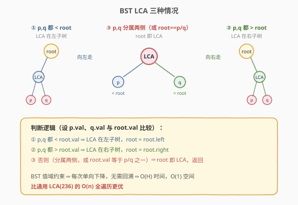
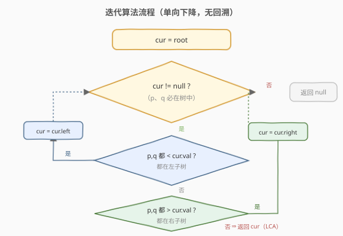
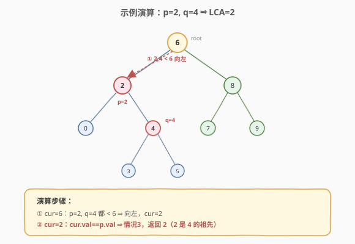

# 二叉搜索树的最近公共祖先

- **题目名称**：二叉搜索树的最近公共祖先
- **链接**：[235. 二叉搜索树的最近公共祖先](https://leetcode.cn/problems/lowest-common-ancestor-of-a-binary-search-tree/)
- **难度**：中等
- **标签**：树、BST、LCA

## 1. 题目概述

给定一棵**二叉搜索树（BST）**，找到该树中两个指定节点 `p` 和 `q` 的**最近公共祖先（LCA）**。

祖先的定义：若节点 `p` 在节点 `root` 的左/右子树中，或 `p == root`，则 `root` 是 `p` 的祖先。最近公共祖先是指 `p` 和 `q` 的所有祖先中**深度最大**的那个。本题保证 `p` 和 `q` 都存在于树中且互不相同。

**示例 1**：

```text
输入：root = [6,2,8,0,4,7,9,null,null,3,5], p = 2, q = 8
输出：6
解释：节点 2 和 8 的最近公共祖先是 6
```

**示例 2**：

```text
输入：root = [6,2,8,0,4,7,9,null,null,3,5], p = 2, q = 4
输出：2
解释：节点 2 是节点 4 的祖先，故 LCA 为 2
```

**约束条件**：

- 所有节点值互不相同
- `p != q`，且 `p`、`q` 都存在于给定的 BST 中
- **进阶**：不利用 BST 性质能否做到？（参考 236 题）

---

## 2. 解题思路

### 2.1 暴力思路：通用 LCA（忽略 BST 性质）

用 [236. 二叉树的最近公共祖先](https://leetcode.cn/problems/lowest-common-ancestor-of-a-binary-tree/) 的通用做法：后序 DFS 搜索 `p` 和 `q`，递归返回「当前子树是否包含 p/q」，左右子树都返回非空则当前节点是 LCA。时间 `O(n)`，需要遍历整棵树。本题是 BST，可以更优。

### 2.2 核心观察：BST 的值域分布决定 LCA 位置



BST 的关键性质：左子树值 < 根值 < 右子树值。对任意节点 `root` 和目标 `p`、`q`（设 `p.val < q.val`）：

1. **`q.val < root.val`**：`p`、`q` 都小于 `root`，两者都在**左子树**，LCA 在左子树，向左走。
2. **`p.val > root.val`**：`p`、`q` 都大于 `root`，两者都在**右子树**，LCA 在右子树，向右走。
3. **否则**：`p`、`q` 分布在 `root` 两侧（或 `root` 本身就是 `p` 或 `q`），`root` 即 LCA，返回。

> 💡 情况 3 涵盖两种子情形：`p.val < root.val < q.val`（分属左右子树），或 `root.val == p.val`/`root.val == q.val`（root 本身是某个目标，由于另一目标在其子树中，root 即 LCA）。

### 2.3 算法流程图



### 2.4 示例演算



以 `root = [6,2,8,0,4,7,9,null,null,3,5]`，`p = 2, q = 4` 为例（`p.val=2 < q.val=4`）：

| 步骤 | 当前 root | p.val | q.val | 判断 | 动作 |
|------|-----------|-------|-------|------|------|
| 1    | 6         | 2     | 4     | q.val=4 < 6 ⇒ 都在左子树 | 向左走到 2 |
| 2    | 2         | 2     | 4     | root.val == p.val ⇒ 情况3 | 返回 2 |

`2` 是 `4` 的祖先，故 LCA 为 `2`。

再看 `p = 2, q = 8`：

| 步骤 | 当前 root | p.val | q.val | 判断 | 动作 |
|------|-----------|-------|-------|------|------|
| 1    | 6         | 2     | 8     | 2 < 6 < 8 ⇒ 分属两侧 | 返回 6 |

`6` 是 LCA。

---

## 3. 参考代码

### C++

```cpp
class Solution {
  public:
    TreeNode* lowestCommonAncestor(TreeNode* root, TreeNode* p, TreeNode* q) {
        // 迭代法：BST 不需要回溯，沿值域单向下降
        while (root) {
            if (p->val < root->val && q->val < root->val) {
                root = root->left;                 // 都在左子树
            } else if (p->val > root->val && q->val > root->val) {
                root = root->right;                // 都在右子树
            } else {
                return root;                        // 分属两侧或 root==p/q
            }
        }
        return nullptr;                             // 不会到达（p、q 必在树中）
    }
};
```

### Python

```python
class Solution:
    def lowestCommonAncestor(self, root: 'TreeNode', p: 'TreeNode', q: 'TreeNode') -> 'TreeNode':
        # 迭代法
        while root:
            if p.val < root.val and q.val < root.val:
                root = root.left                    # 都在左子树
            elif p.val > root.val and q.val > root.val:
                root = root.right                   # 都在右子树
            else:
                return root                         # 分属两侧或 root==p/q
        return None
```

**递归版**：

```cpp
TreeNode* lowestCommonAncestor(TreeNode* root, TreeNode* p, TreeNode* q) {
    if (p->val < root->val && q->val < root->val)
        return lowestCommonAncestor(root->left, p, q);
    if (p->val > root->val && q->val > root->val)
        return lowestCommonAncestor(root->right, p, q);
    return root;
}
```

> 💡 BST 的 LCA **无需回溯**：每次比较后单向下降到左或右子树，路径唯一确定。因此迭代法天然适合，无需栈或后序遍历。这是 BST LCA 比普通树 LCA（236）更简单的根本原因。

---

## 4. 复杂度分析

| 维度 | 复杂度 | 说明 |
|------|--------|------|
| 时间复杂度 | O(H) | 从根沿一条路径下降到 LCA，最多走树高 H 步 |
| 空间复杂度 | O(1) | 迭代法仅用常数指针；递归法 O(H) 栈空间 |

> 💡 平衡 BST 时 `H = O(log n)`，链状退化时 `H = O(n)`。比通用 LCA（236，必须 `O(n)` 全遍历）更优。

---

## 5. 扩展：BST LCA vs 普通树 LCA（236）

| 维度 | 235（BST LCA） | 236（普通树 LCA） |
|------|----------------|-------------------|
| 利用 BST 性质 | 是 | 否（任意二叉树） |
| 算法 | 值域比较单向下降 | 后序 DFS，左右子树返回值判断 |
| 时间 | O(H) | O(n) |
| 空间 | O(1) 迭代 / O(H) 递归 | O(H) 递归栈 |
| 是否回溯 | 否 | 是（需汇总左右子树结果） |

> ⚠️ 235 的解法**不能**用于 236（无 BST 性质无法单向下降）；236 的解法**可以**用于 235，但放弃了 BST 带来的优化。面试若题目是 BST，务必用 235 的值域下降法。

---

## 6. 面试要点

1. **为什么 BST 的 LCA 不需要回溯？**
   - BST 的值域约束保证：对于任意 `root`，`p` 和 `q` 要么都在左、要么都在右、要么分属两侧。这三种情况互斥且唯一，每次比较就能确定下一步走向，路径不回溯。普通树没有这种约束，必须遍历左右子树后汇总。

2. **情况 3「分属两侧」包含哪些子情形？**
   - 两种：① `p.val < root.val < q.val`，p、q 分在左右子树；② `root.val == p.val` 或 `root.val == q.val`，root 本身是目标之一，另一目标在其子树内，root 即 LCA。

3. **需要保证 p.val < q.val 吗？**
   - 不需要。代码用 `p->val < root->val && q->val < root->val` 同时判断两者，不依赖大小顺序。即使 p.val > q.val，逻辑仍正确。

4. **迭代法和递归法哪个更好？**
   - 迭代法更好：BST LCA 是单向下降，无回溯，迭代天然 `O(1)` 空间，且代码更短。递归法因递归栈占用 `O(H)` 空间。面试推荐写迭代版。

5. **如果 p 或 q 不在树中怎么办？**
   - 本题保证都在。若不保证，迭代法会在走到 null 时返回 null（表示找不到）；递归法类似。需额外处理，但本题无需考虑。

---

## 7. 同类练习题

- [236. 二叉树的最近公共祖先](https://leetcode.cn/problems/lowest-common-ancestor-of-a-binary-tree/)（[题解](../../week1/day5/二叉树的最近公共祖先.md)）：通用 LCA，后序 DFS
- [1644. 二叉树的最近公共祖先 II](https://leetcode.cn/problems/lowest-common-ancestor-of-a-binary-tree-ii/)：节点可能不存在
- [1650. 二叉树的最近公共祖先 III](https://leetcode.cn/problems/lowest-common-ancestor-of-a-binary-tree-iii/)：带父指针，迭代向上
- [98. 验证二叉搜索树](https://leetcode.cn/problems/validate-binary-search-tree/)（[题解](../../week3/day5/验证二叉搜索树.md)）：BST 值域性质的应用
- [235. 本题的迭代思维](https://leetcode.cn/problems/lowest-common-ancestor-of-a-binary-search-tree/)（[题解](二叉搜索树的最近公共祖先.md)）：单向下降无回溯的典型
