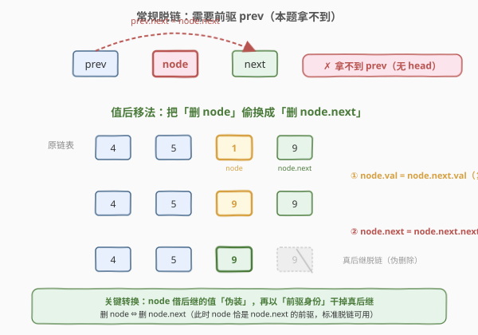
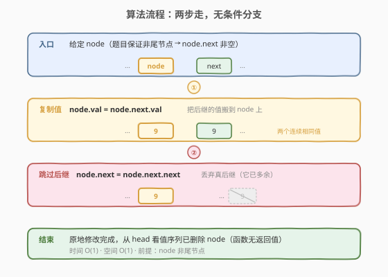
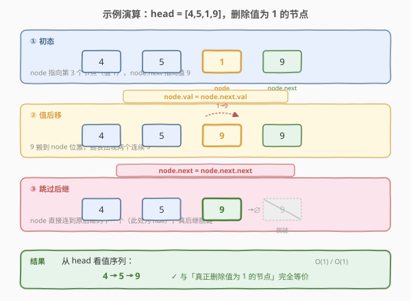

# 删除链表中的节点

- **题目名称**：删除链表中的节点
- **链接**：[237. 删除链表中的节点](https://leetcode.cn/problems/delete-node-in-a-linked-list/)
- **难度**：中等
- **标签**：链表、指针操作

## 1. 题目概述

有一个单链表的**头节点** `head` 与一个**待删除节点** `node`（`node` 是链表中的一个真实节点引用，**不是头节点**）。请你**原地删除**这个 `node`，使删除后的链表仍然保持单链表结构。

⚠️ 关键限制：**函数只接收 `node` 这一个参数，不接收 `head`**——你拿不到链表头，也无法遍历到 `node` 的前驱。此外题目保证 `node` **不是尾节点**（即 `node.next` 非空）。

**示例 1**：

```text
输入：head = [4,5,1,9], node = 5
输出：[4,1,9]
解释：给定你链表中值为 5 的第二个节点，删除后链表变为 4 -> 1 -> 9。
```

**示例 2**：

```text
输入：head = [4,5,1,9], node = 1
输出：[4,5,9]
解释：给定你链表中值为 1 的第三个节点，删除后链表变为 4 -> 5 -> 9。
```

**约束条件**：

- 链表节点数在范围 `[2, 1000]` 内
- `-1000 <= Node.val <= 1000`
- 链表中的节点值**互不相同**
- 给定的 `node` 为链表中有效的非尾节点

> 💡 这是一道**反直觉**的链表题：常规删除需要握住前驱改 `next`，而题目刻意只给你待删节点本身、切断你通往前驱的路径，逼你换一种「不靠前驱」的删除姿势——**值后移法**。

---

## 2. 解题思路

### 2.1 常规思路：握前驱脱链（被题目封死）



单链表删除一个节点的标准姿势是「握住它的前驱，让前驱的 `next` 跳过它」：

```text
prev.next = prev.next.next   // 让 prev 直接连到 node 的下一个，node 即脱链
```

这正是 [203. 移除链表元素](203_移除链表元素.md) 的做法——用哑节点 + `curr` 盯 `curr.next` 脱链。但那道题给你 `head`，你能从头遍历到任意节点的前驱。

**本题的刁难之处**：函数签名只有 `node`，**没有 `head`**。单链表节点不存前驱指针，于是你**无法回头**——既不能往回走到 `node` 的前驱，也不能从头扫一遍定位前驱。没有前驱，标准脱链法无从下手。

> ⚠️ 思路卡点：要删 `node` 就得改 `node` 的前驱的 `next`，可前驱拿不到。换个角度想——**能否让 `node` 不再是它自己？**

### 2.2 核心观察：值后移法（伪删除）

既然不能改前驱，那就**改 `node` 本身**：把 `node` 的值替换成下一个节点的值，然后删掉下一个节点。

> 💡 **关键转换**：把「删除 `node`」偷换成「删除 `node.next`」。而删 `node.next` 时，`node` 恰好就是 `node.next` 的前驱——前驱有了，标准脱链法就能用了！

具体两步：

1. **值后移**：`node.val = node.next.val`——把后继的值搬到 `node` 上。此刻链表里出现了两个连续的相同值（`node` 与 `node.next` 都持有原后继的值）。
2. **跳过后继**：`node.next = node.next.next`——让 `node` 直接连到后继的下一个，原后继节点脱链。

从外部看，`node` 这个位置仍然存在，但它已经「换芯」成了原后继的值，而原本持有那个值的真后继被丢弃。最终链表的值序列与「真正删除 `node`」完全一致。

> ⚠️ **这是「伪删除」而非真删除**：被释放的内存其实是 `node.next`，`node` 这块内存本身没被回收，只是内容被覆盖了。但在 LeetCode 判题（只看 `head` 起的值序列）和大多数面试场景下，效果等同于删除 `node`。

**为什么题目保证 `node` 不是尾节点？**

- 值后移法依赖 `node.next` 存在：要从 `node.next` 借值、借「前驱身份」。若 `node` 是尾节点，`node.next` 为空，既无值可借、也无节点可跳过，方法失效。
- 题目刻意加这条保证，让 $O(1)$ 解法存在；若允许是尾节点，就只能从头遍历找前驱（$O(n)$），见第 5 节扩展。

### 2.3 算法流程图



整个算法只需两行核心操作，无条件分支、无循环：

| 步骤 | 操作 | 作用 |
|------|------|------|
| ① 复制值 | `node.val = node.next.val` | 让 `node`「伪装」成后继 |
| ② 跳过后继 | `node.next = node.next.next` | 丢弃真后继（此时它已多余） |

> 💡 **顺序不能反**：必须先复制值再改 `next`。若先 `node.next = node.next.next`，就丢失了对原后继的引用，再也无法取它的 `val`。

### 2.4 示例演算

以 `head = [4,5,1,9]`、`node` 指向值为 `1` 的第三个节点为例：



| 步骤 | 操作 | 链表值序列 | 说明 |
|------|------|-----------|------|
| ① 初态 | — | `4 → 5 → [1] → 9` | `node` 指向第三个节点（值 1），待删 |
| ② 值后移 | `node.val = node.next.val` | `4 → 5 → [9] → 9` | 把后继的 9 搬到 `node` 上，出现两个连续 9 |
| ③ 跳过后继 | `node.next = node.next.next` | `4 → 5 → 9 → ∅` | `node` 直接连到原尾节点之后（`null`），真后继脱链 |

最终从 `head` 看到的值序列为 `4 → 5 → 9`，与「真正删除值为 1 的节点」结果一致 ✓。

示例 1（删值为 5 的第二个节点）同理：`4 → [5] → 1 → 9` → 值后移 → `4 → [1] → 1 → 9` → 跳过 → `4 → 1 → 9`。

---

## 3. 参考代码

### C++

```cpp
/**
 * Definition for singly-linked list.
 * struct ListNode {
 *     int val;
 *     ListNode *next;
 *     ListNode(int x) : val(x), next(nullptr) {}
 * };
 */
class Solution {
  public:
    void deleteNode(ListNode* node) {
        node->val = node->next->val;          // ① 值后移：伪装成后继
        node->next = node->next->next;        // ② 跳过后继：丢弃真后继
    }
};
```

### Python

```python
# Definition for singly-linked list.
# class ListNode:
#     def __init__(self, x):
#         self.val = x
#         self.next = None
class Solution:
    def deleteNode(self, node):
        node.val = node.next.val              # ① 值后移：伪装成后继
        node.next = node.next.next            # ② 跳过后继：丢弃真后继
```

> ⚠️ 注意本题函数**无返回值**（`void` / 不 return）。`node` 本身的内存地址未变，变的是它持有的值与 `next` 指向；调用方通过 `head` 遍历即可看到删除后的链表。Python 中无需手动释放被跳过的节点（GC 自动回收）。

---

## 4. 复杂度分析

| 维度 | 复杂度 | 说明 |
|------|--------|------|
| 时间复杂度 | $O(1)$ | 仅两次指针/值操作，与链表长度无关 |
| 空间复杂度 | $O(1)$ | 不开辟额外空间，原地修改 |

> 💡 这是本题的「甜点」：$O(1)$ 时间、$O(1)$ 空间删除一个节点。代价是依赖「`node` 非尾节点」这一前提，且本质是伪删除。

---

## 5. 扩展：尾节点与带附加数据的节点

### 5.1 如果 `node` 可能是尾节点怎么办？

值后移法失效（`node.next` 为空，无值可借、无节点可跳）。此时只能退回 $O(n)$ 方案：从头遍历找到 `node` 的前驱，让前驱的 `next` 置空。但题目不给你 `head`，所以**信息不足时本题无解**——这正是题目加上「`node` 不是尾节点」保证的原因。

```text
// 假设能拿到 head（题目不给，仅作对照）
prev = head
while prev.next is not node:
    prev = prev.next
prev.next = None          // node 是尾节点，前驱断尾即可
```

### 5.2 节点带额外数据时值后移法的陷阱

值后移法只搬了 `val`。若链表节点还携带**其他字段**（如 [138. 复制带随机指针的链表](../0101-0200/138_复制带随机指针的链表.md) 中的 `random` 指针、或业务数据），单纯复制 `val` 会让 `node` 持有原后继的值却保留自己的 `random`，**破坏指针语义**。此时需改为**整体节点数据搬移**（深拷贝后继的全部字段到 `node`），或退回「握前驱脱链」的标准姿势。

> 💡 **一句话总结**：值后移法是「无前驱删除」的奇技淫巧，适用于「只看值序列 + 非尾节点」的场景。一旦节点带复杂附加数据或可能为尾节点，就得回到握前驱脱链的正道。

---

## 6. 面试要点

1. **为什么不能直接用标准脱链法（改前驱的 `next`）？**

   - 标准脱链要握住待删节点的**前驱**来改 `next`。本题函数只给 `node`、不给 `head`，而单链表节点不存前驱指针，无法回头走到前驱，也无法从头扫描定位。前驱拿不到，标准法无从施展。

2. **值后移法的两步为什么不能调换顺序？**

   - 必须先 `node.val = node.next.val` 再 `node.next = node.next.next`。若先改 `next` 跳过后继，对原后继的引用就丢了，再也取不到它的 `val` 来填充 `node`。先取值、再断链，顺序不可逆。

3. **这是真正的删除吗？有什么副作用？**

   - 不是。被释放的内存是 `node.next`，`node` 本身这块内存没被回收，只是 `val` 被覆盖、`next` 被改向。这是「伪删除」——从 `head` 看值序列等价于删了 `node`，但 `node` 的地址仍存活。若外部持有 `node` 的引用并期望它保持原值，就会出问题。

4. **题目为什么保证 `node` 不是尾节点？**

   - 值后移法依赖 `node.next` 存在：要从后继借值、借「前驱身份」来跳过它。尾节点 `next` 为空，方法失效。题目加这条保证让 $O(1)$ 解法成立；若允许尾节点，只能 $O(n)$ 找前驱，但又不给 `head`，无解。

5. **如果链表节点除了 `val` 还有 `random` 指针，值后移法还成立吗？**

   - 不完全成立。只搬 `val` 会让 `node` 持原后继的值却留自己的 `random`，破坏随机指针语义。正确做法是**搬整个节点数据**（`val` 与 `random` 一起复制），或退回标准脱链。这提醒我们：值后移是「只重值」的简化，遇到附加数据要谨慎。

> 💡 **一句话总结**：237 的核心是「把删自己偷换成删后继」——`node` 借后继的值伪装，再借前驱身份干掉真后继。两步、$O(1)$，但前提是非尾节点、只看值序列。

---

## 7. 同类练习题

- [203. 移除链表元素](https://leetcode.cn/problems/remove-linked-list-elements/)（[题解](203_移除链表元素.md)）：标准脱链法——握前驱改 `next` 跳过目标节点。对照本题体会「有前驱」与「无前驱」两种删除姿势的差异
- [19. 删除链表的倒数第 N 个节点](https://leetcode.cn/problems/remove-nth-node-from-end-of-list/)（[题解](../0001-0100/19_删除链表的倒数第N个节点.md)）：同样是删一个节点需握前驱，用快慢双指针定位倒数第 n 个的前驱，哑节点统一删头边界
- [83. 删除排序链表中的重复元素](https://leetcode.cn/problems/remove-duplicates-from-sorted-list/)（[题解](../0001-0100/83_删除排序链表中的重复元素.md)）：链表删除的变体——保留一个删多余，仍是握前驱脱链，对照本题的「无前驱伪删除」
- [138. 复制带随机指针的链表](https://leetcode.cn/problems/copy-list-with-random-pointer/)（[题解](../0101-0200/138_复制带随机指针的链表.md)）：节点带 `random` 附加指针，体会值后移法只搬 `val` 在带附加数据时的陷阱
