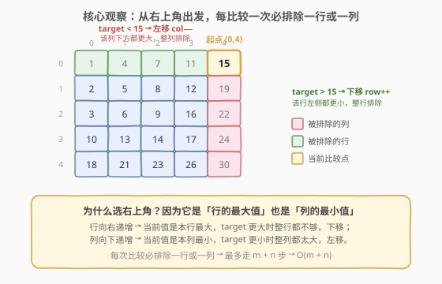
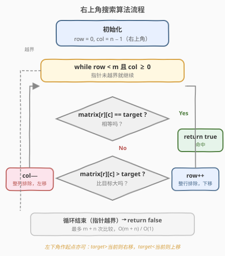
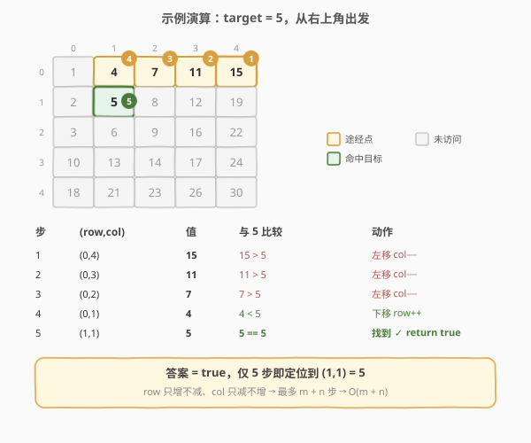

# LeetCode 搜索二维矩阵 II 题解

## 1. 题目概述

- **标题 / 题号**：搜索二维矩阵 II（#240，medium）
- **链接**：https://leetcode.cn/problems/search-a-2d-matrix-ii/
- **难度**：中等
- **标签**：数组、二分查找、分治

**题意**：编写一个高效的算法来搜索 `m x n` 矩阵 `matrix` 中的一个目标值 `target`。该矩阵具有以下性质：

- 每行的元素从左到右升序排列。
- 每列的元素从上到下升序排列。

**示例 1**：

```text
输入：matrix = [[1,4,7,11,15],[2,5,8,12,19],[3,6,9,16,22],[10,13,14,17,24],[18,21,23,26,30]], target = 5
输出：true
```

**示例 2**：

```text
输入：matrix = [[1,4,7,11,15],[2,5,8,12,19],[3,6,9,16,22],[10,13,14,17,24],[18,21,23,26,30]], target = 20
输出：false
```

**约束**：

- `m == matrix.length`
- `n == matrix[i].length`
- `1 <= n, m <= 300`
- `-10^9 <= matrix[i][j] <= 10^9`
- 每行的所有整数从左到右升序排列
- 每列的所有整数从上到下升序排列

## 2. 解题思路

### 2.1 暴力思路

遍历矩阵的每个元素逐一比较，时间复杂度 $O(m \times n)$。没有利用「行、列均有序」这一关键性质，效率低。

一个改进是**逐行二分**：每行升序，对每一行做二分查找，时间复杂度 $O(m \log n)$。这已经不错，但仍未同时利用「列也有序」的信息。

### 2.2 核心观察：从右上角出发，每步排除一行或一列



关键直觉是站在**右上角** `(0, n-1)`：由于行向右递增、列向下递增，这个位置同时是**本行最大值**与**本列最小值**。把它和 `target` 比较：

- **相等** → 直接命中。
- **`matrix[r][c] > target`** → 当前值偏大。又因为本列向下递增，下方只会更大，所以**整列都不可能**，`col--` 左移排除该列。
- **`matrix[r][c] < target`** → 当前值偏小。又因为本行向左递减，左侧只会更小，所以**整行都不可能**，`row++` 下移排除该行。

> 💡 **为什么左上角 / 右下角不行？** 左上角 `(0,0)` 是本行最小、本列最小，无论 `target` 偏大还是偏小，右方和下方都「既有更大也有更小」，无法确定排除方向。只有**行最大与列最小交汇**的右上角（或行最小与列最大交汇的左下角）才能每次给出唯一的排除方向。

### 2.3 算法流程图



整个过程只有 `row`（只增不减）和 `col`（只减不增）两个指针，因此最多移动 $m + n$ 步。

### 2.4 示例演算



以 `target = 5` 为例，从右上角 `(0,4)=15` 出发：

- `15 > 5` → 整列排除，左移到 `(0,3)=11`
- `11 > 5` → 左移到 `(0,2)=7`
- `7 > 5` → 左移到 `(0,1)=4`
- `4 < 5` → 整行排除，下移到 `(1,1)=5`
- `5 == 5` → 命中，返回 `true`

仅 5 步即定位目标，远快于暴力扫描的 25 次。

## 3. 参考代码

### C++

```cpp
class Solution {
  public:
    bool searchMatrix(vector<vector<int>>& matrix, int target) {
        int m = matrix.size(), n = matrix[0].size();
        int row = 0, col = n - 1;          // 从右上角出发
        while (row < m && col >= 0) {
            int val = matrix[row][col];
            if (val == target) {
                return true;
            } else if (val > target) {
                col--;                     // 整列排除，左移
            } else {
                row++;                     // 整行排除，下移
            }
        }
        return false;
    }
};
```

### Python

```python
class Solution:
    def searchMatrix(self, matrix: List[List[int]], target: int) -> bool:
        m, n = len(matrix), len(matrix[0])
        row, col = 0, n - 1                 # 从右上角出发
        while row < m and col >= 0:
            val = matrix[row][col]
            if val == target:
                return True
            elif val > target:
                col -= 1                    # 整列排除，左移
            else:
                row += 1                    # 整行排除，下移
        return False
```

> ⚠️ **注意** 起点必须是**右上角**（或左下角），写成左上角 `(0,0)` 会因为无法判断排除方向而出错。

## 4. 复杂度分析

| 维度 | 复杂度 | 说明 |
|------|--------|------|
| 时间复杂度 | $O(m + n)$ | `row` 至多增加 $m$ 次、`col` 至多减少 $n$ 次，每次比较排除一行或一列 |
| 空间复杂度 | $O(1)$ | 只用常数个指针变量 |

## 5. 扩展：其他解法对比

| 解法 | 时间复杂度 | 说明 |
|------|-----------|------|
| 暴力扫描 | $O(m \times n)$ | 不利用有序性 |
| 逐行二分 | $O(m \log n)$ | 只利用行有序，较易想到 |
| 右上角搜索 | $O(m + n)$ | 同时利用行列有序，最优线性解 |
| 分治 / 四象限裁剪 | $O((m+n)\log(m+n))$ 思想 | 以中心为锚分四块，递归剪掉不可能的象限，常数较大 |

> 💡 当 $m$ 与 $n$ 差距悬殊时（如 $m=1$），逐行二分 $O(m \log n)$ 反而优于右上角搜索 $O(m+n)$。面试时可主动提及这一权衡，再根据数据形状选择。

### 左下角起点

从**左下角** `(m-1, 0)` 出发同样可行：它是本行最大、本列最小，方向相反——`matrix[r][c] > target` 时 `row--` 上移，`matrix[r][c] < target` 时 `col++` 右移。两者等价，任选其一即可。

## 6. 面试要点

1. **为什么选右上角而不是左上角？**

   - 右上角是「本行最大、本列最小」的交汇点，与 `target` 比较后能唯一确定排除方向（整行或整列）。左上角两个方向都无法排除，会陷入歧义。

2. **每一步排除的依据是什么？**

   - `val > target` 时利用「列向下递增」→ 本列下方全更大 → 排除整列；`val < target` 时利用「行向右递增」→ 本行左侧全更小 → 排除整行。

3. **时间复杂度为什么是** $O(m+n)$**？**

   - `row` 只增不减（至多 $m$ 次），`col` 只减不增（至多 $n$ 次），两指针各自单调，总移动不超过 $m+n$。

4. **能否用二分做到更优？**

   - 逐行二分是 $O(m \log n)$；当 $m \ll n$ 时它更优，但一般情况下 $O(m+n)$ 已是线性最优。还有分治四象限裁剪，但常数大、实现复杂，面试通常不必。

5. **如果矩阵只保证行有序、列无序（即第 74 题）该怎么做？**

   - 那是另一道题（每行首元素大于上一行末元素），可先对首列二分定位行，再对该行二分，整体 $O(\log m + \log n)$。两题条件不同，解法不可混用。

## 同类练习题

| # | 题目 | 与本题的关联 |
|---|------|-------------|
| 74 | [搜索二维矩阵](https://leetcode.cn/problems/search-a-2d-matrix/) | 先二分首列定行、再二分该行，体会条件差异带来的解法切换 |
| 378 | [有序矩阵中第 K 小的元素](https://leetcode.cn/problems/kth-smallest-element-in-a-sorted-matrix/) | 同样行列有序，用二分答案 + 右上角计数法验证 |
| 1351 | [统计有序矩阵中的负数](https://leetcode.cn/problems/count-negative-numbers-in-a-sorted-matrix/) | 行列有序，从右上角出发每步计数，$O(m+n)$ |
| 1428 | [至少有一个 1 的最左端列](https://leetcode.cn/problems/leftmost-column-with-at-least-a-one/) | 每行非降，从右上角出发找最左 1，同样套路 |
