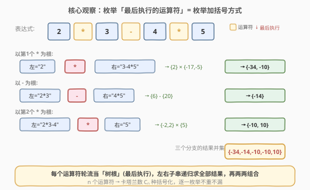
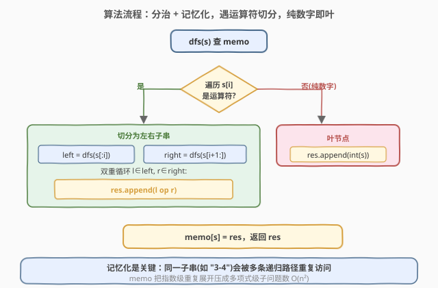
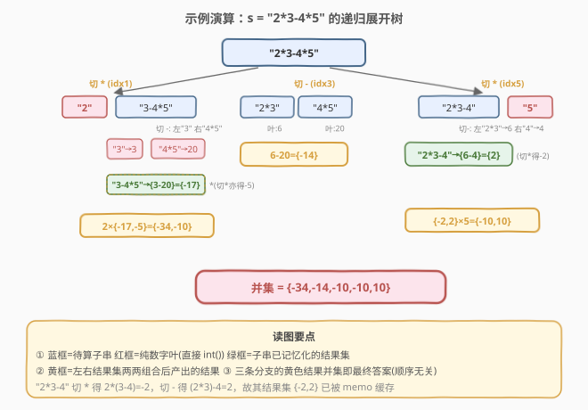

# LeetCode 为运算表达式设计优先级 题解

## 1. 题目概述

- **标题 / 题号**：为运算表达式设计优先级（#241，medium）
- **链接**：https://leetcode.cn/problems/different-ways-to-add-parentheses/
- **难度**：中等
- **标签**：递归、记忆化搜索、分治、字符串

**题意**：给定一个由**数字**和运算符 `+`、`-`、`*` 组成的字符串表达式 `expression`（**不含括号**）。返回通过**加括号改变运算优先级**所能得到的**所有可能结果**。答案顺序任意。

**示例 1**：

```text
输入：expression = "2-1-1"
输出：[0,2]
解释：((2-1)-1) = 0
     (2-(1-1)) = 2
```

**示例 2**：

```text
输入：expression = "2*3-4*5"
输出：[-34,-14,-10,-10,10]
解释：(2*(3-(4*5))) = -34
     ((2*3)-(4*5)) = -14
     ((2*(3-4))*5) = -10
     (2*((3-4)*5)) = -10
     (((2*3)-4)*5) = 10
```

**约束**：

- `1 <= expression.length <= 30`
- `expression` 由数字和运算符 `'+'`、`'-'`、`'*'` 组成
- 输入表达式中的整数在 `[0, 99]` 范围内
- 所有结果都在 32 位整数范围内

> 💡 本题**不含括号**，但通过加括号等价于「选择哪个运算符最后执行」。每个运算符轮流当「树根」，左右子串递归求全部结果再两两组合——这是**分治 + 记忆化**的经典招牌题。

## 2. 解题思路

### 2.1 暴力思路

最朴素的联想是「枚举所有括号化方式再求值」。但括号化方式数是卡塔兰数 $C_n$（$n$ 个运算符时 $C_n = \frac{1}{n+1}\binom{2n}{n}$），直接枚举括号位置既难写又重复计算严重——同一段子串会被不同括号化反复求值。

更自然的视角是**从运算符入手**：表达式的「最后一步运算」一定是某个运算符（因为全是二元运算符）。**选定哪个运算符最后执行，就等价于选定一种最外层括号**。

### 2.2 核心观察：枚举「最后执行的运算符」= 枚举加括号方式



关键直觉：把表达式看成一棵**二叉树**，运算符是内部节点、数字是叶子。**最后执行的运算符位于树根**——它把表达式切成左右两个独立子表达式。**枚举哪个运算符当根 = 枚举所有括号化**，不重不漏。

具体地，遍历 `expression` 的每个字符 `s[i]`：

- 若 `s[i]` 是运算符 `op`：以 `i` 为切点，`left = dfs(s[:i])`，`right = dfs(s[i+1:])`，对 `l ∈ left, r ∈ right` 计算 `l op r` 收集进结果；
- 若 `s[i]` 是数字：跳过（继续找运算符）。

**递归终止**：若一个子串**不含任何运算符**（纯数字），直接返回 `[int(s)]`——这是叶子节点。

> 为什么这样不重不漏？任何一种加括号方式，最外层括号决定了「最后执行的运算符」是唯一确定的。枚举所有运算符当根，恰好对应所有不同的最外层括号；左右子表达式同理递归。这正是**卡特兰递推** $C_n = \sum_{i=1}^{n} C_{i-1} \cdot C_{n-i}$ 的组合含义。

> ⚠️ **左右是子串，不是「运算符左边的数」**。切点 `i` 把整个表达式切成 `s[:i]` 和 `s[i+1:]` 两段，每段可能仍含多个运算符，需要继续递归求其**全部**可能结果，再做笛卡尔积。

### 2.3 算法流程图



**记忆化是关键**：同一子串（如 `"3-4"`）会被多条递归路径重复访问。用 `memo`（哈希表，键为子串）缓存每个子串的结果列表，把指数级的重复展开压成 $O(n^2)$ 个子问题。

> 💡 **为什么纯数字要单独判 `res.empty()`？** 遍历完整个串都没遇到运算符，说明 `res` 仍为空，此时 `s` 必是纯数字，执行 `res.append(int(s))` 作为叶节点返回。这比「预先判断是否含运算符」更简洁——一次遍历既找切点又顺便判叶。

### 2.4 示例演算



逐步跟踪 `s = "2*3-4*5"`，三个运算符各当一次根：

- **切第 1 个 `*`**：左 `"2"→{2}`，右 `"3-4*5"`（内部切 `-` 得 `3-20={-17}`，切 `*` 得 `(3-4)*5={-5}`，故 `{-17,-5}`）。组合 `2×{-17,-5}` → `{-34, -10}`。
- **切 `-`**：左 `"2*3"→{6}`，右 `"4*5"→{20}`。组合 `6-20` → `{-14}`。
- **切第 2 个 `*`**：左 `"2*3-4"`（切 `*` 得 `2×(3-4)={-2}`，切 `-` 得 `(2×3)-4={2}`，故 `{-2,2}`），右 `"5"→{5}`。组合 `{-2,2}×5` → `{-10, 10}`。

三条分支并集：`{-34, -14, -10, -10, 10}`，与官方答案一致。

## 3. 参考代码

### C++

```cpp
class Solution {
  public:
    vector<int> diffWaysToCompute(string expression) {
        unordered_map<string, vector<int>> memo;
        return dfs(expression, memo);
    }
  private:
    vector<int> dfs(const string& s, unordered_map<string, vector<int>>& memo) {
        if (memo.count(s)) return memo[s];
        vector<int> res;
        for (int i = 0; i < (int)s.size(); ++i) {
            char c = s[i];
            if (c == '+' || c == '-' || c == '*') {
                auto left  = dfs(s.substr(0, i), memo);
                auto right = dfs(s.substr(i + 1), memo);
                for (int l : left) {
                    for (int r : right) {
                        if (c == '+')      res.push_back(l + r);
                        else if (c == '-') res.push_back(l - r);
                        else               res.push_back(l * r);
                    }
                }
            }
        }
        if (res.empty()) res.push_back(stoi(s)); // 纯数字，叶节点
        memo[s] = res;
        return res;
    }
};
```

### Python

```python
class Solution:
    def diffWaysToCompute(self, expression: str) -> List[int]:
        @cache
        def dfs(s: str) -> List[int]:
            res = []
            for i, c in enumerate(s):
                if c in "+-*":
                    for l in dfs(s[:i]):
                        for r in dfs(s[i + 1:]):
                            res.append(l + r if c == '+' else
                                       l - r if c == '-' else
                                       l * r)
            if not res:                       # 纯数字，叶节点
                res.append(int(s))
            return res
        return dfs(expression)
```

> 💡 Python 用 `functools.cache` 自动对子串记忆化，一行装饰器替代手写 `dict`。C++ 需手传 `memo` 引用，或用 `static` 成员变量（注意多次调用需清空）。

> ⚠️ `stoi(s)` 处理纯数字子串时，数字范围 `[0, 99]` 且子串不含前导空格，安全。若输入含多位数字也兼容。

## 4. 复杂度分析

| 维度 | 复杂度 | 说明 |
|------|--------|------|
| 时间复杂度 | $O(n \cdot C_n)$，约 $O\!\left(\dfrac{4^n}{\sqrt{n}}\right)$ | $n$ 为运算符个数；最终结果数为卡塔兰数 $C_n$，每个结果由 $O(n)$ 次组合产生；记忆化消除子串重复展开 |
| 空间复杂度 | $O(n^2 \cdot C_n)$ | `memo` 存储 $O(n^2)$ 个子串，每个子串结果列表可达 $C_{k}$ 大小；递归栈深 $O(n)$ |

> 题目 $n \le 15$（长度 $\le 30$），$C_{15} \approx 9.7 \times 10^6$，但记忆化后实际子问题仅 $O(n^2) \approx 225$ 个，运行极快。无记忆化会因重复展开退化为指数级。

## 5. 扩展：卡塔兰数与括号化计数

$n$ 个运算符的表达式，加括号方式数即第 $n$ 个**卡塔兰数**：

$$C_n = \frac{1}{n+1}\binom{2n}{n}, \qquad C_0 = 1, \quad C_n = \sum_{i=1}^{n} C_{i-1}\,C_{n-i}$$

这个递推正是本题分治的组合对应：选第 $i$ 个运算符当根，左子有 $i-1$ 个运算符（$C_{i-1}$ 种），右子有 $n-i$ 个运算符（$C_{n-i}$ 种），求和得 $C_n$。卡塔兰数同样出现在：出栈序列数、二叉树形态数、括号匹配串数（[22. 括号生成](../0001-0100/22_括号生成.md)）、[96. 不同的二叉搜索树](../0001-0100/96_不同的二叉搜索树.md)。

> ⚠️ 本题结果列表可能含**重复值**（如示例 2 出现两个 `-10`），因为不同括号化可能算出相同数值。若需去重，对最终结果 `sort + unique` 即可，但题目允许重复，不必处理。

## 6. 面试要点

1. **为什么枚举「最后执行的运算符」能覆盖所有括号化？**

   - 任何一种加括号方式，最外层括号唯一确定了「最后一步」执行的运算符（树根）。反过来，给定一个运算符当根，左右子表达式的所有括号化再自由组合，就生成了所有「以该运算符为最后一步」的方案。枚举所有运算符当根，恰覆盖所有最外层括号选择，由卡特兰递推保证不重不漏。

2. **记忆化为什么必须加？不加会怎样？**

   - 不加记忆化时，同一子串（如 `"3-4*5"`）会被不同的上层切点反复展开，时间退化为指数级（远超 $C_n$，接近 $4^n$ 的重复计算）。加 `memo` 后，$O(n^2)$ 个不同子串各只算一次，把重复展开压平。本题 $n$ 小不挂也能过，但 $n$ 稍大即 TLE，面试必加。

3. **怎么判断一个子串是「纯数字」叶节点？**

   - 不必预先扫描。遍历找切点时若无任何运算符被命中，`res` 保持为空，循环后用 `if (res.empty()) res.push_back(stoi(s))` 兜底即叶。这种「找切点顺便判叶」的写法一次遍历两用，最简洁。

4. **结果里有重复值正常吗？要去重吗？**

   - 正常。不同括号化可能算出相同值（如 `(2*(3-4))*5 = -10` 与 `2*((3-4)*5) = -10`）。题目要求返回所有可能**结果**而非所有括号化方案，且顺序任意、允许重复，故直接保留。若题目改为「不同结果值」，再 `sort + unique`。

5. **能改成 DP 吗？怎么设计状态？**

   - 可以。状态为子串区间 `[l, r]`，`dp[l][r]` 存该子串的全部结果列表。按区间长度从小到大枚举，每段内枚举切点 `k`，`dp[l][r]` 由 `dp[l][k-1]` 与 `dp[k+1]` 笛卡尔积合并。本质上就是记忆化搜索的迭代版，复杂度相同。记忆化搜索写起来更短更直观，本题推荐递归 + `cache`。

## 同类练习题

| # | 题目 | 与本题的关联 |
|---|------|-------------|
| 95 | [不同的二叉搜索树 II](https://leetcode.cn/problems/unique-binary-search-trees-ii/) | 同样是「枚举根 + 左右子递归 + 笛卡尔积」的分治结构，生成所有 BST 形态，结构完全平行 |
| 96 | [不同的二叉搜索树](https://leetcode.cn/problems/unique-binary-search-trees/)（[题解](../0001-0100/96_不同的二叉搜索树.md)） | 95 的「只计数」版，卡塔兰数 DP，承接本题扩展节的计数视角 |
| 22 | [括号生成](https://leetcode.cn/problems/generate-parentheses/)（[题解](../0001-0100/22_括号生成.md)） | 卡塔兰数家族的另一招牌，回溯生成所有合法括号串 |
| 224 | [基本计算器](https://leetcode.cn/problems/basic-calculator/)（[题解](../0201-0300/224_基本计算器.md)） | 表达式求值的另一维度——给定括号求唯一值，与本题「枚举括号求所有值」对偶 |
| 89 | [格雷编码](https://leetcode.cn/problems/gray-code/)（[题解](../0001-0100/89_格雷编码.md)） | 构造型分治，镜像反射生成所有序列，思路「分治枚举全部方案」同源 |
