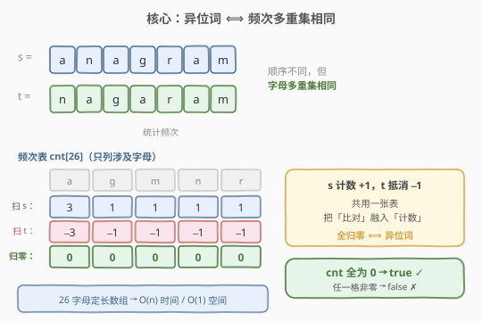
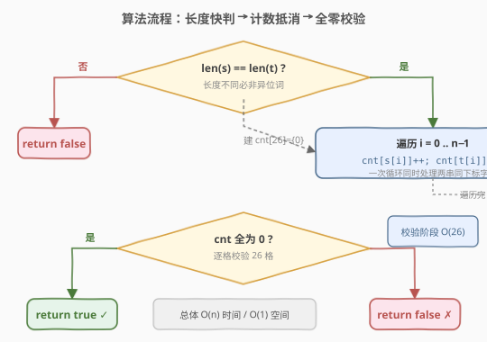
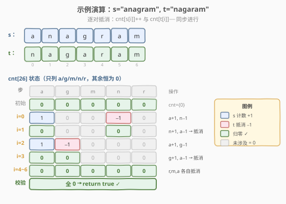

# LeetCode 有效的字母异位词 题解

## 1. 题目概述

- **标题 / 题号**：有效的字母异位词（#242，easy）
- **链接**：https://leetcode.cn/problems/valid-anagram/
- **难度**：简单
- **标签**：哈希表、字符串、计数

**题意**：给定两个字符串 `s` 和 `t`，判断 `t` 是否是 `s` 的**字母异位词**。若是返回 `true`，否则返回 `false`。

**字母异位词**：由源单词的所有字母重新排列得到的新单词，每个字母**恰好使用一次**（即两串的字符多重集合完全相同）。

**示例 1**：

```text
输入：s = "anagram", t = "nagaram"
输出：true
解释：t 是 s 的字母重排，每个字母出现次数一致。
```

**示例 2**：

```text
输入：s = "rat", t = "car"
输出：false
解释：t 中出现了 'c'，s 中没有；'r'/'a'/'t' 与 'c'/'a'/'r' 频次不同。
```

**约束**：

- $1 \leq \text{s.length}, \text{t.length} \leq 5 \times 10^4$
- `s` 和 `t` 仅包含**小写英文字母**

**进阶**：如果输入包含 **Unicode** 字符，如何适配你的解法？

> 💡 这道题是字母异位词家族的「单对判定」母题——只需判断**两个**串是否互为异位词。它向上承接 [49. 字母异位词分组](../0001-0100/49_字母异位词分组.md)（给一批串按异位词成组，需算「签名」做 key）、[438. 找到字符串中所有字母异位词](../0401-0500/438_找到字符串中所有字母异位词.md)（在长串里滑窗找所有异位词起点，频次增量更新）。三题共享同一个核心判据：**异位词 ⟺ 长度相同 + 各字符频次相同**。

## 2. 解题思路

### 2.1 暴力思路：排序后逐字符比较

最直觉的做法：把 `s` 和 `t` 各自排序，排序后两串若相等即为异位词。

```text
return sorted(s) == sorted(t)
```

时间 $O(n \log n)$（排序主导），空间 $O(n)$（排序需拷贝字符串）。能 AC，但**没有利用「只需判断频次」这一结构**——排序把字符按字典序重排，远超「统计频次」所需的 $O(n)$ 工作量。

> ⚠️ 排序法的瓶颈：它回答了一个比题目更强的疑问（「重排后两串是否逐位相同」），而题目只需回答「频次分布是否相同」。过度计算带来 $O(n \log n)$ 的代价，可优化到 $O(n)$。

### 2.2 核心观察：频次多重集相同即异位词



异位词的本质是「同一组字母的排列」，因此判据可精确刻画为：

> 💡 **频次判据**：`s` 与 `t` 互为异位词 ⟺ 二者**长度相同**且**每个字符的出现次数相同**（即字符多重集 $\{c_1, c_2, \dots\}$ 完全一致）。

由于题目限定**小写字母**（只有 $26$ 种），用一个长度为 $26$ 的计数数组即可记录完整频次分布。两步走：

1. 扫 `s`：对每个字符 `c`，`cnt[c - 'a'] += 1`；
2. 扫 `t`：对每个字符 `c`，`cnt[c - 'a'] -= 1`。

若最终 `cnt` 全为 $0$，说明 `t` 的每个字符都「抵消」了 `s` 中对应的计数 → 频次相同 → 异位词；若任一格非 $0$，说明某字符多出或缺失 → 非异位词。

> 💡 **为什么先 `+1` 再 `-1` 而不是各建一张表再逐格比对？** 共用一张表把「比对」融入「计数」——`t` 中每出现一个字符就直接抵消 `s` 的计数，扫完 `t` 即等同于完成比对。少一次 $O(26)$ 的逐格比较，且代码更短。这种「增量抵消」的思想与 [438. 找到字符串中所有字母异位词](../0401-0500/438_找到字符串中所有字母异位词.md) 的滑窗增量更新一脉相承。

### 2.3 算法流程图



流程三步：

1. **长度快判**：若 `len(s) != len(t)`，直接返回 `false`（长度不同必非异位词，这是最便宜的剪枝）。
2. **计数抵消**：遍历 `i` 从 $0$ 到 $n-1$，`cnt[s[i]-'a']++`、`cnt[t[i]-'a']--`（一次循环同时处理两串同下标字符）。
3. **全零校验**：遍历 `cnt` 数组，若任一格 $\ne 0$ 返回 `false`；全部为 $0$ 返回 `true`。

> ⚠️ **长度快判不能省**：若 `t` 比 `s` 长，循环按 `len(s)` 遍历会漏掉 `t` 的尾部字符，`cnt` 可能仍全为 $0$（例如 `s="a"`, `t="ab"`，只处理 `s[0]` 与 `t[0]` 后 `cnt['a']=0`，误判为真）。先判长度不同直接 `false`，既高效又堵住这个陷阱。

### 2.4 示例演算

以 `s = "anagram"`, `t = "nagaram"` 为例（长度均为 $7$，逐对抵消后全归零）：



| 步骤 | s[i] | t[i] | cnt 变化（仅列涉及的格） | 全零？ |
|------|------|------|--------------------------|--------|
| 初始 | — | — | 全 0 | ✓ |
| i=0 | a | n | a:+1, n:−1 → {a:1, n:−1} | ✗ |
| i=1 | n | a | n:+1, a:−1 → {a:0, n:0} | ✓ |
| i=2 | a | g | a:+1, g:−1 → {a:1, g:−1} | ✗ |
| i=3 | g | a | g:+1, a:−1 → {a:0, g:0} | ✓ |
| i=4 | r | r | r:+1−1=0 | ✓ |
| i=5 | a | a | a:+1−1=0 | ✓ |
| i=6 | m | m | m:+1−1=0 | ✓ |
| 校验 | — | — | 全 0 | ✓ → **true** |

每对字符一加一减相互抵消，最终 `cnt` 全归零，返回 `true`。

**反例**：`s = "rat"`, `t = "car"`。`i=0`：`r:+1, c:−1`；`i=1`：`a:+1−1=0`；`i=2`：`t:+1, r:−1`。最终 `cnt = {c:−1, r:0, a:0, t:1}`，存在非零格 → `false`。

## 3. 参考代码

### C++

```cpp
class Solution {
  public:
    bool isAnagram(string s, string t) {
        if (s.size() != t.size()) return false;          // 长度快判
        int cnt[26] = {0};
        for (int i = 0; i < (int)s.size(); ++i) {
            ++cnt[s[i] - 'a'];                            // s 计数 +1
            --cnt[t[i] - 'a'];                            // t 抵消 -1
        }
        for (int c : cnt) {
            if (c != 0) return false;                     // 任一格非零即非异位词
        }
        return true;
    }
};
```

### Python

```python
class Solution:
    def isAnagram(self, s: str, t: str) -> bool:
        if len(s) != len(t):
            return False
        cnt = [0] * 26
        for cs, ct in zip(s, t):
            cnt[ord(cs) - 97] += 1                        # s 计数 +1
            cnt[ord(ct) - 97] -= 1                        # t 抵消 -1
        return all(c == 0 for c in cnt)
```

> 💡 **更 Pythonic 的写法**：直接 `return Counter(s) == Counter(t)`。`Counter` 内部就是哈希频次表，等价于上述手写循环，但常数略大。面试可先写手写数组版体现对「26 字母定长」结构的利用，再提 `Counter` 作为优雅替代。

## 4. 复杂度分析

| 维度 | 计数数组法 | 排序法 |
|------|-----------|--------|
| **时间复杂度** | $O(n)$ | $O(n \log n)$ |
| **空间复杂度** | $O(1)$ | $O(n)$ |
| **适用场景** | 字符集有限（如 26 字母） | 字符集未知或需通用判定 |

> ⚠️ **空间 $O(1)$ 的来源**：计数数组大小固定为 $26$（小写字母数），与输入规模 $n$ 无关，故为 $O(1)$。若字符集扩展为整个 Unicode（约 100 万+ 码点），固定数组不再可行，需改用哈希表，空间退化为 $O(k)$，$k$ 为串中不同字符数（最坏 $O(n)$）。这是进阶问题的核心权衡，见下节。

## 5. 扩展：进阶——Unicode 字符的适配

题目进阶问「输入含 Unicode 字符怎么办」。核心矛盾：**定长数组依赖「字符集小且可枚举」这一前提**，Unicode 打破了它。

### 5.1 哈希表替代定长数组

把 `cnt[26]` 换成 `unordered_map` / `Counter`，以字符码点为 key：

```python
from collections import Counter

class Solution:
    def isAnagram(self, s: str, t: str) -> bool:
        if len(s) != len(t):
            return False
        return Counter(s) == Counter(t)        # 哈希频次表，支持任意字符
```

时间仍为 $O(n)$，空间变为 $O(k)$（$k$ 为不同字符数）。对 Unicode 完全适用，且无需关心码点范围。

> 💡 **Python 的 `Counter` 直接用字符串构造**：`Counter(s)` 会遍历 `s` 的每个字符（Python 3 中字符串按 Unicode 码点迭代，自动支持多字节字符如中文、emoji），无需手动 `ord`。

### 5.2 Unicode 的两个陷阱

1. **组合字符与预组合字符**：如 `é` 可以是单码点 `U+00E9`，也可以是 `e` + `U+0301`（组合重音）。两者视觉相同但码点序列不同，直接计数会误判为非异位词。严谨做法是先做 **Unicode 规范化**（`unicodedata.normalize('NFC', s)`）再比较。
2. **大小写 / 全半角**：若题目语义上认为 `'A'` 与 `'a'` 等价（异位词不区分大小写），需先 `casefold()`。本题约束为小写字母，无需处理。

> ⚠️ 面试中答进阶题时，主动提「Unicode 规范化」与「大小写语义」两点，能体现对国际化字符串处理的深度理解，超越「换哈希表」的表层答案。

### 5.3 排序法的通用性

排序法 `sorted(s) == sorted(t)` 天然支持 Unicode（Python 按码点排序），无需关心字符集大小，代码最短。代价是 $O(n \log n)$ 时间与 $O(n)$ 空间。当字符集巨大且不关心常数时，排序法反而是「最省心」的通用解。

## 6. 面试要点

1. **异位词的数学本质是什么？**
   - 两串字符的**多重集**（允许重复元素的集合）相同，即每个字符出现次数一致。等价表述：长度相同 + 频次分布相同。所有解法（排序、计数、哈希）都围绕这个判据展开。

2. **为什么先判长度不同直接返回 false？**
   - 长度不同 → 多重集大小不同 → 必非异位词。这是 $O(1)$ 的剪枝，既加速又堵住「循环按短串长度遍历导致漏字符」的 bug（见 2.3 的陷阱说明）。

3. **计数法为什么是 O(1) 空间？Unicode 下还成立吗？**
   - 小写字母只有 26 种，计数数组大小固定为 26，与 $n$ 无关 → $O(1)$。Unicode 下码点空间巨大（百万级），定长数组不可行，改用哈希表 → $O(k)$，$k$ 为不同字符数，最坏 $O(n)$。空间复杂度从「字符集是否有限」这一点分叉。

4. **排序法和计数法各适合什么场景？**
   - **计数法**：字符集小且已知（如 ASCII 字母/数字），$O(n)$ 时间 + $O(1)$ 空间，最优。**排序法**：字符集未知或巨大（如 Unicode 任意字符），代码最短、无需关心码点范围，$O(n \log n)$ 时间 + $O(n)$ 空间。面试先问清字符集再选解法。

5. **和 49、438 的关系是什么？**
   - 三题同根：都基于「频次多重集相同 = 异位词」这一判据。本题是**单对判定**（一次比两个串）；[49](../0001-0100/49_字母异位词分组.md) 是**批量分组**（给签名做哈希 key，把签名相同的串归一桶）；[438](../0401-0500/438_找到字符串中所有字母异位词.md) 是**滑窗扫描**（在长串里维护定长窗口频次，增量更新找所有异位词起点）。面试举一反三能体现对「频次判据」多种应用的统揽。

> 💡 **一句话总结**：异位词判定 = 频次多重集相同。小字符集用定长计数数组 $O(n)$/$O(1)$，大字符集（Unicode）退化为哈希表 $O(n)$/$O(k)$ 或排序 $O(n \log n)$/$O(n)$。先判长度、再计数抵消、最后校验全零，三步即得。

## 同类练习题

| # | 题目 | 与本题的关联 |
|---|------|-------------|
| 49 | [字母异位词分组](https://leetcode.cn/problems/group-anagrams/)（[题解](../0001-0100/49_字母异位词分组.md)） | 本题的「批量分组」版——给一批串按异位词归桶，需把频次判据升级为「签名」（排序串或计数元组）做哈希 key |
| 438 | [找到字符串中所有字母异位词](https://leetcode.cn/problems/find-all-anagrams-in-a-string/)（[题解](../0401-0500/438_找到字符串中所有字母异位词.md)） | 本题的「滑窗扫描」版——在长串里维护定长窗口频次，增量更新（进一出一）找所有异位词起点，承接本题的计数抵消思想 |
| 383 | [赎金信](https://leetcode.cn/problems/ransom-note/) | 判断 `ransomNote` 能否由 `magazine` 的字母构成（`magazine` 频次需「覆盖」`ransomNote`），计数法判定 `cnt >= 0`，是本题的「子集判定」变体 |
| 14 | [最长公共前缀](https://leetcode.cn/problems/longest-common-prefix/)（[题解](../0001-0100/14_最长公共前缀.md)） | 同为字符串简单题，纵向扫描逐字符比较，对比本题的「频次统计」与「逐位比较」两种字符串处理范式 |
