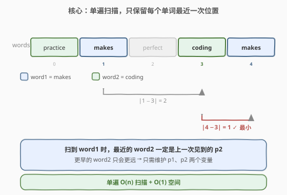
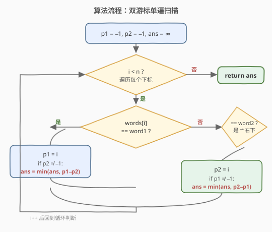
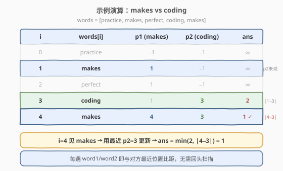

# LeetCode 最短单词距离 题解

## 1. 题目概述

- **标题 / 题号**：最短单词距离（#243，medium）
- **链接**：https://leetcode.cn/problems/shortest-word-distance/
- **难度**：中等
- **标签**：数组、字符串、双指针、单遍扫描

**题意**：给定一个字符串数组 `wordsDict` 和两个**不同**的字符串 `word1`、`word2`（二者都保证出现在数组中），返回这两个单词在数组中的**最短距离**——即各自出现位置下标之差的绝对值的最小值 $|i - j|$。

**示例 1**：

```text
输入：wordsDict = ["practice", "makes", "perfect", "coding", "makes"], word1 = "coding", word2 = "practice"
输出：3
解释：coding 在下标 3，practice 在下标 0，距离 |3 − 0| = 3。
```

**示例 2**：

```text
输入：wordsDict = ["practice", "makes", "perfect", "coding", "makes"], word1 = "makes", word2 = "coding"
输出：1
解释：makes 出现在下标 1 和 4，coding 出现在下标 3。最近的一对是 (4, 3)，距离 |4 − 3| = 1。
```

**约束**：

- $1 \leq \text{wordsDict.length} \leq 3 \times 10^4$
- $1 \leq \text{wordsDict[i].length} \leq 10$
- `wordsDict[i]` 仅包含**小写英文字母**
- `word1` 和 `word2` 都在 `wordsDict` 中，且 `word1 != word2`

> 💡 这是「单词距离」三件套的**母题**——只问一次、两个单词不同。[244. 最短单词距离 II](https://leetcode.cn/problems/shortest-word-distance-ii/) 把它升级为「设计题」（多次查询，需预处理下标）；[245. 最短单词距离 III](https://leetcode.cn/problems/shortest-word-distance-iii/) 放宽了「两单词可能相同」的约束。三题共享同一个核心：**只关心每个单词最近一次出现的位置**。

## 2. 解题思路

### 2.1 暴力思路：双重循环两两比距

最直觉的做法：枚举所有下标对 $(i, j)$，若 `wordsDict[i] == word1` 且 `wordsDict[j] == word2`，就用 $|i - j|$ 更新答案。

```text
ans = ∞
for i in range(n):
    if wordsDict[i] != word1: continue
    for j in range(n):
        if wordsDict[j] == word2:
            ans = min(ans, abs(i - j))
return ans
```

时间 $O(n^2)$，空间 $O(1)$。能 AC 小数据，但在 $n = 3 \times 10^4$ 时约 $9 \times 10^8$ 次比较，明显偏慢。瓶颈在于：**对每个 `word1` 的位置都把整个数组扫了一遍**，而真正影响答案的只是离它最近的那个 `word2`。

> ⚠️ 暴力法的浪费：它回答了「所有 word1 位置与所有 word2 位置的距离」这一远超题目所需的疑问。题目只需「最近的一对」，绝大多数配对都是无用计算。

### 2.2 核心观察：单遍扫描只保留最近位置



关键洞察是一句贪心断言：

> 💡 **最近位置定理**：当扫描到下标 `i` 处遇到 `word1` 时，离它最近的 `word2` 一定是**目前见过的最后一个 `word2`**（即游标 `p2`）。任何更早的 `word2` 下标都只会比 `p2` 离 `i` 更远，无需考虑。

理由很简单：下标沿扫描方向单调递增。设历史中 `word2` 出现在 $j_1 < j_2 < \dots < j_k$，当前 `word1` 在 $i > j_k$，则 $|i - j_k| < |i - j_{k-1}| < \dots < |i - j_1|$——最后一个 $j_k$ 严格最优。对称地，遇到 `word2` 时也只需与最近的 `p1` 比距。

于是只需两个游标：

- `p1`：最近一次见到 `word1` 的下标，初值 $-1$；
- `p2`：最近一次见到 `word2` 的下标，初值 $-1$。

从左到右扫一遍数组，命中任一单词就更新对应游标；若另一个游标已非 $-1$，就用二者之差的绝对值更新答案。

> 💡 **为什么不需回头看？** 单调性保证了「下一个见到的同侧单词只会更近」。这与归并排序中「两个有序数组求最小差值对」同构——只是把两个数组合并进了一条扫描线，在线维护各自队尾。

### 2.3 算法流程图



流程四步：

1. **初始化**：`p1 = -1`、`p2 = -1`、`ans = ∞`（用一个大于 $n$ 的数即可，如 `INT_MAX`）。
2. **遍历** `i` 从 $0$ 到 $n-1$：
   - 若 `wordsDict[i] == word1`：`p1 = i`；若 `p2 != -1`，`ans = min(ans, p1 - p2)`（此时 `p1 > p2`，差即绝对值）。
   - 若 `wordsDict[i] == word2`：`p2 = i`；若 `p1 != -1`，`ans = min(ans, p2 - p1)`。
3. **返回** `ans`。

> ⚠️ **为何不用 `abs`？** 扫描是自左向右的，更新游标时 `i` 一定严格大于历史游标，故 `p1 - p2`（`word1` 刚出现）或 `p2 - p1`（`word2` 刚出现）天然非负，省一次 `abs` 调用。写 `abs` 也对，但理解「方向性」能避免在 245（同单词）题里踩坑。

> ⚠️ **`p` 为 $-1$ 时不能比距**：初始两个游标都 $-1$，表示「对方还没出现过」，此时无配对可算，必须跳过更新。漏判会得到 $|i - (-1)| = i + 1$ 的错值。

### 2.4 示例演算

以 `wordsDict = ["practice", "makes", "perfect", "coding", "makes"]`、`word1 = "makes"`、`word2 = "coding"` 为例：



| 步骤 | words[i] | 命中 | p1 (makes) | p2 (coding) | ans | 说明 |
|------|----------|------|------------|-------------|-----|------|
| i=0 | practice | — | −1 | −1 | ∞ | 都未出现 |
| i=1 | makes | word1 | 1 | −1 | ∞ | p1←1；p2=−1 跳过 |
| i=2 | perfect | — | 1 | −1 | ∞ | 无关词 |
| i=3 | coding | word2 | 1 | 3 | 2 | p2←3；\|1−3\|=2 更新 ans |
| i=4 | makes | word1 | 4 | 3 | 1 | p1←4；\|4−3\|=1 更新 ans |

最终 `ans = 1`。注意 $i=4$ 时只与最近的 `p2=3` 比距，而**不需要**回头和 $i=1$ 时那个「更早的 makes」纠缠——单调性已保证 $|4-3|$ 优于 $|1-3|$。

**对照示例 1**（`word1="coding"`、`word2="practice"`）：$i=0$ 命中 practice → `p2=0`；$i=3$ 命中 coding → `p1=3`，`ans = 3-0 = 3`。数组里 coding 与 practice 各只出现一次，答案即为 $3$。

## 3. 参考代码

### C++

```cpp
class Solution {
  public:
    int shortestDistance(vector<string>& wordsDict,
                         string word1, string word2) {
        int p1 = -1, p2 = -1, ans = INT_MAX;
        for (int i = 0; i < (int)wordsDict.size(); ++i) {
            if (wordsDict[i] == word1) {
                p1 = i;
                if (p2 != -1) ans = min(ans, p1 - p2);   // p1 > p2 天然非负
            } else if (wordsDict[i] == word2) {
                p2 = i;
                if (p1 != -1) ans = min(ans, p2 - p1);   // p2 > p1 天然非负
            }
        }
        return ans;
    }
};
```

### Python

```python
class Solution:
    def shortestDistance(self, wordsDict: List[str],
                         word1: str, word2: str) -> int:
        p1 = p2 = -1
        ans = float('inf')
        for i, w in enumerate(wordsDict):
            if w == word1:
                p1 = i
                if p2 != -1:
                    ans = min(ans, p1 - p2)
            elif w == word2:
                p2 = i
                if p1 != -1:
                    ans = min(ans, p2 - p1)
        return ans
```

> 💡 **`else if` 而非两个 `if`**：题目保证 `word1 != word2`，一个单词不可能同时等于两者，用 `if/else if` 既能短路省一次比较，又能清晰表达「互斥分支」的语义。在 245（`word1` 可能等于 `word2`）中这一选择会变成关键差异。

## 4. 复杂度分析

| 维度 | 单遍扫描法 | 暴力双重循环 |
|------|-----------|-------------|
| **时间复杂度** | $O(n)$ | $O(n^2)$ |
| **空间复杂度** | $O(1)$ | $O(1)$ |
| **核心操作** | 每个元素至多比一次字符串相等 | 每个 word1 位置扫全表找 word2 |

> ⚠️ **时间 $O(n)$ 的来源**：循环体对每个下标只做一次字符串相等判断（`==` 对长度 $\leq 10$ 的串是 $O(10)=O(1)$），至多触发一次 `min` 更新，故整体线性。空间只有两个游标与答案，常数级。

> 💡 **字符串相等的常数**：约束保证单词长度 $\leq 10$，单次 `==` 比较最多 $10$ 次字符比对，可视作 $O(1)$。若单词很长，可预先把 `word1`/`word2` 的引用存好，比较仍是 $O(L)$ 但 $L$ 与 $n$ 无关，不影响渐近界。

## 5. 扩展：收集下标 + 双指针归并（通向 244）

除单遍扫描外，还有一种 $O(n)$ 做法：**先收集 `word1`、`word2` 的所有下标到两个有序列表 `pos1`、`pos2`**，再用双指针归并求两列表元素的最小差值。

```python
pos1 = [i for i, w in enumerate(wordsDict) if w == word1]
pos2 = [i for i, w in enumerate(wordsDict) if w == word2]
i = j = 0
ans = float('inf')
while i < len(pos1) and j < len(pos2):
    ans = min(ans, abs(pos1[i] - pos2[j]))
    if pos1[i] < pos2[j]:
        i += 1
    else:
        j += 1
return ans
```

时间 $O(n)$，空间 $O(k_1 + k_2)$（两个单词的出现次数）。比单遍扫描多用了 $O(k)$ 空间，乍看不优，但它的价值在 [244. 最短单词距离 II](https://leetcode.cn/problems/shortest-word-distance-ii/) 中爆发：那是一道**设计题**，要求支持**多次查询**不同单词对。预存「每个单词 → 有序下标列表」的哈希表后，每次查询只需对两个有序列表做双指针归并，单次查询 $O(k_1 + k_2)$，远优于每次重扫数组的 $O(n)$。

> 💡 **两种 $O(n)$ 的取舍**：单遍扫描适合「一次性查询」（本题），空间最优；收集下标适合「反复查询」（244），用空间换后续每次查询的常数。这是「在线 vs 离线」权衡的经典缩影。

## 6. 面试要点

1. **为什么只保留最近一次位置就够了？**
   - 下标随扫描单调递增。设 `word2` 历史出现在 $j_1 < j_2 < \dots < j_k$，当前 `word1` 在 $i > j_k$，则 $|i - j_k| < |i - j_{k-1}| < \dots$，最后一个 $j_k$ 严格最优。更早的位置只会更远，可安全丢弃。这是「单调性 → 贪心」的典型推论。

2. **`p1`/`p2` 初值为什么用 $-1$？能否用 $0$？**
   - $-1$ 是哨兵，表示「尚未出现」。下标从 $0$ 起，用 $0$ 会与「单词恰在下标 $0$」混淆，无法区分「没见过」与「见在下标 $0$」。任何合法下标都 $\geq 0$，故 $-1$ 是天然的「无效」标记。更新答案前必须判 `p != -1`，否则会算出 $|i - (-1)| = i + 1$ 的错值。

3. **为什么不用 `abs`？**
   - 扫描自左向右，更新游标时 `i` 严格大于历史游标，故 `p1 - p2`（`word1` 刚出现）或 `p2 - p1`（`word2` 刚出现）天然非负。省一次 `abs` 是小事，但理解「方向性」是解 245（`word1` 可能等于 `word2`）的关键——那里需合并两个游标为同一个。

4. **如果 `word1` 可能等于 `word2`（即 245）怎么办？**
   - 退化为「同一个单词的相邻两次出现位置之差最小」。无需两个游标，只维护一个 `prev`：命中目标单词时，若 `prev != -1` 就用 `i - prev` 更新答案，再 `prev = i`。本题的 `if/else if` 在 245 中合并为单个 `if`。这是三件套里最易踩的区分点。

5. **和 244（设计题）的区别？如何支持多次查询？**
   - 244 要求一个数据结构反复回答不同单词对的最短距离。预处理：遍历一次，把「每个单词 → 有序下标列表」存入哈希表。查询时取出两个列表做双指针归并求最小差值，单次 $O(k_1 + k_2)$。本题的「单遍扫描」相当于 244 里「只查一次」的退化情形，无需存表。

> 💡 **一句话总结**：两个单词的最短距离 = 单遍扫描 + 两个游标。遇到任一单词就更新游标并与对方最近位置比距，单调性保证只需「最近一个」。$O(n)$/$O(1)$，是 244/245 三件套的母题。

## 同类练习题

| # | 题目 | 与本题的关联 |
|---|------|-------------|
| 244 | [最短单词距离 II](https://leetcode.cn/problems/shortest-word-distance-ii/) | 本题的「设计题」版——要求支持多次查询，预存「单词→有序下标列表」哈希表，每次查询双指针归并求最小差值，从 $O(1)$ 空间换到 $O(n)$ 预处理空间 |
| 245 | [最短单词距离 III](https://leetcode.cn/problems/shortest-word-distance-iii/) | 放宽 `word1` 可能等于 `word2`——退化为同一单词相邻两次出现的最小间距，两游标合并为一个 `prev`，是本题「方向性」理解的试金石 |
| 219 | [存在重复元素 II](https://leetcode.cn/problems/contains-duplicate-ii/)（[题解](../0201-0300/219_存在重复元素II.md)） | 同骨架的「同单词距离判定」——维护最近一次下标，命中时判 `i - prev <= k`，把「求最小距离」改为「距离是否超阈值」 |
| 283 | [移动零](https://leetcode.cn/problems/move-zeroes/)（[题解](../0201-0300/283_移动零.md)） | 同为「单遍扫描 + 游标」范式，用快慢双指针原地分区，对照本题「双游标在线维护」的指针用法 |
