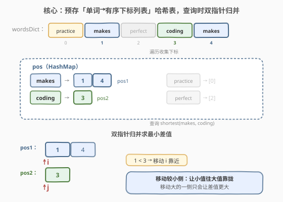
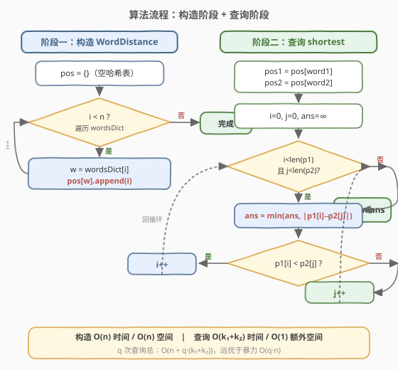
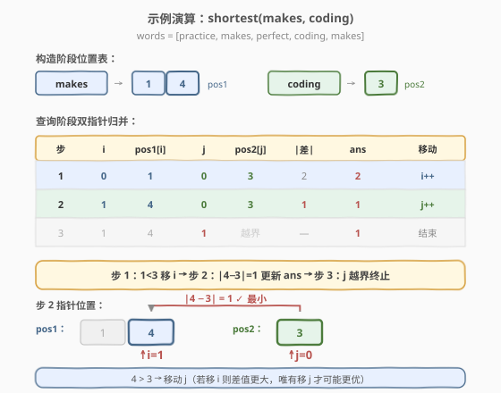

# LeetCode 最短单词距离II 题解

## 1. 题目概述

- **标题 / 题号**：最短单词距离II（#244，medium）
- **链接**：https://leetcode.cn/problems/shortest-word-distance-ii/
- **难度**：中等
- **标签**：设计、数组、哈希表、双指针

**题意**：请设计一个类，接收一个字符串数组 `wordsDict`，并支持**多次**查询：给定两个**不同**的单词 `word1`、`word2`（二者都保证出现在数组中），返回它们在数组中的**最短距离**——即各自出现位置下标之差的绝对值的最小值 $|i - j|$。

**示例 1**：

```text
输入：
["WordDistance", "shortest"]
[[["practice", "makes", "perfect", "coding", "makes"]], ["coding", "practice"]]
输出：[null, 3]
解释：coding 在下标 3，practice 在下标 0，距离 |3 − 0| = 3。
```

**示例 2**：

```text
输入：
["WordDistance", "shortest", "shortest"]
[[["practice", "makes", "perfect", "coding", "makes"]], ["makes", "coding"], ["makes", "practice"]]
输出：[null, 1, 1]
解释：
  shortest("makes", "coding")：makes 在 1 和 4，coding 在 3，最近对 (4, 3) 距离 1。
  shortest("makes", "practice")：makes 在 1 和 4，practice 在 0，最近对 (1, 0) 距离 1。
```

**约束**：

- $1 \leq \text{wordsDict.length} \leq 3 \times 10^4$
- $1 \leq \text{wordsDict[i].length} \leq 10$
- `wordsDict[i]` 仅包含**小写英文字母**
- `word1` 和 `word2` 都在 `wordsDict` 中，且 `word1 != word2`
- `shortest` 最多被调用 $5000$ 次

> 💡 这是「单词距离」三件套的**设计题版**——[243. 最短单词距离](../0201-0300/243_最短单词距离.md) 只问一次、两个单词不同，可用 $O(1)$ 空间单遍扫描；本题把查询升级为**多次反复**，于是「每次重扫数组」的 $O(n)$ 查询在 $5000$ 次调用下会到 $1.5 \times 10^8$，不可接受。[245. 最短单词距离 III](https://leetcode.cn/problems/shortest-word-distance-iii/) 则放宽了「两单词可能相同」的约束。三题共享同一核心：**只关心每个单词出现的位置序列**。

## 2. 解题思路

### 2.1 暴力思路：每次查询重扫数组

最直觉的做法：每次 `shortest` 调用都照搬 243 的单遍扫描——用两个游标 `p1`、`p2` 从左到右扫一遍 `wordsDict`，遇到 `word1`/`word2` 就更新游标并比距。

```text
shortest(word1, word2):
    p1 = -1, p2 = -1, ans = ∞
    for i in range(n):
        if wordsDict[i] == word1:
            p1 = i; if p2 != -1: ans = min(ans, p1 - p2)
        elif wordsDict[i] == word2:
            p2 = i; if p1 != -1: ans = min(ans, p2 - p1)
    return ans
```

单次查询 $O(n)$、空间 $O(1)$。问题在于 `wordsDict` 在构造时**已知且不变**，而 `shortest` 会被调用最多 $5000$ 次。$5000 \times 3 \times 10^4 = 1.5 \times 10^8$ 次字符串比较，常数偏大、明显偏慢。

> ⚠️ 暴力法的浪费：它**无视了查询之间的可复用结构**。每次扫描都在重复地遍历那些与本次查询无关的单词——它们既不是 `word1` 也不是 `word2`，却每次都要被 `==` 比较一遍。如果能**预存每个单词的出现位置**，查询时就只看两个目标单词的位置序列，跳过所有无关词。

### 2.2 核心观察：预存位置表 + 双指针归并



关键洞察是「**离线预处理换取在线查询加速**」：

> 💡 **预处理定理**：`wordsDict` 在构造时一次性给出且此后不变。把**每个单词的所有出现下标**收集到一个哈希表中，由于扫描自左向右，每个单词的下标列表天然**升序**。查询时只需取出两个有序列表，用双指针归并求最小差值。

这把「每次查询扫整个数组 $O(n)$」降为「每次查询只扫两个单词的位置列表 $O(k_1 + k_2)$」（$k_1, k_2$ 分别是两词出现次数，通常远小于 $n$）。

**构造阶段**（$O(n)$ 时间，$O(n)$ 空间）：

遍历 `wordsDict`，对下标 `i` 处的单词 `w`，把 `i` 追加到 `pos[w]` 末尾。哈希表 `pos: Map<String, List<Integer>>` 存好后永久持有。

**查询阶段**（$O(k_1 + k_2)$ 时间，$O(1)$ 额外空间）：

取出 `pos1 = pos[word1]`、`pos2 = pos[word2]`（两个升序列表），用双指针 `i`、`j` 归并求最小差值：

> 💡 **为什么移动较小侧？** 设当前 `pos1[i] < pos2[j]`，则 $|pos_1[i] - pos_2[j]| = pos_2[j] - pos_1[i]$。若移动 `j`（令 `j++`），则 `pos2[j+1] > pos2[j]`，差值只增不减——不可能更优。唯有移动 `i`（令 `i++`），让 `pos1` 往右靠拢 `pos2[j]`，才有可能缩小差值。这与 [21. 合并两个有序链表](../0001-0100/21_合并两个有序链表.md) 的归并同构——两路有序序列的同步推进，永远只前进不回退。

### 2.3 算法流程图



流程分两阶段：

**阶段一：构造 `WordDistance(wordsDict)`**

1. **初始化**空哈希表 `pos`。
2. **遍历** `i` 从 $0$ 到 $n-1$：`pos[wordsDict[i]].append(i)`。
3. 哈希表即预处理完毕，作为成员变量持有。

**阶段二：查询 `shortest(word1, word2)`**

1. **取表**：`pos1 = pos[word1]`、`pos2 = pos[word2]`。
2. **双指针归并**：`i = 0`、`j = 0`、`ans = ∞`。
   - 循环 `while i < len(pos1) and j < len(pos2)`：
     - `ans = min(ans, abs(pos1[i] - pos2[j]))`。
     - 若 `pos1[i] < pos2[j]`：`i += 1`（让小的一侧往右靠）。
     - 否则：`j += 1`。
3. **返回** `ans`。

> ⚠️ **查询中必须用 `abs`**：与 243 不同，这里 `pos1[i]` 与 `pos2[j]` 的大小关系不固定（取决于两列表交错情况），不能假设谁大谁小。243 靠「扫描方向性」省掉 `abs`，本题靠「双列表归并」则无所谓方向，直接 `abs` 最稳妥。

### 2.4 示例演算

以 `wordsDict = ["practice", "makes", "perfect", "coding", "makes"]` 为例，查询 `shortest("makes", "coding")`。



**构造阶段**建立位置表：

| 单词 | 位置列表 |
|------|---------|
| practice | [0] |
| makes | [1, 4] |
| perfect | [2] |
| coding | [3] |

**查询阶段**双指针归并 `pos1 = [1, 4]`、`pos2 = [3]`：

| 步骤 | i | pos1[i] | j | pos2[j] | \|差\| | ans | 移动 | 说明 |
|------|---|---------|---|---------|--------|-----|------|------|
| 1 | 0 | 1 | 0 | 3 | 2 | 2 | i++ | 1 < 3，右移 i 靠近 |
| 2 | 1 | 4 | 0 | 3 | 1 | 1 | j++ | 4 > 3，右移 j 靠近 |
| 3 | 1 | 4 | 1 | — | — | 1 | 结束 | j 越界，循环终止 |

最终 `ans = 1`。关键在第 1 步：`pos1[0]=1 < pos2[0]=3`，此时若移动 `j` 则 `pos2` 只会更大、差值只会增大，唯有移动 `i` 让 `pos1` 从 1 跳到 4 才有机会缩小到 1。这就是「移动较小侧」的贪心正确性。

**对照查询 `shortest("makes", "practice")`**：`pos1=[1,4]`、`pos2=[0]`。$i=0,j=0$：$|1-0|=1$，`ans=1`，$1>0 \to j{+}+$；$j=1$ 越界结束，返回 $1$。

## 3. 参考代码

### C++

```cpp
class WordDistance {
  public:
    WordDistance(vector<string>& wordsDict) {
        for (int i = 0; i < (int)wordsDict.size(); ++i)
            pos[wordsDict[i]].push_back(i);
    }

    int shortest(string word1, string word2) {
        auto& p1 = pos[word1];
        auto& p2 = pos[word2];
        int i = 0, j = 0, ans = INT_MAX;
        while (i < (int)p1.size() && j < (int)p2.size()) {
            ans = min(ans, abs(p1[i] - p2[j]));
            if (p1[i] < p2[j]) ++i;
            else                 ++j;
        }
        return ans;
    }
  private:
    unordered_map<string, vector<int>> pos;
};
```

### Python

```python
class WordDistance:

    def __init__(self, wordsDict: List[str]):
        self.pos = defaultdict(list)
        for i, w in enumerate(wordsDict):
            self.pos[w].append(i)

    def shortest(self, word1: str, word2: str) -> int:
        p1, p2 = self.pos[word1], self.pos[word2]
        i = j = 0
        ans = float('inf')
        while i < len(p1) and j < len(p2):
            ans = min(ans, abs(p1[i] - p2[j]))
            if p1[i] < p2[j]:
                i += 1
            else:
                j += 1
        return ans
```

> 💡 **`auto& p1` 而非 `auto p1`**：C++ 中 `pos[word1]` 返回 `vector<int>` 的引用。用 `auto&` 避免拷贝整个下标列表；若写 `auto p1` 则会触发一次深拷贝，查询常数翻倍。同理 Python 直接用列表引用，`self.pos[word1]` 本身返回引用不拷贝。

> 💡 **`unordered_map` vs `map`**：本题无需按键排序，`unordered_map`（哈希表）$O(1)$ 平均查找优于 `map`（红黑树）$O(\log n)$。字符串哈希对长度 $\leq 10$ 的单词常数很小。

## 4. 复杂度分析

| 维度 | 预存位置 + 双指针归并 | 暴力重扫（243 复用） |
|------|----------------------|---------------------|
| **构造时间** | $O(n)$ | $O(1)$（不预处理） |
| **构造空间** | $O(n)$ | $O(1)$ |
| **单次查询时间** | $O(k_1 + k_2)$ | $O(n)$ |
| **单次查询额外空间** | $O(1)$ | $O(1)$ |
| **$q$ 次查询总时间** | $O(n + q \cdot (k_1 + k_2))$ | $O(q \cdot n)$ |

> 💡 **$k_1 + k_2 \leq n$**：两词出现次数之和不超过数组长度。最坏情况（两词各占一半）单次查询仍为 $O(n)$，但平均情况下 $k \ll n$，预处理的优势随查询次数累积而放大。$q = 5000$、$n = 3 \times 10^4$ 时，暴力 $1.5 \times 10^8$ vs 预处理 $\sim 5000 \times \text{小常数}$，差距显著。

> ⚠️ **空间 $O(n)$ 的来源**：哈希表存了每个单词的所有下标，总和恰为 $n$（每个下标只被存一次）。这是「以空间换时间」的经典权衡——把每次查询的 $O(n)$ 降为 $O(k)$，代价是一次性 $O(n)$ 预处理空间。

## 5. 扩展：为何双指针能求有序数组最小差值对？

双指针归并求两个有序数组最小差值对的正确性，可由**反证法**证明：

设 `pos1` 升序、`pos2` 升序，最优解为 $|pos_1[a] - pos_2[b]| = \delta_{\min}$。考察双指针在到达 $(a, b)$ 前的每一步：

- 若某步 `pos1[i] < pos2[j]` 且 $i < a$：此时移动 `j` 只会令 `pos2[j]` 更大（因为 $pos_2[j{+}1] > pos_2[j] > pos_1[i]$），差值只增不减。故移动 `i` 是唯一可能缩小差值的方向，且 $i$ 最终一定会到达 $a$。
- 对称地，若 `pos1[i] >= pos2[j]` 且 $j < b$：移动 `j` 是唯一可能缩小差值的方向。

因此双指针在每一步都「贪心地朝最优对靠拢」，不会跳过最优对 $(a, b)$，最终必在到达或经过 $(a, b)$ 时记录到 $\delta_{\min}$。

> 💡 **与 243 单遍扫描的关系**：243 的「两个游标 `p1`/`p2` 各只保留最近一次」其实是本题双指针归并的**退化特例**——当两个单词各只出现一次时，$k_1 = k_2 = 1$，双指针只走一步即结束。243 的单遍扫描相当于「不预存、在扫描途中隐式地构建并消费位置」，故空间 $O(1)$；本题预存后查询时再归并，空间 $O(n)$ 但支持反复查询。

## 6. 面试要点

1. **为什么不能直接复用 243 的单遍扫描？**
   - 243 是「一次性查询」，$O(n)$ 时间 $O(1)$ 空间最优。但本题 `shortest` 会被调用最多 $5000$ 次，每次 $O(n)$ 则总 $O(qn) \approx 1.5 \times 10^8$，常数偏大。`wordsDict` 构造时已知且不变，应预处理把重复工作提前做完——这是「离线预处理 vs 在线查询」的经典分野。

2. **预处理为什么存「下标列表」而非别的结构？**
   - 最短距离 $= \min |i - j|$，本质是两个位置集合的最小差值。存下标列表后，同一下标只出现一次、天然升序（扫描顺序决定），直接适配双指针归并。存频率、存前缀和都没用——距离是「位置」的函数，不是「计数」的函数。

3. **双指针为什么移动较小侧？**
   - 设 `pos1[i] < pos2[j]`，当前差值 $= pos_2[j] - pos_1[i]$。移动 `j` 只会令 `pos2` 更大、差值更大；唯有移动 `i` 让 `pos1` 右靠才可能缩小差值。这是「两个有序序列同步推进，永远只朝可能更优的方向走」的贪心，正确性由反证法保证（见第 5 节）。

4. **如果 `word1` 可能等于 `word2`（即 245）怎么办？**
   - 预处理结构不变，但查询时若 `word1 == word2`，取出的 `pos1` 和 `pos2` 是同一个列表。双指针会原地自比得到 $0$（`abs(p[i]-p[i])=0`），这是错的——应退化为「同一列表中相邻元素的最小差值」，即遍历 `pos[word1]` 求相邻两项之差的最小值。这是 244 → 245 的关键区分点。

5. **哈希表的键为什么不会冲突？**
   - 键是字符串本身，`unordered_map` 用字符串哈希。长度 $\leq 10$ 的英文小写串哈希冲突概率极低，且 `==` 兜底校验。即使冲突，最坏退化为 $O(k)$ 链表查找，不影响渐近界。本题数据量下无性能问题。

> 💡 **一句话总结**：多次查询的最短单词距离 = 预存「单词→有序下标列表」哈希表 + 双指针归并求最小差值。构造 $O(n)$ / 查询 $O(k_1+k_2)$，是 243 单遍扫描的「离线预处理」升级版，用 $O(n)$ 空间把 $q$ 次查询从 $O(qn)$ 降到 $O(n + qk)$。

## 同类练习题

| # | 题目 | 与本题的关联 |
|---|------|-------------|
| 243 | [最短单词距离](https://leetcode.cn/problems/shortest-word-distance/)（[题解](../0201-0300/243_最短单词距离.md)） | 本题的「一次性查询」母题——两个游标单遍扫描 $O(n)$/$O(1)$，不预处理；对照本题的「预存位置表 + 双指针归并」，体会「在线 vs 离线」的取舍 |
| 245 | [最短单词距离 III](https://leetcode.cn/problems/shortest-word-distance-iii/) | 放宽 `word1` 可能等于 `word2`——预处理结构不变，但同词查询退化为「同一列表相邻元素最小差值」，是本题双指针归并的边界特例 |
| 981 | [基于时间的键值存储](https://leetcode.cn/problems/time-based-key-value-store/)（[题解](../0701-0800/981_基于时间的键值存储.md)） | 同为「设计题 + 预处理哈希表」范式——`HashMap<key, 有序数组>` + 二分查找，对照本题的 `HashMap<word, 有序下标列表>` + 双指针归并，预处理结构相同、查询策略因问题而异 |
| 21 | [合并两个有序链表](https://leetcode.cn/problems/merge-two-sorted-lists/)（[题解](../0001-0100/21_合并两个有序链表.md)） | 双指针归并的母题——两个有序序列同步推进，永远只前进不回退，本题查询阶段与之同构 |
