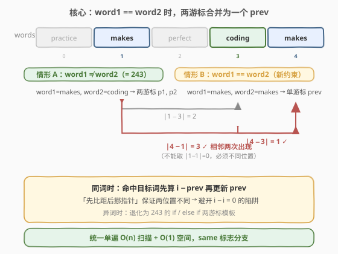
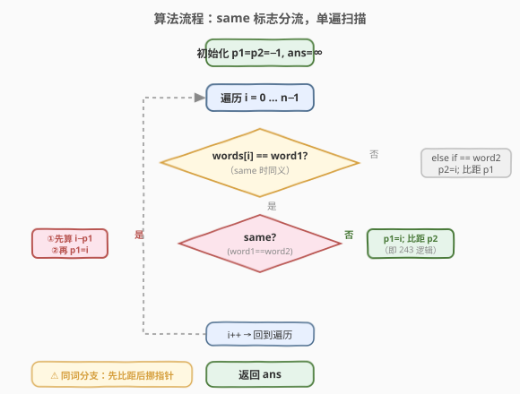
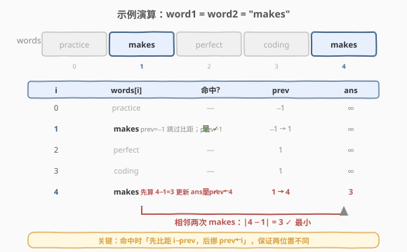

# 最短单词距离III

- **题目名称**：最短单词距离III
- **链接**：[245. 最短单词距离 III](https://leetcode.cn/problems/shortest-word-distance-iii/)
- **难度**：中等
- **标签**：数组、字符串、双指针、单遍扫描

## 1. 题目概述

给定一个字符串数组 `wordsDict` 和两个字符串 `word1`、`word2`（二者都保证出现在数组中），返回这两个单词在数组中的**最短距离**——即各自出现位置下标之差的绝对值的最小值 $|i - j|$。

与 [243. 最短单词距离](../0201-0300/243_最短单词距离.md) 的唯一区别在于：**`word1` 和 `word2` 可能相同**。当二者相同时，表示同一个单词在数组中**两个不同位置**之间的最近距离。

**示例 1**：

```text
输入：wordsDict = ["practice", "makes", "perfect", "coding", "makes"], word1 = "coding", word2 = "practice"
输出：3
解释：coding 在下标 3，practice 在下标 0，距离 |3 − 0| = 3。
```

**示例 2**：

```text
输入：wordsDict = ["practice", "makes", "perfect", "coding", "makes"], word1 = "makes", word2 = "coding"
输出：1
解释：makes 在下标 1 和 4，coding 在下标 3，最近对 (4, 3) 距离 1。
```

**示例 3**：

```text
输入：wordsDict = ["practice", "makes", "perfect", "coding", "makes"], word1 = "makes", word2 = "makes"
输出：3
解释：makes 出现在下标 1 和 4，取两个不同位置之差 |4 − 1| = 3。
```

**约束条件**：

- $1 \leq \text{wordsDict.length} \leq 3 \times 10^4$
- $1 \leq \text{wordsDict[i].length} \leq 10$
- `wordsDict[i]` 仅包含**小写英文字母**
- `word1` 和 `word2` 都在 `wordsDict` 中

> 💡 这是「单词距离」三件套的**收尾题**——[243. 最短单词距离](../0201-0300/243_最短单词距离.md) 只问一次且两词不同；[244. 最短单词距离 II](../0201-0300/244_最短单词距离II.md) 把查询升级为多次反复；本题只动了一处约束——**放宽 `word1` 可能等于 `word2`**——却逼出了 243 模板里一个隐藏的脆弱点：`if/else if` 的互斥假设。三题共享同一核心：**只关心每个单词最近一次出现的位置**。

---

## 2. 解题思路

### 2.1 暴力思路：双重循环两两比距

最直觉的做法与 243 一致：枚举所有下标对 $(i, j)$，若 `wordsDict[i] == word1` 且 `wordsDict[j] == word2` 且 $i \neq j$，就用 $|i - j|$ 更新答案。

```text
ans = ∞
for i in range(n):
    if wordsDict[i] != word1: continue
    for j in range(n):
        if i == j: continue
        if wordsDict[j] == word2:
            ans = min(ans, abs(i - j))
return ans
```

时间 $O(n^2)$，空间 $O(1)$。新增的 `i == j` 判断正是为应对 `word1 == word2`——否则同词时 $i = j$ 会让距离恒为 $0$。但 $n = 3 \times 10^4$ 时仍约 $9 \times 10^8$ 次比较，瓶颈未变：**对每个 `word1` 位置都把整个数组扫了一遍**。

> ⚠️ 暴力法的隐患：当 `word1 == word2` 时，若漏写 `i == j` 跳过，会得到 $0$ 的错值——这正是本题区别于 243 的核心陷阱，单遍扫描同样要面对它。

### 2.2 核心观察：同词时两游标合并为一个 prev



243 的单遍扫描依赖一条贪心断言：扫到 `word1` 时，离它最近的 `word2` 一定是**目前见过的最后一个 `word2`**（游标 `p2`）。这要求 `word1` 与 `word2` 是**不同**的单词——于是 `if/else if` 把每次命中干净地分流到 `p1` 或 `p2`。

当 `word1 == word2` 时，这条分流失效：一个单词同时等于两者，`if/else if` 的 `else` 永远走不到，只剩 `p1` 一个游标被反复覆盖。此时问题退化为：

> 💡 **同词退化定理**：求同一个单词**相邻两次出现位置**的最小差值。最近的一对必是**相邻出现**——若 $j_1 < j_2 < j_3$ 都是目标词，则 $|j_3 - j_1| > |j_3 - j_2|$ 且 $|j_2 - j_1| < |j_3 - j_1|$，跨过中间项的配对只增不减。

于是同词时只需一个游标 `prev`：命中目标词时，若 `prev != -1` 就用 `i - prev` 更新答案，再 `prev = i`。

> ⚠️ **顺序铁律：先比距，后挪指针**。若先 `prev = i` 再算 `i - prev`，会得到 $i - i = 0$。这一步顺序是本题最易踩的坑——它对应暴力法里那个 `i == j` 跳过，只是从「枚举对」压缩成了「相邻对」。

两种情形可以用一个 `same = (word1 == word2)` 标志在单遍扫描里统一分流：`same` 走单游标 `prev` 逻辑，`!same` 走 243 的双游标 `if/else if` 逻辑。

### 2.3 算法流程图



流程四步：

1. **初始化**：`p1 = -1`、`p2 = -1`、`ans = ∞`、`same = (word1 == word2)`。
2. **遍历** `i` 从 $0$ 到 $n-1$，若 `wordsDict[i] == word1`：
   - 若 `same`：若 `p1 != -1`，`ans = min(ans, i - p1)`（**先比距**）；然后 `p1 = i`（**后挪指针**）。
   - 否则：`p1 = i`；若 `p2 != -1`，`ans = min(ans, p1 - p2)`（243 逻辑）。
3. **否则** 若 `!same` 且 `wordsDict[i] == word2`：`p2 = i`；若 `p1 != -1`，`ans = min(ans, p2 - p1)`。
4. **返回** `ans`。

> ⚠️ **`same` 时 `else if` 分支永不触发**：当 `word1 == word2`，`words[i] == word1` 已在第一个 `if` 命中并处理，`else if (== word2)` 自然短路。这正是 `same` 分支单独处理同词的原因——把「同一次命中不能既算 word1 又算 word2」的语义显式化。

> ⚠️ **为何 `same` 分支也用 `i - p1` 而非 `abs`**：扫描自左向右，`i` 严格大于历史 `p1`，差天然非负。与 243 同理，理解方向性才能写出无 `abs` 的干净代码。

### 2.4 示例演算

以 `wordsDict = ["practice", "makes", "perfect", "coding", "makes"]`、`word1 = "makes"`、`word2 = "makes"` 为例（`same = true`）：



| 步骤 | words[i] | 命中 | prev | ans | 说明 |
|------|----------|------|------|-----|------|
| i=0 | practice | — | −1 | ∞ | 无关词 |
| i=1 | makes | ✓ | −1 → 1 | ∞ | prev=−1 跳过比距；prev←1 |
| i=2 | perfect | — | 1 | ∞ | 无关词 |
| i=3 | coding | — | 1 | ∞ | 无关词 |
| i=4 | makes | ✓ | 1 → 4 | 3 | 先算 4−1=3 更新 ans；prev←4 |

最终 `ans = 3`。注意 $i=4$ 时**先算 `i - prev = 4 - 1 = 3`，再 `prev = 4`**——若颠倒顺序会得到 `4 - 4 = 0` 的错值。

**对照异词情形**（`word1="makes"`、`word2="coding"`，`same=false`）：退化为 243。$i=1$ 命中 makes → `p1=1`；$i=3$ 命中 coding → `p2=3`，`ans = 3-1 = 2`；$i=4$ 命中 makes → `p1=4`，`ans = min(2, 4-3) = 1`。与 243 完全一致。

---

## 3. 参考代码

### C++

```cpp
class Solution {
  public:
    int shortestWordDistance(vector<string>& wordsDict,
                             string word1, string word2) {
        int p1 = -1, p2 = -1, ans = INT_MAX;
        bool same = (word1 == word2);
        for (int i = 0; i < (int)wordsDict.size(); ++i) {
            if (wordsDict[i] == word1) {
                if (same) {
                    if (p1 != -1) ans = min(ans, i - p1);   // 先比距
                    p1 = i;                                  // 后挪指针
                } else {
                    p1 = i;
                    if (p2 != -1) ans = min(ans, p1 - p2);   // 243 逻辑
                }
            } else if (!same && wordsDict[i] == word2) {
                p2 = i;
                if (p1 != -1) ans = min(ans, p2 - p1);
            }
        }
        return ans;
    }
};
```

### Python

```python
class Solution:
    def shortestWordDistance(self, wordsDict: List[str],
                             word1: str, word2: str) -> int:
        p1 = p2 = -1
        ans = float('inf')
        same = word1 == word2
        for i, w in enumerate(wordsDict):
            if w == word1:
                if same:
                    if p1 != -1:
                        ans = min(ans, i - p1)   # 先比距
                    p1 = i                       # 后挪指针
                else:
                    p1 = i
                    if p2 != -1:
                        ans = min(ans, p1 - p2)   # 243 逻辑
            elif not same and w == word2:
                p2 = i
                if p1 != -1:
                    ans = min(ans, p2 - p1)
        return ans
```

> 💡 **`else if` 的 `!same` 守卫**：当 `same` 为真，`words[i] == word1` 已处理同词命中，`else if` 即使不显式判 `!same` 也不会触发（因为 `else` 分支只在前一 `if` 不命中时进入）。但写上 `!same &&` 让「同词时绝不走双游标分支」的语义一目了然，是防御性编程的好习惯，也免去读者推理短路路径。

> 💡 **同词分支的顺序对照**：异词分支里 `p1 = i` 在前、比距在后，因为 `p1` 与 `p2` 是**不同**单词的游标，互不干扰；同词分支里只有 `p1` 一个游标，必须**先读旧值比距、再写新值**——这是「单游标自指」时的通用准则，参见 [219. 存在重复元素 II](../0201-0300/219_存在重复元素II.md) 的 `i - prev <= k` 判定。

---

## 4. 复杂度分析

| 维度 | 统一单遍扫描 | 暴力双重循环 |
|------|-------------|-------------|
| **时间复杂度** | $O(n)$ | $O(n^2)$ |
| **空间复杂度** | $O(1)$ | $O(1)$ |
| **核心操作** | 每元素至多一次 `==` + 至多一次 `min` | 每个目标位置扫全表 |

> ⚠️ **时间 $O(n)$ 的来源**：循环体对每个下标只做一次字符串相等判断（`==` 对长度 $\leq 10$ 的串是 $O(1)$），`same` 分支与异词分支互斥，至多触发一次 `min` 更新，整体线性。空间只有两个游标、一个布尔标志与答案，常数级——与 243 完全持平。

> 💡 **与 244 的对比**：244 是设计题，需支持多次查询，故用 $O(n)$ 空间预存位置表换取每次查询 $O(k_1 + k_2)$。本题虽题号紧邻，却不是设计题——仍是「一次性查询」，故沿用 243 的 $O(1)$ 空间单遍扫描，只多了一个 `same` 分支。

---

## 5. 扩展：双 `if` 陷阱与 `else if` 的语义

本题最隐蔽的陷阱是把 243 的代码「小改」时踩中：把 `if/else if` 拆成两个独立 `if`，企图让同词时两个分支都触发。

```cpp
// ⚠️ 错误写法：同词时会得到 0
if (words[i] == word1) {
    p1 = i;
    if (p2 != -1) ans = min(ans, abs(p1 - p2));
}
if (words[i] == word2) {        // 同词时这里也命中！
    p2 = i;                      // p2 被设成同一个 i
    if (p1 != -1) ans = min(ans, abs(p2 - p1));   // |i - i| = 0
}
```

当 `word1 == word2 == "makes"`、命中 $i=1$ 时：第一个 `if` 设 `p1 = 1`，第二个 `if` 设 `p2 = 1`，随即 `abs(1 - 1) = 0` 污染答案。

243 之所以安全，是因为 `word1 != word2` 的前提让 `if/else if` 的互斥成立——一个单词不可能同时是两者。245 放宽了这一前提，互斥性失效，「两个独立 `if`」就从「等价改写」变成了「致命 bug」。

> 💡 **教训**：`if/else if` 表达的是「**互斥分支**」语义，`两个 if` 表达的是「**独立可叠加**」语义。二者只在「条件不可能同时成立」时等价。一旦前提松动（本题正是「两词可能相同」），必须重新审视分支结构。这与 [27. 移除元素](../0001-0100/27_移除元素.md) 中「快慢双指针」与「左右双指针」的选择同构——指针结构的正确性依附于题目的隐含前提。

### 另一种写法：分离同词与异词两条路径

若觉得 `same` 标志内嵌在循环里分支过多，也可在循环外先分流：

```python
if word1 == word2:
    prev = -1
    for i, w in enumerate(wordsDict):
        if w == word1:
            if prev != -1:
                ans = min(ans, i - prev)
            prev = i
else:
    p1 = p2 = -1
    for i, w in enumerate(wordsDict):
        if w == word1:
            p1 = i
            if p2 != -1: ans = min(ans, p1 - p2)
        elif w == word2:
            p2 = i
            if p1 != -1: ans = min(ans, p2 - p1)
```

两条路径各自干净，可读性更佳——代价是扫描代码重复了一段。面试中两种写法皆可，统一版更显「抽象能力」，分离版更显「边界意识」。

---

## 6. 面试要点

1. **245 与 243 的唯一区别是什么？为什么它致命？**
   - 唯一区别是 `word1` 可能等于 `word2`。这使 243 的 `if/else if` 互斥假设失效——同词时一个单词同时满足两个条件，`else` 永远走不到，只剩一个游标被覆盖，且若误用两个独立 `if` 会得到 `|i - i| = 0` 的错值。必须显式处理同词分支。

2. **同词时为什么只比较「相邻两次出现」？**
   - 设目标词出现在 $j_1 < j_2 < j_3$。对 $j_3$ 而言，$|j_3 - j_2| < |j_3 - j_1|$（跳过 $j_2$ 只会更远）；对 $j_1$ 而言，$|j_2 - j_1| \leq |j_3 - j_1|$。故最优对必是某对相邻出现。维护单个 `prev` 即可覆盖所有相邻对，是「单调性 → 贪心」的典型推论。

3. **「先比距后挪指针」的顺序能否颠倒？**
   - 不能。同词时只有 `prev` 一个游标，若先 `prev = i` 再算 `i - prev`，得到 $0$。必须先读旧 `prev` 算 `i - prev`，再写新 `prev = i`。这对应暴力法里 `i == j` 的跳过——把「枚举对去重」压缩成了「单游标读写顺序」。

4. **为什么 `same` 分支里 `else if` 不会触发？**
   - `same` 为真时 `words[i] == word1` 已在第一个 `if` 命中并 `return` 式地走完同词逻辑，`else if (== word2)` 的 `else` 前置条件已不满足。显式加 `!same &&` 是防御性写法，让「同词时绝不走双游标分支」的意图一目了然。

5. **能否复用 244 的预处理位置表来解 245？**
   - 可以。预存 `pos: 单词 → 有序下标列表` 后，异词查询走双指针归并；同词查询退化为「同一列表中相邻元素最小差值」，即遍历 `pos[word1]` 求 `pos[k] - pos[k-1]` 的最小值。但 245 不是设计题、只查一次，$O(n)$ 预处理 + $O(k)$ 查询不如直接 $O(n)$ 单遍扫描 + $O(1)$ 空间。244 的预处理价值在「多次查询」时才爆发。

> 💡 **一句话总结**：245 = 243 + `same` 分支。同词时两游标合并为一个 `prev`，命中目标词「先算 `i - prev` 比距、再 `prev = i` 挪指针」保证两位置不同。$O(n)$/$O(1)$，是单词距离三件套里考验「分支语义与隐含前提」的收尾题。

---

## 7. 同类练习题

- [243. 最短单词距离](https://leetcode.cn/problems/shortest-word-distance/)（[题解](../0201-0300/243_最短单词距离.md)）：本题的「两词不同」母题——双游标 `if/else if` 单遍扫描 $O(n)$/$O(1)$，对照本题的 `same` 分支，体会「互斥前提松动后分支结构如何崩坏」
- [244. 最短单词距离 II](https://leetcode.cn/problems/shortest-word-distance-ii/)（[题解](../0201-0300/244_最短单词距离II.md)）：三件套的设计题版——预存位置表 + 双指针归并支持多次查询；同词查询退化为「同一列表相邻元素最小差值」，是本题单游标 `prev` 的「离线预处理」镜像
- [219. 存在重复元素 II](https://leetcode.cn/problems/contains-duplicate-ii/)（[题解](../0201-0300/219_存在重复元素II.md)）：同骨架的「同词距离判定」——维护 `prev` 命中时判 `i - prev <= k`，把「求最小距离」改为「距离是否超阈值」，与本题同词分支共享「先读旧值、后写新值」的单游标范式
- [283. 移动零](https://leetcode.cn/problems/move-zeroes/)（[题解](../0201-0300/283_移动零.md)）：同为「单遍扫描 + 游标」范式——快慢双指针原地分区，对照本题「单游标读写顺序决定正确性」的指针用法
