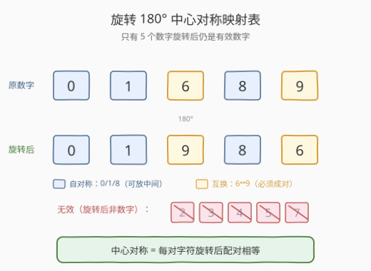
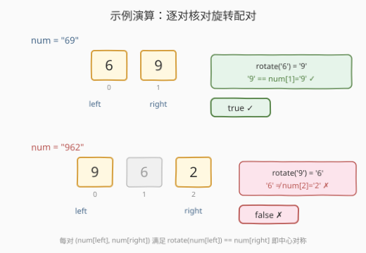

# 中心对称数

- **题目名称**：中心对称数
- **链接**：[246. 中心对称数](https://leetcode.cn/problems/strobogrammatic-number/)
- **难度**：简单
- **标签**：数学、双指针、字符串

## 1. 题目概述

给定一个表示数字的字符串 `num`，判断它是否是**中心对称数**（Strobogrammatic Number）。

中心对称数的定义：把这个数字**旋转 180°**（即倒过来看）之后，得到的数字与原数字**相同**。

只有以下 5 个数字旋转 180° 后仍是有效数字：

| 原数字 | 旋转 180° 后 |
|--------|--------------|
| 0 | 0 |
| 1 | 1 |
| 6 | 9 |
| 8 | 8 |
| 9 | 6 |

而 `2`、`3`、`4`、`5`、`7` 旋转后不是有效数字（变不成任何数字）。

**示例 1**：

```text
输入：num = "69"
输出：true
解释：旋转 180° 后，6→9、9→6，得到 "69"，与原数相同。
```

**示例 2**：

```text
输入：num = "88"
输出：true
解释：旋转 180° 后，8→8、8→8，得到 "88"，与原数相同。
```

**示例 3**：

```text
输入：num = "962"
输出：false
解释：旋转 180° 后，9→6，但右端是 2（2 本身旋转无效）；中间的 2 也不自对称。
```

**约束条件**：

- `1 <= num.length <= 50`
- `num` 只包含数字字符。

> 💡 中心对称数本质是**带旋转映射的回文**。普通回文要求 `s[i] == s[n-1-i]`；中心对称数要求 `rotate(s[i]) == s[n-1-i]`，其中 `rotate` 是上面 5 对映射。可以理解为「回文的加强版」——不仅位置对称，字符本身还得满足旋转配对关系。承接 [9 回文数](../0001-0100/9_回文数.md) 的「反转一半」与 [125 验证回文串](../0101-0200/125_验证回文串.md) 的「左右双指针」思想。

---

## 2. 解题思路

### 2.1 暴力思路：整体翻转后比较

最直觉的做法：模拟「把数字倒过来看」——先把字符串**反转**，再把每个字符按旋转表映射，得到旋转后的字符串，最后与原串比较是否相等。

```text
rotated = reverse(num)        # 先反转字符顺序
for c in rotated:
    mapped += rotate_table[c] # 再逐字符旋转映射
return mapped == num
```

以 `num = "69"` 为例：反转得 `"96"`，再映射 `9→6, 6→9` 得 `"69"`，与原串相等 → `true`。

这个方法正确，时间也是 $O(n)$，但需要 $O(n)$ 额外空间存放翻转+映射后的字符串，且遇到非法字符（2/3/4/5/7）时映射表查不到需要单独处理（返回 `false`）。

> ⚠️ 注意「反转」和「旋转」是**两步**：物理上把数字倒过来看 = 先把字符顺序反过来（反转），再把每个字符本身旋转 180°（映射）。两步缺一不可——只反转不映射，`"69"` 变 `"96"` ≠ `"69"`；只映射不反转，`"69"` 变 `"96"` 也不对。只有「反转 + 映射」合起来才等于「倒过来看」。

### 2.2 核心观察：对撞双指针 + 旋转配对

实际上不必构造完整的旋转串。中心对称的判定等价于：**对每一对关于中心对称的字符 `(num[left], num[right])`，`num[left]` 旋转 180° 后必须等于 `num[right]`**。

用对撞双指针 `left`、`right` 从两端向中间扫描：

- 查旋转表：`rotated = table[num[left]]`，若 `num[left]` 不在表中（是 2/3/4/5/7），直接 `false`；
- 核对：`rotated == num[right]`？不等则 `false`；
- `left++`，`right--`，直到 `left > right`。

对于奇数长度，`left == right` 时落在中间字符，它必须**自对称**（旋转后等于自己），即只能是 `0`/`1`/`8`——双指针模板自然覆盖：此时 `left == right`，查表得 `table[num[left]]`，必须等于 `num[left]`，正好筛掉 `6`/`9`（它们旋转后变成对方，不自等）。



> 💡 **为什么 6 和 9 必须成对出现？** 因为 `6` 旋转后是 `9`，`9` 旋转后是 `6`。它们只能出现在**关于中心对称的两个位置**上——左是 6 右就得是 9。若 6 落在正中间（奇数长度的中心位），它的旋转值 `9` ≠ `6`，双指针核对 `table['6']=='9' != num[mid]='6'` 立刻判 `false`。这就是为什么中间字符只能是 `0`/`1`/`8` 这三个「自对称」数字。

### 2.3 算法流程图


一次遍历 $O(n)$，旋转表用哈希/数组 $O(1)$ 空间（固定 10 个数字的映射），双指针本身 $O(1)$，总空间 $O(1)$。

### 2.4 示例演算

以 `num = "69"`（true）和 `num = "962"`（false）为例：



**`num = "69"`**（偶数长度）：

| `left` | `right` | `num[left]` | 旋转值 | `num[right]` | 核对 |
|--------|---------|-------------|--------|--------------|------|
| 0 | 1 | 6 | 9 | 9 | ✓ |
| 1 | 0 | — | — | — | `left > right`，循环结束 |

全程通过 → `true`。

**`num = "962"`**（奇数长度）：

| `left` | `right` | `num[left]` | 旋转值 | `num[right]` | 核对 |
|--------|---------|-------------|--------|--------------|------|
| 0 | 2 | 9 | 6 | 2 | ✗（6 ≠ 2） |

第一对即失败 → `false`。

**`num = "818"`**（奇数长度，中间字符自对称）：

| `left` | `right` | `num[left]` | 旋转值 | `num[right]` | 核对 |
|--------|---------|-------------|--------|--------------|------|
| 0 | 2 | 8 | 8 | 8 | ✓ |
| 1 | 1 | 1 | 1 | 1 | ✓（中间字符，自对称） |

全程通过 → `true`。

---

## 3. 参考代码

### C++

```cpp
// 中心对称数.cpp —— 对撞双指针 + 旋转配对表，O(n) 时间 / O(1) 空间
// 编译: g++ -O2 -std=c++17 中心对称数.cpp -o strobo
class Solution {
  public:
    bool isStrobogrammatic(string num) {
        // 旋转 180° 映射表：只有 0/1/6/8/9 合法，其余映射为 '\0' 表示非法
        char rotate[128] = {0};
        rotate['0'] = '0';
        rotate['1'] = '1';
        rotate['6'] = '9';
        rotate['8'] = '8';
        rotate['9'] = '6';
        for (int l = 0, r = (int)num.size() - 1; l <= r; ++l, --r) {
            if (rotate[num[l]] == 0) return false;        // 非法字符（2/3/4/5/7）
            if (rotate[num[l]] != num[r]) return false;   // 旋转后必须等于右端
        }
        return true;
    }
};
```

### Python

```python
class Solution:
    def isStrobogrammatic(self, num: str) -> bool:
        rotate = {'0': '0', '1': '1', '6': '9', '8': '8', '9': '6'}
        l, r = 0, len(num) - 1
        while l <= r:
            if num[l] not in rotate:                     # 非法字符（2/3/4/5/7）
                return False
            if rotate[num[l]] != num[r]:                 # 旋转后必须等于右端
                return False
            l += 1
            r -= 1
        return True
```

> 💡 Python 用 `not in rotate` 一行处理非法字符（2/3/4/5/7 不在字典里），再查表核对。也可用 `rotate.get(num[l])` 返回 `None`，与 `num[r]`（字符串）比较必不等，省去 `in` 判断——但显式 `not in` 更可读，推荐面试首选。C++ 用 `char[128]` 数组当映射表，零初始化让非法字符值为 `'\0'`，一行 `== 0` 判非法，比 `unordered_map` 更轻量。

---

## 4. 复杂度分析

| 维度 | 对撞双指针 | 整体翻转比较 |
|------|-----------|--------------|
| **时间复杂度** | $O(n)$ | $O(n)$ |
| **空间复杂度** | $O(1)$ | $O(n)$（存翻转串） |
| **实现难度** | 直观，推荐面试首选 | 最直觉但多占空间 |
| **提前终止** | 首对不配即返回 | 需构造完整串再比较 |

> ⚠️ **时间 $O(n)$ 的来源**：双指针最多走 $\lceil n/2 \rceil$ 对，每对查表 $O(1)$，共 $O(n)$。旋转表大小固定为 10（数字 0–9），空间严格 $O(1)$。翻转法需 $O(n)$ 空间存放翻转后的字符串，但时间同为 $O(n)$；双指针法的优势在于 $O(1)$ 空间 + 可提前终止。

---

## 5. 扩展：整体翻转法（一行 Python）

把暴力思路压缩成一行：反转字符串 + 逐字符映射 + 比较，映射用 `dict.get` 处理非法字符：

```python
class Solution:
    def isStrobogrammatic(self, num: str) -> bool:
        rot = {'0': '0', '1': '1', '6': '9', '8': '8', '9': '6'}
        # 任意字符不在 rot 中 → get 返回 None，与 num 字符不等 → 整体判 False
        return num == ''.join(rot.get(c) for c in reversed(num))
```

> ⚠️ 关键：`reversed(num)` 先反转顺序，`rot.get(c)` 再旋转每个字符——两步合一模拟「倒过来看」。`get` 对非法字符返回 `None`，`None` 拼进字符串会使两端长度/内容不等，自然判 `false`。这个写法优雅但空间 $O(n)$，面试可作为「巧解」补充，主解仍推双指针。

---

## 6. 面试要点

1. **中心对称数和回文数有什么关系？**

   - 都是「关于中心对称」的判定，都用对撞双指针从两端核对。
   - 区别在核对规则：回文要求 `s[i] == s[n-1-i]`（字符直接相等）；中心对称要求 `rotate(s[i]) == s[n-1-i]`（字符旋转 180° 后相等）。
   - 一句话：**中心对称 = 带旋转映射的回文**。把回文的「相等」换成「旋转后相等」即得本题。

2. **为什么 6 和 9 不能出现在中间位置？**

   - 中间位置（奇数长度的中心字符）`left == right`，核对 `rotate(num[mid]) == num[mid]`，即要求字符**自对称**。
   - `6` 旋转后是 `9` ≠ `6`，`9` 旋转后是 `6` ≠ `9`，都不自对称。
   - 只有 `0`、`1`、`8` 三个数字旋转后等于自己，能落在中间。双指针模板的 `l <= r` 自然覆盖这一约束，无需特判。

3. **遇到 2/3/4/5/7 怎么处理？**

   - 这些数字旋转 180° 后不是任何有效数字，映射表里查不到。
   - 双指针法：查表返回空/不存在即直接 `false`；翻转法：`get` 返回 `None`，拼接后与原串不等，整体判 `false`。
   - 本质是「非法字符即整体非法」——只要有一个字符旋转后无效，整个数就不可能中心对称。

4. **能不能不建映射表，硬编码判断？**

   - 可以，但可读性差。比如写一堆 `if (c=='0'||c=='1'||c=='8') && s[r]==c || (c=='6'&&s[r]=='9') || (c=='9'&&s[r]=='6')`。
   - 映射表把「哪些字符旋转成什么」显式编码，查表即可，新增/修改映射只改表不改逻辑，扩展性好（如 247/248 复用同一张表）。

5. **follow-up：如何生成长度为 n 的所有中心对称数？**

   - 这是 [247 中心对称数 II](https://leetcode.cn/problems/strobogrammatic-number-ii/)：从两端向中间递归填数，外层只能填 `0/1/6/8/9`（注意首尾不能填 `0`，除非 `n==1`），内层可填 `0/1/8`（自对称）或 `6/9`（成对），奇数长度最内层只能填 `0/1/8`。
   - 复用本题的旋转表，加上「两端同步填一对」的递归框架即可。

> 💡 **一句话总结**：中心对称数 = 带旋转映射的回文。核心套路是**对撞双指针 + 旋转配对表**——从两端向中间扫描，每对字符 `num[left]` 旋转后必须等于 `num[right]`，非法字符或配对失败即 `false`。一次遍历 $O(n)$ 时间、$O(1)$ 空间，与 [9 回文数](../0001-0100/9_回文数.md)、[125 验证回文串](../0101-0200/125_验证回文串.md) 同属对撞双指针家族。

---

## 7. 同类练习题

- [247. 中心对称数 II](https://leetcode.cn/problems/strobogrammatic-number-ii/)：生成长度为 n 的所有中心对称数，复用本题旋转表 + 两端递归填对
- [248. 中心对称数 III](https://leetcode.cn/problems/strobogrammatic-number-iii/)（[题解](../0201-0300/248_中心对称数III.md)）：统计 `[low, high]` 范围内的中心对称数个数，247 的计数版 + 范围过滤 / 数位 DP
- [1056. 易混淆数](https://leetcode.cn/problems/confusing-number/)：旋转 180° 后是**不同**的有效数字（中心对称的「反义」：旋转有效但不等于原数）
- [9. 回文数](https://leetcode.cn/problems/palindrome-number/)（[题解](../0001-0100/9_回文数.md)）：对撞双指针判回文的母题，把「相等」换成「旋转后相等」即得本题
- [125. 验证回文串](https://leetcode.cn/problems/valid-palindrome/)（[题解](../0101-0200/125_验证回文串.md)）：字符串版回文判定，同样是左右双指针，对照本题的旋转配对规则
