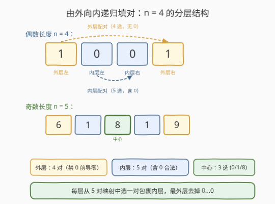
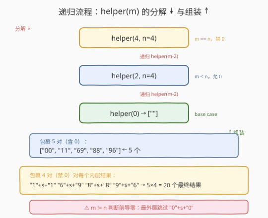
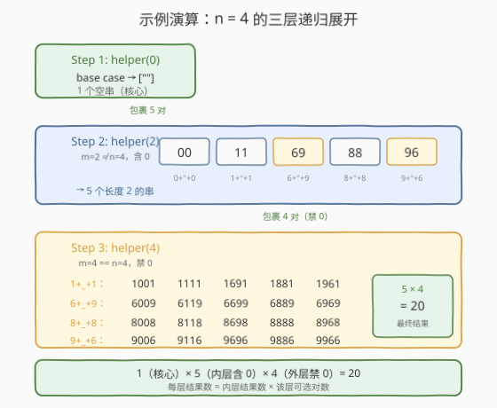

# 中心对称数 II

- **题目名称**：中心对称数 II
- **链接**：[247. 中心对称数 II](https://leetcode.cn/problems/strobogrammatic-number-ii/)
- **难度**：中等
- **标签**：递归、回溯、字符串

## 1. 题目概述

给定一个整数 `n`，返回所有长度为 `n` 的**中心对称数**（Strobogrammatic Number），答案可以按任意顺序返回。

中心对称数的定义与 [246 中心对称数](../0201-0300/246_中心对称数.md) 完全一致：把数字**旋转 180°**（倒过来看）后与原数字相同。合法的旋转映射只有 5 对：

| 原数字 | 旋转 180° 后 | 性质 |
|--------|--------------|------|
| 0 | 0 | 自对称（可放中间） |
| 1 | 1 | 自对称（可放中间） |
| 6 | 9 | 互换（必须成对） |
| 8 | 8 | 自对称（可放中间） |
| 9 | 6 | 互换（必须成对） |

> ⚠️ 本题不是「判定」而是「**生成**」——246 是给定一个数判定是否中心对称，247 是枚举出长度为 `n` 的所有中心对称数。从判定到生成，核心从「对撞双指针核对」升级为「由外向内递归填对」。

**示例 1**：

```text
输入：n = 2
输出：["11","69","88","96"]
解释：长度为 2 的中心对称数只有 4 个——每对必须从 5 个合法映射中选，
      但首尾不能选 "0...0"（前导零不合法），故 4 个。
```

**示例 2**：

```text
输入：n = 1
输出：["0","1","8"]
解释：长度为 1 时，单个字符必须自对称（旋转后等于自己），只有 0/1/8 三个。
```

**示例 3**：

```text
输入：n = 4
输出：["1001","1111","1691","1881","1961","6009","6119","6699","6889","6969",
       "8008","8118","8698","8888","8968","9006","9116","9696","9886","9966"]
解释：共 20 个。外层 4 对（无 0）× 内层 5 对（含 0）= 20。
```

**约束条件**：

- `1 <= n <= 12`

> 💡 **为什么 n ≤ 12？** 中心对称数的数量随 n 指数增长——每多两层（一层 = 一对），内层选项乘以 5（5 个合法对）。到 $n=12$ 时已有 $4 \times 5^5 = 12500$ 个结果，再大就会超出合理的输出规模。这个上界是「结果集本身的大小」决定的，而非时间限制。

---

## 2. 解题思路

### 2.1 暡力思路：枚举所有 n 位数 + 逐一判定

最直觉的做法：遍历 $10^{n-1}$ 到 $10^n - 1$ 的所有整数，对每个数用 [246 的对撞双指针法](../0201-0300/246_中心对称数.md) 判定是否中心对称，收集通过者。

```text
for num in range(10^(n-1), 10^n):   # n=4 时遍历 9000 个数
    if is_strobogrammatic(str(num)):
        result.append(str(num))
```

问题显而易见：$n=12$ 时要遍历 $10^{11}$ 个数，绝大部分都不是中心对称数，浪费极大。暴力法把「哪些数字旋转后合法」这一**结构性信息**完全丢弃了——它不知道 `2/3/4/5/7` 根本不可能出现在任何位置，也不知道 `6` 和 `9` 必须成对出现在对称位置。

> ⚠️ 生成问题的暴力枚举往往比判定问题更浪费——判定至少只检查给定的一个数，生成却要遍历整个值域。正确做法是**只构造合法的结构**，跳过所有不可能的分支。

### 2.2 核心观察：由外向内递归填对

中心对称数的结构是**分层嵌套的配对**：

- 长度为 `n` 的中心对称数 = **外层一对** `pair` + **内层长度为 `n-2` 的中心对称数**
- 外层一对从 5 个合法映射中选：`(0,0)`、`(1,1)`、`(6,9)`、`(8,8)`、`(9,6)`
- 内层继续递归分解，直到长度归 0（偶数，空核心）或归 1（奇数，单个自对称字符 `0`/`1`/`8`）



**两个关键约束**：

1. **前导零禁止**：最外层一对不能选 `(0,0)`，否则 `"0..."` 是前导零，不是合法的 `n` 位数。内层可以选 `(0,0)`——`"1001"` 中间的 `"00"` 是合法的。
2. **奇数长度的中心字符**：当递归到 `m=1` 时，只剩一个位置（正中间），它必须自对称——只能选 `0`/`1`/`8`，不能选 `6`/`9`（它们旋转后变成对方，不自等）。

> 💡 **「由外向内」分解 vs「由内向外」组装**：递归调用的方向是**由外向内**——先处理 `helper(n)`，再调用 `helper(n-2)`，再调用 `helper(n-4)`……直到 base case。但结果的**组装方向是「由内向外」**——先得到最内层的结果（空串或单字符），再逐层包裹配对向外扩展。这和 [22 括号生成](../0001-0100/22_括号生成.md) 的「递归向下分解、结果向上回溯」是同一种思维模式。

递归定义如下：

$$
\text{helper}(m) = \begin{cases} [\text{""}] & m = 0 \quad \text{（空核心，偶数长度的基准）} \\ [\text{"0", "1", "8"}] & m = 1 \quad \text{（自对称单字符，奇数长度的基准）} \\ \{ a + s + b \mid s \in \text{helper}(m-2),\; (a,b) \in \text{pairs} \} & m \geq 2 \end{cases}
$$

其中 `pairs` 在最外层（$m = n$）时排除 `(0,0)`，内层包含全部 5 对。

### 2.3 算法流程图



**递归骨架**（伪代码）：

```text
helper(m, n):
    if m == 0:  return [""]              # 偶数基准：空核心
    if m == 1:  return ["0","1","8"]     # 奇数基准：自对称单字符
    inner = helper(m - 2, n)             # 先递归内层
    res = []
    for s in inner:                      # 再逐个包裹配对
        if m != n:  res.append("0"+s+"0")  # 非最外层才允许 0...0
        res.append("1"+s+"1")
        res.append("6"+s+"9")
        res.append("8"+s+"8")
        res.append("9"+s+"6")
    return res

findStrobogrammatic(n):
    return helper(n, n)
```

> ⚠️ **`m != n` 是前导零约束的核心**：参数 `n` 始终传到底层，让每一层都知道自己是不是最外层。最外层 `m == n`，跳过 `"0"+s+"0"`；内层 `m < n`，正常加入。一个布尔参数管住整个生成树的前导零合法性。

### 2.4 示例演算

以 `n = 4` 为例，完整展示三层递归的展开过程：



**第 1 层：`helper(0)` → 基准返回 `[""]`**

内层核心为空串，1 个结果。

**第 2 层：`helper(2)` → 包裹 5 对（`m=2 ≠ n=4`，允许 0）**

| 内层 `s` | `0+s+0` | `1+s+1` | `6+s+9` | `8+s+8` | `9+s+6` |
|-----------|---------|---------|---------|---------|---------|
| `""` | `"00"` | `"11"` | `"69"` | `"88"` | `"96"` |

→ 5 个长度为 2 的中间结果。

**第 3 层：`helper(4)` → 包裹 4 对（`m=4 == n=4`，禁止 0）**

| 内层 `s` | `1+s+1` | `6+s+9` | `8+s+8` | `9+s+6` |
|-----------|---------|---------|---------|---------|
| `"00"` | `"1001"` | `"6009"` | `"8008"` | `"9006"` |
| `"11"` | `"1111"` | `"6119"` | `"8118"` | `"9116"` |
| `"69"` | `"1691"` | `"6699"` | `"8698"` | `"9696"` |
| `"88"` | `"1881"` | `"6889"` | `"8888"` | `"9886"` |
| `"96"` | `"1961"` | `"6969"` | `"8968"` | `"9966"` |

→ $5 \times 4 = 20$ 个长度为 4 的最终结果。

> 💡 **数量规律**：$f(0)=1$，$f(1)=3$，内层 $g(m) = 5 \times g(m-2)$（5 对全可用），最外层 $f(n) = 4 \times g(n-2)$（去掉 0 对）。所以 $n$ 为偶数时 $f(n) = 4 \times 5^{n/2-1}$，$n$ 为奇数时 $f(n) = 4 \times 5^{(n-3)/2} \times 3$。

---

## 3. 参考代码

### C++

```cpp
// 中心对称数II.cpp —— 由外向内递归填对，O(5^{n/2}·n) 时间
// 编译: g++ -O2 -std=c++17 中心对称数II.cpp -o strobo2
class Solution {
  public:
    vector<string> findStrobogrammatic(int n) {
        return helper(n, n);
    }
  private:
    vector<string> helper(int m, int n) {
        if (m == 0) return {""};                   // 偶数基准：空核心
        if (m == 1) return {"0", "1", "8"};        // 奇数基准：自对称单字符
        vector<string> inner = helper(m - 2, n);   // 先递归内层
        vector<string> res;
        for (const string& s : inner) {
            if (m != n) res.push_back("0" + s + "0");  // 非最外层才允许 0...0
            res.push_back("1" + s + "1");
            res.push_back("6" + s + "9");
            res.push_back("8" + s + "8");
            res.push_back("9" + s + "6");
        }
        return res;
    }
};
```

### Python

```python
class Solution:
    def findStrobogrammatic(self, n: int) -> list[str]:
        def helper(m: int) -> list[str]:
            if m == 0:
                return [""]
            if m == 1:
                return ["0", "1", "8"]
            inner = helper(m - 2)
            res = []
            for s in inner:
                if m != n:                          # 非最外层，允许 0...0
                    res.append("0" + s + "0")
                res.append("1" + s + "1")
                res.append("6" + s + "9")
                res.append("8" + s + "8")
                res.append("9" + s + "6")
            return res
        return helper(n)
```

> 💡 Python 闭包自动捕获外层 `n`，递归只需传 `m`；C++ 需显式传 `n` 到底层。两种写法逻辑一致——`m != n` 这一判断是前导零约束的唯一开关。base case `m == 0` 返回 `[""]`（包含一个空串的列表）而非 `[]`（空列表），否则内层无元素可包裹，整棵递归树返回空——这是最常见的坑。

---

## 4. 复杂度分析

| 维度 | 递归填对 | 暴力枚举 + 判定 |
|------|----------|------------------|
| **时间复杂度** | $O(5^{n/2} \cdot n)$ | $O(10^n \cdot n)$ |
| **空间复杂度** | $O(n)$ 递归栈（不含输出） | $O(n)$ 单数判定 |
| **输出规模** | $O(5^{n/2} \cdot n)$（正比于结果总数×长度） | 同左 |
| **实用性** | 只生成合法结构，推荐面试首选 | 浪费极大，不可行 |

> ⚠️ **时间 $O(5^{n/2} \cdot n)$ 的来源**：结果总数 $f(n) \approx 4 \times 5^{n/2 - 1}$（偶数）或 $12 \times 5^{(n-3)/2}$（奇数），每个结果长度为 $n$，字符串拼接 $O(n)$，总时间正比于输出大小。递归深度 $O(n)$（每次 $m$ 减 2），每层产生中间结果的总长度也正比于最终输出。$n = 12$ 时约 $12500 \times 12 \approx 1.5 \times 10^5$ 字符操作，远优于暴力的 $10^{12}$。

---

## 5. 扩展：迭代法（从内向外逐层扩展）

递归的本质是「由外向内分解，由内向外组装」。可以把组装过程显式化为迭代——直接从最内层开始，每次向外扩一对：

```python
class Solution:
    def findStrobogrammatic(self, n: int) -> list[str]:
        # 根据奇偶确定内层核心
        if n % 2 == 0:
            cur = [""]
        else:
            cur = ["0", "1", "8"]
        m = 1 if n % 2 == 1 else 0
        # 每次向外扩一对，直到达到目标长度 n
        while m < n:
            nxt = []
            for s in cur:
                if m + 2 != n:                      # 非最外层，允许 0...0
                    nxt.append("0" + s + "0")
                nxt.append("1" + s + "1")
                nxt.append("6" + s + "9")
                nxt.append("8" + s + "8")
                nxt.append("9" + s + "6")
            cur = nxt
            m += 2
        return cur
```

> 💡 **迭代 vs 递归**：迭代法把递归的「分解阶段」省掉了——直接从 base case（`m=0` 或 `m=1`）出发，逐步向外扩展。`m + 2 != n` 等价于递归中的 `m != n`，判断的是「扩展后是否到达最外层」。两种方法的时间/空间复杂度相同（迭代省了递归栈的 $O(n)$，但输出空间相同），面试中递归更易讲解，迭代适合作为 follow-up 展示对递归结构的深入理解。

---

## 6. 面试要点

1. **为什么最外层不能用 `0...0`？**

   - `0` 放在首位就是前导零，`"0110"` 不是合法的 4 位数（会被读作 `110`）。
   - 但内层的 `0...0` 是合法的——`"1001"` 中间的 `"00"` 不涉及前导零问题。
   - 递归中用 `m != n` 区分：最外层 `m == n` 跳过 `"0"+s+"0"`，内层正常加入。

2. **base case `m == 0` 为什么返回 `[""]` 而不是 `[]`？**

   - `[""]` 是包含一个空串的列表——空串是偶数长度的合法核心，后续包裹配对后得到 `"00"`、`"11"` 等。
   - `[]` 是空列表——内层无元素可包裹，`for s in inner` 一次都不执行，整棵递归返回空。
   - 一句话：**空串 ≠ 空列表**。空串是「长度为 0 的字符串」，是合法的 building block；空列表是「没有结果」，会让生成树枯萎。

3. **为什么是「由外向内」分解但「由内向外」组装？**

   - 递归调用的方向是「由外向内」：`helper(4)` 调 `helper(2)` 调 `helper(0)`，一路分解到 base case。
   - 结果回溯的方向是「由内向外」：`helper(0)` 先返回 `[""]`，`helper(2)` 拿到后包裹成 5 个长度 2 的串，`helper(4)` 再包裹成 20 个长度 4 的串。
   - 这和 [22 括号生成](../0001-0100/22_括号生成.md)、[39 组合总和](../0001-0100/39_组合总和.md) 的回溯框架同构——递归向下分解问题规模，结果向上回溯组装。

4. **时间复杂度是多少？为什么 n 的上界是 12？**

   - 时间 $O(5^{n/2} \cdot n)$：结果总数 $\approx 4 \times 5^{n/2-1}$，每个长度 $n$，拼接 $O(n)$。
   - $n = 12$ 时约 12500 个结果、总计约 $1.5 \times 10^5$ 字符；$n = 14$ 时 62500 个结果，已偏大。
   - 上界由「输出规模本身」决定，而非计算时间——这是生成类问题的特征。

5. **follow-up：如何统计 `[low, high]` 范围内的中心对称数个数？**

   - 这是 [248 中心对称数 III](https://leetcode.cn/problems/strobogrammatic-number-iii/)：在 247 的基础上加范围过滤。
   - 小规模可直接生成所有长度 $\leq$ `len(high)` 的中心对称数，再逐个比较是否落在 `[low, high]` 内。
   - 大规模用数位 DP：按位填数 + 上下界约束，复用 247 的配对结构。

> 💡 **一句话总结**：247 是 246 从「判定」到「生成」的升级——核心套路是**由外向内递归填对**，每层从 5 个合法映射中选一对包裹内层结果，最外层去掉 `(0,0)` 避免前导零，base case 为 `[""]`（偶数）和 `["0","1","8"]`（奇数）。时间 $O(5^{n/2} \cdot n)$，正比于输出规模，与 [22 括号生成](../0001-0100/22_括号生成.md) 同属「递归构造合法结构」家族。

---

## 7. 同类练习题

- [246. 中心对称数](https://leetcode.cn/problems/strobogrammatic-number/)（[题解](../0201-0300/246_中心对称数.md)）：判定单个字符串是否中心对称，本题的前传——判定用对撞双指针，生成用递归填对，共享同一张旋转映射表
- [248. 中心对称数 III](https://leetcode.cn/problems/strobogrammatic-number-iii/)（[题解](../0201-0300/248_中心对称数III.md)）：统计 `[low, high]` 范围内的中心对称数个数，247 的计数版 + 范围过滤 / 数位 DP
- [22. 括号生成](https://leetcode.cn/problems/generate-parentheses/)（[题解](../0001-0100/22_括号生成.md)）：生成所有合法括号组合，同为「递归构造合法结构」——括号用「左右计数」约束配对，中心对称数用「旋转映射」约束配对
- [108. 将有序数组转换为二叉搜索树](https://leetcode.cn/problems/convert-sorted-array-to-binary-search-tree/)（[题解](../0101-0200/109_有序链表转换二叉搜索树.md)）：递归取中点构造平衡 BST，同为「由外向内分解 + 由内向外组装」的递归思维
- [17. 电话号码的字母组合](https://leetcode.cn/problems/letter-combinations-of-a-phone-number/)：按数字到字母的映射逐位生成所有组合，结构类似——映射表驱动生成，但无对称配对约束
