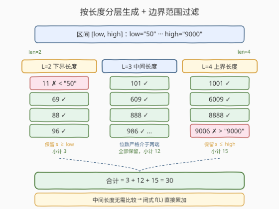
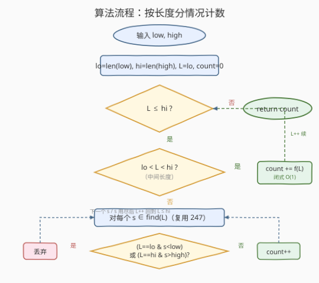
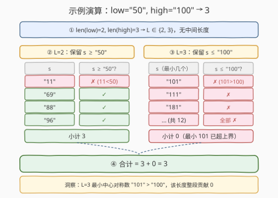

# LeetCode 中心对称数 III 题解

## 1. 题目概述

- **标题 / 题号**：中心对称数 III（#248，hard）
- **链接**：https://leetcode.cn/problems/strobogrammatic-number-iii/
- **难度**：困难
- **标签**：递归、回溯、数学、字符串

**题意**：给定两个用字符串表示的非负整数 `low` 和 `high`，统计 `[low, high]` **闭区间**内**中心对称数**（Strobogrammatic Number）的个数。

中心对称数的定义与 [246 中心对称数](../0201-0300/246_中心对称数.md)、[247 中心对称数 II](../0201-0300/247_中心对称数II.md) 完全一致：把数字**旋转 180°**（倒过来看）后与原数字相同。合法的旋转映射只有 5 对：

| 原数字 | 旋转 180° 后 | 性质 |
|--------|--------------|------|
| 0 | 0 | 自对称（可放中间） |
| 1 | 1 | 自对称（可放中间） |
| 6 | 9 | 互换（必须成对） |
| 8 | 8 | 自对称（可放中间） |
| 9 | 6 | 互换（必须成对） |

> ⚠️ 本题不是「判定」（246）也不是「生成」（247），而是「**计数**」——246 判定单个数，247 枚举长度为 `n` 的全部，248 统计一个**数值区间**内的总数。从判定 → 生成 → 计数，核心从「对撞双指针核对」升级为「按长度生成 + 范围过滤」，最终可进一步升级为「闭式计数 + 数位 DP」。

**示例 1**：

```text
输入：low = "50", high = "100"
输出：3
解释：[50, 100] 内的中心对称数有 69、88、96 共 3 个。
      长度 2 的中心对称数 {11, 69, 88, 96} 中，11 < 50 被排除；
      长度 3 的最小中心对称数 101 > 100，全部排除。
```

**示例 2**：

```text
输入：low = "100", high = "1000"
输出：12
解释：长度 3 的中心对称数共 12 个（外层 4 对 × 中心 3 选），
      全部落在 [100, 1000] 内：101, 111, 181, 609, 619, 689,
      808, 818, 888, 906, 916, 986。
      长度 2 的最大 96 < 100，长度 4 的最小 1001 > 1000，均不在范围内。
```

**约束**：

- `low` 和 `high` 是表示非负整数的字符串，不含前导零（整数 `0` 本身表示为 `"0"`）
- `1 <= len(low) <= len(high)`
- `low` 表示的数值 `<= high` 表示的数值
- 答案在 32 位有符号整数范围内

> 💡 **为什么用字符串而非整数？** 区间端点可能很大（位数较多），用字符串避免整型溢出，且**等长数字字符串的字典序等于数值序**——这是本题范围比较的关键性质，让我们无需把字符串转成大整数即可比较大小。中心对称数极其**稀疏**：长度为 $n$ 的中心对称数只有约 $5^{n/2}$ 个，远少于 $10^n$ 个 $n$ 位数，所以「只生成合法结构」远胜于「遍历整个数值域」。

## 2. 解题思路

### 2.1 暴力思路：遍历整个数值域逐个判定

最直觉的做法：把 `[low, high]` 内的每个整数转成字符串，用 [246 的对撞双指针法](../0201-0300/246_中心对称数.md) 逐个判定是否中心对称，数通过者的个数。

```text
count = 0
for num in range(int(low), int(high) + 1):   # 遍历整个数值域
    if is_strobogrammatic(str(num)):
        count += 1
```

问题显而易见：`[low, high]` 的数值域可能极大（端点用字符串给出正是为了表达大数），遍历 $10^{\text{len}}$ 个数绝大部分都白费——它们含 `2/3/4/5/7` 或配对不合法，根本不可能中心对称。暴力法把「哪些数字旋转后合法」这一**结构性信息**完全丢弃了。

> ⚠️ 计数问题的暴力枚举比判定更浪费——246 判定只检查一个数，248 计数却要遍历整个区间。正确做法是**只生成合法的结构**，再过滤范围，跳过所有不可能的分支。这正是 [247](../0201-0300/247_中心对称数II.md) 的「由外向内递归填对」在计数场景的延伸。

### 2.2 核心观察：按长度生成 + 范围过滤

把区间 `[low, high]` 按**位数**切片。任何落在区间内的中心对称数，其长度 $L$ 必满足 $\text{len}(\text{low}) \le L \le \text{len}(\text{high})$。于是：

- 遍历长度 $L$ 从 $\text{len}(\text{low})$ 到 $\text{len}(\text{high})$
- 对每个 $L$，复用 [247 的递归填对](../0201-0300/247_中心对称数II.md) 生成所有长度为 $L$ 的中心对称数（无前导零，$L=1$ 时含 `"0"`）
- 对生成的每个数 $s$ 做范围过滤：
  - 若 $L = \text{len}(\text{low})$（下界长度）：保留 $s \ge \text{low}$
  - 若 $L = \text{len}(\text{high})$（上界长度）：保留 $s \le \text{high}$
  - 若 $\text{len}(\text{low}) < L < \text{len}(\text{high})$（中间长度）：**全部保留**——位数严格介于两端之间的数，必然大于 `low`（位数更多）且小于 `high`（位数更少），无需逐个比较



> 💡 **等长字符串比较 = 数值比较**：$s$ 与 `low`/`high` 在边界长度时位数相同，且都不含前导零（生成器对 $L \ge 2$ 禁止最外层 `0...0`，端点字符串也无前导零），所以 `s < low` 这类字典序比较等价于数值比较，无需转大整数。中间长度之所以能「全部保留」，是因为「位数多 → 数值大」是绝对成立的——一个 $k+1$ 位的正整数必大于任何 $k$ 位正整数。

### 2.3 进一步优化：中间长度闭式计数，仅边界生成

中间长度的数全部在范围内，不必逐个生成——它们的**个数**有闭式公式。设长度为 $L$ 的中心对称数（无前导零）个数为 $f(L)$：

$$
f(L) = \begin{cases} 3 & L = 1 \quad (\text{即 } 0, 1, 8) \\ 4 \cdot 5^{L/2-1} & L \text{ 为偶数} \quad (\text{外层 } 4 \text{ 对} \times \text{ 内层 } 5^{L/2-1}) \\ 12 \cdot 5^{(L-3)/2} & L \ge 3 \text{ 为奇数} \quad (\text{外层 } 4 \text{ 对} \times \text{ 中心 } 3 \text{ 选} \times 5^{(L-3)/2}) \end{cases}
$$

推导：偶数 $L=2k$ 时，最外层 4 对（禁 `0...0`），向内每层 5 对（含 `0...0`），共 $k-1$ 个内层 → $4 \cdot 5^{k-1}$；奇数 $L=2k+1$ 时多一个中心位 3 选 → $4 \cdot 5^{k-1} \cdot 3 = 12 \cdot 5^{k-1}$，其中 $k-1 = (L-3)/2$。

于是只需对**两个边界长度**生成并比较，中间长度用 $f(L)$ 直接累加：

```text
total = Σ f(L) for len(low) < L < len(high)        # 闭式累加，O(log) 项
      + #{ s ∈ find(len(low)) : s ≥ low }          # 下界长度生成+比较
      + #{ s ∈ find(len(high)) : s ≤ high }        # 上界长度生成+比较
```

当 $\text{len}(\text{low}) = \text{len}(\text{high})$ 时无中间长度，且两个边界合并为同一批生成，条件变为 $\text{low} \le s \le \text{high}$。



> ⚠️ **优化的收益**：若 `low` 和 `high` 位数相差很多，中间长度的生成被闭式 $O(1)$ 取代，只剩两个边界长度需要 $O(5^{n/2} \cdot n)$ 的生成。这把「全量生成」压缩为「只生成边界」，是 [247 follow-up](../0201-0300/247_中心对称数II.md) 所说「大规模用数位 DP」的简化先行版。真正超大边界（如位数上百）时，边界长度也可改用数位 DP 按 $O(n^2)$ 计数而不生成（见第 5 节扩展）。

### 2.4 示例演算

以 `low = "50", high = "100"`（输出 3）为例：



**第 1 步：确定长度范围** $\text{len}(\text{low})=2$，$\text{len}(\text{high})=3$，遍历 $L \in \{2, 3\}$。无中间长度。

**第 2 步：$L=2$（下界长度，保留 $s \ge$ `"50"`）**

生成长度 2 的全部中心对称数（复用 247，最外层禁 `0...0`）：

| $s$ | $s \ge$ `"50"`? | 计入 |
|-----|----------------|------|
| `"11"` | ✗（`"11"` < `"50"`，字典序=数值序） | 排除 |
| `"69"` | ✓ | +1 |
| `"88"` | ✓ | +1 |
| `"96"` | ✓ | +1 |

小计 3。

**第 3 步：$L=3$（上界长度，保留 $s \le$ `"100"`）**

长度 3 的中心对称数最小为 `"101"`（外层 `(1,1)` + 中心 `0`），而 `"101"` > `"100"`（等长字典序比较：首位 `1==1`，第二位 `0==0`，第三位 `1 > 0`）。故 12 个长度 3 的中心对称数**全部超过上界**，小计 0。

| $s$（最小几个） | $s \le$ `"100"`? | 计入 |
|-----------------|------------------|------|
| `"101"` | ✗ | 排除 |
| `"111"` | ✗ | 排除 |
| ... | ✗ | 全部排除 |

**第 4 步：合计** $3 + 0 = 3$。

> 💡 **关键洞察**：$L=3$ 一行不生成也能预判——长度 3 的最小中心对称数是 `"101"`，而 `high = "100"` 也是 3 位且 `"101" > "100"`，所以这一长度贡献 0。这种「最小/最大中心对称数」与边界端点的比较，正是闭式优化的直觉基础。

## 3. 参考代码

### C++

```cpp
// 中心对称数III.cpp —— 按长度生成 + 范围过滤，复用 247 的递归填对
// 编译: g++ -O2 -std=c++17 中心对称数III.cpp -o strobo3
class Solution {
  public:
    int strobogrammaticInRange(string low, string high) {
        int count = 0;
        int lo = low.size(), hi = high.size();
        for (int L = lo; L <= hi; ++L) {
            for (const string& s : findStrobogrammatic(L)) {
                if (L == lo && s < low) continue;   // 下界：等长字典序 = 数值序
                if (L == hi && s > high) continue;  // 上界
                ++count;
            }
        }
        return count;
    }
  private:
    // 以下与 247 完全一致：生成长度为 n 的所有中心对称数（无前导零，n=1 含 "0"）
    vector<string> findStrobogrammatic(int n) {
        return helper(n, n);
    }
    vector<string> helper(int m, int n) {
        if (m == 0) return {""};                   // 偶数基准：空核心
        if (m == 1) return {"0", "1", "8"};        // 奇数基准：自对称单字符
        vector<string> inner = helper(m - 2, n);
        vector<string> res;
        for (const string& s : inner) {
            if (m != n) res.push_back("0" + s + "0");  // 非最外层才允许 0...0
            res.push_back("1" + s + "1");
            res.push_back("6" + s + "9");
            res.push_back("8" + s + "8");
            res.push_back("9" + s + "6");
        }
        return res;
    }
};
```

### Python

```python
class Solution:
    def strobogrammaticInRange(self, low: str, high: str) -> int:
        # 复用 247：生成长度为 m 的所有中心对称数（无前导零，m=1 含 "0"）
        def find(m: int) -> list[str]:
            def helper(k: int) -> list[str]:
                if k == 0:
                    return [""]
                if k == 1:
                    return ["0", "1", "8"]
                inner = helper(k - 2)
                res = []
                for s in inner:
                    if k != m:                      # 非最外层，允许 0...0
                        res.append("0" + s + "0")
                    res.append("1" + s + "1")
                    res.append("6" + s + "9")
                    res.append("8" + s + "8")
                    res.append("9" + s + "6")
                return res
            return helper(m)

        count = 0
        lo, hi = len(low), len(high)
        for L in range(lo, hi + 1):
            for s in find(L):
                if L == lo and s < low:             # 下界：等长字典序 = 数值序
                    continue
                if L == hi and s > high:            # 上界
                    continue
                count += 1
        return count
```

> 💡 主解**直接复用 247 的 `findStrobogrammatic`**，外层只加一个「按长度遍历 + 两条边界过滤」的壳。`L == lo` 和 `L == hi` 两个判断分别守住下界与上界：当 `lo == hi` 时同一批生成同时套用两条过滤，即 `low <= s <= high`；当 `L` 严格介于中间时两条都不触发，全部计入——这正是「中间长度无需比较」的体现。代码虽未显式用闭式公式，但「中间长度跳过比较」的逻辑已为闭式优化埋好接口（见第 5 节）。

## 4. 复杂度分析

| 维度 | 按长度生成 + 范围过滤 | 暴力遍历数值域 |
|------|----------------------|----------------|
| **时间复杂度** | $O(5^{H/2} \cdot H)$，$H=\text{len}(\text{high})$ | $O(10^{H} \cdot H)$ |
| **空间复杂度** | $O(5^{H/2} \cdot H)$（输出规模）/ $O(H)$ 递归栈 | $O(H)$ 单数判定 |
| **关键优势** | 只生成合法结构，利用稀疏性 | 丢弃结构信息，浪费极大 |
| **实用性** | 推荐面试首选 | 不可行 |

> ⚠️ **时间 $O(5^{H/2} \cdot H)$ 的来源**：上界长度的生成规模最大，约 $f(H) \approx 4 \cdot 5^{H/2-1}$ 个结果，每个长度 $H$，拼接 $O(H)$；下界长度与各中间长度的生成规模更小。总时间由上界长度主导。由于中心对称数稀疏（$5^{H/2} \ll 10^{H}$），生成法远优于暴力。若 $H$ 极大（如上百位），改用第 5 节的闭式 + 数位 DP，可降到 $O(H^2)$ 甚至 $O(H)$。

## 5. 扩展：闭式计数中间长度 + 数位 DP 计数边界

主解已能通过 LeetCode。当区间端点位数相差悬殊时，可进一步优化：**中间长度用闭式公式 $f(L)$ 直接累加，仅对两个边界长度生成并比较**。

```python
class Solution:
    def strobogrammaticInRange(self, low: str, high: str) -> int:
        # 长度 L 的中心对称数个数（无前导零）
        def count_by_len(L: int) -> int:
            if L == 1:
                return 3                          # 0, 1, 8
            if L % 2 == 0:
                return 4 * 5 ** (L // 2 - 1)      # 外层 4 对 × 内层 5^(L/2-1)
            return 12 * 5 ** ((L - 3) // 2)        # 4 对 × 3 中心 × 5^((L-3)/2)

        def find(m: int) -> list[str]:            # 同 247
            def helper(k: int) -> list[str]:
                if k == 0:
                    return [""]
                if k == 1:
                    return ["0", "1", "8"]
                inner = helper(k - 2)
                res = []
                for s in inner:
                    if k != m:
                        res.append("0" + s + "0")
                    res.append("1" + s + "1")
                    res.append("6" + s + "9")
                    res.append("8" + s + "8")
                    res.append("9" + s + "6")
                return res
            return helper(m)

        lo, hi = len(low), len(high)
        total = 0
        for L in range(lo, hi + 1):
            if lo < L < hi:
                total += count_by_len(L)          # 中间长度：闭式 O(1) 累加
            else:
                for s in find(L):                 # 边界长度：生成 + 两端过滤
                    if (L > lo or s >= low) and (L < hi or s <= high):
                        total += 1
        return total
```

> 💡 条件 `(L > lo or s >= low) and (L < hi or s <= high)` 把「是否为边界长度」与「范围比较」合在一行：`L > lo` 表示非下界长度（跳过下界比较），`L < hi` 表示非上界长度（跳过上界比较）。当 `lo == hi == L` 时退化为 `s >= low and s <= high`。中间长度走 `count_by_len` 分支，连 `find` 都不调用——闭式累加只需 $O(\log)$ 项。

**数位 DP：超大边界的 $O(H^2)$ 计数**

若边界长度也极大（生成 $5^{H/2}$ 仍太多），可把边界长度的「生成 + 比较」替换为**数位 DP 计数**：定义 $\text{countLE}(X)$ 为 `[0, X]` 内中心对称数的个数，则答案 $= \text{countLE}(\text{high}) - \text{countLE}(\text{low}) + \text{isStrobo}(\text{low})$。

- $\text{countLE}(X)$ 中，位数 $< \text{len}(X)$ 的部分用 $f(L)$ 闭式求和
- 位数 $= \text{len}(X)$ 的部分按「由外向内填对」做数位 DP：维护 `tight` 标志表示前缀是否仍与 $X$ 完全相等，外层填一对 `(a, b)` 时若 `a < X[left]` 则后续内层任填（`tight` 转为 `false`），若 `a == X[left]` 还需 `b <= X[right]` 配合，若 `a > X[left]` 则该分支剪掉

这样无需生成任何完整字符串，只数组合数，复杂度 $O(H^2)$（$H$ 个位置 × 每位置 $O(H)$ 状态转移）。它是 [247 follow-up](../0201-0300/247_中心对称数II.md) 所指「大规模数位 DP」的完整形态，但实现细节较多，面试中主解（生成 + 过滤）已足够，数位 DP 作为 follow-up 思路展示即可。

## 6. 面试要点

1. **248 与 246、247 的关系是什么？**

   - 三题共享同一张旋转映射表，构成「判定 → 生成 → 计数」的递进。
   - 246 判定单个数：对撞双指针核对旋转对；247 生成长度 $n$ 的全部：由外向内递归填对；248 计数区间内的总数：按长度生成 + 范围过滤，并可用闭式 + 数位 DP 优化。
   - 一句话：**248 = 247 的生成能力 + 区间端点的范围约束**。复用 247 的 `findStrobogrammatic`，外面套一层按长度遍历和两条边界过滤即得主解。

2. **为什么中间长度可以「全部保留」不做比较？**

   - 一个 $k$ 位正整数必大于任何位数 $< k$ 的正整数，也必小于任何位数 $> k$ 的正整数。
   - 所以长度严格介于 $\text{len}(\text{low})$ 和 $\text{len}(\text{high})$ 之间的中心对称数，必然 $> \text{low}$（位数更多）且 $< \text{high}$（位数更少），无需逐个比较。
   - 只有等于端点长度的数才可能越界，需要用等长字符串比较（字典序 = 数值序）过滤。

3. **等长字符串比较为什么等价于数值比较？**

   - 两个不含前导零的等长数字字符串，字典序与数值序一致：从最高位起按字符逐位比较，首个不同的字符决定大小。
   - 生成器对 $L \ge 2$ 禁止最外层 `0...0`，端点 `low`/`high` 也无前导零（除整数 0 本身），故比较合法。
   - 若端点有前导零需先归一化，但本题约束已保证无前导零。

4. **闭式公式 $f(L)$ 怎么推？**

   - 偶数 $L=2k$：最外层 4 对（禁 `0...0`），向内 $k-1$ 层每层 5 对（含 `0...0`），空核心 → $4 \cdot 5^{k-1}$。
   - 奇数 $L=2k+1$（$k \ge 1$）：多一个中心位 3 选（`0/1/8`）→ $4 \cdot 5^{k-1} \cdot 3 = 12 \cdot 5^{k-1}$，$k-1=(L-3)/2$。
   - $L=1$ 特例：`0/1/8` 共 3 个。验证：$f(2)=4$、$f(3)=12$、$f(4)=20$、$f(5)=60$，与 247 枚举结果一致。

5. **follow-up：端点极大（位数上百）时怎么办？**

   - 生成 $5^{H/2}$ 个字符串不可行，改用数位 DP 计数 $\text{countLE}(X)$：位数 $<\text{len}(X)$ 闭式求和，位数 $=\text{len}(X)$ 按「由外向内填对 + tight 标志」数组合数，复杂度 $O(H^2)$。
   - 答案 $= \text{countLE}(\text{high}) - \text{countLE}(\text{low}) + \text{isStrobo}(\text{low})$，把区间计数转化为前缀计数之差——这是数位 DP 的经典套路（参见 [902. 至多 K 的最大组合数](https://leetcode.cn/problems/numbers-at-most-n-given-digit-set/) 同款「计数 ≤ X」分解）。

> 💡 **一句话总结**：248 是 246/247 系列的计数收尾——核心套路是**按长度生成 + 范围过滤**，复用 247 的递归填对，外层套「遍历长度 + 两条边界比较」；中间长度因「位数决定大小」可全部保留或闭式累加，仅边界长度需生成比较。利用中心对称数的稀疏性（$5^{n/2} \ll 10^n$），把暴力的 $O(10^H)$ 降到 $O(5^{H/2} \cdot H)$，与 [247](../0201-0300/247_中心对称数II.md)、[22 括号生成](../0001-0100/22_括号生成.md) 同属「构造合法结构」家族。

## 同类练习题

| # | 题目 | 与本题的关联 |
|---|------|-------------|
| 246 | [中心对称数](https://leetcode.cn/problems/strobogrammatic-number/)（[题解](../0201-0300/246_中心对称数.md)） | 判定单个字符串是否中心对称，本题前传——判定用对撞双指针，计数用按长度生成 + 过滤，共享同一张旋转映射表 |
| 247 | [中心对称数 II](https://leetcode.cn/problems/strobogrammatic-number-ii/)（[题解](../0201-0300/247_中心对称数II.md)） | 生成长度为 $n$ 的所有中心对称数，本题直接复用其 `findStrobogrammatic` 递归填对骨架 |
| 902 | [至多 K 的最大组合数](https://leetcode.cn/problems/numbers-atmost-n-given-digit-set/) | 数位 DP 计数 $\le X$ 的经典题，第 5 节扩展的 $\text{countLE}$ 分解同款「前缀计数之差」套路 |
| 22 | [括号生成](https://leetcode.cn/problems/generate-parentheses/)（[题解](../0001-0100/22_括号生成.md)） | 递归构造合法结构，与 247/248 同属「按配对约束生成」家族——括号用左右计数约束，中心对称数用旋转映射约束 |
| 1088 | [易混淆数 II](https://leetcode.cn/problems/confusing-number-ii/) | 统计 $[1, N]$ 内旋转 180° 后仍是有效数字但**不等于原数**的个数，结构同 248 的按位生成 + 计数，区别在「旋转有效且不回文」 |
