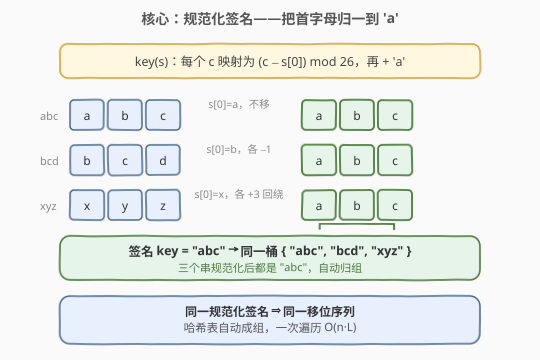
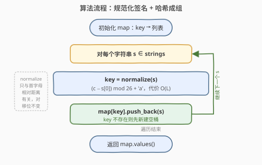
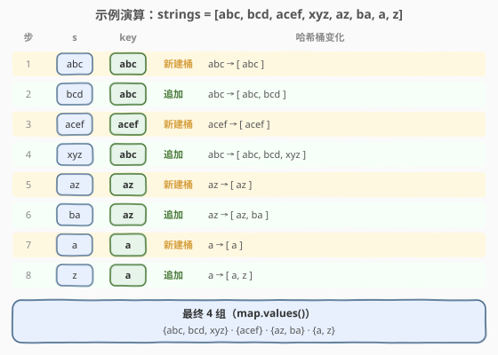

# 移位字符串分组

- **题目名称**：移位字符串分组
- **链接**：[249. 移位字符串分组](https://leetcode.cn/problems/group-shifted-strings/)
- **难度**：中等
- **标签**：哈希表、字符串、数组

## 1. 题目概述

我们可以「移位」一个字符串：把每个字符替换为字母表中的下一个字符，`'z'` 移位后变成 `'a'`。例如 `"abc" -> "bcd" -> ... -> "xyz" -> "yza"`。对一个字符串可以**反复移位任意次**，也可以一次移位多位（每位移位量相同）。

称一串字符串属于**同一移位序列**，当且仅当它们能通过**对每个字符施加相同的循环移位量**相互得到。注意：移位量对所有字符**相同**，但不同的串之间移位量可以不同。

给定一个字符串数组 `strings`，把属于同一移位序列的字符串**分组**返回。组内、组间顺序均可。

**示例 1**：

```text
输入：strings = ["abc","bcd","acef","xyz","az","ba","a","z"]
输出：[["acef"],["a","z"],["abc","bcd","xyz"],["az","ba"]]
解释：
  abc -> bcd -> ... -> xyz：每个串相邻字符差都为 +1，互为移位
  az 与 ba：az 各位差 +25(=−1)，ba 各位差 −1，同一序列
  a 与 z：单字符，任意单字符串都属同一序列（无相邻差）
  acef：差为 +2,+2,+1，独占一组
```

**示例 2**：

```text
输入：strings = ["a"]
输出：[["a"]]
```

**约束条件**：

- $1 \le \text{strings.length} \le 10^4$
- $1 \le \text{strings}[i].\text{length} \le 50$
- `strings[i]` 仅包含**小写英文字母**

> 💡 **关键性质**：两个串属于同一移位序列 ⟺ 长度相同且**各字符相对首字符的循环距离序列完全一致**。这意味只要为每个串算出一个**与移位无关的规范化「签名」**，签名相同者必同组——这正是用哈希表自动成组的切入点。思路与 [49 字母异位词分组](../0001-0100/49_字母异位词分组.md) 同构，只是「签名」的构造从「排序/计数」换成「按首字母归一」。

---

## 2. 解题思路

### 2.1 暴力思路：两两判定归并

最直觉的做法：对每对串 `s, t`，检查它们是否属于同一移位序列——即长度相同，且 `(t[i] - s[i]) mod 26` 对所有 `i` 是同一个常数（等价于 `(t[i] - t[0]) mod 26 == (s[i] - s[0]) mod 26`）。用并查集或 `visited` 标记把同组者合并。

```text
for i in range(n):
    if visited[i]: continue
    group = [strings[i]]; visited[i] = True
    for j in range(i+1, n):
        if not visited[j] and same_shift(strings[i], strings[j]):
            visited[j] = True; group.append(strings[j])
    ans.append(group)
```

单对判定 $O(L)$，外层两两组合 $O(n^2)$，总时间 $O(n^2 \cdot L)$。`n` 可达 $10^4$，平方比较必然超时。

> ⚠️ 暴力法把「同一组」这一**等价关系**拆成一堆两两比较，重复劳动极多——每加入一个新成员都要和组内所有人重新核对。正确做法是给每个串算一个**指纹**，让指纹相同者自动落进同一桶，一次遍历即可完成分组。

### 2.2 核心观察：规范化签名——把首字母归一到 'a'



移位操作的实质是「给每个字符加上同一个常数 $k$（模 26）」。因此**两个串互为移位 ⟺ 它们对应位置的字符差 $(c_i - c_0) \bmod 26$ 序列完全相同**——这个差序列与移位量 $k$ 无关。

于是定义**规范化签名**：把串 `s` 的首字符「平移回 `'a'`」，其余字符跟着平移相同量：

$$
\text{key}(s) = \text{每个 } c_i \mapsto \big((c_i - s[0]) \bmod 26\big) + \text{'a'}
$$

- `"abc"`：$s[0]=\text{a}$，差 $0,1,2$ → `"abc"`
- `"bcd"`：$s[0]=\text{b}$，各 $-1$ → `"abc"`
- `"xyz"`：$s[0]=\text{x}$，各 $+3$（回绕）→ `"abc"`
- `"az"`：差 $0,25$ → `"az"`；`"ba"`：$s[0]=\text{b}$，$a-b=-1\equiv 25$ → `"az"`

三个 `abc/bcd/xyz` 的签名都是 `"abc"`，自动归同组。

> 💡 **关键转化**：移位判定从「两两比较」变成「各自规范化后查表」。规范化消去了移位量 $k$ 这个「自由度」，把整组串映射到唯一代表元（首字母为 `'a'` 的那个），时间从 $O(n^2)$ 降到 $O(n)$ 趟。

### 2.3 算法流程图



流程三步：

1. **建表**：初始化哈希表 `map: key → list`。
2. **遍历归桶**：对每个 `s`，算 `key = normalize(s)`，执行 `map[key].push_back(s)`（key 不存在则自动新建空桶）。
3. **输出**：返回 `map.values()`，每个 value 即一个分组。

> ⚠️ **为什么单字符串都归一组？** 长度为 1 的串没有「相邻差」，签名就是首字符归一后的 `"a"`——所有单字符串规范化后都是 `"a"`，自动落进同一桶。这与示例 1 中 `"a"`、`"z"` 同组一致。规范化签名天然处理了这一边界，无需特判。

### 2.4 示例演算

以 `strings = ["abc","bcd","acef","xyz","az","ba","a","z"]` 为例：



| 步骤 | 输入 `s` | 签名 `key` | 哈希表 `map` 变化 |
|------|----------|------------|-------------------|
| 1 | `abc` | `abc` | 新建桶 `abc → [abc]` |
| 2 | `bcd` | `abc` | 追加 `abc → [abc, bcd]` |
| 3 | `acef` | `acef` | 新建桶 `acef → [acef]` |
| 4 | `xyz` | `abc` | 追加 `abc → [abc, bcd, xyz]` |
| 5 | `az` | `az` | 新建桶 `az → [az]` |
| 6 | `ba` | `az` | 追加 `az → [az, ba]` |
| 7 | `a` | `a` | 新建桶 `a → [a]` |
| 8 | `z` | `a` | 追加 `a → [a, z]` |

遍历结束，`map.values()` 即四组答案：`{abc, bcd, xyz}`、`{acef}`、`{az, ba}`、`{a, z}`。注意 `bcd`、`xyz` 无需和 `abc` 两两核对——它们的签名都是 `abc`，被哈希表自动并入同一桶。

---

## 3. 参考代码

### C++

```cpp
// 移位字符串分组.cpp —— 规范化签名 + 哈希成组
// 编译: g++ -O2 -std=c++17 移位字符串分组.cpp -o groupshift
class Solution {
  public:
    vector<vector<string>> groupStrings(vector<string>& strings) {
        unordered_map<string, vector<string>> mp;
        for (const string& s : strings) {
            mp[normalize(s)].push_back(s);
        }
        vector<vector<string>> ans;
        for (auto& [k, v] : mp) {
            ans.push_back(std::move(v));
        }
        return ans;
    }
  private:
    // 把首字符归一到 'a'，其余字符跟随平移相同量（mod 26）
    string normalize(const string& s) {
        string key;
        int base = s[0] - 'a';
        for (char c : s) {
            int d = (c - 'a' - base + 26) % 26;   // +26 防 C++ 负数取模
            key.push_back((char)('a' + d));
        }
        return key;
    }
};
```

### Python

```python
class Solution:
    def groupStrings(self, strings: List[str]) -> List[List[str]]:
        def normalize(s: str) -> str:
            base = ord(s[0])
            # (c - base) % 26：Python 取模天然非负，无需 +26
            return "".join(chr((ord(c) - base) % 26 + ord('a')) for c in s)

        mp = collections.defaultdict(list)
        for s in strings:
            mp[normalize(s)].append(s)
        return list(mp.values())
```

> 💡 **C++ 取模陷阱**：`(-1) % 26` 在 C++ 中结果为 `-1`（向零取整），不是 `25`。故 `normalize` 中显式 `+ 26` 再取模，把负差拉回正区间。Python 的 `%` 对负数返回非负余数（`(-1) % 26 == 25`），无需补正。这是两语言在「循环差」计算上最常踩的坑。

---

## 4. 复杂度分析

设 $n = \text{strings.length}$，$L = \max(\text{strings}[i].\text{length})$。

| 维度 | 规范化签名 + 哈希 | 暴力两两判定 |
|------|------------------|--------------|
| **时间复杂度** | $O(n \cdot L)$ | $O(n^2 \cdot L)$ |
| **空间复杂度** | $O(n \cdot L)$ | $O(n \cdot L)$（输出） |
| **关键优势** | 签名消去移位自由度，一次遍历成组 | 重复两两比较，平方爆炸 |
| **实用性** | 推荐面试首选 | $n$ 大时不可行 |

> ⚠️ **时间 $O(n \cdot L)$ 的来源**：每个串算一次签名 $O(L)$，哈希插入均摊 $O(L)$（签名长度 $L$，比较/哈希代价 $O(L)$），共 $n$ 个串。空间 $O(n \cdot L)$ 主要被输出本身占据（所有串都要进结果），哈希表的额外开销同阶。

---

## 5. 扩展：差分元组签名

规范化签名把首字母归一到 `'a'`，得到一个**字符串** key。另一种等价构造是**差分元组**：用相邻字符的循环差作 key。

$$
\text{key}_2(s) = \big((s[1]-s[0]) \bmod 26,\ (s[2]-s[1]) \bmod 26,\ \dots\big)
$$

```python
def diff_key(s: str) -> tuple:
    return tuple((ord(s[i]) - ord(s[i - 1])) % 26 for i in range(1, len(s)))
```

- `"abc"` → `(1, 1)`；`"bcd"` → `(1, 1)`；`"xyz"` → `(1, 1)`：同组
- `"az"` → `(25,)`；`"ba"` → `(25,)`：同组
- 单字符 → `()`（空元组）：所有单字符串同组

> 💡 **两种签名的等价性**：差分元组记录「相邻差」，规范化字符串记录「相对首字符的差」——后者是前者的前缀和（模 26）。给定首字符为 `'a'` 后，前缀和序列与差分序列一一对应，故两种 key 划分出的分组完全相同。选用哪种看语言便利：Python 元组可直接哈希、写法更短；C++ 元组需 `tuple<int,...>` 或拼成字符串，反不如直接构造字符串 key 省事。

**与 [49 字母异位词分组](../0001-0100/49_字母异位词分组.md) 的对比**

两题骨架完全一致——「规范化签名 + 哈希成组」，差别只在签名的构造规则：

| 题目 | 等价关系 | 签名构造 |
|------|----------|----------|
| 49 字母异位词分组 | 字符多重集相同 | 排序串 / 26 维频次元组 |
| 249 移位字符串分组 | 相邻循环差序列相同 | 首字母归一串 / 差分元组 |

凡是「按某种等价关系分组」的题，套路都是：**找到与等价关系无关的不变量作签名，哈希自动成桶**。识别出等价关系的「不变量」是解题的关键一步。

---

## 6. 面试要点

1. **为什么规范化后签名相同就一定同组？**

   - 移位操作给每个字符加同一个常数 $k$。规范化用 $(c_i - s[0]) \bmod 26$ 消去 $k$，得到一个**与移位量无关**的相对位置序列。
   - 两个串同组 ⟺ 存在某个 $k$ 使逐位差 $k$ ⟺ 它们的相对位置序列相同 ⟺ 规范化签名相同。规范化是同组关系的一个**完全不变量**。

2. **规范化为什么要 `(c - s[0] + 26) % 26`？**

   - 字母循环相减可能出现负数（如 `"ba"` 中 $a - b = -1$）。数学上 $-1 \equiv 25 \pmod{26}$，但 C++ 的 `%` 对负数返回负值，需 `+26` 修正；Python 的 `%` 天然返回非负余数。修正后 `"ba"` 的第二位得到 `25`，与 `"az"`（$z - a = 25$）一致，正确归同组。

3. **单字符串为什么都分到一组？**

   - 长度 1 的串没有相邻字符差，规范化后首字符（也是唯一字符）被归一到 `'a'`，签名恒为 `"a"`。所有单字符串签名相同 → 同组。这与题意一致：任意单字符都能通过移位得到任意其他单字符。

4. **能否用排序法做签名？**

   - 不能。移位**保持字符顺序**，只是整体平移；排序会打乱顺序，把不同移位序列的串误并（如 `"abc"` 排序得 `"abc"`，但 `"cba"` 排序也得 `"abc"`，二者并非移位关系）。移位分组的签名必须**保留相对位置信息**，排序法只适用于 [49 异位词分组](../0001-0100/49_字母异位词分组.md)那种「顺序无关」的等价关系。

5. **和 49 字母异位词分组的本质区别是什么？**

   - 等价关系不同：49 是「字符多重集相同」（顺序无关，可重排），249 是「相邻循环差序列相同」（顺序相关，不可重排）。
   - 签名构造因此分叉：49 用排序/频次（丢弃顺序），249 用首字母归一/差分（保留顺序）。两题共享「签名 + 哈希成组」的骨架，是「按等价关系分组」模式的两个实例。

> 💡 **一句话总结**：249 是「按等价关系分组」家族的顺序版——核心是**首字母归一的规范化签名**，消去移位量这一自由度后用哈希自动成组，$O(n \cdot L)$ 一次遍历。与 [49](../0001-0100/49_字母异位词分组.md) 共享骨架，差别在签名保留顺序（差分/归一）还是丢弃顺序（排序/频次）。注意 C++ 循环取模的负数修正，是本题最易踩的坑。

---

## 7. 同类练习题

- [49. 字母异位词分组](https://leetcode.cn/problems/group-anagrams/)（[题解](../0001-0100/49_字母异位词分组.md)）：同骨架「签名 + 哈希成组」，但等价关系是「字符多重集相同」（顺序无关），签名用排序串或频次元组——对照本题的「顺序相关」签名
- [242. 有效的字母异位词](https://leetcode.cn/problems/valid-anagram/)（[题解](../0201-0300/242_有效的字母异位词.md)）：异位词的单对判定版，频次判据；类比「移位序列的单对判定」即检查 $(t[i]-s[i]) \bmod 26$ 是否恒为常数
- [205. 同构字符串](https://leetcode.cn/problems/isomorphic-strings/)（[题解](../0201-0300/205_同构字符串.md)）：另一种「字符间映射关系」的等价判定，用双射哈希核对；与本题的「循环差不变量」对照两种不变量构造
- [890. 查找和替换模式](https://leetcode.cn/problems/find-and-replace-pattern/)：按「双射模式」分组，同为「规范化签名 + 匹配」家族，签名构造用双射归一
- [451. 根据字符出现频率排序](https://leetcode.cn/problems/sort-characters-by-frequency/)：频次统计的另一面应用，反向运用字符计数，对照本题的「相对位置」而非「频次」
