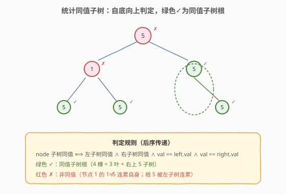
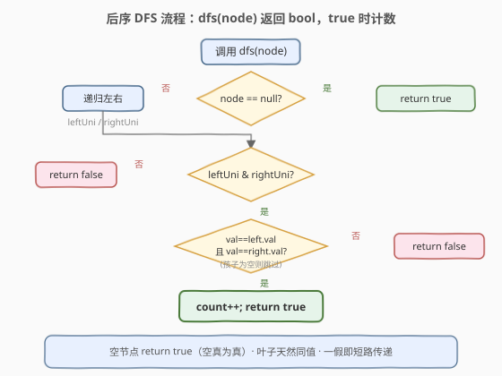
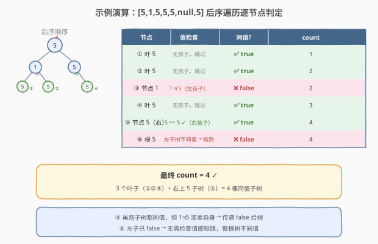

# 统计同值子树

- **题目名称**：统计同值子树
- **链接**：[250. 统计同值子树](https://leetcode.cn/problems/count-univalue-subtrees/)
- **难度**：中等
- **标签**：树、二叉树、深度优先搜索、后序遍历

## 1. 题目概述

给定一棵二叉树的根节点 `root`，统计这棵树中**同值子树**（uni-value subtree）的数量。

> **同值子树**：该子树中**所有节点**的值都相同。

**示例 1**：

```text
输入：root = [5,1,5,5,5,null,5]
输出：4

        5
       / \
      1   5
     / \   \
    5   5   5
```

4 棵同值子树分别为：3 个值为 5 的叶子节点，以及根为右上 `5` 的子树（它只有一个值为 5 的右孩子，`5 == 5`）。根为 `1` 的子树**不是**同值子树（`1 != 5`），整棵树也**不是**（左子树不同值）。

**示例 2**：

```text
输入：root = []
输出：0
```

**示例 3**：

```text
输入：root = [5,5,5,5,5,null,5]
输出: 6

        5
       / \
      5   5
     / \   \
    5   5   5
```

每个节点都是某棵同值子树的根：3 个叶子 + 左下 `5`（左右都是 5）+ 右上 `5`（右孩子是 5）+ 根 `5`（左右子树都同值为 5），共 6 棵。

**约束条件**：

- 树中节点数目范围 `[0, 1000]`
- `-1000 <= Node.val <= 1000`

> 💡 本题是「**后序遍历 + 布尔返回值**」家族的招牌题。一棵子树是否同值，取决于「它的左右子树是否同值」加上「当前节点值是否等于孩子值」——这是天然的后序（自底向上）结构。叶子节点没有孩子，天然同值。

---

## 2. 解题思路

### 2.1 暴力思路：逐节点检查整棵子树

最直观的做法：遍历每个节点，对每个节点调用一次 `isUnivalue(node)` 检查以它为根的子树是否所有节点值相同（需要再遍历一次子树）。时间 $O(n^2)$（每个节点被重复检查多次），空间 $O(h)$ 递归栈。能过，但**完全没有利用「子树同值性可由子问题传递」的性质**——一个节点的子树同值，当且仅当它的两个子树各自同值且节点值与孩子值一致，无需重复扫描。

### 2.2 核心观察：后序传递 + 布尔返回值



**关键洞察**：子树同值性具有**最优子结构**——

> 以 `node` 为根的子树同值 ⟺ （左子树同值 ∨ 左子为空）∧（右子树同值 ∨ 右子为空）∧ `node.val == left.val`（若左存在）∧ `node.val == right.val`（若右存在）

这意味着只需一次**后序遍历**（先递归左、右，再处理根），DFS 返回布尔值「该子树是否同值」，在返回 `true` 时顺便计数。每个节点只访问一次。

> ⚠️ **叶子天然同值**：没有孩子的节点，左右条件自动满足（`left == null` 跳过比较），直接返回 `true` 并计数。这是递归的「天然基底」，无需特判。

### 2.3 算法流程图



**DFS 完整步骤**（函数 `dfs(node)` 返回 `bool`）：

1. **空节点**：返回 `true`（空子树视为「不妨碍父节点同值」，这是关键约定）；
2. **递归左右**：`leftUni = dfs(node.left)`，`rightUni = dfs(node.right)`；
3. **判定同值**：若 `leftUni` 且 `rightUni`，再检查值一致——
   - 左孩子存在且 `node.val != node.left.val` → `false`；
   - 右孩子存在且 `node.val != node.right.val` → `false`；
   - 否则 → `count += 1`，返回 `true`；
4. **否则**：返回 `false`（某棵子树已不同值，当前子树必不同值）。

> 💡 **为什么空节点返回 `true` 而非 `false`？** 空子树不含任何节点，「所有节点值相同」这一命题对空集**空真为真**（vacuously true）。更实际的原因：父节点在检查「左子树是否同值」时，空左子不应拖累父节点——若返回 `false`，则任何只有右子的节点都无法成为同值子树根，这显然不对。

### 2.4 示例演算

以 `root = [5,1,5,5,5,null,5]` 为例，后序遍历顺序与计数过程：



| 后序访问节点 | dfs(left) | dfs(right) | 值一致性检查 | 是否同值 | count |
|-------------|-----------|------------|-------------|---------|-------|
| ① 叶 5（左下） | true(null) | true(null) | 无孩子，跳过 | ✅ true | 1 |
| ② 叶 5（左下右） | true(null) | true(null) | 无孩子，跳过 | ✅ true | 2 |
| ③ 节点 1 | true(①) | true(②) | `1 != 5`（左孩子值）→ 失败 | ❌ false | 2 |
| ④ 叶 5（右下） | true(null) | true(null) | 无孩子，跳过 | ✅ true | 3 |
| ⑤ 节点 5（右上） | true(null) | true(④) | 左空跳过，`5 == 5`（右孩子）✓ | ✅ true | 4 |
| ⑥ 根 5 | false(③) | true(⑤) | 左子树不同值 → 短路 | ❌ false | 4 |

最终 `count = 4` ✓。注意 ③ 处虽然两个孩子各自同值，但 `1 != 5` 导致整棵子树不同值——这正是「子树同值需逐层传递」的体现。

> 💡 **观察短路效应**：⑥ 根节点的左子树（③）已返回 `false`，无需再检查值一致性即可判定根子树不同值。后序传递天然支持「一假即停」——只要任一子树不同值，当前子树必然不同值。

---

## 3. 参考代码

### C++

```cpp
class Solution {
  public:
    int count = 0;

    int countUnivalSubtrees(TreeNode* root) {
        dfs(root);
        return count;
    }

    bool dfs(TreeNode* node) {
        if (!node) return true;            // 空子树：空真为真
        bool leftUni  = dfs(node->left);   // 后序：先递归左右
        bool rightUni = dfs(node->right);
        if (leftUni && rightUni) {         // 两子树都同值才有可能
            if (node->left  && node->val != node->left->val)  return false;
            if (node->right && node->val != node->right->val) return false;
            count++;                       // 当前子树同值，计数
            return true;
        }
        return false;                      // 某子树不同值，传递 false
    }
};
```

### Python

```python
class Solution:
    def countUnivalSubtrees(self, root: Optional[TreeNode]) -> int:
        count = 0

        def dfs(node: Optional[TreeNode]) -> bool:
            nonlocal count
            if not node:
                return True                # 空子树：空真为真
            left_uni  = dfs(node.left)     # 后序：先递归左右
            right_uni = dfs(node.right)
            if left_uni and right_uni:     # 两子树都同值才有可能
                if node.left  and node.val != node.left.val:
                    return False
                if node.right and node.val != node.right.val:
                    return False
                count += 1                 # 当前子树同值，计数
                return True
            return False                   # 某子树不同值，传递 false

        dfs(root)
        return count
```

> 💡 两版等价。`dfs` 同时承担「判定同值」与「计数」两职——返回值驱动父节点判定，副作用 `count++` 记录结果。这种「布尔返回 + 副作用计数」是树形判定计数题的通用模板，下文第 5 节给出更多变体。

---

## 4. 复杂度分析

| 维度 | 复杂度 | 说明 |
|------|--------|------|
| 时间复杂度 | $O(n)$ | 每个节点只访问一次，每次做 $O(1)$ 比较 |
| 空间复杂度 | $O(h)$ | 递归栈深度 = 树高 $h$；平衡树 $O(\log n)$，退化链状 $O(n)$ |
| 最坏情况 | $O(n)$ 空间 | 树退化为单侧链时递归深度达 $n$ |

> ⚠️ 暴力法 $O(n^2)$ 的浪费在于：检查某节点子树同值时已扫描过其子树，但父节点又重新扫描一遍。后序传递法把「子树同值性」压缩成一个布尔值向上传递，避免了重复扫描——这本质上是**记忆化思想**在树形结构上的体现。

---

## 5. 扩展：迭代法后序遍历

递归写法直观，但面试中可能被追问「能否用迭代避免栈溢出」。用显式栈做后序遍历即可，难点在于「拿到孩子返回值后再判定」——需在栈中存储每个节点的中间状态。

```python
class Solution:
    def countUnivalSubtrees(self, root: Optional[TreeNode]) -> int:
        if not root:
            return 0
        count = 0
        stack = [(root, False)]      # (节点, 是否已处理左右)
        result = {}                  # id(node) -> bool，存子树判定结果
        while stack:
            node, visited = stack.pop()
            if visited:
                left_uni  = result.get(id(node.left), True)
                right_uni = result.get(id(node.right), True)
                if left_uni and right_uni:
                    if node.left  and node.val != node.left.val:
                        result[id(node)] = False
                        continue
                    if node.right and node.val != node.right.val:
                        result[id(node)] = False
                        continue
                    count += 1
                    result[id(node)] = True
                else:
                    result[id(node)] = False
            else:
                stack.append((node, True))   # 后序：根最后处理
                if node.right:
                    stack.append((node.right, False))
                if node.left:
                    stack.append((node.left, False))
        return count
```

> 💡 **迭代 vs 递归**：迭代版用 `visited` 标记模拟后序「先左右后根」的顺序，用 `result` 字典替代递归返回值传递。时间同样 $O(n)$，空间 $O(n)$（栈 + 字典）。逻辑更繁，**面试推荐递归版**——简洁且能体现对后序子结构传递的理解。迭代版仅在树极深（递归栈溢出风险）时才有实际优势。

---

## 6. 面试要点

1. **为什么用后序遍历而不是前序或中序？**

   > 同值性的判定依赖子树的结果——只有先知道左右子树是否同值，才能判定当前子树是否同值。这是典型的「子问题结果决定父问题」结构，对应后序（左右根）。前序/中序在处理父节点时尚未获取子树信息，无法做一次遍历完成判定。

2. **空节点为什么返回 `true`？**

   > 空子树不含任何节点，「所有节点值相同」对空集空真为真（vacuous truth）。实际意义上，空子树不应拖累父节点——若返回 `false`，则只有右子（左子为空）的节点无法成为同值子树根，这显然不对。这与「空树是二叉搜索树」「空树是平衡树」的约定一脉相承。

3. **暴力 $O(n^2)$ 和最优 $O(n)$ 的本质区别是什么？**

   > 暴力法对每个节点独立调用 `isUnivalue` 重新扫描子树，子树信息无法复用。最优法把子树同值性压缩成一个布尔返回值向上传递，父节点直接读取孩子的判定结果，无需重复扫描。这是「自底向上传递子结构结论」的通用优化范式——同样的思想见之于 [124. 二叉树最大路径和](https://leetcode.cn/problems/binary-tree-maximum-path-sum/)（传递子树最大贡献）。

4. **`count` 为什么用成员变量 / `nonlocal` 而不在返回值里？**

   > `dfs` 的返回值已用于传递「该子树是否同值」（布尔），无法同时返回计数。两种方案：① 返回值改为复合结构（`(isUni, count)`），代码略繁；② 用成员变量 / `nonlocal` 记录副作用。方案 ② 更简洁，是树形「判定 + 计数」题的惯用法。

5. **如果题目改为「统计同值子树的最大节点数」怎么改？**

   > 在 `count += 1` 处改为 `maxSize = max(maxSize, subtreeSize)`，需额外传递子树大小（或维护 `size` 字典）。更优雅的做法是 `dfs` 返回 `(isUni, size)`：若同值返回 `(true, leftSize + rightSize + 1)`，否则返回 `(false, 0)`。这体现了「布尔返回 + 副作用」模板的可扩展性。

> 💡 **一句话总结**：250 的灵魂是「**后序遍历 + 布尔返回值传递子结构结论**」——`dfs` 返回「子树是否同值」，父节点据此与值一致性检查合流，一次遍历 $O(n)$ 完成判定与计数。这个「自底向上传递布尔/数值，在根处聚合」的模板是所有树形统计题的核心套路。

---

## 7. 同类练习题

- [124. 二叉树中的最大路径和](https://leetcode.cn/problems/binary-tree-maximum-path-sum/)：后序传递子树最大贡献值，在节点处聚合路径和，同套「后序 + 返回值传递」模板
- [687. 最长同值路径](https://leetcode.cn/problems/longest-univalue-path/)：同值版本的 124，后序传递「以本节点为端点的同值路径长度」，与本题的「同值子树判定」互为表里
- [543. 二叉树的直径](https://leetcode.cn/problems/diameter-of-binary-tree/)：后序传递子树深度，在节点处聚合直径，经典「后序 + 返回值 + 副作用记录最值」模板
- [236. 二叉树的最近公共祖先](https://leetcode.cn/problems/lowest-common-ancestor-of-a-binary-tree/)（[题解](../0101-0200/236_二叉树的最近公共祖先.md)）：后序传递「子树是否含 p/q」，在节点处聚合判定 LCA，同套后序布尔传递骨架
- [100. 相同的树](https://leetcode.cn/problems/same-tree/)：后序同步递归两棵树返回布尔，是本题「同值判定」的双树版本（把「与孩子比」换成「与另一棵树的对应节点比」）
