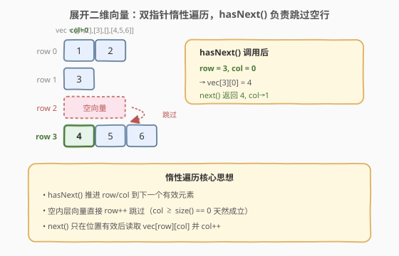
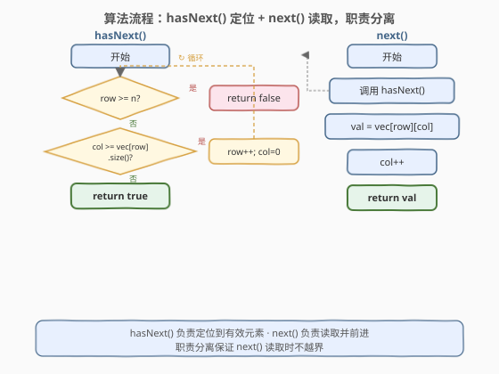
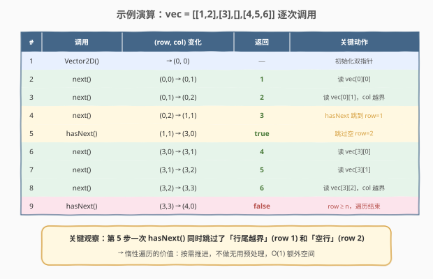

# LeetCode 展开二维向量 题解

## 1. 题目概述

- **标题 / 题号**：展开二维向量（#251，medium）
- **链接**：https://leetcode.cn/problems/flatten-2d-vector/
- **难度**：中等
- **标签**：设计、数组、双指针、迭代器

**题意**：请为二维向量设计一个迭代器，将其「展平」为一维序列逐元素访问。实现 `Vector2D` 类：

- `Vector2D(vector<vector<int>>& vec)`：用二维向量 `vec` 初始化对象。
- `int next()`：返回二维向量中的下一个元素，并将指针前移。
- `bool hasNext()`：如果仍有元素可访问则返回 `true`，否则 `false`。

**示例 1**：

```text
输入：
["Vector2D", "next", "next", "next", "hasNext", "hasNext", "next", "hasNext"]
[[[[1, 2], [3], [4]]], [], [], [], [], [], [], []]
输出：[null, 1, 2, 3, true, true, 4, false]

解释：
Vector2D v2d = Vector2D([[1, 2], [3], [4]]);
v2d.next();    // 返回 1
v2d.next();    // 返回 2
v2d.next();    // 返回 3
v2d.hasNext(); // 返回 true
v2d.hasNext(); // 返回 true
v2d.next();    // 返回 4
v2d.hasNext(); // 返回 false
```

**约束**：

- `0 <= vec.length <= 10^4`
- `0 <= vec[i].length <= 10^4`
- `next()` 和 `hasNext()` 的调用总次数不超过 $10^4$

> ⚠️ **内层向量可能为空**——这是本题的核心坑点。直接用 `(row, col)` 双指针遍历时，`col` 可能在某行末尾越界，需要跳到下一行；空行则需直接跳过。

> 💡 **进阶挑战**：能否仅用 C++ 迭代器（或 Java 迭代器）实现，而不存储额外的下标或展开数组？

## 2. 解题思路

### 2.1 暴力思路：构造时一次性展平

最直观的做法：在构造函数中把所有元素复制到一个一维数组中，之后 `next()` / `hasNext()` 只需维护一个下标即可。

```python
class Vector2D:
    def __init__(self, vec):
        self.flat = [x for row in vec for x in row]
        self.idx = 0
    def next(self):
        self.idx += 1
        return self.flat[self.idx - 1]
    def hasNext(self):
        return self.idx < len(self.flat)
```

简单可靠，但**额外空间 $O(N)$**（$N$ 为元素总数），且构造时 $O(N)$ 全量遍历——如果只调用一次 `next()` 就丢弃，做了大量无用功。更关键的是，它没有体现迭代器「**惰性**」的设计哲学。

### 2.2 核心观察：双指针惰性遍历



**关键洞察**：只需两个整数 `row` 和 `col` 即可跟踪当前位置，无需展开。难点在于**空内层向量**——当 `col` 越过某行末尾时，需要推进 `row` 并重置 `col = 0`，直到找到下一个非空行。

> 将「定位到有效元素」的职责交给 `hasNext()`，`next()` 只负责读取并前进。这样 `next()` 可以安全地假设位置已有效，无需重复判空逻辑——**职责分离**是迭代器设计的通用原则。

**`hasNext()` 的逻辑**：

```text
while row < n and col >= vec[row].size():
    row++; col = 0
return row < n
```

循环体跳过所有「已耗尽或为空」的行，最终要么 `row < n`（找到了有效行，`col` 指向该行有效元素），要么 `row >= n`（全部遍历完）。

> ⚠️ **为什么 `next()` 要先调 `hasNext()`？** `next()` 假设位置有效，但上一次 `next()` 的 `col++` 可能使 `col` 越过行尾。调用 `hasNext()` 确保在读取前 `row`/`col` 已被推进到下一个有效位置。`hasNext()` 是幂等的——多次调用不会跳过元素（循环条件 `col >= size()` 在 `col < size()` 时立即退出）。

### 2.3 算法流程图



### 2.4 示例演算

以 `vec = [[1,2], [3], [], [4,5,6]]` 为例（包含一个空内层向量）：



| # | 调用 | (row, col) 变化 | 返回 | 关键动作 |
|---|------|-----------------|------|----------|
| 1 | `Vector2D()` | →(0, 0) | — | 初始化双指针 |
| 2 | `next()` | (0,0)→(0,1) | 1 | 读 `vec[0][0]` |
| 3 | `next()` | (0,1)→(0,2) | 2 | 读 `vec[0][1]`，`col` 越界 |
| 4 | `next()` | (0,2)→(1,1) | 3 | `hasNext` 跳到 `row=1`，读 `vec[1][0]` |
| 5 | `hasNext()` | (1,1)→(3,0) | true | 跳过空 `row=2`，定位 `row=3` |
| 6 | `next()` | (3,0)→(3,1) | 4 | 读 `vec[3][0]` |
| 7 | `next()` | (3,1)→(3,2) | 5 | 读 `vec[3][1]` |
| 8 | `next()` | (3,2)→(3,3) | 6 | 读 `vec[3][2]`，`col` 越界 |
| 9 | `hasNext()` | (3,3)→(4,0) | false | `row≥n`，遍历结束 |

> 💡 **观察第 5 步**：`hasNext()` 从 `(1,1)` 出发——`col=1 ≥ vec[1].size()=1`（行耗尽）→ `row=2, col=0`——但 `vec[2]` 为空（`col=0 ≥ 0`）→ `row=3, col=0`——`vec[3]` 非空，停止。**一次 `hasNext()` 跳过了行尾和空行两类「无效位置」**，这正是惰性遍历的核心价值。

## 3. 参考代码

### C++（双指针）

```cpp
class Vector2D {
    vector<vector<int>> vec;
    int row = 0, col = 0;
public:
    Vector2D(vector<vector<int>>& v) : vec(v) {}

    int next() {
        hasNext();
        return vec[row][col++];
    }

    bool hasNext() {
        while (row < (int)vec.size() && col >= (int)vec[row].size()) {
            row++;
            col = 0;
        }
        return row < (int)vec.size();
    }
};
```

### Python（双指针）

```python
class Vector2D:
    def __init__(self, vec: List[List[int]]):
        self.vec = vec
        self.row = 0
        self.col = 0

    def next(self) -> int:
        self.hasNext()
        val = self.vec[self.row][self.col]
        self.col += 1
        return val

    def hasNext(self) -> bool:
        while (self.row < len(self.vec)
               and self.col >= len(self.vec[self.row])):
            self.row += 1
            self.col = 0
        return self.row < len(self.vec)
```

> 💡 两版结构一致：`next()` 先调 `hasNext()` 定位，再读取 `vec[row][col]` 并 `col++`。`hasNext()` 的 `while` 循环统一处理「行尾越界」和「空行」两种情况——条件 `col >= vec[row].size()` 对两者都成立（空行的 `size() == 0`，`col = 0 >= 0` 为真）。

## 4. 复杂度分析

| 维度 | 复杂度 | 说明 |
|------|--------|------|
| 时间（构造） | $O(1)$ | 仅初始化两个指针，不预处理 |
| 时间（`hasNext`） | 均摊 $O(1)$ | 每次 `row++` 不可逆，总共最多推进 $n$ 次，分摊到所有调用 |
| 时间（`next`） | 均摊 $O(1)$ | 内含一次 `hasNext()`，加上 $O(1)$ 读取 |
| 空间 | $O(1)$ | 仅两个整型指针（不计输入存储） |

> ⚠️ 暴力展平法构造 $O(N)$ + 空间 $O(N)$，单次调用优势在于 `next()` 是严格的 $O(1)$ 而非均摊。但迭代器的核心价值是**惰性**——如果只读前几个元素就停止，双指针法避免了不必要的全量遍历。

## 5. 扩展：仅用迭代器实现（进阶）

题目进阶要求仅用 C++ 迭代器实现。思路：用外层迭代器遍历行，内层迭代器遍历列，`advance()` 函数跳过空行（内层 `begin == end` 的行）。

```cpp
class Vector2D {
    vector<vector<int>>::iterator it, end;
    vector<int>::iterator colIt, colEnd;

    void advance() {
        while (it != end && colIt == colEnd) {
            colIt = it->begin();
            colEnd = it->end();
            ++it;
        }
    }
public:
    Vector2D(vector<vector<int>>& vec) {
        it = vec.begin();
        end = vec.end();
        advance();
    }

    int next() {
        int val = *colIt++;
        advance();
        return val;
    }

    bool hasNext() {
        return it != end || colIt != colEnd;
    }
};
```

> 💡 **与双指针法的对应关系**：`it` ↔ `row`，`colIt` ↔ `col`，`colEnd` ↔ `vec[row].end()`。`advance()` ↔ `hasNext()` 中的 `while` 循环。迭代器版的 `advance()` 在**构造时**就调用一次（把指针定位到首个有效元素），之后每次 `next()` 读取后立即 `advance()`——与双指针版「`next()` 先调 `hasNext()`」是同一思想的不同时序：迭代器版**读取后推进**，双指针版**读取前推进**。两者等价，因为首次调用前都需定位。
>
> ⚠️ **迭代器有效性**：`it` 和 `colIt` 是指向输入 `vec` 的迭代器，要求 `vec` 在 `Vector2D` 生命周期内不被销毁/修改。LeetCode 测试框架保证这一点；工程中若需安全，可在构造时拷贝一份 `vec`（牺牲 $O(N)$ 空间换所有权）。

## 6. 面试要点

1. **为什么用双指针而不是直接展平？**

   > 展平法构造时 $O(N)$ 时间 + $O(N)$ 空间，如果只调用几次 `next()` 就丢弃，浪费大量预处理。双指针法惰性遍历，构造 $O(1)$，空间 $O(1)$，只在需要时才推进——这是迭代器设计的核心哲学。类比 [173. 二叉搜索树迭代器](https://leetcode.cn/problems/binary-search-tree-iterator/)：也是惰性中序遍历而非预先展平。

2. **`hasNext()` 为什么是幂等的？多次调用不会跳过元素吗？**

   > `hasNext()` 的循环条件是 `col >= vec[row].size()`。当 `(row, col)` 已指向有效元素时，`col < vec[row].size()`，循环不执行，直接返回 `true`。只有当 `col` 越过行尾（包括空行 `0 >= 0`）时才推进。因此多次调用 `hasNext()` 效果等同一次——指针只在「当前位置无效」时才前进。

3. **`next()` 内部为什么必须先调 `hasNext()`？**

   > 上一次 `next()` 的 `col++` 可能使 `col` 恰好越过行尾。若不先调 `hasNext()` 定位，直接读 `vec[row][col]` 会越界。`hasNext()` 负责把指针推进到下一个有效位置，保证 `next()` 的读取安全。这是「职责分离」：定位归 `hasNext`，读取归 `next`。

4. **如何扩展到三维向量？**

   > 嵌套一层：维护 `(plane, row, col)` 三个下标，`hasNext()` 的循环改为「跳过所有 `col` 越界的行，行耗尽则跳行，行耗尽则跳面」。更通用的做法是用**栈模拟递归**——每个维度压一层迭代器，栈顶耗尽则弹栈推进下层。参考 [341. 扁平化嵌套列表迭代器](https://leetcode.cn/problems/flatten-nested-list-iterator/)，用栈处理任意深度嵌套。

5. **均摊 $O(1)$ 的分析依据是什么？**

   > `hasNext()` 中的 `row++` 是不可逆操作——`row` 从 0 单调递增到 $n$，总共最多 $n$ 次。设总共调用 $k$ 次 `next()`/`hasNext()`，所有 `row++` 的总次数不超过 $n$，分摊到 $k$ 次调用，每次均摊 $O(n/k)$。当 $k$ 与 $n$ 同阶时为 $O(1)$。这与 [232. 用栈实现队列](../0001-0100/232_用栈实现队列.md) 的双栈倒换均摊分析一脉相承。

> 💡 **一句话总结**：251 的灵魂是「**双指针惰性遍历 + hasNext/next 职责分离**」——`hasNext()` 负责 `row++` 跳过空行与行尾越界，把指针定位到下一个有效元素；`next()` 只管读取并 `col++`。这个「定位与读取分离」的模板是所有迭代器设计题的核心套路。

## 同类练习题

| # | 题目 | 与本题的关联 |
|---|------|-------------|
| 281 | [锯齿迭代器](https://leetcode.cn/problems/zigzag-iterator/) | 多向量交替遍历，用队列管理各向量的迭代器，同属「迭代器设计」家族 |
| 341 | [扁平化嵌套列表迭代器](https://leetcode.cn/problems/flatten-nested-list-iterator/) | 任意深度嵌套的展平，用栈模拟递归，是 251 的递归泛化版 |
| 232 | [用栈实现队列](../0001-0100/232_用栈实现队列.md) | 均摊 $O(1)$ 分析的经典题，与本题的 `row++` 均摊同属「摊还分析」家族 |
| 173 | [二叉搜索树迭代器](https://leetcode.cn/problems/binary-search-tree-iterator/) | 惰性中序遍历，同样是「按需推进指针」而非预先展平 |
| 284 | [窥视迭代器](../0201-0300/284_窥视迭代器.md) | 在迭代器基础上增加 `peek()` 功能，核心为单元素缓存（装饰器模式），考察对迭代器状态的保存与恢复 |
