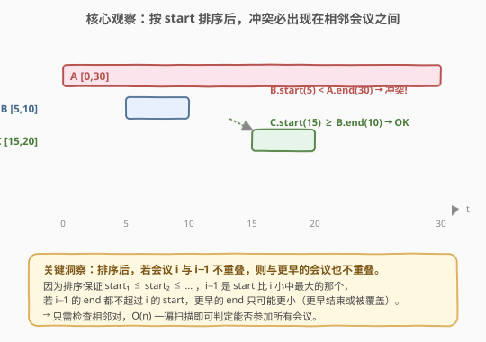
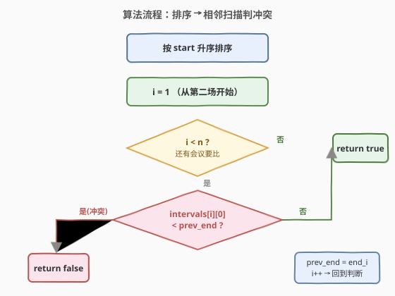
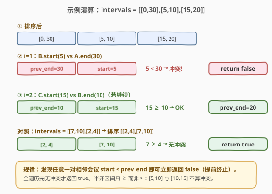

# LeetCode 会议室 题解

## 1. 题目概述

- **标题 / 题号**：会议室（#252，easy）
- **链接**：https://leetcode.cn/problems/meeting-rooms/
- **难度**：简单
- **标签**：排序、贪心、区间

**题意**：给定一个会议时间安排的数组 `intervals`，每个会议 `intervals[i] = [start_i, end_i)` 表示该会议在 `start_i` 开始、`end_i` 结束（**半开区间**）。判断一个人是否可以**参加所有会议**——即任意两场会议时间都不重叠。

**示例 1**：

```text
输入：intervals = [[0,30],[5,10],[15,20]]
输出：false
解释：会议 [0,30] 与 [5,10] 时间重叠，无法全部参加。
```

**示例 2**：

```text
输入：intervals = [[7,10],[2,4]]
输出：true
解释：两场会议时间不重叠，可以全部参加。
```

**约束**：

- `0 <= intervals.length <= 10^4`
- `intervals[i].length == 2`
- `0 <= start_i < end_i <= 10^6`

> ⚠️ 注意是**半开区间**：`[5,10]` 与 `[10,15]` 不算冲突，`10` 时刻可直接接续。这正是判断条件用 `>=`（而非 `>`）的原因。本题是 [253. 会议室 II](253_会议室II.md) 的「判定版」——253 求最少房间数，252 只需判定 1 间是否够用。

## 2. 解题思路

### 2.1 暴力思路

对每两场会议两两比较，一旦发现某对 `i, j` 满足 `intervals[i][0] < intervals[j][1] && intervals[j][0] < intervals[i][1]`（区间相交），即返回 `false`。时间 $O(n^2)$，在 $n = 10^4$ 量级达到 $10^8$ 次比较，偏慢且没有利用「时间先后」的结构。下面用**排序 + 一次扫描**把复杂度压到 $O(n \log n)$。

### 2.2 核心观察：排序后冲突必出现在相邻会议之间



把所有会议**按 `start` 升序排序**后，时间线从左到右依次排列。此时一个关键性质成立：

> **若会议 $i$ 与 $i-1$ 不重叠，则它与所有更早的会议也不重叠。**

**证明**：排序保证 $start_1 \le start_2 \le \dots \le start_i$。会议 $i-1$ 是所有 $start$ 比 $i$ 小的会议中 $start$ 最大的那个。若 $i-1$ 的 $end$ 都不超过 $i$ 的 $start$（即 $end_{i-1} \le start_i$），那么对于任意 $k < i-1$：

- 若 $end_k \le end_{i-1}$，则 $end_k \le start_i$，不重叠；
- 若 $end_k > end_{i-1}$（某个更早的会议拖得更长），它必然覆盖了 $i-1$ 的开始时刻——此时 $i-1$ 本身就与 $k$ 重叠，会在更早的相邻比较中被发现。

因此只需检查**相邻对**是否满足 $start_i < end_{i-1}$（即重叠），一遍 $O(n)$ 扫描即可判定。

> 💡 **与 253 的关系**：253 问「最少几间房」，需要在相邻比较时维护一个最小堆来复用房间；252 只问「1 间够不够」，退化为「是否存在相邻重叠」——有重叠就 `false`，全无重叠就 `true`。252 是 253 的「布尔判定版」，复杂度从 $O(n \log n)$（堆）降为 $O(n \log n)$（仅排序）+ $O(n)$（扫描），常数更小。

### 2.3 算法流程图



### 2.4 示例演算

以 `intervals = [[0,30],[5,10],[15,20]]` 为例（已按 `start` 排序）：



| 步骤 | $i$ | 当前会议 | `prev_end` | 比较 `start_i < prev_end` | 结果 |
|------|-----|----------|------------|---------------------------|------|
| 排序 | — | `[[0,30],[5,10],[15,20]]` | — | — | — |
| 初始 | 1 | `[5,10]` | 30 | `5 < 30` ✅ 冲突 | `return false` |

第一个相邻对就发现冲突，立即返回 `false`（无需继续比较 `[15,20]`）。

对照 `intervals = [[7,10],[2,4]]` → 排序 `[[2,4],[7,10]]`：

| 步骤 | $i$ | 当前会议 | `prev_end` | 比较 `start_i < prev_end` | 结果 |
|------|-----|----------|------------|---------------------------|------|
| 排序 | — | `[[2,4],[7,10]]` | — | — | — |
| ① | 1 | `[7,10]` | 4 | `7 < 4` ❌ 不冲突 | `prev_end = 10`, `i++` |
| 终止 | 2 | 越界 | — | `i == n` | `return true` |

> 💡 半开区间的细节：`[5,10]` 与 `[10,15]` 的 `start=10` 等于前一个 `end=10`，用 `10 < 10` 为假 → 不算冲突。若误用 `<=` 会把刚好接续的两场误判为冲突。

## 3. 参考代码

### C++

```cpp
class Solution {
public:
    bool canAttendMeetings(vector<vector<int>>& intervals) {
        sort(intervals.begin(), intervals.end());  // 按 start 升序
        for (int i = 1; i < (int)intervals.size(); ++i) {
            if (intervals[i][0] < intervals[i - 1][1]) return false;  // 相邻重叠
        }
        return true;
    }
};
```

### Python

```python
class Solution:
    def canAttendMeetings(self, intervals: List[List[int]]) -> bool:
        intervals.sort()  # 按 start 升序
        for i in range(1, len(intervals)):
            if intervals[i][0] < intervals[i - 1][1]:  # 相邻重叠
                return False
        return True
```

> 💡 两版结构一致：排序后从 $i=1$ 起逐个与前一个的 `end` 比较，`start_i < prev_end` 即冲突。无需显式维护 `prev_end` 变量——直接读 `intervals[i-1][1]` 即可，因为排序后数组本身已是有序的「上一场结束时刻」记录。

## 4. 复杂度分析

| 维度 | 复杂度 | 说明 |
|------|--------|------|
| 时间复杂度 | $O(n \log n)$ | 排序 $O(n \log n)$；一次线性扫描 $O(n)$，总体由排序主导 |
| 空间复杂度 | $O(\log n)$ | 排序的递归栈空间（C++ `sort` 内省排序）；不计输入存储 |

> 💡 当 $n = 10^4$ 时 $n \log n \approx 1.3 \times 10^5$，远优于暴力的 $O(n^2) = 10^8$。提前终止优化：一旦发现冲突立即返回，最好情况 $O(1)$（前两场就冲突），但最坏仍需遍历全部。

## 5. 扩展：暴力双指针与扫描线视角

**暴力法**（$O(n^2)$）用于对照理解：

```python
class Solution:
    def canAttendMeetings(self, intervals: List[List[int]]) -> bool:
        n = len(intervals)
        for i in range(n):
            for j in range(i + 1, n):
                a, b = intervals[i], intervals[j]
                if a[0] < b[1] and b[0] < a[1]:  # 区间相交
                    return False
        return True
```

**扫描线视角**：把每场会议拆成「开始 +1」「结束 -1」事件，按时间排序后扫描，若任意时刻 `cur > 1` 则有冲突（即 253 的扫描线在峰值阈值上的特化）。

```python
class Solution:
    def canAttendMeetings(self, intervals: List[List[int]]) -> bool:
        events = []
        for s, e in intervals:
            events.append((s, 1))
            events.append((e, -1))
        events.sort(key=lambda x: (x[0], x[1]))  # 同时刻结束(-1)排在开始(+1)前
        cur = 0
        for _, delta in events:
            cur += delta
            if cur > 1:  # 瞬时并发 > 1 即冲突
                return False
        return True
```

> 💡 扫描线判定 `cur > 1` 等价于「最少房间数 > 1」，即 253 的解法把答案阈值化为布尔。但排序+相邻比较更简洁、常数更小，是本题的首选。

## 6. 面试要点

1. **为什么排序后只需检查相邻对？**

   > 排序保证 $start$ 单调不减。若会议 $i$ 与 $i-1$（$start$ 最大且小于 $start_i$ 的那场）都不重叠，则与更早的会议也不重叠——因为更早的 $start$ 更小，若它们的 $end$ 超过 $start_i$，必然也覆盖了 $i-1$ 的开始时刻，会在更早的相邻比较中暴露。这个「相邻蕴含全局」的性质是所有区间调度题的基础。

2. **判断条件为什么用 `<` 而不是 `<=`？**

   > 题目是半开区间 $[start, end)$，`end` 时刻房间立即空闲。所以 `[5,10]` 与 `[10,15]` 不冲突，`10 < 10` 为假。若改成闭区间 $[start, end]$，则需用 `<=`。这与 [253](253_会议室II.md) 中堆解法的 `heap[0] <= s` 是同一语义的两种表达。

3. **本题与 253 会议室 II 的关系？**

   > 252 是 253 的「判定版」：253 求最少房间数（最大并发），252 只需判定「最大并发是否 $\le 1$」。252 的解法是 253 的退化——不需要最小堆维护房间集合，只需相邻比较。把 253 的堆解法阈值化（`return len(heap) <= 1`）也能解 252，但浪费了 $O(n)$ 空间。

4. **如果区间未排序，能否在 $O(n)$ 内判定？**

   > 不能。判定「是否存在重叠」在最坏情况下需要 $\Omega(n \log n)$ 次比较（元素唯一性归约）。排序 + 扫描的 $O(n \log n)$ 已是渐近最优。若值域很小（如 $end \le 10^6$），可用差分数组 $O(n + V)$ 牺牲空间换时间，但本题值域与 $n$ 同阶时不优于排序。

5. **空输入 `intervals = []` 应返回什么？**

   > 返回 `true`。没有会议自然「可以参加全部」——循环不执行，直接返回 `true`。这是空输入的平凡真值，与「最大并发 = 0 ≤ 1」一致。

> 💡 **一句话总结**：252 的灵魂是「**排序后相邻比较**」——把「任意两两是否重叠」的 $O(n^2)$ 判定，借助排序的单调性压缩为「相邻是否重叠」的 $O(n)$ 扫描。这是区间调度家族（253/435/452/56）的共同起手式。

## 同类练习题

| # | 题目 | 与本题的关联 |
|---|------|-------------|
| 253 | [会议室 II](253_会议室II.md) | 本题的「计数版」，求最少房间数=最大并发，需最小堆维护房间集合，承接相邻比较的起手式 |
| 435 | [无重叠区间](../0001-0100/435_无重叠区间.md) | 同样按端点贪心，求最少删几个区间使剩余不重叠，是 252「使不冲突」的反向版 |
| 452 | [用最少数量的箭引爆气球](https://leetcode.cn/problems/minimum-number-of-arrows-to-burst-balloons/) | 按右端点贪心求最少射箭数，区间覆盖类问题模板 |
| 56 | [合并区间](../0001-0100/56_合并区间.md) | 按左端点排序后合并重叠区间，区间题的基础套路 |
| 1094 | [拼车](https://leetcode.cn/problems/car-pooling/) | 扫描线差分数组判断容量是否超限，与本题扫描线视角同源 |
