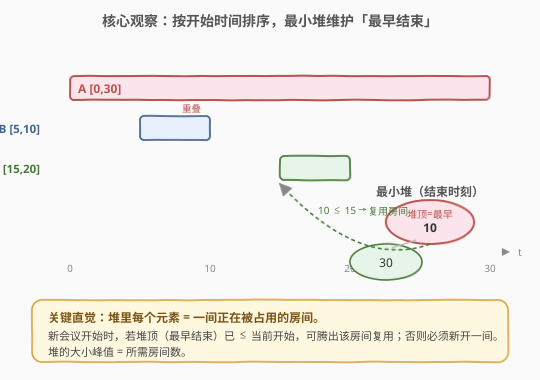
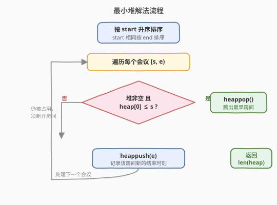
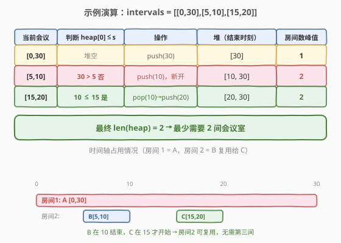

# LeetCode 会议室II 题解

## 1. 题目概述

- **标题 / 题号**：会议室II（#253，medium）
- **链接**：https://leetcode.cn/problems/meeting-rooms-ii/
- **难度**：中等
- **标签**：堆、贪心、排序、扫描线

**题意**：给定一个会议时间安排的数组 `intervals`，每个会议 `intervals[i] = [start_i, end_i)` 表示该会议在 `start_i` 开始、`end_i` 结束（**半开区间**，`end_i` 时刻房间即可被下一个会议复用）。求为使所有会议都不冲突，**最少需要多少间会议室**。

**示例 1**：

```text
输入：intervals = [[0,30],[5,10],[15,20]]
输出：2
解释：会议 [0,30] 独占一间；[5,10] 与 [15,20] 时间不重叠，可共用另一间。
```

**示例 2**：

```text
输入：intervals = [[7,10],[2,4]]
输出：1
解释：两场会议时间不重叠，一间会议室即可。
```

**约束**：

- `1 <= intervals.length <= 10^4`
- `0 <= start_i < end_i <= 10^6`

> ⚠️ 注意是**半开区间**：`[5,10]` 与 `[10,15]` 不算冲突，`10` 时刻房间可立刻复用。这正是后续判断条件用 `heap[0] <= s`（而非 `<`）的原因。

## 2. 解题思路

### 2.1 暴力思路

把每个会议看作一段时间区间，最朴素的办法是：在所有出现过的时刻点中扫描，统计任意时刻**同时在进行的会议数**，其最大值即为答案。但时刻值域高达 $10^6$，逐点扫描既慢又没必要。退一步，可以**对每个会议统计与它重叠的会议数**再取最大，时间 $O(n^2)$，在 $n = 10^4$ 量级偏慢且没用到结构。下面用**排序 + 最小堆**把复杂度压到 $O(n \log n)$。

### 2.2 核心观察：最小堆维护「最早结束的房间」



把每一间**正在被占用的会议室**抽象成堆里的一个元素——它的值是该房间**最早能腾出的时刻**（即当前占用它的那场会议的 `end`）。

- **按 `start` 升序**逐个处理会议。处理顺序就是会议开始的先后，符合"先开始的先分配房间"的直觉。
- 对当前会议 `[s, e)`：
  - 若堆顶（**所有房间中最早结束的那个**）`heap[0] <= s`，说明这个房间在 `s` 之前已空出，可**复用**它——弹出旧的 `end`。
  - 否则没有任何房间空闲，必须**新开一间**。
  - 无论复用还是新开，都要把 `e` 入堆，代表这间房间现在被占用到 `e`。

**堆的大小**始终等于"当前正在被占用的房间数"，其峰值即为答案。由于每次只做"先 pop 再 push"或"只 push"，堆大小只会先减后增或只增，所以**最终 `len(heap)` 恰好等于过程中的峰值**，直接返回即可。

> 💡 **关键直觉**：我们不需要知道具体哪间房给哪场会议，只需知道"当前最早的空房时刻"够不够早。最小堆用 $O(\log n)$ 维护这个"最早空房"，贪心地复用，自然得到最少房间数。

### 2.3 算法流程图



### 2.4 示例演算

以 `intervals = [[0,30],[5,10],[15,20]]` 为例（已按 `start` 排序）：



| 当前会议 | 判断 `heap[0] <= s` | 操作 | 堆（结束时刻） | 房间数峰值 |
|----------|---------------------|------|----------------|------------|
| `[0,30]` | 堆空 | push(30) | `[30]` | 1 |
| `[5,10]` | `30 > 5` 否 | push(10)，新开 | `[10, 30]` | 2 |
| `[15,20]` | `10 <= 15` 是 | pop(10) → push(20) | `[20, 30]` | 2 |

最终 `len(heap) = 2`，即最少需要 **2** 间会议室。

## 3. 参考代码

### C++

```cpp
class Solution {
  public:
    int minMeetingRooms(vector<vector<int>>& intervals) {
        sort(intervals.begin(), intervals.end());   // 按 start 升序
        priority_queue<int, vector<int>, greater<int>> pq; // 最小堆，存 end
        for (auto& m : intervals) {
            int s = m[0], e = m[1];
            if (!pq.empty() && pq.top() <= s) pq.pop(); // 复用最早空闲的房间
            pq.push(e);
        }
        return pq.size();
    }
};
```

### Python

```python
class Solution:
    def minMeetingRooms(self, intervals: List[List[int]]) -> int:
        intervals.sort()                       # 按 start 升序
        heap = []                              # 最小堆，存 end
        for s, e in intervals:
            if heap and heap[0] <= s:          # 最早结束的房间已空出
                heapq.heappop(heap)
            heapq.heappush(heap, e)
        return len(heap)
```

## 4. 复杂度分析

| 维度 | 复杂度 | 说明 |
|------|--------|------|
| 时间复杂度 | $O(n \log n)$ | 排序 $O(n \log n)$；每个会议至多一次 push、一次 pop，共 $O(n)$ 次堆操作，每次 $O(\log n)$ |
| 空间复杂度 | $O(n)$ | 最坏情况所有会议重叠，堆中存 $n$ 个 end |

> 💡 当 $n = 10^4$ 时 $n \log n \approx 1.3 \times 10^5$，远优于暴力的 $O(n^2) = 10^8$。

## 5. 扩展：扫描线（差分数组）解法

另一种等价且更直观的思路是**扫描线**：把每个会议拆成"开始事件 +1"和"结束事件 -1"，按时间排序后扫描，维护一个**正在进行会议数** `cur`，其最大值即答案。

```python
class Solution:
    def minMeetingRooms(self, intervals: List[List[int]]) -> int:
        events = []
        for s, e in intervals:
            events.append((s, 1))   # 开始：占用 +1
            events.append((e, -1))   # 结束：占用 -1
        # 关键：同一时刻，结束事件(-1)排在开始事件(+1)前面，保证半开区间可复用
        events.sort(key=lambda x: (x[0], x[1]))
        cur = ans = 0
        for _, delta in events:
            cur += delta
            ans = max(ans, cur)
        return ans
```

> 💡 **排序的细节**：同一时刻若把 `+1` 排在 `-1` 前面，会把"刚好接续"的两场会议误判为冲突，多算一间房。让 `-1`（结束）排在前面，正对应半开区间 `end <= start` 即可复用的语义。两种解法等价：堆解法维护"房间集合"，扫描线维护"瞬时并发数"。

## 6. 面试要点

1. **为什么排序后用最小堆就能得到最少房间数？**
   - 按 `start` 处理保证先开始的会议先占房间；最小堆顶是"最早能腾出的房间"，能复用就复用，避免不必要地新开。这是经典的**贪心**：每次都尽可能复用最早空闲的房间，等价于把冲突降到最低，故房间数最少。

2. **判断条件为什么是 `heap[0] <= s` 而不是 `<`？**
   - 题目是半开区间 `[start, end)`，`end` 时刻房间立即空闲。所以 `10` 结束的会议与 `10` 开始的会议不冲突，用 `<=`。若改成闭区间 `[start, end]`，则需用 `<`。

3. **为什么返回 `len(heap)` 而不是过程中记录 `max(size)`？**
   - 每轮操作是"先 pop 再 push"（大小不变）或"只 push"（大小 +1），堆大小**单调不降**，因此最终大小即等于过程中的峰值。但写法上"只 push"时大小会一直增长到峰值后保持，所以 `len(heap)` 等于峰值。若逻辑改为"先 push 再 pop"，则必须显式记录 `max(size)`。

4. **堆解法与扫描线解法各有什么优劣？**
   - 堆解法直观体现"房间复用"语义，易扩展到"求每个房间安排哪些会议"；扫描线（差分）实现更短、常数更小，且天然处理"瞬时并发"类问题（如天际线、最多同时在线人数）。面试按需选择并讲清即可。

5. **若要求输出每间房间的具体安排，如何改造？**
   - 堆里不再只存 `end`，改为存 `(end, room_id)`；复用时弹出旧 `end` 并把新会议加入该 `room_id` 的日程表；新开时分配新 `room_id`。复杂度不变。

## 同类练习题

| # | 题目 | 与本题的关联 |
|---|------|-------------|
| 435 | [无重叠区间](https://leetcode.cn/problems/non-overlapping-intervals/) | 同样按端点贪心，求最少删几个区间使剩余不重叠，对比"区间调度"套路 |
| 452 | [用最少数量的箭引爆气球](https://leetcode.cn/problems/minimum-number-of-arrows-to-burst-balloons/) | 按右端点贪心求最少射箭数，区间覆盖类问题模板 |
| 56 | [合并区间](https://leetcode.cn/problems/merge-intervals/) | 按左端点排序后合并重叠区间，区间题的基础套路 |
| 1851 | [包含每个查询的最小区间](https://leetcode.cn/problems/minimum-interval-to-include-each-query/) | 区间 + 离线查询 + 最小堆的进阶综合题 |
| 1094 | [拼车](https://leetcode.cn/problems/car-pooling/) | 扫描线差分数组判断容量是否超限，与本文扫描线解法同源 |
