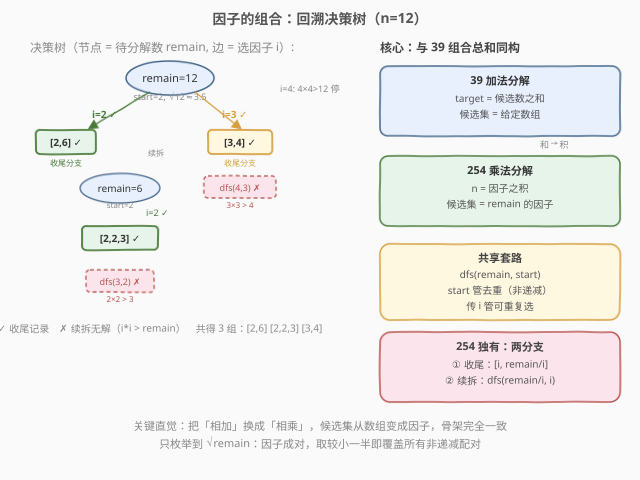
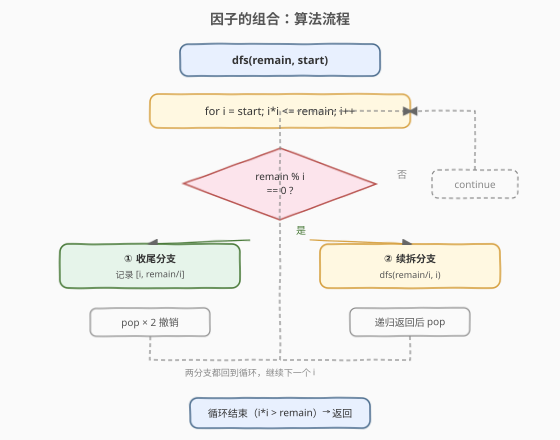
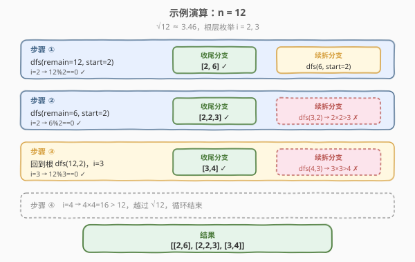

# LeetCode 因子的组合 题解

## 1. 题目概述

- **标题 / 题号**：因子的组合（#254，medium）
- **链接**：https://leetcode.cn/problems/factor-combinations/
- **难度**：中等
- **标签**：回溯、数学

**题意**：一个整数可以表示为它的若干因子的乘积。例如 $8 = 2 \times 2 \times 2 = 2 \times 4$。给定一个整数 $n$，返回它**所有可能的因子组合**。

要求：

- 每个组合中的因子按**升序**排列；
- 每个因子必须**大于 1 且小于 $n$**（即 1 和 $n$ 本身不算因子）；
- 结果中**不能包含重复组合**。

**示例 1**：

```text
输入：n = 1
输出：[]
解释：1 没有大于 1 小于自身的因子。
```

**示例 2**：

```text
输入：n = 12
输出：[[2,6],[2,2,3],[3,4]]
解释：12 = 2×6 = 2×2×3 = 3×4，共 3 种分解。
```

**示例 3**：

```text
输入：n = 30
输出：[[2,15],[2,3,5],[3,10],[5,6]]
解释：30 = 2×15 = 2×3×5 = 3×10 = 5×6，共 4 种分解。
```

**约束**：

- `1 <= n <= 10^7`

> ⚠️ 注意「因子升序」是去重的关键约束：$12 = 2 \times 6$ 与 $12 = 6 \times 2$ 视为同一种组合，只保留 $[2,6]$。

## 2. 解题思路

### 2.1 暴力思路：枚举因子全排列 + 去重集合

最朴素的办法：找出 $n$ 的所有因子（除 1 和 $n$ 外），然后回溯枚举「可重复选取的因子」使乘积等于 $n$，最后用 `HashSet` 过滤重复。这与 [39. 组合总和](../0001-0100/39_组合总和.md) 的「和」版完全同构——只是把「相加」换成了「相乘」。

问题在于：若不做顺序约束，$12 = 2 \times 6$ 与 $12 = 6 \times 2$ 会被当成两个不同的分支各搜一遍，再靠集合去重，白白浪费搜索量。

### 2.2 核心观察：回溯 + 非递减因子（同 39 的 start 技巧）



关键直觉与 [39. 组合总和](../0001-0100/39_组合总和.md) **完全同构**：

- **39（加法分解）**：把 `target` 拆成若干候选数之**和**，传 `start` 保证后续数 ≥ 当前数 → 组合非递减 → 杜绝 $[2,3]$ 与 $[3,2]$ 重复。
- **254（乘法分解）**：把 `n` 拆成若干因子之**积**，传 `start` 保证后续因子 ≥ 当前因子 → 因子序列非递减 → 杜绝 $[2,6]$ 与 $[6,2]$ 重复。

不同的是，254 的「候选集」**不是给定的数组，而是动态发现的**：对当前待分解数 `remain`，合法的下一个因子就是 `[start, √remain]` 区间内能整除 `remain` 的那些 `i`。

> 💡 **为什么只枚举到 `√remain`？** 因子成对出现：若 `i` 整除 `remain`，则 `remain/i` 也是因子，且 `i ≤ remain/i` 当且仅当 `i ≤ √remain`。我们只取「较小的一半」`i`，把较大的一半 `remain/i` 留作「要么直接作为配对因子收尾，要么继续递归分解」。越过 `√remain` 后，`i > remain/i`，配对会颠倒顺序，产生已被 `start` 约束排除的重复。

每发现一个因子 `i`（`remain % i == 0` 且 `i ≥ start`），有**两条分支**：

1. **收尾分支**：`[i, remain/i]` 已是一组合法因子（因子非递减，因为 `i ≤ remain/i`）→ 直接记录。
2. **续拆分支**：把 `remain/i` 继续往下拆，下一层 `start = i`（保证后续因子 ≥ `i`），递归得到更长组合。

```text
remain=12, start=2
├─ i=2: 12%2==0 → 收尾记录 [2,6]；续拆 dfs(6, start=2)
│         └─ remain=6, start=2
│            └─ i=2: 6%2==0 → 收尾记录 [2,2,3]；续拆 dfs(3, start=2) → 2*2>3 结束
├─ i=3: 12%3==0 → 收尾记录 [3,4]；续拆 dfs(4, start=3) → 3*3>4 结束
└─ i=4: 4*4>12 越过 √12，结束
```

### 2.3 算法流程图



### 2.4 示例演算

以 `n = 12` 为例（$\sqrt{12} \approx 3.46$，故根层枚举 `i = 2, 3`）：



| 层 | remain | start | i | remain%i==0 | 收尾分支 | 续拆分支 | 记录 |
|----|--------|-------|---|-------------|----------|----------|------|
| 0 | 12 | 2 | 2 | ✓ | `[2, 6]` | `dfs(6, 2)` | `[2,6]` |
| 1 | 6 | 2 | 2 | ✓ | `[2, 2, 3]` | `dfs(3, 2)` → 无 | `[2,2,3]` |
| 0 | 12 | 2 | 3 | ✓ | `[3, 4]` | `dfs(4, 3)` → 无 | `[3,4]` |

最终 `[[2,6],[2,2,3],[3,4]]`。

## 3. 参考代码

### C++

```cpp
class Solution {
  public:
    vector<vector<int>> getFactors(int n) {
        vector<vector<int>> ans;
        vector<int> path;
        dfs(n, 2, path, ans);
        return ans;
    }

  private:
    void dfs(int remain, int start, vector<int>& path,
             vector<vector<int>>& ans) {
        // 只枚举到 sqrt(remain)：保证 i <= remain/i，因子非递减
        for (int i = start; (long long)i * i <= remain; ++i) {
            if (remain % i == 0) {
                // ① 收尾分支：[i, remain/i] 即一组合法因子
                path.push_back(i);
                path.push_back(remain / i);
                ans.push_back(path);
                path.pop_back();
                path.pop_back();
                // ② 续拆分支：继续分解 remain/i，下一层因子 >= i
                path.push_back(i);
                dfs(remain / i, i, path, ans);
                path.pop_back();
            }
        }
    }
};
```

### Python

```python
class Solution:
    def getFactors(self, n: int) -> List[List[int]]:
        ans = []
        path = []

        def dfs(remain: int, start: int) -> None:
            # 只枚举到 sqrt(remain)：保证 i <= remain // i，因子非递减
            for i in range(start, int(remain ** 0.5) + 1):
                if remain % i == 0:
                    # ① 收尾分支：[i, remain // i] 即一组合法因子
                    path.append(i)
                    path.append(remain // i)
                    ans.append(path[:])
                    path.pop()
                    path.pop()
                    # ② 续拆分支：继续分解 remain // i，下一层因子 >= i
                    path.append(i)
                    dfs(remain // i, i)
                    path.pop()

        dfs(n, 2)
        return ans
```

> ⚠️ **Python 收集结果必须用** `path[:]` **拷贝**：直接 `append(path)` 存的是引用，后续 `pop()` 会改坏已存入的结果（与 [46. 全排列](../0001-0100/46_全排列.md) 同理）。

> 💡 **两处细节决定正确性**：① 循环上界 `i * i <= remain`（只取较小因子，保证非递减）；② 递归传 `i` 而非 `i+1`（允许相同因子重复出现，如 `[2,2,3]` 中的两个 2）——这与 39 题传 `i` 而非 `i+1` 的道理一致。

## 4. 复杂度分析

| 维度 | 复杂度 | 说明 |
|------|--------|------|
| 时间复杂度 | $O(\sqrt{n} + F(n) \cdot \log n)$ | 根层枚举因子 $O(\sqrt{n})$；搜索树节点数与因子分解方案数 $F(n)$ 成正比，每条结果路径深度至多 $O(\log n)$（每层因子 $\geq 2$） |
| 空间复杂度 | $O(\log n)$ | 递归栈与 `path` 深度，每层至少乘一个 $\geq 2$ 的因子，深度至多 $\lfloor \log_2 n \rfloor$ |

> 💡 $F(n)$（$n$ 的无序因子分解数）随 $n$ 增长极慢：即便 $n = 10^7$，$F(n)$ 通常也只有几十量级，因此实际运行极快。$O(\sqrt{n})$ 的根层枚举在 $n = 10^7$ 时约 $3162$ 次整除判定，完全可接受。

## 5. 扩展：与组合总和系列的类比

254 与「组合总和」系列是**加法 vs 乘法**的镜像：

| 题 | 分解方式 | 候选集 | 去重手段 | 可重复选 |
|----|----------|--------|----------|----------|
| [39. 组合总和](../0001-0100/39_组合总和.md) | 加法（和 = target） | 给定数组 | `start` 非递减 | 是（传 `i`） |
| [40. 组合总和 II](https://leetcode.cn/problems/combination-sum-ii/) | 加法 | 给定数组（含重复） | 排序 + 同层跳过 | 否（传 `i+1`） |
| **254. 因子的组合** | **乘法（积 = n）** | **动态发现（因子）** | **`start` 非递减** | **是（传 `i`）** |

> 💡 **本质统一**：凡是「把一个量拆成若干部分（加/乘）」且「允许重复选取」的枚举题，套路都是 `dfs(remain, start)` + 传 `i`——`start` 管去重，`i` 管可重复。254 只是「候选集从给定数组变成 `remain` 的因子」，其余骨架与 39 完全一致。

## 6. 面试要点

1. **为什么传 `i` 而不是 `i+1`？**

   - 传 `i` 允许下一层仍选当前因子，于是 $12 = 2 \times 2 \times 3$ 中两个 2 能连选；若传 `i+1` 则每个因子只出现一次，会漏掉所有含重复因子的分解。

2. **如何避免 $[2,6]$ 与 $[6,2]$ 重复？**

   - 通过 `start` 控制因子顺序：每层只选 $\geq$ 上一个因子的值，序列天然非递减。$[2,6]$ 会生成而 $[6,2]$ 不会，从源头杜绝重复，无需集合去重。

3. **为什么循环上界是 `i * i <= remain` 而不是 `i < remain`？**

   - 因子成对出现 $(i, remain/i)$，且 $i \leq remain/i \iff i \leq \sqrt{remain}$。只取较小一半即可覆盖所有「非递减」配对；越过 $\sqrt{remain}$ 后配对颠倒顺序，属于已被 `start` 排除的重复。这也把根层枚举从 $O(n)$ 压到 $O(\sqrt{n})$。

4. **「收尾」和「续拆」两条分支缺一不可吗？**

   - 缺一不可。只收尾不续拆 → 只得到二因子分解（漏 $[2,2,3]$）；只续拆不收尾 → 得到的全是最小因子连乘（漏 $[2,6]$ 这种「2 直接配 6 收尾」的）。两者并集才完整。

5. **这题和 39 组合总和的区别在哪？**

   - 仅候选集不同：39 是给定的固定数组，254 是「对当前 `remain` 动态枚举其因子」。回溯三步（选-递归-撤销）与 `start` 去重完全一致，是「加法拆解」到「乘法拆解」的自然迁移。

## 同类练习题

| # | 题目 | 与本题的关联 |
|---|------|-------------|
| 39 | [组合总和](https://leetcode.cn/problems/combination-sum/)（[题解](../0001-0100/39_组合总和.md)） | 加法分解版的母题，`start` + 传 `i` 的去重可重复模板，254 的骨架来源 |
| 77 | [组合](https://leetcode.cn/problems/combinations/)（[题解](../0001-0100/77_组合.md)） | 基础组合回溯，`start` 传 `i+1` 的「不可重复选」模板，对比 254 的传 `i` |
| 40 | [组合总和 II](https://leetcode.cn/problems/combination-sum-ii/) | 候选含重复 + 不可重复选，排序 + 同层剪枝去重，对比去重场景差异 |
| 50 | [Pow(x, n)](https://leetcode.cn/problems/powx-n/) | 快速幂，同样是「乘法」主题但求单值而非枚举所有分解 |
