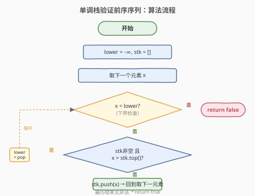
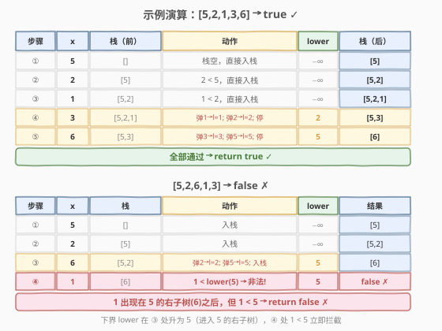

# 验证二叉搜索树的前序遍历序列

- **题目名称**：验证二叉搜索树的前序遍历序列
- **链接**：[255. 验证二叉搜索树的前序遍历序列](https://leetcode.cn/problems/verify-preorder-sequence-in-binary-search-tree/)
- **难度**：中等
- **标签**：栈、二叉搜索树、前序遍历、单调栈、数组

## 1. 题目概述

给定一个**无重复元素**的整数数组 `preorder`，判断它是否是某棵**二叉搜索树（BST）**的合法前序遍历序列。

> **BST 性质**：对于任意节点，左子树所有节点值 < 根节点值 < 右子树所有节点值。

**示例 1**：

```text
输入：preorder = [5,2,1,3,6]
输出：true

对应的 BST：
        5
       / \
      2   6
     / \
    1   3

前序遍历：5 → 2 → 1 → 3 → 6 ✓
```

**示例 2**：

```text
输入：preorder = [5,2,6,1,3]
输出：false

尝试构造 BST：
        5
       / \
      2   6
     /
    1       ← 1 应在 2 的左子树，但 6 已出现在 2 的右子树之后
             ← 1 < 5（根），却出现在 5 的右子树（6）之后，矛盾
```

**约束条件**：

- `1 <= preorder.length <= 10^4`
- `preorder` 中的所有元素**互不相同**
- `1 <= preorder[i] <= 10^9`

> **进阶**：能否用 $O(n)$ 时间 $O(1)$ 额外空间完成？（提示：复用输入数组作栈）

> 💡 本题是 [1008. 前序遍历构造二叉搜索树](../1001-1100/1008_前序遍历构造二叉搜索树.md) 的「验证版」——1008 假设输入合法直接建树，255 则要判断输入是否合法。两题共享同一套单调栈骨架，255 额外维护一个**下界**来检测非法序列。

---

## 2. 解题思路

### 2.1 暴力思路：分治递归 + 上下界

最直观的做法：第一个元素是根，用上下界递归验证。

- 根 `preorder[lo]` 必须在 `(lower, upper)` 范围内；
- 找到分区点 `i`：`preorder[lo+1..i-1]` 都 < 根（左子树），`preorder[i..hi]` 都 > 根（右子树）；
- 递归验证左子树（上界收紧为根）和右子树（下界收紧为根）。

```python
def verifyPreorder(self, preorder):
    def dc(lo, hi, lower, upper):
        if lo > hi:
            return True
        root = preorder[lo]
        if root <= lower or root >= upper:
            return False
        i = lo + 1
        while i <= hi and preorder[i] < root:
            i += 1
        return dc(lo + 1, i - 1, lower, root) and dc(i, hi, root, upper)
    return dc(0, len(preorder) - 1, float('-inf'), float('inf'))
```

> ⚠️ **必须传 `lower`**：仅检查「右子树元素 > 根」不够——右子树中的元素还必须 > 所有**左脊上的祖先**。例如 `[4,2,3,1]`：1 < 2（祖先），出现在 2 的右子树（3）之后，非法。只有 `lower` 传递祖先约束才能捕获。

时间 $O(n^2)$（退化链状时每层扫描 $O(n)$），空间 $O(n)$（递归栈）。能过但不够优。

### 2.2 核心观察：单调栈 + 下界约束


**关键洞察**：BST 前序遍历有两个结构性特征——

1. **左脊递减**：沿根的左链下行（`root → left → left.left → …`），前序序列中的值**严格递减**。这天然对应一个**单调递减栈**。

2. **右拐升下界**：一旦遇到比栈顶大的值，说明从某祖先「向右拐」进入了它的右子树。弹栈找到这个祖先，**它的值成为新的下界** `lower`——此后所有值必须 > `lower`（因为已进入它的右子树）。

> 💡 **下界只会单调递增**：每次「右拐」都是进入一个更大祖先的右子树，因此 `lower` 只升不降。这是「合法前序序列」的本质不变式。

**算法**：用栈维护当前路径上的祖先链（递减），遍历每个值 `x`：

- 若 `x < lower` → **非法**（出现在某祖先右子树中却比该祖先小）；
- 弹出所有比 `x` 小的栈顶（正在进入它们的右子树），最后一个弹出的值更新 `lower`；
- 将 `x` 入栈（成为新的路径末端）。

这与 [739. 每日温度](../0701-0800/739_每日温度.md) 的单调栈如出一辙——都是「遇到更大的值就弹栈」，只不过 739 弹栈是为了记录「下一个更大元素的距离」，而 255 弹栈是为了更新**下界约束**。

### 2.3 算法流程图



### 2.4 示例演算

以 `preorder = [5,2,1,3,6]` 为例：



| 步骤 | 当前值 x | 栈（处理前） | 动作 | lower | 栈（处理后） |
|------|---------|-------------|------|-------|-------------|
| ① | 5 | `[]` | 栈空，直接入栈 | $-\infty$ | `[5]` |
| ② | 2 | `[5]` | 2 < 5，直接入栈 | $-\infty$ | `[5,2]` |
| ③ | 1 | `[5,2]` | 1 < 2，直接入栈 | $-\infty$ | `[5,2,1]` |
| ④ | 3 | `[5,2,1]` | 3 > 1 弹 1 → lower=1；3 > 2 弹 2 → lower=2；3 < 5 停 | 2 | `[5,3]` |
| ⑤ | 6 | `[5,3]` | 6 > 3 弹 3 → lower=3；6 > 5 弹 5 → lower=5；栈空停 | 5 | `[6]` |

全部通过，返回 `true` ✓。

再看非法用例 `preorder = [5,2,6,1,3]`：

| 步骤 | x | 栈 | 动作 | lower | 结果 |
|------|---|----|------|-------|------|
| ① | 5 | `[]` | 入栈 | $-\infty$ | `[5]` |
| ② | 2 | `[5]` | 入栈 | $-\infty$ | `[5,2]` |
| ③ | 6 | `[5,2]` | 弹 2 → lower=2，弹 5 → lower=5，入栈 | 5 | `[6]` |
| ④ | 1 | `[6]` | **1 < lower(5)** → 非法！ | 5 | `false` ✗ |

步骤 ④ 中 1 出现在 5 的右子树（6）之后，但 1 < 5，违反 BST 性质，下界拦截命中。

---

## 3. 参考代码

### C++

```cpp
class Solution {
  public:
    bool verifyPreorder(vector<int>& preorder) {
        stack<int> stk;
        int lower = INT_MIN;
        for (int x : preorder) {
            if (x < lower) return false;
            while (!stk.empty() && x > stk.top()) {
                lower = stk.top();
                stk.pop();
            }
            stk.push(x);
        }
        return true;
    }
};
```

### Python

```python
class Solution:
    def verifyPreorder(self, preorder: List[int]) -> bool:
        stk = []
        lower = float('-inf')
        for x in preorder:
            if x < lower:
                return False
            while stk and x > stk[-1]:
                lower = stk.pop()
            stk.append(x)
        return True
```

> 💡 两版等价。核心是三行循环体：① 下界检查 → ② 弹栈更新下界 → ③ 入栈。弹栈的 `while` 条件用 `>`（严格大于），因为题目保证元素唯一，遇等值不必处理。

---

## 4. 复杂度分析

| 维度 | 复杂度 | 说明 |
|------|--------|------|
| 时间复杂度 | $O(n)$ | 每个元素至多入栈一次、出栈一次，均摊 $O(1)$ |
| 空间复杂度 | $O(n)$ | 最坏情况（单调递减序列如 `[5,4,3,2,1]`）栈存全部 $n$ 个元素 |
| 最坏情况 | $O(n)$ 空间 | 退化链状树（全左子树），栈深度 = $n$ |

> ⚠️ 分治法 $O(n^2)$ 的浪费在于：每次递归都要线性扫描找分区点，而祖先信息无法在递归间复用。单调栈法把「祖先链」显式存入栈中，遇到更大值时一次性弹出并更新下界，避免了重复扫描。

---

## 5. 扩展：O(1) 空间复用输入数组

进阶要求 $O(1)$ 额外空间。关键观察：栈的内容是 `preorder` 的一个前缀子集——遍历到位置 `j` 时，栈中元素全部来自 `preorder[0..j-1]`。因此可以直接**复用 `preorder` 数组的前部作为栈**，用一个指针 `i` 标记栈顶。

```cpp
class Solution {
  public:
    bool verifyPreorder(vector<int>& preorder) {
        int i = 0;              // 栈顶指针，preorder[0..i) 作栈
        int lower = INT_MIN;
        for (int x : preorder) {
            if (x < lower) return false;
            while (i > 0 && x > preorder[i - 1]) {
                lower = preorder[i - 1];
                i--;
            }
            preorder[i++] = x;  // 入栈
        }
        return true;
    }
};
```

> 💡 **原理**：遍历指针始终 ≥ 栈顶指针 `i`（栈只存已遍历过的元素），所以 `preorder[i..]` 中尚未读取的元素不会被覆写。修改 `preorder` 不影响后续遍历（`x` 是值拷贝）。这是「原地栈」的经典技巧，与 [287. 寻找重复数](../0201-0300/287_寻找重复数.md) 的「数组当哈希表」思想异曲同工。

---

## 6. 面试要点

1. **为什么用单调栈而不是分治？**

   > 分治每次递归都要 $O(n)$ 扫描找分区点，祖先信息无法跨层复用，最坏 $O(n^2)$。单调栈把祖先链显式存入栈，遇更大值弹栈即定位「右拐的祖先」，一次遍历 $O(n)$ 完成。两者本质都是利用 BST 前序的「左脊递减 + 右拐升下界」结构，但栈把分治的重复扫描消掉了。

2. **`lower` 的作用是什么？为什么不用也能过部分用例？**

   > `lower` 记录「已进入其右子树的最近祖先值」，此后所有元素必须 > `lower`。不传 `lower` 只靠栈无法捕获「右子树中出现比祖先小的值」——例如 `[4,2,3,1]`，1 比栈中所有元素都小会直接入栈，但它出现在 2 的右子树之后，应 > 2。`lower=2` 拦截了这个非法值。

3. **弹栈条件和入栈条件分别是什么？**

   > 弹栈：`!stk.empty() && x > stk.top()`（当前值比栈顶大，说明进入栈顶的右子树）。入栈：弹栈结束后无条件入栈——无论 `x` 是新的左孩子（比栈顶小）还是某个祖先的右孩子（弹栈后比新栈顶小），它都成为路径的新末端。

4. **和 1008（前序构造 BST）的关系？**

   > 两题共享同一套单调栈骨架：栈维护祖先链，遇更大值弹栈找父节点。区别在于 1008 假设输入合法、弹栈是为了「找新节点的父节点」并建树；255 不假设合法、弹栈是为了「更新下界」并验证。可以把 255 理解为「1008 的前置校验」。

5. **$O(1)$ 空间版为什么覆写 `preorder` 不影响遍历？**

   > 栈顶指针 `i` 始终 ≤ 遍历位置 `j`（栈只存 `preorder[0..j-1]` 的子集）。写 `preorder[i]` 时 `i < j`，覆写的是已读过的旧值；而当前值 `x = preorder[j]` 在进入循环时就已取出，覆写不影响后续 `for` 取值。只要覆写区域与未读区域不重叠即可。

> 💡 **一句话总结**：255 的灵魂是「**单调栈追踪左脊，弹栈更新下界**」——栈中祖先链递减，遇更大值弹栈定位「右拐祖先」，其值成为下界，此后任何小于下界的值都非法。这与 739/503 的单调栈骨架完全一致，只是弹栈语义从「记录距离」变成了「验证合法性」。

---

## 7. 同类练习题

- [1008. 前序遍历构造二叉搜索树](https://leetcode.cn/problems/construct-binary-search-tree-from-preorder-traversal/)（[题解](../1001-1100/1008_前序遍历构造二叉搜索树.md)）：同一单调栈骨架的「建树版」，假设输入合法，弹栈找父节点而非更新下界
- [98. 验证二叉搜索树](https://leetcode.cn/problems/validate-binary-search-tree/)（[题解](../0001-0100/98_验证二叉搜索树.md)）：上下界递归验证 BST，255 是其「序列版」——从树验证变为序列验证
- [739. 每日温度](https://leetcode.cn/problems/daily-temperatures/)（[题解](../0701-0800/739_每日温度.md)）：单调栈母题，同为「遇更大值弹栈」，弹栈语义从「记录距离」变为「更新下界」
- [503. 下一个更大元素 II](https://leetcode.cn/problems/next-greater-element-ii/)（[题解](../0501-0600/503_下一个更大元素II.md)）：单调栈 + 循环数组，同套弹栈骨架
- [287. 寻找重复数](https://leetcode.cn/problems/find-the-duplicate-number/)（[题解](../0201-0300/287_寻找重复数.md)）：数组原地复用技巧，与 255 的 $O(1)$ 空间版思想相通
