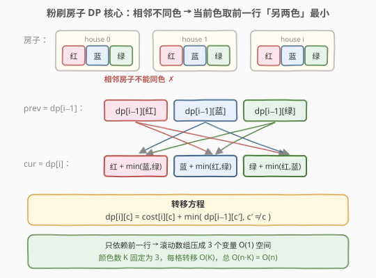
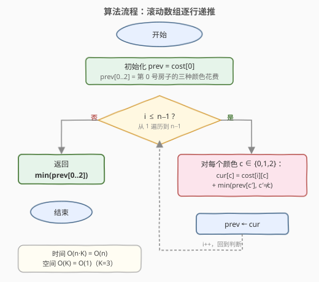
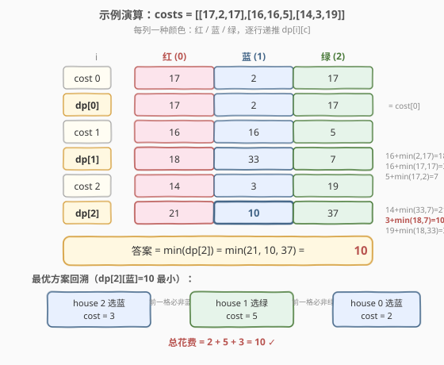

# 粉刷房子

- **题目名称**：粉刷房子
- **链接**：[256. 粉刷房子](https://leetcode.cn/problems/paint-house/)
- **难度**：中等
- **标签**：动态规划

## 1. 题目概述

一排 `n` 幢房子需要粉刷，每幢房子可以涂成**红、蓝、绿**三种颜色之一。给定 `n × 3` 的花费矩阵 `costs`，其中 `costs[i][0/1/2]` 分别表示把第 `i` 幢房子涂成红/蓝/绿的花费。要求**相邻两幢房子颜色不同**，求涂完所有房子的**最小总花费**。

**示例 1**：

```text
输入：costs = [[17,2,17],[16,16,5],[14,3,19]]
输出：10
解释：house 0 涂蓝(2) + house 1 涂绿(5) + house 2 涂蓝(3) = 10
```

**示例 2**：

```text
输入：costs = [[7,6,2]]
输出：2
解释：只有一幢房子，直接选最便宜的颜色绿(2)。
```

**约束条件**：

- `costs.length == n`
- `costs[i].length == 3`
- `1 <= n <= 100`
- `1 <= costs[i][j] <= 20`

> 💡 本题是「**线性 DP + 相邻不同状态**」的招牌题——状态是「当前房子选哪种颜色」，相邻约束体现为「转移时跳过同色」。颜色数 `K=3` 固定，每个状态只依赖前一行另两个状态的最小值，天然支持滚动数组压到 `O(1)` 空间。它是 [265. 粉刷房子 II](https://leetcode.cn/problems/paint-house-ii/)（K 种颜色版）与 [1473. 粉刷房子 III](https://leetcode.cn/problems/paint-house-iii/)（加街区约束版）的基础模板。

---

## 2. 解题思路

### 2.1 暴力思路：DFS 枚举每幢房子的颜色

最直观的做法：用 DFS 逐幢房子枚举三种颜色，遇到「与前一幢同色」就剪枝，到第 `n` 幢时统计总花费取最小。

```text
dfs(i, prevColor):
    if i == n: return 0
    best = +∞
    for c in {0,1,2}:
        if c == prevColor: continue        // 相邻不同色
        best = min(best, costs[i][c] + dfs(i+1, c))
    return best
```

时间 $O(3 \cdot 2^{n-1})$（第一幢 3 选、之后每幢 2 选），`n=100` 时严重超时。问题在于**子问题被重复求解**：`dfs(i, c)`（「第 `i` 幢涂 `c` 色，后续最优花费」）会被不同前缀路径反复调用。

> ⚠️ 暴力法的启示：一旦固定「第 `i` 幢房子涂颜色 `c`」，后续的最优花费**只取决于 `i` 和 `c`**，与前面房子怎么涂无关——这就是**无后效性**，是 DP 可行的根本条件。

### 2.2 核心观察：相邻不同色 → 当前色只看前一行另两色最小



**关键洞察**：定义状态

$$dp[i][c] = \text{涂完第 } 0 \dots i \text{ 幢房子的最小花费，且第 } i \text{ 幢涂颜色 } c$$

相邻不同色意味着第 `i` 幢涂 `c` 时，第 `i-1` 幢只能涂 `c' ≠ c`。于是：

$$dp[i][c] = costs[i][c] + \min_{c' \neq c} dp[i-1][c']$$

**边界**：`dp[0][c] = costs[0][c]`（第 0 幢无前驱约束，直接取自身花费）。

**答案**：$\min_{c} dp[n-1][c]$（最后一幢取三种颜色中的最小）。

> 💡 **为什么无后效性成立？** 第 `i` 幢之后的最优决策只依赖「第 `i` 幢涂了什么颜色」，不依赖更早的房子——因为相邻约束只看「紧邻的前一幢」。把前缀信息压缩成「前一幢的颜色 `c`」这一个维度，就足以驱动后续转移。这正是线性 DP 能「逐行递推」的本质。

> ⚠️ **「跳过同色」是转移的关键**：朴素地写 `dp[i][c] = costs[i][c] + min(dp[i-1])` 会把同色也纳入候选，违反约束。必须显式排除 `c' == c`——`K=3` 时等价于「取另两色的较小者」。

### 2.3 算法流程图



**三步法**（滚动数组 `O(1)` 空间）：

1. **初始化**：`prev = costs[0]`（`prev[c]` 即 `dp[0][c]`，三个值）。
2. **逐行递推**：对 `i = 1 … n-1`，计算 `cur[c] = costs[i][c] + min(prev[c′], c′ ≠ c)`，然后 `prev ← cur`。
3. **收尾**：返回 `min(prev[0], prev[1], prev[2])`。

> 💡 **滚动数组的依据**：`dp[i]` 只依赖 `dp[i-1]`，前一行用完即可丢弃。用两个长度为 3 的小数组（甚至直接 6 个变量）即可，空间 $O(K) = O(1)$。若不在乎原地修改，也可直接在 `costs` 上覆写，连 `prev/cur` 都省了。

### 2.4 示例演算

以 `costs = [[17,2,17],[16,16,5],[14,3,19]]` 为例：



**第 0 幢**（`dp[0] = cost[0]`）：

| 颜色 | dp[0] | 计算 |
|------|-------|------|
| 红 | 17 | = cost[0][红] |
| 蓝 | 2 | = cost[0][蓝] |
| 绿 | 17 | = cost[0][绿] |

**第 1 幢**（`dp[1][c] = cost[1][c] + min(dp[0][另两色])`）：

| 颜色 | dp[1] | 计算 |
|------|-------|------|
| 红 | 18 | 16 + min(蓝=2, 绿=17) = 16+2 |
| 蓝 | 33 | 16 + min(红=17, 绿=17) = 16+17 |
| 绿 | 7 | 5 + min(红=17, 蓝=2) = 5+2 |

**第 2 幢**（`dp[2][c] = cost[2][c] + min(dp[1][另两色])`）：

| 颜色 | dp[2] | 计算 |
|------|-------|------|
| 红 | 21 | 14 + min(蓝=33, 绿=7) = 14+7 |
| 蓝 | **10** | 3 + min(红=18, 绿=7) = 3+7 |
| 绿 | 37 | 19 + min(红=18, 蓝=33) = 19+18 |

**答案** = `min(21, 10, 37) = 10` ✓。

**最优方案回溯**：`dp[2][蓝]=10` 最小 → house 2 选蓝 → 前一格必非蓝，house 1 选绿（`dp[1][绿]=7`）→ 前一格必非绿，house 0 选蓝（`dp[0][蓝]=2`）。总花费 `2+5+3=10`。

> 💡 **回溯不增加复杂度**：记录每格取最小值时的「前驱颜色」即可在 $O(n)$ 内还原方案。但本题只问最小花费，无需回溯。注意 house 0 和 house 2 都选了蓝——它们不相邻，同色合法，这正是「相邻约束只看紧邻」的体现。

---

## 3. 参考代码

### C++

```cpp
// 粉刷房子.cpp —— 线性 DP + 滚动数组 O(1) 空间
// 编译: g++ -O2 -std=c++17 粉刷房子.cpp -o paint
#include <vector>
#include <algorithm>
using namespace std;

class Solution {
  public:
    int minCost(vector<vector<int>>& costs) {
        int n = costs.size();
        // prev[c] = dp[i-1][c]，初值取第 0 幢的花费
        int prev0 = costs[0][0], prev1 = costs[0][1], prev2 = costs[0][2];
        for (int i = 1; i < n; ++i) {
            // 当前三种颜色的最小花费：取前一行「另两色」较小者 + 自身花费
            int cur0 = costs[i][0] + min(prev1, prev2);   // 涂红，前一幢非红
            int cur1 = costs[i][1] + min(prev0, prev2);   // 涂蓝，前一幢非蓝
            int cur2 = costs[i][2] + min(prev0, prev1);   // 涂绿，前一幢非绿
            prev0 = cur0; prev1 = cur1; prev2 = cur2;     // 滚动
        }
        return min({prev0, prev1, prev2});
    }
};
```

### Python

```python
class Solution:
    def minCost(self, costs: list[list[int]]) -> int:
        # prev = dp[0]，三种颜色的最小花费
        prev = costs[0][:]                      # 拷贝，避免改 costs
        for i in range(1, len(costs)):
            cur = [
                costs[i][0] + min(prev[1], prev[2]),   # 涂红，前一幢非红
                costs[i][1] + min(prev[0], prev[2]),   # 涂蓝，前一幢非蓝
                costs[i][2] + min(prev[0], prev[1]),   # 涂绿，前一幢非绿
            ]
            prev = cur                              # 滚动
        return min(prev)
```

> 💡 两版等价。`K=3` 固定，C++ 版直接展开成三个变量省去数组下标；Python 版用列表更易读、也方便扩展到 `K` 种颜色（见第 5 节）。两种写法都只保留「前一行」的三个值，空间 $O(1)$。

---

## 4. 复杂度分析

| 维度 | 复杂度 | 说明 |
|------|--------|------|
| **时间复杂度** | $O(n)$ | 每幢房子做 $O(K)=O(3)$ 次转移，共 $n$ 幢，总计 $O(n \cdot K) = O(n)$ |
| **空间复杂度** | $O(1)$ | 只保留前一行三个值 `prev0/prev1/prev2`，与 $n$ 无关 |
| 最坏情况 | 同上 | 与颜色取值无关，$n=100$ 时常数级运算 |

> ⚠️ 暴力 DFS $O(2^n)$ 的浪费在于「同一 `(i, c)` 子问题被不同前缀反复求解」。DP 用一张 `dp[i][c]` 表把每个子问题的答案存下来只算一次——这是「最优子结构 + 无后效性 → DP」的标准范式。本题 `K=3` 固定，连表都不用开，三个变量滚动即可。

---

## 5. 扩展：K 种颜色与 O(nk) 通用解法

本题是 `K=3` 的特例。推广到 [265. 粉刷房子 II](https://leetcode.cn/problems/paint-house-ii/)（`K` 种颜色，`K` 可达 `n`），朴素 DP 为 $O(n \cdot K^2)$（每格要扫一遍前一行 `K` 个值取最小）。能否压到 $O(n \cdot K)$？

### 5.1 记录前一行最小与次小

关键观察：`dp[i][c] = costs[i][c] + min(dp[i-1][c′], c′ ≠ c)`。这个「跳过同色的最小」分两种情况：

- 若 `c` 恰好是前一行的**最小值所在颜色** → 取**次小值**；
- 否则 → 取**最小值**。

因此每行只需维护「最小值 `m1`、次小值 `m2`、最小值颜色 `idx`」三个量，转移时按 `c == idx` 二选一，整行 $O(K)$。总时间 $O(n \cdot K)$，空间 $O(1)$。

```python
def minCostII(costs: list[list[int]]) -> int:
    m1 = m2 = 0          # 前一行最小、次小（初值 0 表示空行）
    idx = -1
    for row in costs:
        n0 = n1 = float('inf')   # 当前行最小、次小
        nidx = -1
        cur = [0] * len(row)
        for c, v in enumerate(row):
            # 跳过同色：c==idx 取次小 m2，否则取最小 m1
            cur[c] = v + (m2 if c == idx else m1)
            if cur[c] < n0:
                n1 = n0; n0 = cur[c]; nidx = c
            elif cur[c] < n1:
                n1 = cur[c]
        m1, m2, idx = n0, n1, nidx
    return m1
```

> 💡 **「最小 + 次小」是跳过单点的通用技巧**：凡是要「取一组数中除某个下标外的最小值」，预处理最小与次小即可 $O(1)$ 应答单点询问，总 $O(K)$ 处理整组。这一思想也见于「除自身以外数组的乘积」（238，用前缀/后缀积跳过单点）等题。

### 5.2 粉刷房子系列全景

| 题目 | 颜色数 | 额外约束 | 核心改动 | 与本题关系 |
|------|--------|---------|---------|-----------|
| **256 粉刷房子（本题）** | 3 | 相邻不同色 | 三变量滚动 DP | 基础模板 |
| [265 粉刷房子 II](https://leetcode.cn/problems/paint-house-ii/) | K | 相邻不同色 | 最小+次小压到 $O(nK)$ | 本题的 K 色推广 |
| [1473 粉刷房子 III](https://leetcode.cn/problems/paint-house-iii/) | K | 相邻不同色 + 目标街区数 | 三维 DP `dp[i][c][t]` | 加「已形成街区数」维度 |

---

## 6. 面试要点

1. **为什么 DP 的状态只定义到「第 i 幢涂什么颜色」，而不需要记录更早的房子？**

   > 相邻约束只看「紧邻的前一幢」。一旦固定第 `i` 幢的颜色 `c`，第 `i+1` 幢的合法选择就完全确定（只要 ≠ `c`），与第 `i-1` 幢及更早无关。这种「未来只依赖当前状态」的性质即**无后效性**，是把状态维度压到「房子下标 + 当前颜色」的依据。

2. **转移方程里为什么要显式排除 `c′ == c`？漏掉会怎样？**

   > 相邻两幢不能同色是题目的硬约束。若写 `dp[i][c] = costs[i][c] + min(dp[i-1])`（不排除同色），就可能让第 `i-1` 幢也涂 `c` 色，产生非法方案，得到偏小的错误答案。`K=3` 时排除同色等价于「取另两色较小者」，写法最简；`K` 更大时用第 5.1 节的「最小+次小」技巧。

3. **滚动数组为什么正确？会不会丢信息？**

   > `dp[i]` 只依赖 `dp[i-1]`，`dp[i-2]` 及更早的行用完即弃。保留前一行三个值就足以计算当前行，算完当前行后它又变成下一行的「前一行」——滚动替换不丢失任何必需信息。这与打家劫舍（198）用两个变量滚动、爬楼梯（70）用两个变量滚动是同一思想：**只依赖有限步前驱的 DP 都能滚动到 O(1) 空间**。

4. **能否直接在 `costs` 上原地修改？有什么取舍？**

   > 可以。`costs[i][c] += min(costs[i-1][另两色])` 直接覆写，省去 `prev/cur` 变量，空间仍 $O(1)$（不计输入）。代价是**破坏了输入数据**——若调用方还要复用 `costs`，原地改会出错。面试中应主动说明「若允许修改输入可原地写」，体现对副作用边界的敏感。本题参考代码用 `prev` 拷贝是稳妥写法。

5. **如果房子排成环（首尾相邻）怎么做？**

   > 与打家劫舍 II（213）的「拆环为线」同思路：首尾不能同色，分两种情况——「固定第 0 幢颜色 `c0`，最后一幢不能涂 `c0`」分别求解再取最小。即枚举第 0 幢的 3 种颜色，每次跑一遍线性 DP 并在末尾排除 `c0`，取 3 次结果的最小。本质都是「环形冲突 → 剪开冲突边分情况」。

> 💡 **一句话总结**：256 的灵魂是「**相邻不同状态 → 转移时跳过同状态**」的线性 DP——状态维度只有「房子下标 + 当前颜色」，`K=3` 固定让转移退化为「取另两色最小」，三变量滚动即可 $O(n)/O(1)$。这个「相邻状态约束」模板是所有粉刷/涂色/选择类 DP 的母题。

---

## 7. 同类练习题

- [198. 打家劫舍](https://leetcode.cn/problems/house-robber/)（[题解](../0101-0200/198_打家劫舍.md)）：同样「相邻位置有约束」的线性 DP，状态为「偷/不偷」二选一，滚动数组 O(1) 空间，思路与本题一脉相承
- [213. 打家劫舍 II](https://leetcode.cn/problems/house-robber-ii/)（[题解](../0201-0300/213_打家劫舍II.md)）：环形相邻约束的拆环为线技巧，是本题第 6 节「环形变体」的现成范例
- [265. 粉刷房子 II](https://leetcode.cn/problems/paint-house-ii/)：本题的 K 色推广，用「最小+次小」把 $O(nK^2)$ 压到 $O(nK)$，承接第 5 节
- [1473. 粉刷房子 III](https://leetcode.cn/problems/paint-house-iii/)：在相邻不同色基础上加「目标街区数」维度，三维 DP，是本题的状态扩展
- [309. 最佳买卖股票时机含冷冻期](https://leetcode.cn/problems/best-time-to-buy-and-sell-stock-with-cooldown/)：相邻状态有约束（卖出后次日冷冻）的线性 DP，同样用「状态机 + 滚动」模板
