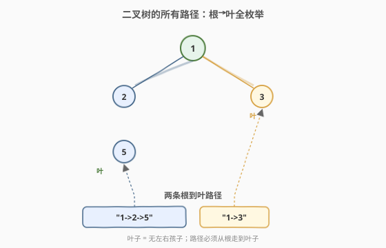
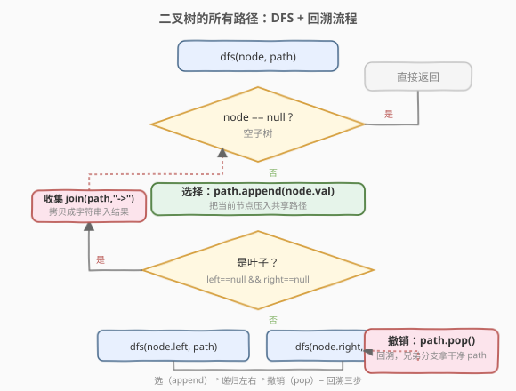
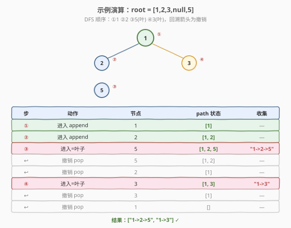

# 二叉树的所有路径

- **题目名称**：二叉树的所有路径
- **链接**：[257. 二叉树的所有路径](https://leetcode.cn/problems/binary-tree-paths/)
- **难度**：简单
- **标签**：树、深度优先搜索、回溯、二叉树

## 1. 题目概述

给定一棵二叉树的根节点 `root`，按**任意顺序**返回所有「从根节点到叶子节点」的路径。

每条路径用一个字符串表示，节点值之间用 `"->"` 连接，例如路径 `1 → 2 → 5` 表示为 `"1->2->5"`。

> 💡 **叶子节点**：没有左右孩子的节点。路径必须**从根开始、在叶子结束**，中间不能停在内部节点。

**示例 1**：

```text
输入：root = [1,2,3,null,5]
输出：["1->2->5","1->3"]
解释：两条根到叶路径：
  1 → 2 → 5  表示 "1->2->5"
  1 → 3      表示 "1->3"
        1
       / \
      2   3
       \
        5
```

**示例 2**：

```text
输入：root = [1]
输出：["1"]
解释：根即叶，单节点路径就是 "1"。
```

**约束条件**：

- 树中节点数目在范围 `[1, 100]` 内
- `-100 <= Node.val <= 100`

> 💡 本题是 [112. 路径总和](../0101-0200/112_路径总和.md)（判定是否存在）和 [113. 路径总和 II](../0101-0200/113_路径总和II.md)（收集数值列表）的「字符串版」：同样回溯收集所有根到叶路径，只是**没有过滤条件**——每条到叶路径都要收，把判断 `cur == target` 换成「无脑 join 成字符串」。它是树 DFS 回溯的最纯净入门题。

---

## 2. 解题思路

### 2.1 暴力思路

枚举每一条「根到叶」路径，逐条拼成 `"a->b->c"` 字符串收集。本质就是一次完整的 DFS 遍历，关键在于**如何在递归过程中高效维护「当前路径」**，避免每条路径从头重新拼接。

### 2.2 核心观察：共享 path 列表 + 回溯（同 113）



递归自顶向下遍历，用一个**共享的** `path` 列表记录「从根到当前节点」的节点值序列：

1. **进入节点**：`path.append(node.val)`。
2. **命中叶子**：若当前节点是叶子（左右孩子都为空），把 `path` 用 `"->"` join 成字符串，加入结果。
3. **返回上层**：`path.pop()`，撤销当前节点，让兄弟分支拿到干净的 `path`。

> 💡 这就是回溯的「**选 / 撤销**」范式，与 [113. 路径总和 II](../0101-0200/113_路径总和II.md)、[46. 全排列](../0001-0100/46_全排列.md) 完全同构。区别只在第 2 步：113 是「叶子且 `cur == target` 才收集」，本题是「叶子就收集」——**没有过滤条件，全收**。

### 2.3 关键易错点：必须判叶子

> ⚠️ 收集条件必须是「**叶子节点**」，**不能**在 `node == null` 时收集。

若改为在 `node == null` 处 join `path`，一个叶子有左右两个 `null` 孩子，会把同一条路径**重复收集两次**。正确做法是在**叶子节点本身**（`node.left == null && node.right == null`）收集，`node == null` 只作 base case 直接返回。

### 2.4 算法流程图



> 💡 注意流程里**没有对叶子特判是否递归子节点**：叶子节点的 `left/right` 为空，调用 `dfs(null)` 会立即在第一步 `return`，天然无害。所以收集逻辑与递归子节点可以统一写，代码更简洁。

### 2.5 示例演算

以示例 1（`root = [1,2,3,null,5]`）为例，DFS 先左后右，`path` 随进入/撤销动态变化，在两个叶子处各收集一条：



| 步 | 动作 | 节点 | path 状态 | 收集 |
|----|------|------|-----------|------|
| ① | 进入 append | 1 | `[1]` | — |
| ② | 进入 append | 2 | `[1, 2]` | — |
| ③ | 进入=叶子 | 5 | `[1, 2, 5]` | `"1->2->5"` |
| ↩ | 撤销 pop | 5 | `[1, 2]` | — |
| ↩ | 撤销 pop | 2 | `[1]` | — |
| ④ | 进入=叶子 | 3 | `[1, 3]` | `"1->3"` |
| ↩ | 撤销 pop | 3 | `[1]` | — |
| ↩ | 撤销 pop | 1 | `[]` | — |

最终结果 `["1->2->5", "1->3"]`。注意 `2` 只有右孩子 `5`（左为空），所以进入 `2` 后不会走向 `null` 收集——必须等到真正的叶子 `5` 才收。

---

## 3. 参考代码

### C++

```cpp
/**
 * Definition for a binary tree node.
 * struct TreeNode {
 *     int val;
 *     TreeNode *left;
 *     TreeNode *right;
 *     TreeNode() : val(0), left(nullptr), right(nullptr) {}
 *     TreeNode(int x) : val(x), left(nullptr), right(nullptr) {}
 *     TreeNode(int x, TreeNode *left, TreeNode *right) : val(x), left(left), right(right) {}
 * };
 */
class Solution {
  public:
    vector<string> binaryTreePaths(TreeNode* root) {
        vector<string> res;
        vector<int> path;
        dfs(root, path, res);
        return res;
    }

  private:
    void dfs(TreeNode* node, vector<int>& path, vector<string>& res) {
        if (node == nullptr) return;                 // 空节点：base case
        path.push_back(node->val);                   // 选择：进入
        if (node->left == nullptr && node->right == nullptr) {
            res.push_back(join(path));               // 叶子：拼成字符串收集
        }
        dfs(node->left,  path, res);
        dfs(node->right, path, res);
        path.pop_back();                             // 撤销：回溯
    }

    static string join(const vector<int>& path) {
        string s = to_string(path[0]);
        for (int i = 1; i < (int)path.size(); ++i) {
            s += "->" + to_string(path[i]);
        }
        return s;
    }
};
```

### Python

```python
class Solution:
    def binaryTreePaths(self, root: Optional[TreeNode]) -> List[str]:
        res: List[str] = []
        path: List[int] = []

        def dfs(node: Optional[TreeNode]) -> None:
            if node is None:
                return                              # 空节点：base case
            path.append(node.val)                   # 选择：进入
            if node.left is None and node.right is None:
                res.append("->".join(map(str, path)))  # 叶子：拼字符串收集
            dfs(node.left)
            dfs(node.right)
            path.pop()                              # 撤销：回溯

        dfs(root)
        return res
```

> ⚠️ **Python 的 `"->".join(...)` 需要字符串序列**：`path` 存的是 `int`，必须先 `map(str, path)` 转成字符串，否则 `join` 报 `TypeError`。C++ 则需自己写拼接函数（`to_string` + 循环），因为标准库没有 `join`。

> 💡 **为什么存 `int` 而不是直接存字符串？** 存 `int` 让 `path` 通用（同一份 `path` 可同时用于求和、判定、拼字符串），且 `pop()` 是 O(1)。若每步都拼字符串，撤销时需 `substr` 或重新拼接，开销大且易错。

---

## 4. 复杂度分析

| 维度 | 复杂度 | 说明 |
|------|--------|------|
| 时间复杂度 | $O(n^2)$ | 遍历 $O(n)$；每条路径需 join 成字符串，开销与路径长度成正比。最坏「梳状树」（每层挂一个叶、深度 $1..n/2$）时 $\sum$ 叶深 $= O(n^2)$ |
| 空间复杂度 | $O(n)$ | 递归调用栈 + `path` 列表，最坏（链状树）深 $n$；不计返回结果所占空间 |

> 💡 本题 $n \le 100$，$O(n^2)$ 至多约 $10^4$ 次操作，毫无压力。复杂度与 [113](../0101-0200/113_路径总和II.md) 同阶——凡是「枚举所有根到叶路径并各做 $O(\text{路径长})$ 工作」的题，最坏都是 $O(n^2)$。

---

## 5. 扩展：字符串参数免回溯写法

除了「共享 `path` 列表 + 回溯」，还有一种更短的写法：把**当前已拼好的字符串**作为参数随递归下传。因为 C++ `string` / Python `str` 在传参时按值/不可变，**天然免回溯**——和 [129. 求根节点到叶节点数字之和](../0101-0200/129_求根节点到叶节点数字之和.md) 中 `cur` 免回溯是同一个道理。

```python
class Solution:
    def binaryTreePaths(self, root: Optional[TreeNode]) -> List[str]:
        res = []

        def dfs(node: Optional[TreeNode], cur: str) -> None:
            if node is None:
                return
            cur = (cur + "->" + str(node.val)) if cur else str(node.val)
            if node.left is None and node.right is None:
                res.append(cur)                     # 叶子：cur 即完整路径串
                return
            dfs(node.left, cur)
            dfs(node.right, cur)

        dfs(root, "")
        return res
```

> 💡 **两种写法对比**：

| 写法 | 状态参数 | 是否回溯 | 适用场景 |
|------|----------|----------|----------|
| 共享 `path` 列表 | 可变 `list` | 需 `append`/`pop` | 通用，可同时求和/计数/拼串 |
| 字符串下传 `cur` | 不可变 `str` | **免回溯** | 只需拼字符串时最简洁 |

> ⚠️ 字符串写法在 C++ 中若用 `string&` 引用传递则**会**互相污染，必须按值传递 `string cur`（每次递归拷贝一份），代价是 $O(\text{路径长})$ 的拷贝——总复杂度仍是 $O(n^2)$，与列表版一致。Python 的 `str` 不可变，天然安全。

---

## 6. 面试要点

1. **为什么收集时要 join 而不能存引用？**

   - `path` 是贯穿整个递归的共享列表，若存 `path` 引用，后续 `pop` 会改坏已存结果。本题要的是字符串，所以收集时直接 `"->".join(map(str, path))` 生成一份**不可变的字符串快照**，天然隔离。对比 [113](../0101-0200/113_路径总和II.md) 存列表需 `path[:]` 拷贝。

2. **为什么必须判叶子，而不能在 `node == null` 处收集？**

   - 一个叶子有左右两个 `null` 孩子，若在 `null` 处收集，同一条路径会被收两次。正确做法在**叶子节点本身**（`left == null && right == null`）收集，`node == null` 只作 base case 直接返回。

3. **回溯的 `pop` 能省掉吗？**

   - 共享 `path` 版不能。`path` 在各分支间共享，访问完一棵子树若不弹出当前节点，它会「漏」进兄弟分支的路径里。`pop` 保证 `path` 始终精确表示「从根到当前节点」这条栈路径。若改用「字符串参数下传」版，则可省 `pop`（见第 5 节）。

4. **这题和 113 路径总和 II 的区别是什么？**

   - 仅过滤条件不同：113 是「叶子**且** `cur == targetSum`」才收集，本题是「叶子就收集」，**无过滤**。回溯三步（选-递归-撤销）完全一致。掌握 113 再看 257，相当于把「条件收集」退化为「无条件收集」。

5. **单节点树（`root` 即叶）怎么处理？**

   - 进入根节点 `append` 后，立即满足 `left == null && right == null`，收集 `"<val>"`，随后递归两个 `null` 子节点立即返回，最后 `pop`。结果 `["1"]`，无需特判。这正是 base case 设计统一的好处。

> 💡 **一句话总结**：257 是树 DFS 回溯的最纯净入门题——「`path` 列表 + 选/撤销 + 叶子处 join 收集」三件套，无任何过滤条件。掌握它，再看 [112](../0101-0200/112_路径总和.md)（判定版，`||` 短路）、[113](../0101-0200/113_路径总和II.md)（条件收集版）、[129](../0101-0200/129_求根节点到叶节点数字之和.md)（拼数求和版），都是同一骨架换「收集条件」与「汇总方式」的自然变体。

---

## 7. 同类练习题

- [113. 路径总和 II](https://leetcode.cn/problems/path-sum-ii/)（[题解](../0101-0200/113_路径总和II.md)）：本题的「条件收集版」，加了 `cur == target` 过滤，回溯骨架完全一致
- [112. 路径总和](https://leetcode.cn/problems/path-sum/)（[题解](../0101-0200/112_路径总和.md)）：只判定是否存在、不收集，从「枚举」退化为「`||` 短路」
- [129. 求根节点到叶节点数字之和](https://leetcode.cn/problems/sum-root-to-leaf-numbers/)（[题解](../0101-0200/129_求根节点到叶节点数字之和.md)）：把路径拼成数字再求和，`cur` 免回溯的典型
- [437. 路径总和 III](https://leetcode.cn/problems/path-sum-iii/)：路径不再要求到叶、可从任意节点开始，升级为「树上前缀和 + 哈希计数」
- [46. 全排列](https://leetcode.cn/problems/permutations/)（[题解](../0001-0100/46_全排列.md)）：数组版回溯「选/撤销」模板，与本题同构
