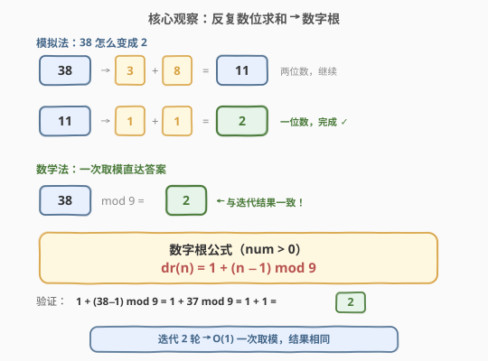
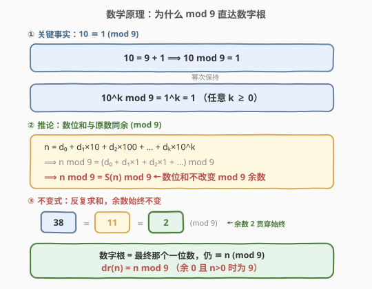
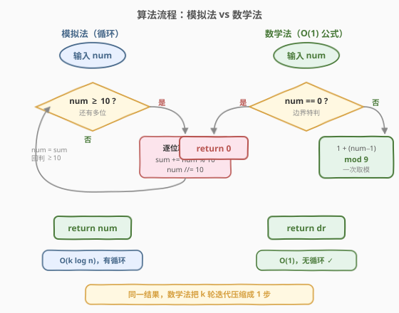
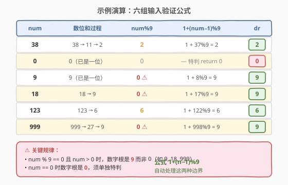

# LeetCode 各位相加 题解

## 1. 题目概述

- **标题 / 题号**：各位相加（#258，easy）
- **链接**：https://leetcode.cn/problems/add-digits/
- **难度**：简单
- **标签**：数学、模拟、数论

**题意**：给定一个非负整数 `num`，**反复**将各个位上的数字相加，直到结果为一位数。返回这个结果。

**示例 1**：

```text
输入：num = 38
输出：2
解释：3 + 8 = 11，1 + 1 = 2。因为 2 是一位数，返回 2。
```

**示例 2**：

```text
输入：num = 0
输出：0
```

**约束**：

- $0 \le \text{num} \le 2^{31} - 1$

> 💡 **进阶**：不使用循环 / 递归，在 $O(1)$ 时间解决？答案是**数字根公式** `1 + (num - 1) % 9`——一次取模直达答案。其数学根基是「$10 \equiv 1 \pmod{9}$」这一关键事实，由此推出「数位和不改变 mod 9 余数」，反复求和最终落在一个恰等于原数余数的一位数上。

## 2. 解题思路

### 2.1 暴力思路：模拟数位求和

最直观的做法：只要 `num` 还有多位（$\ge 10$），就逐位取余求和，用和替换 `num`，重复直到一位。

```text
while num >= 10：
    sum = 0
    while num > 0：
        sum += num % 10
        num //= 10
    num = sum
return num
```

以 `num = 38` 为例：$38 \to 3+8=11 \to 1+1=2$，两轮收敛。对 32 位整数（至多 10 位），首轮和至多 $9 \times 10 = 90$，次轮和至多 $9+9=18$，第三轮必到一位——**至多 3 轮**，每轮 $O(\log n)$，总计 $O(\log n)$。能 AC，但**用了循环**，不满足进阶的「$O(1)$ 无循环」要求。

> 💡 转机：观察多组输入的最终结果，会发现它与 `num % 9` 有某种神秘联系——$38 \bmod 9 = 2$，恰是答案。这不是巧合，而是**数位和与原数在 mod 9 下同余**这一数论性质的必然推论。

### 2.2 核心观察：数字根 = n mod 9



反复求数位和最终收敛到的那个一位数，数学上称为**数字根**（digital root）。关键观察是：

- $38 \to 11 \to 2$，而 $38 \bmod 9 = 2$——**数字根恰好等于原数 mod 9**（余 0 的正数例外，为 9）。

这意味着我们不需迭代，**一次取模**即可直达答案：

$$\text{dr}(n) = \begin{cases} 0 & n = 0 \\ 9 & n > 0 \text{ 且 } n \bmod 9 = 0 \\ n \bmod 9 & \text{否则} \end{cases}$$

可合并为一行：`num == 0 ? 0 : 1 + (num - 1) % 9`。

> 💡 **为什么减 1 再取模？** 正数 mod 9 的余数范围是 $0..8$，而数字根范围是 $1..9$。把 $n$ 先减 1，余数范围变成 $0..8$ 对应数字根 $1..9$——偏移 1 完美对齐，且自动处理了「$n \bmod 9 = 0$ 时数字根为 9 而非 0」的特例。

### 2.3 数学原理：为什么 mod 9



一切源于一个朴素的事实：**$10 = 9 + 1$**，即 $10 \equiv 1 \pmod{9}$。由此推出三步：

1. **$10^k \equiv 1 \pmod{9}$**：任意位权（个、十、百、千……）在 mod 9 下都等价于 1。
2. **$n \equiv S(n) \pmod{9}$**：把 $n$ 按 $n = d_0 + d_1 \times 10 + d_2 \times 10^2 + \cdots$ 展开，每个 $10^k$ 替换为 1，得 $n \equiv d_0 + d_1 + d_2 + \cdots = S(n) \pmod{9}$。**数位和不改变 mod 9 余数**。
3. **不变式链**：$38 \equiv 11 \equiv 2 \pmod{9}$——反复求和，余数始终不变。最终的一位数（数字根）仍 $\equiv n \pmod{9}$，故 $\text{dr}(n) = n \bmod 9$（正数余 0 时取 9）。

> ⚠️ **为什么不是 mod 10 或其他？** 因为十进制的基数是 10，而 $10 \equiv 1 \pmod{9}$。若用 $b$ 进制，数字根公式为 $\text{dr}(n) = n \bmod (b-1)$——这正是「弃九验算法」（casting out nines）的数学基础，已有千年历史。

### 2.4 算法流程图



两种解法并列对比：

- **模拟法**（左）：`while num >= 10` 反复逐位求和，外层循环次数 = 收敛轮数（至多 3），内层遍历所有数位。
- **数学法**（右）：一次 `num == 0` 特判 + 一次取模，$O(1)$ 无循环，直接满足进阶要求。

### 2.5 示例演算



六组典型输入覆盖所有边界：

| num | 数位和过程 | num % 9 | 1+(num−1)%9 | 数字根 | 说明 |
|-----|-----------|---------|-------------|--------|------|
| 38 | 38→11→2 | 2 | 1+37%9=2 | **2** | 普通情况，余数即答案 |
| 0 | 0 | 0 | — 特判 | **0** | 零的特例，公式不适用 |
| 9 | 9 | 0 ⚠ | 1+8%9=9 | **9** | 正数余 0，数字根为 9 |
| 18 | 18→9 | 0 ⚠ | 1+17%9=9 | **9** | 同上，9 的倍数 |
| 123 | 123→6 | 6 | 1+122%9=6 | **6** | 普通情况 |
| 999 | 999→27→9 | 0 ⚠ | 1+998%9=9 | **9** | 三轮收敛，仍是 9 的倍数 |

> 💡 注意 `num % 9 == 0` 的分叉：`num == 0` 时数字根为 **0**，`num > 0` 时数字根为 **9**。公式 `1 + (num - 1) % 9` 对 `num > 0` 统一返回 $1..9$，自动把余 0 映射为 9——无需单独处理 9 的倍数，只需特判 0。

## 3. 参考代码

### C++（O(1) 数学法）

```cpp
class Solution {
public:
    int addDigits(int num) {
        return num == 0 ? 0 : 1 + (num - 1) % 9;
    }
};
```

### Python（O(1) 数学法）

```python
class Solution:
    def addDigits(self, num: int) -> int:
        return 0 if num == 0 else 1 + (num - 1) % 9
```

> 💡 **一行即终**。`num == 0` 特判处理零，`1 + (num - 1) % 9` 处理一切正数——余 0 的正数（9 的倍数）经减 1 后 `(num-1) % 9 = 8`，加 1 得 9；非 9 倍数的正数 `(num-1) % 9` 恰好把余数对齐到 $0..8$，加 1 还原为 $1..9$。

### C++（模拟法，不满足进阶）

```cpp
class Solution {
public:
    int addDigits(int num) {
        while (num >= 10) {
            int sum = 0;
            while (num > 0) {
                sum += num % 10;
                num /= 10;
            }
            num = sum;
        }
        return num;
    }
};
```

### Python（模拟法，简洁写法）

```python
class Solution:
    def addDigits(self, num: int) -> int:
        while num >= 10:
            num = sum(int(d) for d in str(num))
        return num
```

> ⚠️ Python 模拟法的 `sum(int(d) for d in str(num))` 借助字符串转换取数位，简洁但开销略大（字符串化 + 生成器）。纯数值版用 `while num > 0: s += num % 10; num //= 10` 更贴近 C++ 写法，适合面试手写。

## 4. 复杂度分析

| 维度 | 数学法 | 模拟法 |
|------|--------|--------|
| **时间复杂度** | $O(1)$ | $O(\log n)$ |
| **空间复杂度** | $O(1)$ | $O(1)$ |
| **无循环/递归** | ✅ 满足进阶 | ✗ 用 while 循环 |

> ⚠️ 数学法严格 $O(1)$：一次比较 + 一次减法 + 一次取模，固定 3 步，与 `num` 大小无关。模拟法对 32 位整数至多 3 轮，每轮遍历至多 10 位，总计约 30 次操作——常数级，但形式上含循环，不满足进阶的「$O(1)$ 无循环」。

## 5. 扩展：公式的等价写法与弃九验算法

### 5.1 三种等价写法

数字根有多种等价表达，各有偏好场景：

```cpp
// 写法一：减 1 取模（推荐，最直观）
return num == 0 ? 0 : 1 + (num - 1) % 9;

// 写法二：利用 || 短路（C/C++ 特有，Python 不可用）
return num % 9 || 9 * (num > 0);

// 写法三：显式三分支（最易读但冗长）
if (num == 0) return 0;
if (num % 9 == 0) return 9;
return num % 9;
```

> 💡 **写法二原理**：`num % 9` 为 0 时（假值），`||` 取右侧 `9 * (num > 0)`——正数返回 9，零返回 0；`num % 9` 非 0 时（真值），直接返回该余数。利用了 C/C++ 中 `||` 返回操作数本身（而非布尔）的特性，Python 的 `or` 同理但可读性争议大。

### 5.2 弃九验算法（历史背景）

数字根的 mod 9 性质自古有之，称为**弃九法**（casting out nines）：验算大数乘法时，把乘数和被乘数的数位和相乘，再求数位和，与积的数位和比较——若不等则计算有误。例如 $38 \times 7 = 266$，$\text{dr}(38) = 2$，$\text{dr}(7) = 7$，$2 \times 7 = 14 \to 5$，$\text{dr}(266) = 2+6+6=14 \to 5$，吻合。

> ⚠️ 弃九法只能查错不能查对（9 的倍数的错误无法检出），但它是数字根性质的最古老应用，比 LeetCode 258 早了一千年。

### 5.3 推广到任意进制

十进制下数字根用 mod 9，是因为 $10 \equiv 1 \pmod{9}$。推广到 $b$ 进制：

$$\text{dr}_b(n) = n \bmod (b - 1)$$

例如二进制（$b=2$）下数字根 = $n \bmod 1 = 0$（恒为 0，因为二进制数位和就是 popcount，而 popcount mod 1 恒 0——平凡但自洽）；十六进制（$b=16$）下数字根 = $n \bmod 15$。这解释了「为什么是 9」——9 不是魔法数字，而是 $10 - 1$。

## 6. 面试要点

1. **为什么数字根等于 n mod 9？**

   - 根基是 $10 \equiv 1 \pmod{9}$，故 $10^k \equiv 1 \pmod{9}$。
   - 把 $n = d_0 + d_1 \times 10 + \cdots + d_k \times 10^k$ 中每个 $10^i$ 替换为 1，得 $n \equiv d_0 + d_1 + \cdots + d_k = S(n) \pmod{9}$。
   - 数位和不改变 mod 9 余数，反复求和（数字根）仍 $\equiv n \pmod{9}$，且在 $1..9$ 内（正数），故 $\text{dr}(n) = n \bmod 9$（余 0 取 9）。

2. **为什么 9 的倍数数字根是 9 而不是 0？**

   - 数字根定义在 $1..9$ 内（对正数），而 mod 9 余数在 $0..8$ 内。$n \bmod 9 = 0$ 意味着 $n$ 是 9 的倍数，其数字根是 9（如 $18 \to 9$，$999 \to 27 \to 9$），不是 0——0 只属于 $n = 0$ 本身。

3. **`1 + (num - 1) % 9` 为什么能统一处理所有正数？**

   - 正数减 1 后范围变为 $0..n{-}1$，其 mod 9 余数在 $0..8$，加 1 后映射到 $1..9$。
   - 9 的倍数（如 18）：$(18-1) \bmod 9 = 17 \bmod 9 = 8$，$1 + 8 = 9$ ✓
   - 非 9 倍数（如 38）：$(38-1) \bmod 9 = 37 \bmod 9 = 1$，$1 + 1 = 2$ ✓
   - 减 1 的偏移技巧把「余 0 → 9」的特例自然吸收，无需分支。

4. **为什么不直接写 `num % 9`？**

   - `num % 9` 对 9 的倍数返回 0，但数字根应为 9（正数）或 0（$n=0$），无法区分。
   - 需额外判断 `num % 9 == 0 ? (num == 0 ? 0 : 9) : num % 9`，三分支冗长。
   - `1 + (num - 1) % 9` 用偏移把两种情况压成一行，只特判 `num == 0`。

5. **模拟法和数学法分别适用什么场景？**

   - **面试**：先讲模拟法（展示基本编码能力），再被追问进阶时推出数学法（展示数论思维），形成「暴力→优化」的完整链路。
   - **工程**：若输入范围小（如 32 位整数），模拟法 3 轮即可，且代码无溢出风险，可读性好；若输入是任意大整数（如 Python 大数），数学法一次取模远优于反复求和。
   - **数学竞赛**：数字根是数论基础工具，弃九法验算、同余方程等场景直接用 mod 9 性质。

> 💡 **一句话总结**：258 是数字根的入门题——$10 \equiv 1 \pmod{9}$ 让数位和与原数同余，反复求和收敛到的一位数恰为 $n \bmod 9$（正数余 0 取 9）。一行 `1 + (num - 1) % 9` 把 $k$ 轮迭代压成一次取模，是「模拟→数学」优化的最纯净范例。

## 同类练习题

| # | 题目 | 与本题的关联 |
|---|------|-------------|
| 202 | [快乐数](https://leetcode.cn/problems/happy-number/)（[题解](../0201-0300/202_快乐数.md)） | 数位平方和代替数位和，共用「逐位取数」骨架，升级为 Floyd 判圈检测循环 |
| 292 | [Nim 游戏](https://leetcode.cn/problems/nim-game/)（[题解](../0201-0300/292_Nim游戏.md)） | 同为「模拟→$O(1)$ 数学公式」的优化思路，`n % 4 != 0` 一行判定必胜 |
| 326 | [3 的幂](https://leetcode.cn/problems/power-of-three/) | 数学判定题，与 258 的 mod 运算异曲同工，用最大幂取模判定 |
| 172 | [阶乘后的零](https://leetcode.cn/problems/factorial-trailing-zeroes/)（[题解](../0101-0200/172_阶乘后的零.md)） | 数论题，勒让德公式数因子 5 的幂次，同为「数学性质 O(1) 求解」 |
