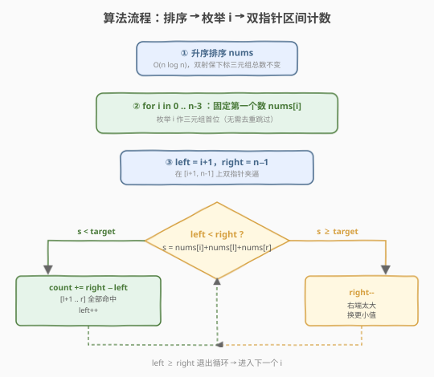
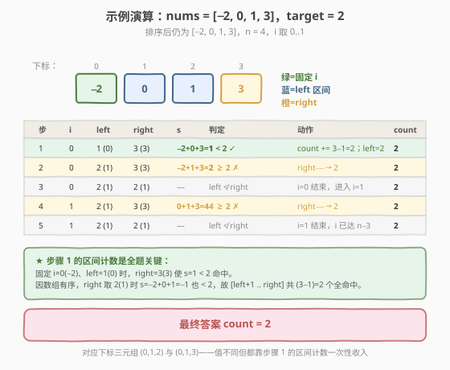

# LeetCode 较小的三数之和 题解

## 1. 题目概述

- **标题 / 题号**：较小的三数之和（#259，medium）
- **链接**：https://leetcode.cn/problems/3sum-smaller/
- **难度**：中等
- **标签**：数组、双指针、排序、二分查找

**题意**：给定一个长度为 $n$ 的整数数组 `nums` 和一个目标值 `target`，返回满足 **$i < j < k$** 且 $\text{nums}[i] + \text{nums}[j] + \text{nums}[k] < \text{target}$ 的下标三元组 `(i, j, k)` 的**个数**。

**示例 1**：

```text
输入：nums = [-2,0,1,3], target = 2
输出：2
解释：共有 2 个三元组之和小于 2：
  (0, 1, 2)：nums[0] + nums[1] + nums[2] = -2 + 0 + 1 = -1 < 2
  (0, 1, 3)：nums[0] + nums[1] + nums[3] = -2 + 0 + 3 =  1 < 2
```

**示例 2**：

```text
输入：nums = [], target = 0
输出：0
```

**示例 3**：

```text
输入：nums = [0], target = 0
输出：0
```

**约束**：

- $3 \le \text{nums.length} \le 3500$
- $-10^5 \le \text{nums}[i] \le 10^5$
- $-10^5 \le \text{target} \le 10^5$

> 💡 本题是 [15. 三数之和](../0001-0100/15_三数之和.md) 的「计数变体」：15 题要求三数之和**等于** 0 且返回所有不重复三元组（按值），需要双层去重；259 题只统计三数之和**小于** `target` 的三元组**个数**（按下标 `i<j<k`），**不去重**——值相同但下标不同的三元组也要分别计数。这一差异决定了双指针移动规则从"命中即记录两端推进"变为"命中则按区间一次性计数 `+= right-left`"。

## 2. 解题思路

### 2.1 暴力思路：三重循环枚举

最直接的做法：三重循环枚举所有满足 $i<j<k$ 的下标组合，判断 $\text{nums}[i]+\text{nums}[j]+\text{nums}[k] < \text{target}$ 即计数。

```text
for i in 0..n:
    for j in i+1..n:
        for k in j+1..n:
            if nums[i]+nums[j]+nums[k] < target: count++
```

时间复杂度 $O(n^3)$，$n=3500$ 时约 $4.3 \times 10^{10}$ 次运算，**严重超时**。由于只数个数不存三元组，去重不是问题，但内两层循环完全可以借助排序后的单调性合并成 $O(n)$。

> ⚠️ 暴力法的瓶颈在「内两层 `j, k` 循环」：对于固定的 $i$，要在 `[i+1, n-1]` 上数有多少对 $(j, k)$ 使 $\text{nums}[j]+\text{nums}[k] < \text{target}-\text{nums}[i]$。这是个经典的「有序数组上数两数之和小于定值的对数」问题，排序 + 双指针可做到 $O(n)$。

### 2.2 核心观察：排序 + 双指针区间计数

**关键转换**：先对数组**升序排序**。排序带来两个好处：

1. **双指针可行**：固定第一个数 $\text{nums}[i]$ 后，在剩余区间 `[i+1, n-1]` 用左右双指针 `left`/`right` 数两数之和小于 $\text{target}-\text{nums}[i]$ 的对数。
2. **区间一次性计数**：因为数组有序，当 $\text{nums}[i]+\text{nums}[\text{left}]+\text{nums}[\text{right}] < \text{target}$ 时，把 `right` 换成 `[left+1, right-1]` 内任意 `right'`，和只会更小，**必然也小于** `target`。于是这一步不必逐个右移 `right`，直接 `count += right - left`，然后 `left++` 进入下一轮。

![双指针 + 区间计数：固定 nums[i]，命中时一次性计入 (right−left) 对](../images/three_sum_smaller_two_pointers.svg)

**双指针移动规则**（设 $s = \text{nums}[i]+\text{nums}[\text{left}]+\text{nums}[\text{right}]$）：

- 若 $s < \text{target}$：命中！`[left+1, right]` 内任意 `right'` 都让和更小、同样命中，`count += right - left`，然后 `left++`（换更大的左端去探索新的命中区间）。
- 若 $s \ge \text{target}$：和偏大，`right--`（换更小的右端去逼近 `target`）。

> 💡 **为什么排序不影响计数结果？** 题目要求的是「下标三元组 $i<j<k$」的个数，而排序会打乱下标。关键在于：排序是 $n$ 个元素之间的一一双射，原数组的任意 3 个不同下标，排序后恰好对应 3 个不同位置（顺序可能变，但仍是 3 个不同位置），反之亦然。「值之和 $< \text{target}$」是关于元素值的条件，排序只改变顺序不改变值。因此「排序后位置 $p_1<p_2<p_3$ 且值之和 $< \text{target}$ 的三元组数」严格等于「原数组下标 $i<j<k$ 且值之和 $< \text{target}$ 的三元组数」。

> ⚠️ **为什么不去重？** 这是本题与 15 题最容易混淆的点。15 题求「不重复的三元组（按值）」，`[-1,0,1]` 与 `[0,1,-1]` 视为同一组必须去重；259 题求「下标三元组的个数」，只要下标不同就算不同三元组——即使两组值完全相同（如 `nums=[0,0,0,0]`，下标 `(0,1,2)` 与 `(0,1,3)` 值都是 `[0,0,0]`）也要分别计数。因此外层枚举 `i` 时**不需要**像 15 题那样 `if (nums[i]==nums[i-1]) continue` 跳过，内层命中后也**不需要**跳过相邻重复值。

### 2.3 算法流程图



**完整步骤**：

1. **排序**：`nums` 升序排序，$O(n \log n)$。
2. **枚举第一个数** $i$：从 $0$ 到 $n-3$，对每个 $\text{nums}[i]$（无需去重跳过）。
3. **双指针数命中对数**：`left = i+1`，`right = n-1`，循环 `while (left < right)`：
   - 若 $s < \text{target}$：`count += right - left`，`left++`。
   - 否则（$s \ge \text{target}$）：`right--`。
4. 返回 `count`。

### 2.4 示例演算

以 `nums = [-2,0,1,3]`、`target = 2` 为例（数组本身已升序，$n=4$，$i$ 取 $0..1$）：



| 步骤 | $i$ | left | right | $s$ | 判定 | 动作 | count |
|------|-----|------|-------|-----|------|------|-------|
| 1 | 0 | 1 (0) | 3 (3) | $-2+0+3=1$ | $1<2$ ✓ | `count += 3-1=2`；`left=2` | 2 |
| 2 | 0 | 2 (1) | 3 (3) | $-2+1+3=2$ | $2\ge2$ ✗ | `right-- → 2` | 2 |
| 3 | 0 | 2 (1) | 2 (1) | — | left ≮ right | $i=0$ 结束 | 2 |
| 4 | 1 | 2 (1) | 3 (3) | $0+1+3=4$ | $4\ge2$ ✗ | `right-- → 2` | 2 |
| 5 | 1 | 2 (1) | 2 (1) | — | left ≮ right | $i=1$ 结束 | 2 |

> 💡 **步骤 1 是全题关键**：固定 $i=0(-2)$、`left=1(0)` 时，`right=3(3)` 使 $s=1<2$ 命中。因数组有序，`right` 取 `2(1)` 时 $s=-2+0+1=-1$ 也小于 2，故 `[left+1 .. right]` 共 $(3-1)=2$ 个全部命中，一次性 `count += 2`。这正是「区间计数」相较「逐个枚举」省时的本质——把内层 $O(n)$ 的扫描压缩成 $O(1)$ 的加减法，同时保证不漏不重。

## 3. 参考代码

### C++

```cpp
// 较小的三数之和.cpp —— 排序 + 双指针区间计数
// 编译: g++ -O2 -std=c++17 较小的三数之和.cpp -o threesumsmaller
#include <vector>
#include <algorithm>
using namespace std;

class Solution {
  public:
    int threeSumSmaller(vector<int>& nums, int target) {
        sort(nums.begin(), nums.end());          // ① 排序
        int n = nums.size(), count = 0;
        for (int i = 0; i < n - 2; ++i) {        // ② 枚举第一个数，不去重
            int left = i + 1, right = n - 1;     // ③ 双指针
            while (left < right) {
                int s = nums[i] + nums[left] + nums[right];
                if (s < target) {
                    // 命中：[left+1, right] 内任意 right' 都让和更小、同样命中
                    count += right - left;       // 一次性区间计数
                    ++left;                       // 换更大的左端继续探索
                } else {
                    --right;                      // 和偏大，右端换更小值
                }
            }
        }
        return count;
    }
};
```

### Python

```python
class Solution:
    def threeSumSmaller(self, nums: list[int], target: int) -> int:
        nums.sort()                               # ① 排序
        n = len(nums)
        count = 0
        for i in range(n - 2):                    # ② 枚举第一个数，不去重
            left, right = i + 1, n - 1            # ③ 双指针
            while left < right:
                s = nums[i] + nums[left] + nums[right]
                if s < target:
                    count += right - left         # 区间一次性计数
                    left += 1
                else:
                    right -= 1
        return count
```

> 💡 与 [15. 三数之和](../0001-0100/15_三数之和.md) 的代码骨架对照：两者都是「排序 + 外层枚举 $i$ + 内层双指针」。差异仅在三处：① 15 题命中时 `push_back` 整个三元组并两端推进 + 去重跳过，259 题命中时 `count += right-left` 后只 `left++`；② 15 题外层有 `if (nums[i]==nums[i-1]) continue` 去重，259 题没有；③ 15 题有 `if (nums[i]>0) break` 剪枝（求和等于 0 才需要），259 题求和小于 `target`，`target` 可正可负，**不能**照搬该剪枝。

## 4. 复杂度分析

| 维度 | 复杂度 | 说明 |
|------|--------|------|
| **时间复杂度** | $O(n^2)$ | 排序 $O(n \log n)$ + 外层 $n$ 轮 × 内层双指针 $O(n)$ = $O(n^2)$；每轮内层至多移动 `left`/`right` 共 $n$ 次 |
| **空间复杂度** | $O(\log n)$ | 排序的栈空间（C++ `sort` 为快排变种）；返回值不计入 |
| **最优时间** | $O(n^2)$ | 双指针已是该问题最优解（计数型 k-sum 问题的下界为 $O(n^{k-1})$） |

> ⚠️ **能否用二分查找做到更好？** 固定 $i, j$ 后二分找最大的 $k$ 使 $\text{nums}[i]+\text{nums}[j]+\text{nums}[k] < \text{target}$，计数 `+= k - j`，时间 $O(n^2 \log n)$——比双指针的 $O(n^2)$ 更慢，仅作为备选思路（见第 5 节）。双指针能省掉那 $\log n$ 是因为内外两层指针共享同一次线性扫描。

## 5. 扩展：二分解法与两数小于型变体

### 5.1 二分解法 $O(n^2 \log n)$

固定 $i$，再固定 $j$（$j$ 从 $i+1$ 到 $n-2$），在 `[j+1, n-1]` 上二分找最大的下标 $k$ 使 $\text{nums}[i]+\text{nums}[j]+\text{nums}[k] < \text{target}$。由于区间有序，满足条件的是 `[j+1, k]` 一整段，计数 `+= k - j`。比双指针慢一个 $\log n$ 因子，但思路直观，适合在面试时作为「先给出一个正确解再优化」的过渡。

### 5.2 两数小于型：LC 1099. 小于 K 的最大两数之和

把本题的「三数小于」退化为「两数小于」：固定没有外层 $i$，直接 `left=0, right=n-1` 双指针。当 $\text{nums}[l]+\text{nums}[r] < K$ 时记录最大和并 `left++`，否则 `right--`。是双指针小于型计数/最值模板的 $k=2$ 基础版，本题是其 $k=3$ 推广。

| 题目 | 与本题差异 | 核心改动 |
|------|-----------|---------|
| 15 三数之和 | 小于计数 → 等于且不重 | 命中改 `push_back` + 双层去重 |
| 16 最接近三数之和 | 小于计数 → 最接近 target | 沿途维护 `|s−target|` 最小的 `best` |
| 1099 两数小于 K 最大和 | 三数 → 两数；计数 → 最大和 | 去掉外层 $i$，命中时维护最大和 |

> 💡 这些题骨架完全相同——都是「排序 + 固定前若干个 + 双指针扫剩余」。掌握「小于型」的区间计数 `count += right-left` 后，可秒杀任意 $k$-sum 小于计数题（$k$ 数时外层固定 $k-2$ 个 + 内层双指针区间计数，时间 $O(n^{k-1})$）。

## 6. 面试要点

1. **为什么本题不需要去重，而 15 题需要？**

   - 15 题返回「所有不重复的三元组」，是按**值**判重——`[-1,0,1]` 与 `[0,1,-1]` 视为同一组，必须排序后跳过相邻重复值。
   - 259 题返回「下标三元组的个数」，是按**下标**计数——只要 $i<j<k$ 不同就算不同三元组，即使值完全相同也分别计数。所以外层 `i` 不做 `nums[i]==nums[i-1]` 跳过，内层命中后也不跳相邻重复值。把 259 当 15 写去重会**漏解**。

2. **排序会打乱下标，为什么计数结果仍然正确？**

   - 排序是 $n$ 个元素之间的一一双射。原数组任意 3 个不同下标，排序后恰好对应 3 个不同位置（双射保「不同」性）。
   - 「值之和 $< \text{target}$」是关于值的条件，排序只改变顺序不改变值。
   - 因此「排序后位置三元组 $p_1<p_2<p_3$ 满足和 $< \text{target}$ 的数量」严格等于「原数组下标三元组 $i<j<k$ 满足和 $< \text{target}$ 的数量」。这是排序类计数题的通用论证。

3. **`count += right - left` 的正确性如何保证不漏不重？**

   - **不漏**：当 $\text{nums}[i]+\text{nums}[\text{left}]+\text{nums}[\text{right}] < \text{target}$ 命中时，因数组升序，把 `right` 换成 `[left+1, right-1]` 内任意 `right'` 都使 $\text{nums}[\text{right'}] \le \text{nums}[\text{right}]$，和只会更小，必然也 $< \text{target}$。所以 `[left+1, right]` 共 $(\text{right}-\text{left})$ 个位置全命中，一次性计入。
   - **不重**：每个命中的 $(\text{left}, \text{right'})$ 对只在「`left` 第一次到达该值、`right'` 落在当前 `right` 之内」时被计入，之后 `left++` 进入下一个左端，旧的 `left` 值不再参与计数。每个二元组 $(\text{left}, \text{right'})$ 恰被计入一次。

4. **能否照搬 15 题的剪枝 `if (nums[i] > 0) break`？**

   - **不能**。15 题求和等于 0，排序后若 $\text{nums}[i] > 0$ 则三数之和必为正，不可能等于 0，可 `break`。
   - 259 题求和小于 `target`，`target` 可正可负。即便 $\text{nums}[i] > 0$，只要 $\text{nums}[i]+\text{nums}[\text{left}]+\text{nums}[\text{right}] < \text{target}$ 仍可能成立（如 `target` 很大时）。照搬剪枝会漏解。
   - 可做的合理剪枝是：若 $\text{nums}[i]+\text{nums}[i+1]+\text{nums}[i+2] \ge \text{target}$（最小的三个数之和都 ≥ target），则后续 $i$ 更大、更不可能，可 `break`；若 $\text{nums}[i]+\text{nums}[n-2]+\text{nums}[n-1] < \text{target}$（当前 $i$ 配最大的两个都命中），则所有以 $i$ 开头的 $\binom{n-i-1}{2}$ 对全命中，`count += (n-i-1)*(n-i-2)/2` 后 `continue`。这些剪枝常数优化，面试时可提但不强求。

5. **双指针与二分解法的取舍？**

   - 双指针 $O(n^2)$、二分 $O(n^2 \log n)$，双指针严格更优。
   - 二分的优势在于思路直观、实现短、不易写错，适合作为「先给出正确解再优化」的过渡。
   - 面试中应先讲双指针的区间计数核心思想，再说明为何比二分省一个 $\log n$（内外两层指针共享同一次线性扫描，而不是每次重新二分）。

> 💡 **一句话总结**：259 是 15 的计数变体——同样是「排序 + 固定一个 + 双指针扫剩余」，但把「等于且去重」换成「小于且计数」。核心是利用有序性把内层命中从「逐个枚举」压缩成「区间一次性 `count += right-left`」，把 $O(n^3)$ 降到 $O(n^2)$。掌握「小于型区间计数」模板可秒杀任意 $k$-sum 小于计数题。

## 同类练习题

| # | 题目 | 与本题的关联 |
|---|------|-------------|
| 15 | [三数之和](https://leetcode.cn/problems/3sum/)（[题解](../0001-0100/15_三数之和.md)） | 等于型 + 双层去重，与本题小于型 + 不去重形成对照 |
| 16 | [最接近的三数之和](https://leetcode.cn/problems/3sum-closest/) | 双指针 + 沿途维护 `\|s−target\|` 最小的 `best`，同样无需去重 |
| 18 | [四数之和](https://leetcode.cn/problems/4sum/) | k-sum 通用模板，固定两个 + 双指针 |
| 1099 | [小于 K 的最大两数之和](https://leetcode.cn/problems/two-sum-less-than-k/) | 两数小于型基础版，双指针命中时维护最大和 |
| 2824 | [统计和小于目标的下标对数目](https://leetcode.cn/problems/count-pairs-whose-sum-is-less-than-target/) | 两数小于计数版，即本题去掉外层 $i$ 的 $k=2$ 退化 |
