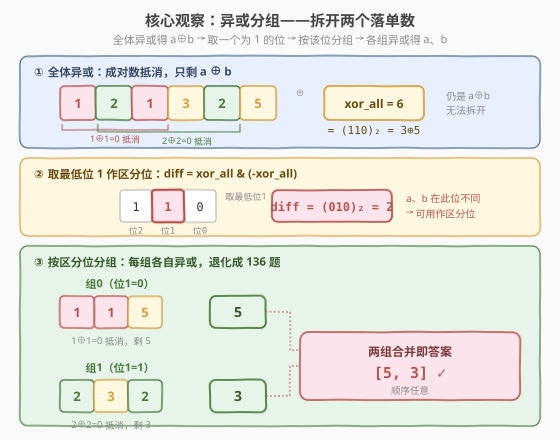
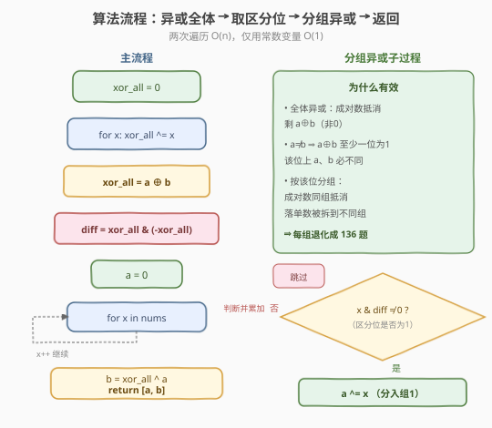

# LeetCode 只出现一次的数字 III 题解

## 1. 题目概述

- **标题 / 题号**：只出现一次的数字 III（#260，medium）
- **链接**：https://leetcode.cn/problems/single-number-iii/
- **难度**：中等
- **标签**：位运算、异或、数组

**题意**：给你一个整数数组 `nums`，其中**恰好有两个元素只出现一次**，其余元素都**恰好出现两次**。请你找出那两个只出现一次的元素，按任意顺序返回。要求时间复杂度 `O(n)`，空间复杂度 `O(1)`。

**示例 1**：

```text
输入：nums = [1,2,1,3,2,5]
输出：[3,5]
解释：3 和 5 各出现一次，1、2 各出现两次。
```

**示例 2**：

```text
输入：nums = [-1,0]
输出：[-1,0]
解释：两个元素本身就各出现一次。
```

**约束**：

- $2 \leq \text{nums.length} \leq 3 \times 10^4$
- $-2^{31} \leq \text{nums}[i] \leq 2^{31}-1$
- 除两个元素只出现一次外，其余每个元素都出现两次

> 💡 这是「只出现一次的数字」三部曲中最难的一题。第一题 [136](https://leetcode.cn/problems/single-number/)（一个落单数）用「全体异或」一步搞定；本题有两个落单数，**全体异或**得到的是它们的**异或和** $a \oplus b$，无法直接分开。突破口是：$a \neq b$ 时 $a \oplus b \neq 0$，必存在某一位为 `1`——这一位说明 $a$、$b$ 在该位**不同**，据此把数组一分为二，每一组退化成「136 题」。

## 2. 解题思路

### 2.1 暴力思路：哈希表计数

用哈希表统计每个数出现次数，再扫一遍取出次数为 `1` 的两个数。

```text
freq = Counter(nums)
return [x for x in nums if freq[x] == 1]
```

时间 `O(n)`，空间 `O(n)`。能过，但**不满足 `O(1)` 空间**的要求，面试会被追问能否优化空间。

> ⚠️ 哈希表的浪费在于：它把「配对抵消」这件事交给了外部容器。而异或运算 $x \oplus x = 0$ 天然具有「成对抵消」的能力——只要能把两个落单数**分到不同组**，每组各自异或就能还原它们，无需额外容器。

### 2.2 核心观察：异或分组

**性质 1（异或抵消）**：$x \oplus x = 0$，$x \oplus 0 = x$。因此「出现两次的数异或后归零」，整组异或的结果 = 该组中所有「出现奇数次」的数的异或。

**性质 2（全体异或 = 两落单数的异或）**：对整个数组异或：

$$
\text{xor\_all} = \bigoplus_{i} \text{nums}[i] = a \oplus b
$$

因为成对的数两两抵消为 `0`，只剩下 $a \oplus b$。但单个 $a \oplus b$ 还原不出 $a$、$b$。

**性质 3（关键——找一个区分位）**：$a \neq b \Rightarrow a \oplus b \neq 0$，即 $a$、$b$ 的二进制至少有一位不同。取 $\text{xor\_all}$ 中任意一个为 `1` 的位（习惯取**最低位** `1`，即 $\text{diff} = \text{xor\_all} \,\&\, (-\text{xor\_all})$）。该位上 $a$、$b$ 必然一个为 `0`、一个为 `1`。

**性质 4（按该位分组 → 退化为 136 题）**：按这一位把数组分成两组：

- 该位为 `0` 的组：包含 $a$（或 $b$）+ 若干成对出现的数
- 该位为 `1` 的组：包含 $b$（或 $a$）+ 若干成对出现的数

每组成对的数异或抵消，组内异或结果即该组的落单数。



> 💡 **为什么按区分位分组后，成对的数一定落在同一组？** 出现两次的数 $x$ 两次的二进制完全相同，在区分位上的取值也相同，必然同时分进同一组，于是组内 $x \oplus x = 0$ 抵消。只有 $a$、$b$ 因该位不同被拆开，各自成为本组唯一的「孤数」。这就是「分组后退化成 136 题」的根本原因。

> ⚠️ **必须取 $\text{xor\_all}$ 中为 `1` 的位**，不能随便选一位。若选了 $\text{xor\_all}$ 为 `0` 的位，说明 $a$、$b$ 在该位相同，分组会把它们分进同一组，无法拆开。最低位 `1`（$\text{diff} = \text{xor\_all} \,\&\, (-\text{xor\_all})$）一定满足条件，且只需 `O(1)` 求出。

### 2.3 算法流程图



**完整步骤**：

1. **全体异或**：`xor_all = 0`，遍历 `nums` 累计异或，得 `xor_all = a ^ b`。
2. **取区分位**：`diff = xor_all & (-xor_all)`，提取 `xor_all` 最低位的 `1`。
3. **分组异或**：`a = 0`，遍历 `nums`，若 `num & diff` 非零则 `a ^= num`。该组异或结果即为一个落单数。
4. **求另一个**：`b = xor_all ^ a`（因为 `xor_all = a ^ b`，故 `b = xor_all ^ a`）。
5. 返回 `[a, b]`。

> 💡 第 4 步用 `b = xor_all ^ a` 比再扫一遍分组省一次遍历，也避免重复写分组逻辑。也可分别维护 `g0`、`g1` 两个累加器，第二次遍历时把不等于 `diff` 位的数异或进 `g1`，结果等价。

### 2.4 示例演算

以 `nums = [1,2,1,3,2,5]` 为例，落单数 $a=3$、$b=5$。

![示例演算：[1,2,1,3,2,5] 按区分位分组，两组异或分别得 5 与 3](../images/snum3_example_walkthrough.svg)

**第 1 步——全体异或**：

$$
\text{xor\_all} = 1 \oplus 2 \oplus 1 \oplus 3 \oplus 2 \oplus 5 = (1\oplus1)\oplus(2\oplus2)\oplus3\oplus5 = 3 \oplus 5 = 6 = (110)_2
$$

**第 2 步——取最低位 1**：$6 = (110)_2$，最低位 `1` 是第 1 位（从低到高），$\text{diff} = 6 \,\&\, (-6) = (010)_2 = 2$。即第 1 位上 $3=(011)_2$ 为 `1`、$5=(101)_2$ 为 `0`，二者不同，可作为区分位。

**第 3 步——按第 1 位分组异或**：

| 元素 | 二进制 | 第 1 位 | 分入 | 该组异或结果 |
|------|--------|---------|------|--------------|
| 初值 | — | — | — | g0=0, g1=0 |
| 1 | `001` | 0 | g0 | g0 = 0^1 = 1 |
| 2 | `010` | 1 | g1 | g1 = 0^2 = 2 |
| 1 | `001` | 0 | g0 | g0 = 1^1 = 0（1 抵消） |
| 3 | `011` | 1 | g1 | g1 = 2^3 = 1 |
| 2 | `010` | 1 | g1 | g1 = 1^2 = 3（2 抵消） |
| 5 | `101` | 0 | g0 | g0 = 0^5 = 5 |

最终 `g0 = 5`、`g1 = 3`，返回 `[5, 3]`（顺序任意）。验证：$3$、$5$ 各出现一次 ✓。

> 💡 观察抵消过程：两个 `1` 都进了 g0 并抵消（`1^1=0`），两个 `2` 都进了 g1 并抵消（`2^2=0`）。剩下的 `3` 留在 g1、`5` 留在 g0。这正是「成对数同组抵消，落单数被拆开」的直观体现。

## 3. 参考代码

### C++

```cpp
// 只出现一次的数字 III.cpp —— 异或分组
// 编译: g++ -O2 -std=c++17 只出现一次的数字III.cpp -o snum3
class Solution {
  public:
    vector<int> singleNumber(vector<int>& nums) {
        long long xor_all = 0;                 // long long 避免 INT_MIN 溢出
        for (int x : nums) xor_all ^= x;       // 全体异或 = a ^ b

        long long diff = xor_all & (-xor_all); // 最低位 1（区分位）
        int a = 0;
        for (int x : nums) {
            if (x & diff) a ^= x;              // 区分位为 1 的组异或
        }
        int b = (int)(xor_all ^ a);            // b = xor_all ^ a
        return {a, b};
    }
};
```

### Python

```python
from typing import List


class Solution:
    def singleNumber(self, nums: List[int]) -> List[int]:
        xor_all = 0
        for x in nums:
            xor_all ^= x                      # 全体异或 = a ^ b

        diff = xor_all & (-xor_all)           # 最低位 1（区分位）
        a = 0
        for x in nums:
            if x & diff:                      # 区分位为 1 的组异或
                a ^= x
        b = xor_all ^ a                       # b = xor_all ^ a
        return [a, b]
```

> ⚠️ **C++ 的 `INT_MIN` 陷阱**：若 `xor_all` 恰为 `INT_MIN`（即 $-2^{31}$），`-xor_all` 会溢出导致未定义行为。用 `long long` 存 `xor_all` 即可规避（如上代码）。若坚持用 `int`，可改写为 `unsigned int u = xor_all; int diff = u & (-u);` 借助无符号运算绕开溢出。Python 的整数是任意精度补码，`x & -x` 对负数也正确，无需特殊处理。

> 💡 **`x & diff` 的判断**：`diff` 只有一个位为 `1`，所以 `x & diff` 非 0 当且仅当 `x` 在该位为 `1`。这正是「按区分位分组」的体现，无需显式构造两个子数组。

## 4. 复杂度分析

| 维度 | 异或分组 | 哈希表计数 |
|------|----------|------------|
| **时间复杂度** | $O(n)$ | $O(n)$ |
| **空间复杂度** | $O(1)$ | $O(n)$ |
| **推荐度** | ✅ 面试首选（满足 `O(1)` 空间） | 简单直观，但空间不达标 |

> ⚠️ 异或分组两次遍历数组（求 `xor_all` 一次、分组一次），共 $2n$ 次运算，时间 $O(n)$；仅用 `xor_all`、`diff`、`a`、`b` 几个变量，空间 $O(1)$。是同时满足 `O(n)` 时间与 `O(1)` 空间的最优解。

## 5. 扩展：「只出现一次」三部曲

「异或抵消」是这一系列的核心，三题的差异在于「落单数的个数与其它数的重复次数」：

| 题号 | 设定 | 核心技法 |
|------|------|----------|
| [136](https://leetcode.cn/problems/single-number/) | 1 个落单，其余出现 2 次 | 全体异或一步出结果 |
| [137](https://leetcode.cn/problems/single-number-ii/) | 1 个落单，其余出现 3 次 | 逐位统计模 3，或状态机 DP |
| **260（本题）** | 2 个落单，其余出现 2 次 | 全体异或 + 取区分位 + 分组 |

**137 题的思路（拓展）**：当其余数出现 3 次时，异或无法直接抵消（$x \oplus x \oplus x = x \neq 0$）。改用「逐位统计」——对每一位统计所有数在该位的 `1` 的个数，模 3 的余数即落单数在该位的值。也可用「两变量状态机」$O(1)$ 空间实现：`ones`、`twos` 记录每位出现 1 次、2 次的状态，出现 3 次时归零。

```python
# 137 题状态机解法（拓展）
def singleNumber(nums):
    ones = twos = 0
    for x in nums:
        ones = (ones ^ x) & ~twos
        twos = (twos ^ x) & ~ones
    return ones
```

> 💡 把三部曲放在一起记：**异或抵消处理「偶数次重复」，逐位取模处理「奇数次重复」，分组处理「多个落单数」**。这是一套覆盖「找特殊数」类问题的完整工具箱。

## 6. 面试要点

1. **为什么全体异或不能直接得到答案？**

   > 全体异或得到的是 $a \oplus b$（成对数抵消为 0），不是 $a$ 或 $b$ 本身。单个异或和无法拆出两个数，所以需要进一步找区分位把 $a$、$b$ 分到不同组。

2. **为什么要取 `xor_all` 中为 1 的位？取 0 的位行不行？**

   > 不行。`xor_all` 某位为 `0` 说明 $a$、$b$ 在该位相同，按该位分组会把它们分进同一组，无法拆开。只有为 `1` 的位才表示 $a$、$b$ 在该位不同，能把它们分开。习惯取最低位 `1`（`x & -x`），因为它能 `O(1)` 求出。

3. **分组后为什么成对的数会抵消？**

   > 出现两次的数 $x$ 两次的二进制完全相同，在区分位上的取值也相同，必然分进同一组，于是组内 $x \oplus x = 0$ 抵消。每最终只剩下被拆开的那个落单数。

4. **`x & -x` 为什么能取到最低位的 1？**

   > 负数用补码表示，$-x = \sim x + 1$。`~x` 把最低位 `1` 及以上的位取反，`+1` 后最低位 `1` 那一位恢复为 `1`、其下所有位为 `0`、其上所有位与 `x` 相反。于是 `x & -x` 只保留最低位那个 `1`，其余位全为 `0`。

5. **C++ 中 `xor_all & -xor_all` 有什么陷阱？**

   > 当 `xor_all == INT_MIN` 时 `-xor_all` 溢出，是未定义行为。用 `long long` 存 `xor_all`，或改用 `unsigned int` 运算即可规避。Python 无此问题。

> 💡 **一句话总结**：260 题是「136 题 + 分组」的组合——全体异或得 $a \oplus b$，取其一个为 `1` 的位作区分位，把数组分两组，每组退化成 136 题各自异或出落单数。时间 $O(n)$、空间 $O(1)$。掌握「异或抵消 + 按位分组」即可迁移到所有「找特殊数」问题。

## 同类练习题

| # | 题目 | 与本题的关联 |
|---|------|-------------|
| 136 | [只出现一次的数字](https://leetcode.cn/problems/single-number/) | 本系列入门题，单个落单数，全体异或一步出结果，是 260 的基础 |
| 137 | [只出现一次的数字 II](https://leetcode.cn/problems/single-number-ii/) | 其余数出现 3 次，异或无法抵消，改用逐位统计模 3 或状态机，对比「奇数次重复」的处理 |
| 268 | [丢失的数字](https://leetcode.cn/problems/missing-number/) | 异或抵消的另一应用——把 `0..n` 与数组全体异或，成对抵消后剩丢失的数 |
| 389 | [找不同](https://leetcode.cn/problems/find-the-difference/) | 字符串多塞了一个字符，全体异或即得多出的字符，与 136 同源 |
| 1009 | [十进制整数的补码](https://leetcode.cn/problems/complement-of-base-10-integer/) | 位运算基础练习，巩固按位操作与掩码构造 |
